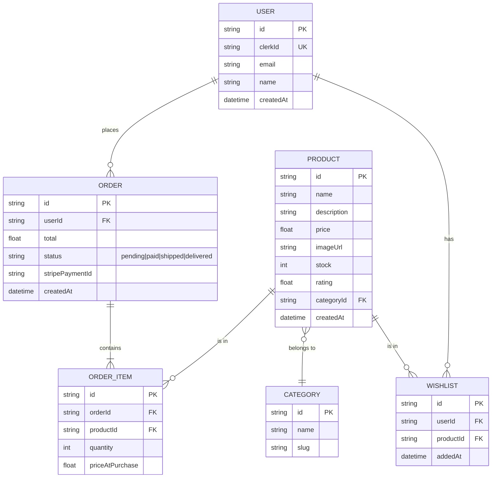

# 🛒 Arcane Quest 02 — Arcane Marketplace

> *"Ini BOSS QUEST. E-commerce beneran. Payment beneran. Auth beneran. Kalo kalian bisa selesaiin ini, kalian udah siap kerja. No cap."*

## 🎯 Misi

Bangun **full-stack E-commerce application** dengan authentication (Clerk), payment processing (Stripe), state management (Zustand), dan deploy ke Vercel.

---

## 📋 Tech Stack (WAJIB)

| Layer | Tech |
|-------|------|
| Framework | Vite + React + TypeScript |
| Styling | Tailwind CSS |
| Auth | [Clerk](https://clerk.com) (free tier) |
| Payment | [Stripe](https://stripe.com) (test mode) |
| State | [Zustand](https://zustand-demo.pmnd.rs/) untuk cart |
| Data Fetching | TanStack Query |
| Routing | React Router v6 atau TanStack Router |
| Backend (opsional) | Express + Prisma ATAU Firebase ATAU Supabase |
| Deploy | Vercel |

---

## 🗂️ Fitur Wajib

### 1. Product Catalog (`/products`)
- Grid layout produk dengan gambar, nama, harga, rating
- Filter by category (sidebar atau dropdown)
- Sort by: price (low-high, high-low), name, rating
- Search dengan debounce
- Pagination atau infinite scroll

### 2. Product Detail (`/products/:id`)
- Gambar besar, deskripsi lengkap
- Pilih quantity
- "Add to Cart" button
- Related products section

### 3. Shopping Cart (Zustand)
- Cart icon di navbar dengan badge count
- Slide-over cart panel ATAU dedicated `/cart` page
- Update quantity, remove item
- Cart total calculation
- **Persist cart ke localStorage** (Zustand middleware)

### 4. Authentication (Clerk)
- Sign up / Sign in
- Protected routes (cart, checkout, order history)
- User profile page
- Session management

### 5. Checkout (`/checkout`)
- Order summary
- Stripe payment integration (test mode)
- Stripe Elements untuk card input
- Handle payment success/failure
- Redirect ke order confirmation

### 6. Order History (`/orders`)
- List of past orders (protected route)
- Order detail: items, total, status, date

---

## 📐 Database ERD



---

## 🔌 API Endpoints

Kalo kalian bikin backend sendiri, ini endpoint yang dibutuhin:

```
# Products
GET    /api/products              # List all (query: ?category=&sort=&search=&page=)
GET    /api/products/:id          # Detail
GET    /api/categories             # List categories

# Cart (bisa client-only pake Zustand, tapi kalo mau sync server:)
POST   /api/cart                  # Add item
PUT    /api/cart/:itemId          # Update quantity
DELETE /api/cart/:itemId          # Remove item
GET    /api/cart                  # Get current cart

# Orders
POST   /api/orders               # Create order (after payment)
GET    /api/orders                # List user's orders
GET    /api/orders/:id            # Order detail

# Payment
POST   /api/create-payment-intent # Stripe payment intent

# Wishlist
GET    /api/wishlist              # Get user's wishlist
POST   /api/wishlist              # Add to wishlist
DELETE /api/wishlist/:productId   # Remove from wishlist
```

**Alternatif tanpa custom backend:** Pake Supabase/Firebase sebagai BaaS + Stripe checkout session (redirect mode). Ini lebih gampang tapi tetep valid.

---

## 🏗️ Folder Structure

```
src/
├── components/
│   ├── layout/
│   │   ├── Navbar.tsx
│   │   ├── Footer.tsx
│   │   └── Layout.tsx
│   ├── product/
│   │   ├── ProductCard.tsx
│   │   ├── ProductGrid.tsx
│   │   ├── ProductFilter.tsx
│   │   └── ProductDetail.tsx
│   ├── cart/
│   │   ├── CartDrawer.tsx
│   │   ├── CartItem.tsx
│   │   └── CartSummary.tsx
│   ├── checkout/
│   │   ├── CheckoutForm.tsx
│   │   ├── PaymentForm.tsx
│   │   └── OrderConfirmation.tsx
│   └── ui/
│       ├── Button.tsx
│       ├── Badge.tsx
│       ├── Modal.tsx
│       └── Skeleton.tsx
├── stores/
│   └── cartStore.ts           // Zustand store
├── hooks/
│   ├── useProducts.ts
│   ├── useOrders.ts
│   └── useDebounce.ts
├── lib/
│   ├── api.ts
│   ├── stripe.ts
│   └── clerk.ts
├── types/
│   └── index.ts
├── pages/
│   ├── Home.tsx
│   ├── Products.tsx
│   ├── ProductDetail.tsx
│   ├── Cart.tsx
│   ├── Checkout.tsx
│   ├── OrderHistory.tsx
│   ├── OrderDetail.tsx
│   └── Profile.tsx
├── routes/
│   └── index.tsx
├── App.tsx
└── main.tsx
```

---

## 🔑 Key Implementation Details

### Zustand Cart Store

```typescript
// stores/cartStore.ts
import { create } from 'zustand';
import { persist } from 'zustand/middleware';

interface CartItem {
  productId: string;
  name: string;
  price: number;
  quantity: number;
  imageUrl: string;
}

interface CartStore {
  items: CartItem[];
  addItem: (item: Omit<CartItem, 'quantity'>) => void;
  removeItem: (productId: string) => void;
  updateQuantity: (productId: string, quantity: number) => void;
  clearCart: () => void;
  totalItems: () => number;
  totalPrice: () => number;
}

// IMPLEMENT sendiri — ini cuma skeleton
// Pake persist middleware buat localStorage
```

### Stripe Integration (Test Mode)

```typescript
// Pake test keys — JANGAN PERNAH commit real keys
// STRIPE_PUBLISHABLE_KEY=pk_test_...
// STRIPE_SECRET_KEY=sk_test_... (server-side only!)

// Test card number: 4242 4242 4242 4242
// Any future expiry, any CVC
```

### Clerk Setup

```typescript
// Wrap app dengan ClerkProvider
// Pake <SignIn />, <SignUp />, <UserButton /> components
// Protected routes pake <SignedIn> / <SignedOut>
```

---

## 📊 Grading

| Kriteria | Bobot | Detail |
|----------|-------|--------|
| **Functionality** | 30% | Products browse, cart CRUD, auth flow, checkout, order history |
| **UI/UX** | 30% | Professional design, responsive, loading/error states, smooth transitions |
| **Code Quality** | 20% | TypeScript strict, Zustand properly used, clean architecture, no `any` |
| **Bonus Features** | 20% | Lihat bonus section |

### Grade Scale
- **S (95-100):** Boss slayer. Semua fitur + 4 bonus. Portfolio-worthy.
- **A (85-94):** Solid. Semua wajib + 2-3 bonus.
- **B (70-84):** Good. Most features work, 1 bonus.
- **C (60-69):** Acceptable. Core features ada tapi rough.
- **F (<60):** Incomplete. Banyak missing.

---

## ✨ Bonus Features (Poin Plus)

| Bonus | Poin | Detail |
|-------|------|--------|
| ❤️ **Wishlist** | +5 | Save/remove products, dedicated page, persist per user |
| 👑 **Admin Panel** | +5 | CRUD products, view all orders, dashboard stats (protected route) |
| 📧 **Email Confirmation** | +3 | Kirim email setelah order success (pake Resend/SendGrid) |
| 🎬 **Animations** | +3 | Framer Motion: page transitions, cart add animation, skeleton loading |
| 🔍 **Advanced Search** | +2 | Autocomplete, recent searches, search suggestions |
| ⭐ **Reviews** | +2 | User bisa kasih rating + review ke products |

---

## 📅 Submission
- **Submit:**
  1. GitHub repo (public) — minimal **20 meaningful commits**
  2. Vercel deployment URL
  3. Video demo (2-3 menit) showing full flow: browse → add to cart → checkout → order history
  4. README.md di repo dengan setup instructions
- **Format repo name:** `arcane-marketplace-[nama-kalian]`

---

## ⚠️ Penting

- **Stripe test mode ONLY** — jangan pake real payment
- **Clerk free tier** — cukup buat project ini
- Seed data minimal **20 products** di **4 categories**
- Kalo stuck di backend, pake mock data dulu — yang penting frontend flow jalan
- **Git history = bukti kerja**. Gua cek.

---

## 💡 Tips

1. **Setup Clerk + Stripe dulu** — ini yang paling bikin stuck kalo ditunda
2. **Cart pake Zustand** — jangan pake Context, overkill dan re-render hell
3. **Stripe Checkout Session** lebih gampang dari Elements — pilih yang sesuai skill
4. **Mobile first** — design mobile dulu, scale up ke desktop
5. **Commit often** — setiap fitur selesai = commit

> *"Ini project paling gede di Phase 2. Kalo kalian bisa deliver ini, gua yakin kalian siap interview di manapun. Let's go! 🚀"*

---

**Good luck, Arcanists. This is your final boss. 👑**
