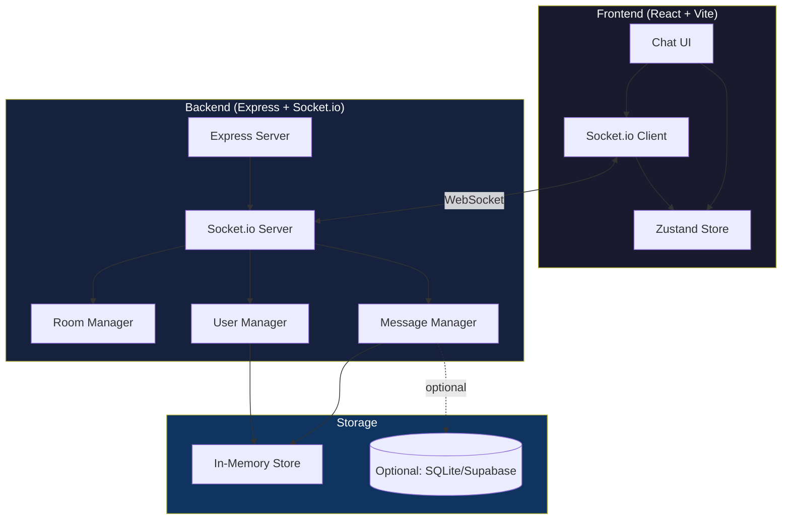
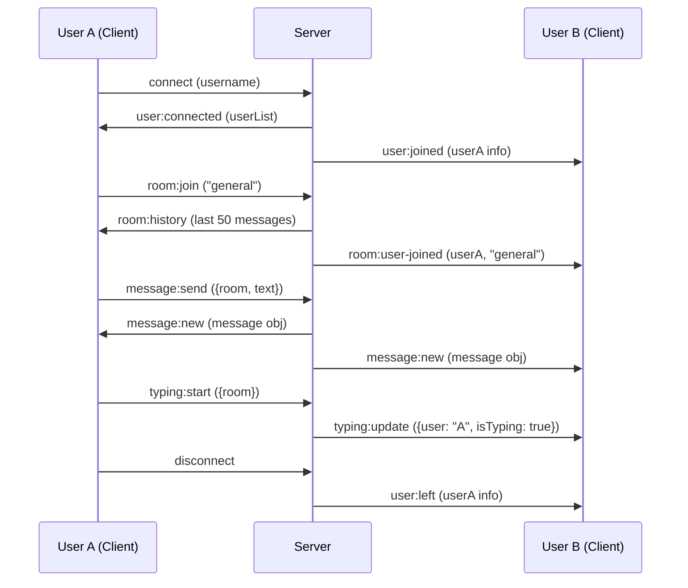

# 💬 Arcane Quest 03 — Arcane Messenger

> *"REST itu request-response. Tapi real world butuh REAL-TIME. Chat apps, live notifications, collaborative editing — semua pake WebSocket. Sekarang kalian bakal ngerasain bedanya."*

## 🎯 Misi

Bangun **Real-time Chat Application** pake WebSocket (Socket.io), dengan fitur rooms, typing indicators, message history, online users, dan emoji support.

---

## 📋 Tech Stack

| Layer | Tech |
|-------|------|
| Frontend | Vite + React + TypeScript |
| Styling | Tailwind CSS |
| Real-time | [Socket.io Client](https://socket.io/docs/v4/client-api/) |
| Backend | Node.js + Express + [Socket.io Server](https://socket.io/docs/v4/server-api/) |
| State | Zustand atau useReducer |
| Emoji | [emoji-mart](https://github.com/missive/emoji-mart) atau custom |
| Deploy | Frontend: Vercel, Backend: Railway/Render/Fly.io |

---

## 🏛️ Architecture



### Event Flow



---

## 🗂️ Fitur Wajib

### 1. User Join
- Input username saat pertama masuk (no auth needed)
- Username harus unique — server validate
- Persist username ke sessionStorage

### 2. Chat Rooms
- Default room: `#general`
- Bisa bikin room baru (nama custom)
- Bisa join/leave rooms
- Room list di sidebar dengan unread message count
- Active room highlighted

### 3. Real-time Messaging
- Send message → instantly appear di semua users di room yang sama
- Message format: `{ id, username, text, room, timestamp, type }`
- Support text messages
- Emoji picker (klik icon → pilih emoji → insert ke input)
- Enter to send, Shift+Enter for newline

### 4. Typing Indicators
- Saat user ngetik, tampilkan "UserX is typing..." di bawah chat
- Multiple users typing: "UserA and UserB are typing..."
- Hilang setelah 3 detik idle

### 5. Message History
- Server simpan last 50 messages per room (in-memory OK)
- Saat join room, load history
- Scroll to bottom on new message
- "New messages" indicator kalo user scroll ke atas

### 6. Online Users
- Sidebar: list semua online users
- Green dot = online
- Show which room each user is in
- Real-time update saat user join/leave

### 7. UI Requirements
- Chat bubble style (sent = right/blue, received = left/gray)
- Timestamp on messages
- User avatar (generate dari initial atau pake DiceBear API)
- Responsive: mobile = full screen chat, desktop = sidebar + chat

---

## 🏗️ Folder Structure

```
# Frontend
client/
├── src/
│   ├── components/
│   │   ├── chat/
│   │   │   ├── ChatWindow.tsx
│   │   │   ├── MessageBubble.tsx
│   │   │   ├── MessageInput.tsx
│   │   │   ├── TypingIndicator.tsx
│   │   │   └── EmojiPicker.tsx
│   │   ├── sidebar/
│   │   │   ├── RoomList.tsx
│   │   │   ├── UserList.tsx
│   │   │   └── CreateRoom.tsx
│   │   └── layout/
│   │       └── ChatLayout.tsx
│   ├── hooks/
│   │   ├── useSocket.ts
│   │   ├── useChat.ts
│   │   └── useTyping.ts
│   ├── stores/
│   │   └── chatStore.ts
│   ├── lib/
│   │   └── socket.ts
│   ├── types/
│   │   └── index.ts
│   ├── App.tsx
│   └── main.tsx

# Backend
server/
├── src/
│   ├── handlers/
│   │   ├── messageHandler.ts
│   │   ├── roomHandler.ts
│   │   └── userHandler.ts
│   ├── managers/
│   │   ├── RoomManager.ts
│   │   ├── MessageManager.ts
│   │   └── UserManager.ts
│   ├── types/
│   │   └── index.ts
│   └── index.ts
├── package.json
└── tsconfig.json
```

---

## 🔑 Key Implementation Hints

### Socket.io Client Setup

```typescript
// lib/socket.ts
import { io, Socket } from 'socket.io-client';

const SOCKET_URL = import.meta.env.VITE_SOCKET_URL || 'http://localhost:3001';

export const socket: Socket = io(SOCKET_URL, {
  autoConnect: false, // manual connect after username set
});
```

### Custom Hook: useSocket

```typescript
// hooks/useSocket.ts
// Handle connect, disconnect, reconnect
// Listen to events dan update Zustand store
// Cleanup listeners on unmount
// Return: { isConnected, connect, disconnect }
```

### Typing Indicator Logic

```typescript
// hooks/useTyping.ts
// Debounce typing events:
// - User mulai ngetik → emit "typing:start"
// - User stop ngetik 3 detik → emit "typing:stop"
// - JANGAN emit setiap keystroke (server overload)
```

### Server Event Handlers

```typescript
// server/src/index.ts
io.on('connection', (socket) => {
  // 'user:join' → add to user manager, broadcast to all
  // 'room:join' → add socket to room, send history
  // 'room:leave' → remove socket from room
  // 'message:send' → validate, store, broadcast to room
  // 'typing:start' → broadcast to room (exclude sender)
  // 'typing:stop' → broadcast to room (exclude sender)
  // 'disconnect' → cleanup user, broadcast leave
});
```

---

## 📊 Grading

| Kriteria | Bobot | Detail |
|----------|-------|--------|
| **Real-time Functionality** | 35% | Messages real-time, typing works, rooms work, online users accurate |
| **UI/UX** | 25% | Chat feels natural, responsive, smooth scrolling, good design |
| **Code Quality** | 20% | TypeScript on both client+server, clean event handling, proper cleanup |
| **Bonus Features** | 20% | Lihat bonus section |

---

## ✨ Bonus Features

| Bonus | Poin | Detail |
|-------|------|--------|
| 🖼️ **Image Messages** | +5 | Upload gambar, preview di chat (pake multer + cloudinary/supabase storage) |
| 🔔 **Notifications** | +3 | Browser notification saat dapat message di room lain |
| 🎨 **Message Reactions** | +3 | Emoji react ke messages (like Slack/Discord) |
| 📌 **Pinned Messages** | +2 | Pin important messages di room |
| 🌙 **Dark Mode** | +2 | Toggle dark/light theme |
| 🔍 **Search Messages** | +3 | Search through message history |
| 👤 **User Profiles** | +2 | Custom avatar upload, status message |

---

## 📅 Submission
- **Submit:**
  1. GitHub repo (monorepo: `/client` + `/server`)
  2. Frontend Vercel URL
  3. Backend deployed URL (Railway/Render/Fly.io)
  4. Video demo: 2 browser windows side by side, real-time chat demo
- **Format:** `arcane-messenger-[nama-kalian]`

---

## ⚠️ Common Pitfalls

- **Memory leak:** SELALU cleanup socket listeners di useEffect return
- **Race condition:** Message arrive before room history loaded → handle ordering
- **Typing spam:** Debounce typing events, jangan emit setiap keystroke
- **Reconnection:** Handle socket disconnect + reconnect gracefully

---

## 💡 Tips

1. **Start with basic messaging** — 1 room, no typing, no emoji. Get WebSocket working first.
2. **Test with 2 browser tabs** — buka 2 tab, chat between them
3. **Backend dulu** — bikin server event handlers, test pake Postman Socket.io plugin
4. **Typing indicator terakhir** — ini polish, bukan core feature

> *"WebSocket itu game changer. Setelah ini, kalian bakal ngeliat web development dari perspektif yang beda. Real-time itu addictive. 🔥"*

---

**Connect and conquer, Arcanists! ⚡**
