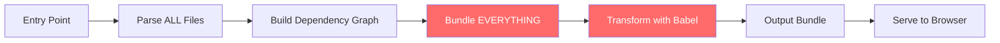
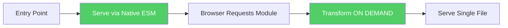

# 🔥 Vite: Build Tool yang Bikin CRA Pensiun Dini

## Cerita Dulu: Kenapa Gue Benci CRA

Jadi gini bro. Tahun 2022, gue lagi ngerjain project dashboard buat client di Kemang. Stack-nya React + CRA. Awalnya fine, codebase masih kecil. Tapi begitu file udah 200+, **setiap kali save file, hot reload-nya 8 DETIK**. Delapan. Detik. Lo bisa bikin Indomie, nyeduh kopi, scroll Twitter, baru browser-nya ke-update.

Gue pikir, "Mungkin laptop gue yang lemot." Upgrade RAM jadi 16GB. Masih lemot. Install SSD NVMe. Masih lemot. Ternyata bukan laptop gue yang bermasalah — **CRA yang bermasalah**.

Terus temen gue, developer di Bukalapak, bilang: *"Bro, pindah ke Vite. Trust me."*

Gue migrate. **Cold start dari 45 detik jadi 300 milidetik.** Gue literally bengong 10 detik, kira ada yang salah karena terlalu cepet.

Nah, di chapter ini gue bakal jelasin kenapa Vite itu game changer, gimana cara setup dari nol, dan config deep dive yang bakal bikin kalian jadi Vite wizard.

---

## Apa Sih Vite Itu?

Vite (dibaca "vit", bahasa Prancis artinya "cepat") adalah **next-generation build tool** yang dibuat oleh Evan You — orang yang sama yang bikin Vue.js. Tapi jangan salah, Vite bukan cuma buat Vue. Vite support React, Svelte, Vanilla JS, dan basically apapun.

### Kenapa CRA Lambat?

CRA pakai **Webpack** under the hood. Webpack itu bundler yang udah legend — tapi legend-nya kayak Nokia 3310. Kuat? Iya. Tapi udah ketinggalan jaman.

**Cara kerja Webpack (CRA):**



Lihat yang merah? Itu bottleneck-nya. Webpack harus **bundle SEMUA file** sebelum bisa serve ke browser. Mau cuma edit 1 baris? Webpack tetep harus re-process ribuan file.

**Cara kerja Vite:**



Vite pakai **Native ES Modules (ESM)**. Browser modern udah natively support `import/export`. Jadi Vite tinggal serve file as-is, dan browser yang request module satu-satu sesuai kebutuhan. **No bundling during dev!**

### ESBuild vs Babel: Speed Comparison

Vite pakai **ESBuild** untuk transform TypeScript dan JSX. ESBuild ditulis pakai **Go** (compiled language), sementara Babel ditulis pakai JavaScript (interpreted).

Analoginya gini: Babel itu kayak naik ojek dari Tangerang ke Sudirman lewat jalan tikus jam 7 pagi. ESBuild itu kayak naik MRT — jalur dedicated, gak ada macet.

**Benchmark real:**

```
Transforming 1000 TypeScript files:

Babel:    ~12 seconds
ESBuild:  ~0.3 seconds (40x faster!)
```

ESBuild bisa segitu cepet karena:
1. **Go is compiled** — gak ada overhead interpreter
2. **Parallelism** — Go punya goroutines, bisa process file paralel
3. **Minimal AST passes** — ESBuild cuma butuh 1 pass, Babel butuh banyak
4. **No plugins overhead** — ESBuild built-in, Babel load ratusan plugin

---

## Setup Vite dari Nol

### Method 1: Create New Project

```bash
npm create vite@latest my-react-app -- --template react-ts
cd my-react-app
npm install
npm run dev
```

**Expected output:**

```
  VITE v5.4.0  ready in 127 ms

  ➜  Local:   http://localhost:5173/
  ➜  Network: use --host to expose
  ➜  press h + enter to show help
```

127 ms bro. Gue gak boong.

### Method 2: Migrate dari CRA

Kalau kalian udah punya project CRA dan mau migrate, ini step-by-step-nya:

**Step 1: Hapus CRA dependencies**

```bash
npm uninstall react-scripts
rm -rf node_modules package-lock.json
```

**Step 2: Install Vite + plugins**

```bash
npm install -D vite @vitejs/plugin-react typescript @types/react @types/react-dom
```

**Step 3: Pindahin `index.html`**

CRA taruh `index.html` di folder `public/`. Vite butuh di **root folder**.

```bash
mv public/index.html ./index.html
```

Edit `index.html`, tambah script tag:

```html
<!DOCTYPE html>
<html lang="en">
  <head>
    <meta charset="UTF-8" />
    <meta name="viewport" content="width=device-width, initial-scale=1.0" />
    <title>My App</title>
  </head>
  <body>
    <div id="root"></div>
    <!-- INI YANG PENTING — entry point untuk Vite -->
    <script type="module" src="/src/main.tsx"></script>
  </body>
</html>
```

**Step 4: Rename entry file**

```bash
mv src/index.tsx src/main.tsx  # atau index.js -> main.tsx
```

**Step 5: Bikin `vite.config.ts`**

```typescript
import { defineConfig } from 'vite'
import react from '@vitejs/plugin-react'

export default defineConfig({
  plugins: [react()],
})
```

**Step 6: Update `package.json` scripts**

```json
{
  "scripts": {
    "dev": "vite",
    "build": "tsc && vite build",
    "preview": "vite preview"
  }
}
```

**Step 7: Handle env variables**

CRA pakai prefix `REACT_APP_`. Vite pakai prefix `VITE_`.

```bash
# .env (CRA style - HARUS diganti)
REACT_APP_API_URL=https://api.example.com

# .env (Vite style)
VITE_API_URL=https://api.example.com
```

Dan cara aksesnya beda:

```typescript
// CRA
const url = process.env.REACT_APP_API_URL

// Vite
const url = import.meta.env.VITE_API_URL
```

**Step 8: Jalanin dan pray**

```bash
npm install
npm run dev
```

Kalau ada error, 90% kemungkinan dari:
- Import path yang pakai absolute tanpa alias
- Env variable yang masih pakai `process.env`
- CSS Modules yang butuh config tambahan

---

## Vite Config Deep Dive

Ini bagian yang bikin kalian naik level dari "user Vite" jadi "Vite wizard". File `vite.config.ts` itu powerful banget.

### Path Aliases

Capek nulis `../../../components/Button`? Gue juga. Setup alias:

```typescript
// vite.config.ts
import { defineConfig } from 'vite'
import react from '@vitejs/plugin-react'
import path from 'path'

export default defineConfig({
  plugins: [react()],
  resolve: {
    alias: {
      '@': path.resolve(__dirname, './src'),
      '@components': path.resolve(__dirname, './src/components'),
      '@hooks': path.resolve(__dirname, './src/hooks'),
      '@utils': path.resolve(__dirname, './src/utils'),
      '@pages': path.resolve(__dirname, './src/pages'),
      '@assets': path.resolve(__dirname, './src/assets'),
    },
  },
})
```

Sekarang bisa import kayak gini:

```typescript
// Sebelum (nightmare)
import Button from '../../../components/ui/Button'
import { useAuth } from '../../../../hooks/useAuth'

// Sesudah (clean af)
import Button from '@components/ui/Button'
import { useAuth } from '@hooks/useAuth'
```

**PENTING:** Kalau pakai TypeScript, lo juga harus update `tsconfig.json`:

```json
{
  "compilerOptions": {
    "baseUrl": ".",
    "paths": {
      "@/*": ["src/*"],
      "@components/*": ["src/components/*"],
      "@hooks/*": ["src/hooks/*"],
      "@utils/*": ["src/utils/*"],
      "@pages/*": ["src/pages/*"],
      "@assets/*": ["src/assets/*"]
    }
  }
}
```

### Environment Variables

Vite punya system env yang lebih strict dari CRA. Dan ini bagus — prevent accidentally leaking server secrets ke client.

```bash
# .env                 → loaded di semua environment
# .env.local           → loaded di semua, GITIGNORED
# .env.development     → loaded kalau `npm run dev`
# .env.production      → loaded kalau `npm run build`
# .env.staging         → custom mode
```

Priority order (paling tinggi menang):
```
.env.production.local > .env.production > .env.local > .env
```

Cara pakai custom mode:

```bash
# package.json
{
  "scripts": {
    "dev": "vite",
    "dev:staging": "vite --mode staging",
    "build": "vite build",
    "build:staging": "vite build --mode staging"
  }
}
```

```bash
# .env.staging
VITE_API_URL=https://staging-api.ethjkt.com
VITE_APP_ENV=staging
```

Type safety untuk env:

```typescript
// src/vite-env.d.ts
/// <reference types="vite/client" />

interface ImportMetaEnv {
  readonly VITE_API_URL: string
  readonly VITE_APP_ENV: 'development' | 'staging' | 'production'
  readonly VITE_STRIPE_PUBLIC_KEY: string
}

interface ImportMeta {
  readonly env: ImportMetaEnv
}
```

Sekarang `import.meta.env.VITE_API_URL` bakal ada autocomplete di VS Code. 🎉

### Proxy Configuration

Ini penting banget kalau frontend dan backend beda port (which is almost always). Tanpa proxy, lo bakal kena **CORS error** yang bikin garuk kepala.

```typescript
// vite.config.ts
export default defineConfig({
  plugins: [react()],
  server: {
    port: 3000,
    proxy: {
      // Simple proxy
      '/api': {
        target: 'http://localhost:8080',
        changeOrigin: true,
      },
      // Rewrite path
      '/api/v2': {
        target: 'http://localhost:8080',
        changeOrigin: true,
        rewrite: (path) => path.replace(/^\/api\/v2/, '/v2'),
      },
      // WebSocket proxy
      '/socket.io': {
        target: 'ws://localhost:8080',
        ws: true,
      },
    },
  },
})
```

Cara kerjanya:

```
Browser request: GET /api/users
                    ↓
Vite dev server catches "/api" prefix
                    ↓
Forwards to: http://localhost:8080/api/users
                    ↓
Response dikirim balik ke browser
```

Browser pikir request-nya ke `localhost:3000`, padahal Vite forward ke `localhost:8080`. No CORS, no problem.

### CSS Configuration

```typescript
// vite.config.ts
export default defineConfig({
  css: {
    // CSS Modules config
    modules: {
      localsConvention: 'camelCase', // .my-class jadi myClass
      scopeBehaviour: 'local',
    },
    // PostCSS config (bisa juga pakai postcss.config.js)
    postcss: {
      plugins: [
        // autoprefixer, tailwindcss, etc
      ],
    },
    // Preprocessor options
    preprocessorOptions: {
      scss: {
        additionalData: `@import "@/styles/variables.scss";`,
      },
    },
  },
})
```

### Build Configuration

```typescript
// vite.config.ts
export default defineConfig({
  build: {
    // Output directory
    outDir: 'dist',
    
    // Generate sourcemaps for debugging
    sourcemap: true,
    
    // Chunk splitting strategy
    rollupOptions: {
      output: {
        manualChunks: {
          // Vendor splitting - pisah library besar ke chunk sendiri
          'react-vendor': ['react', 'react-dom'],
          'tanstack': ['@tanstack/react-query', '@tanstack/react-table'],
          'ui': ['@radix-ui/react-dialog', '@radix-ui/react-dropdown-menu'],
        },
      },
    },
    
    // Minimum chunk size (KB)
    chunkSizeWarningLimit: 500,
    
    // Target browsers
    target: 'es2020',
  },
})
```

**Kenapa chunk splitting penting?**

Tanpa splitting, semua code masuk 1 file gede. User harus download semuanya sebelum bisa interact. Dengan splitting:

```
Tanpa splitting:
main.js → 2.4MB (user nunggu download semua)

Dengan splitting:
main.js        → 150KB (app code - load pertama)
react-vendor.js → 140KB (cached after first visit)  
tanstack.js    → 200KB (loaded when needed)
ui.js          → 180KB (loaded when needed)
```

Browser bisa cache vendor chunks. Next visit, cuma download `main.js` yang berubah.

---

## Full Production-Ready Config

Ini config lengkap yang bisa kalian pakai sebagai starting point buat project apapun:

```typescript
// vite.config.ts
import { defineConfig, loadEnv } from 'vite'
import react from '@vitejs/plugin-react'
import path from 'path'

export default defineConfig(({ mode }) => {
  // Load env file based on `mode`
  const env = loadEnv(mode, process.cwd(), '')
  
  return {
    plugins: [
      react({
        // Enable React Refresh for fast HMR
        fastRefresh: true,
      }),
    ],
    
    resolve: {
      alias: {
        '@': path.resolve(__dirname, './src'),
        '@components': path.resolve(__dirname, './src/components'),
        '@hooks': path.resolve(__dirname, './src/hooks'),
        '@utils': path.resolve(__dirname, './src/utils'),
        '@pages': path.resolve(__dirname, './src/pages'),
        '@stores': path.resolve(__dirname, './src/stores'),
        '@types': path.resolve(__dirname, './src/types'),
        '@services': path.resolve(__dirname, './src/services'),
        '@assets': path.resolve(__dirname, './src/assets'),
      },
    },
    
    server: {
      port: 3000,
      open: true, // Auto open browser
      proxy: {
        '/api': {
          target: env.VITE_API_URL || 'http://localhost:8080',
          changeOrigin: true,
        },
      },
    },
    
    css: {
      modules: {
        localsConvention: 'camelCase',
      },
    },
    
    build: {
      outDir: 'dist',
      sourcemap: mode !== 'production',
      rollupOptions: {
        output: {
          manualChunks: (id) => {
            if (id.includes('node_modules')) {
              if (id.includes('react') || id.includes('react-dom')) {
                return 'react-vendor'
              }
              if (id.includes('@tanstack')) {
                return 'tanstack'
              }
              return 'vendor'
            }
          },
        },
      },
    },
    
    // Performance: exclude large deps from pre-bundling if needed
    optimizeDeps: {
      include: ['react', 'react-dom'],
    },
  }
})
```

---

## Vite Plugin Ecosystem

Vite punya plugin ecosystem yang growing cepet banget. Beberapa yang wajib tau:

### 1. `@vitejs/plugin-react`

Plugin official React. Udah include di template. Support JSX transform, Fast Refresh, dan Babel plugins kalau butuh.

### 2. `vite-plugin-svgr`

Convert SVG jadi React components:

```bash
npm install -D vite-plugin-svgr
```

```typescript
// vite.config.ts
import svgr from 'vite-plugin-svgr'

export default defineConfig({
  plugins: [react(), svgr()],
})
```

```typescript
// Pakai SVG sebagai component (pakai ?react suffix)
import Logo from '@assets/logo.svg?react'

function Header() {
  return <Logo className="h-8 w-8" />
}
```

### 3. `vite-plugin-checker`

TypeScript + ESLint checking di terminal selama dev:

```bash
npm install -D vite-plugin-checker
```

```typescript
import checker from 'vite-plugin-checker'

export default defineConfig({
  plugins: [
    react(),
    checker({
      typescript: true,
      eslint: {
        lintCommand: 'eslint "./src/**/*.{ts,tsx}"',
      },
    }),
  ],
})
```

### 4. `vite-plugin-compression`

Gzip/Brotli compression untuk production:

```bash
npm install -D vite-plugin-compression
```

```typescript
import compression from 'vite-plugin-compression'

export default defineConfig({
  plugins: [
    react(),
    compression({
      algorithm: 'brotliCompress', // or 'gzip'
    }),
  ],
})
```

---

## Project Structure yang Gue Recommend

Setelah setup Vite, ini folder structure yang battle-tested:

```
my-app/
├── public/
│   ├── favicon.ico
│   └── robots.txt
├── src/
│   ├── assets/          # Images, fonts, SVGs
│   ├── components/
│   │   ├── ui/          # Reusable UI (Button, Modal, Input)
│   │   └── layout/      # Layout components (Navbar, Sidebar)
│   ├── hooks/           # Custom hooks
│   ├── pages/           # Route pages
│   ├── services/        # API calls
│   ├── stores/          # State management (Zustand/Redux)
│   ├── types/           # TypeScript types/interfaces
│   ├── utils/           # Helper functions
│   ├── styles/          # Global styles
│   ├── App.tsx
│   ├── main.tsx         # Entry point
│   └── vite-env.d.ts    # Vite type declarations
├── index.html
├── vite.config.ts
├── tsconfig.json
├── tsconfig.node.json
├── package.json
├── .env
├── .env.local
└── .gitignore
```

---

## Hands-On: Setup dari Nol Sampai Deploy-Ready

Oke, sekarang let's build. Copy-paste semua ini:

```bash
# 1. Create project
npm create vite@latest ethjkt-week3 -- --template react-ts

# 2. Masuk folder
cd ethjkt-week3

# 3. Install base dependencies
npm install

# 4. Install extras yang bakal kita pakai di Week 3
npm install @tanstack/react-query @tanstack/react-table @tanstack/react-router zustand axios
npm install -D @types/node vite-plugin-svgr

# 5. Jalanin
npm run dev
```

**Expected output:**

```
  VITE v5.4.0  ready in 156 ms

  ➜  Local:   http://localhost:5173/
  ➜  Network: use --host to expose
```

Sekarang buka browser, lo bakal liat Vite + React default page dengan counter. 

**Coba edit `src/App.tsx`**, ganti text apapun, dan lihat browser. **Instant update, no page reload.** Itu HMR (Hot Module Replacement) in action.

---

## Troubleshooting Common Issues

### 1. "Cannot find module '@/...'"

TypeScript gak tau alias lo. Pastiin `tsconfig.json` punya `paths` yang match sama `vite.config.ts`.

### 2. "process is not defined"

Lo masih pakai `process.env.SOMETHING`. Ganti ke `import.meta.env.VITE_SOMETHING`.

### 3. Global CSS gak ke-apply

Pastiin import di `main.tsx`:
```typescript
import './styles/globals.css'
```

### 4. Build error "Top-level await"

Set target ke `es2022` di `vite.config.ts`:
```typescript
build: {
  target: 'es2022',
}
```

### 5. Port 5173 udah kepakai

```typescript
server: {
  port: 3000, // ganti port
  strictPort: true, // error kalau port kepakai (instead of auto-increment)
}
```

---

## Summary

| Feature | CRA (Webpack) | Vite (ESBuild) |
|---------|--------------|----------------|
| Cold Start | 30-60s | 100-300ms |
| HMR | 1-8s | <50ms |
| Build | Slow | 10-100x faster |
| Config | Eject hell | Clean config file |
| ESM | Bundled | Native |
| TypeScript | Babel transform | ESBuild native |
| Maintenance | Deprecated vibes | Actively maintained |

**TL;DR:** Kalau masih pakai CRA di 2024+, lo kayak masih pakai Internet Explorer di era Chrome. Pindah ke Vite. Sekarang. Gak ada alasan buat gak pindah.

---

## Latihan

1. Buat project baru pakai Vite + React + TypeScript
2. Setup path aliases (`@components`, `@hooks`, `@utils`)
3. Bikin `.env.development` dan `.env.production` dengan variable berbeda
4. Configure proxy ke `https://jsonplaceholder.typicode.com`
5. Build dan analyze chunk sizes (`npm run build`)
6. Deploy ke Vercel (gratis): `npx vercel`

---

**Next Part -> [02 - useRef Deep Dive](https://github.com/Ethereum-Jakarta/phase-2-week3-frontend-advance/blob/main/study-material/02-useref-deep-dive.md)**
