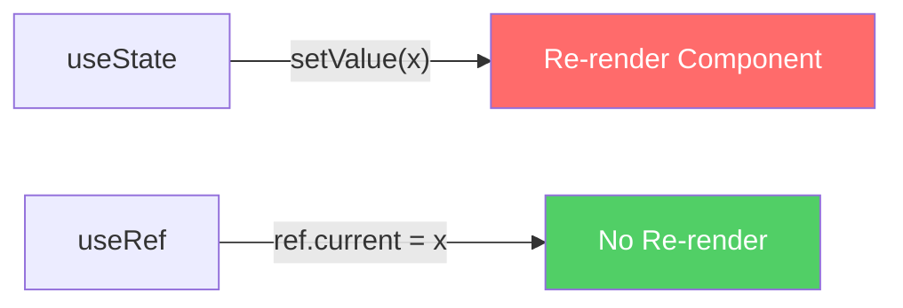

# 🎯 useRef Deep Dive: DOM Manipulation Tanpa Re-render

## Cerita Dulu: Bug yang Bikin Gue Begadang

Suatu malam jam 2 pagi, gue lagi bikin video player custom buat client. Setiap kali user klik play/pause, **seluruh UI ke-rerender**. Progress bar reset, volume slider balik ke default, chat overlay kedip-kedip. Client marah, deadline besok.

Masalahnya? Gue pakai `useState` buat nyimpen reference ke `<video>` element. Setiap update state = re-render. Padahal gue cuma butuh **akses ke DOM element tanpa trigger render**.

Solusinya? `useRef`. Tiga baris code, bug fixed, gue bisa tidur.

---

## Apa Itu useRef?

`useRef` itu hook yang bikin **mutable container** yang persist across renders. Value-nya disimpen di `.current` property dan **TIDAK trigger re-render** kalau diubah.



Perbedaan fundamental:

```typescript
// useState: setiap update = re-render
const [count, setCount] = useState(0)
setCount(1) // 🔄 Component re-renders!

// useRef: update TANPA re-render
const countRef = useRef(0)
countRef.current = 1 // 😴 Nothing happens in UI
```

---

## Use Case 1: DOM References

Ini use case paling umum. Akses DOM element langsung.

```typescript
import { useRef, useEffect } from 'react'

function AutoFocusInput() {
  const inputRef = useRef<HTMLInputElement>(null)
  
  useEffect(() => {
    // Focus input saat component mount
    inputRef.current?.focus()
  }, [])
  
  return (
    <div className="p-4">
      <label className="block mb-2 font-bold">Username:</label>
      <input
        ref={inputRef}
        type="text"
        className="border p-2 rounded w-full"
        placeholder="Auto-focused!"
      />
    </div>
  )
}

export default AutoFocusInput
```

**Expected behavior:** Begitu component mount, cursor langsung ada di input field. Gak perlu user klik.

### Scroll to Element

```typescript
import { useRef } from 'react'

function ScrollDemo() {
  const topRef = useRef<HTMLDivElement>(null)
  const bottomRef = useRef<HTMLDivElement>(null)
  
  const scrollToBottom = () => {
    bottomRef.current?.scrollIntoView({ behavior: 'smooth' })
  }
  
  const scrollToTop = () => {
    topRef.current?.scrollIntoView({ behavior: 'smooth' })
  }
  
  return (
    <div>
      <div ref={topRef}>
        <h1>Top of Page</h1>
        <button onClick={scrollToBottom} className="bg-blue-500 text-white p-2 rounded">
          Scroll to Bottom ⬇️
        </button>
      </div>
      
      {/* Spacer */}
      <div style={{ height: '200vh' }} className="bg-gradient-to-b from-blue-100 to-purple-100" />
      
      <div ref={bottomRef}>
        <h1>Bottom of Page</h1>
        <button onClick={scrollToTop} className="bg-green-500 text-white p-2 rounded">
          Scroll to Top ⬆️
        </button>
      </div>
    </div>
  )
}
```

---

## Use Case 2: Mutable Values (No Re-render)

Kadang lo butuh simpen value yang berubah-ubah tapi gak perlu ditampilin di UI. Contoh: interval ID, previous value, render count.

### Render Counter

```typescript
import { useRef, useState, useEffect } from 'react'

function RenderCounter() {
  const [name, setName] = useState('')
  const renderCount = useRef(0)
  
  useEffect(() => {
    renderCount.current += 1
  })
  
  return (
    <div className="p-4">
      <input
        value={name}
        onChange={(e) => setName(e.target.value)}
        className="border p-2 rounded"
        placeholder="Ketik sesuatu..."
      />
      <p>Nama: {name}</p>
      <p>Component ini udah render {renderCount.current} kali</p>
    </div>
  )
}
```

**Expected output:** Setiap ketik huruf, render count naik. Tapi render count sendiri GAK trigger tambahan render.

Kalau lo pakai `useState` buat render count, lo bakal dapet **infinite loop** karena setiap update count = re-render = update count = re-render = 💥

### Previous Value Hook

```typescript
import { useRef, useEffect, useState } from 'react'

function usePrevious<T>(value: T): T | undefined {
  const ref = useRef<T>()
  
  useEffect(() => {
    ref.current = value
  }, [value])
  
  return ref.current
}

function PriceTracker() {
  const [price, setPrice] = useState(50000)
  const prevPrice = usePrevious(price)
  
  const diff = prevPrice !== undefined ? price - prevPrice : 0
  
  return (
    <div className="p-4">
      <h2>ETH Price: Rp {price.toLocaleString('id-ID')}</h2>
      {prevPrice !== undefined && (
        <p style={{ color: diff >= 0 ? 'green' : 'red' }}>
          {diff >= 0 ? '📈' : '📉'} {diff >= 0 ? '+' : ''}{diff.toLocaleString('id-ID')}
        </p>
      )}
      <div className="flex gap-2 mt-2">
        <button onClick={() => setPrice(p => p + 1000)} className="bg-green-500 text-white p-2 rounded">
          +1000
        </button>
        <button onClick={() => setPrice(p => p - 1000)} className="bg-red-500 text-white p-2 rounded">
          -1000
        </button>
      </div>
    </div>
  )
}
```

### Timer/Interval dengan useRef

```typescript
import { useRef, useState } from 'react'

function Stopwatch() {
  const [time, setTime] = useState(0)
  const [isRunning, setIsRunning] = useState(false)
  const intervalRef = useRef<number | null>(null)
  
  const start = () => {
    if (isRunning) return
    setIsRunning(true)
    intervalRef.current = window.setInterval(() => {
      setTime(prev => prev + 10)
    }, 10)
  }
  
  const stop = () => {
    if (!isRunning) return
    setIsRunning(false)
    if (intervalRef.current) {
      clearInterval(intervalRef.current)
      intervalRef.current = null
    }
  }
  
  const reset = () => {
    stop()
    setTime(0)
  }
  
  const formatTime = (ms: number) => {
    const minutes = Math.floor(ms / 60000)
    const seconds = Math.floor((ms % 60000) / 1000)
    const centiseconds = Math.floor((ms % 1000) / 10)
    return `${String(minutes).padStart(2, '0')}:${String(seconds).padStart(2, '0')}.${String(centiseconds).padStart(2, '0')}`
  }
  
  return (
    <div className="p-8 text-center">
      <h1 className="text-6xl font-mono mb-8">{formatTime(time)}</h1>
      <div className="flex gap-4 justify-center">
        <button onClick={start} className="bg-green-500 text-white px-6 py-3 rounded-lg text-xl">
          ▶ Start
        </button>
        <button onClick={stop} className="bg-yellow-500 text-white px-6 py-3 rounded-lg text-xl">
          ⏸ Stop
        </button>
        <button onClick={reset} className="bg-red-500 text-white px-6 py-3 rounded-lg text-xl">
          🔄 Reset
        </button>
      </div>
    </div>
  )
}
```

**Kenapa interval ID harus di ref?** Karena kalau di variable biasa, setiap re-render bikin variable baru. Lo gak bisa `clearInterval` kalau ID-nya udah ilang.

---

## Use Case 3: Uncontrolled Forms

Controlled form (pakai useState) = setiap keystroke = re-render. Buat form gede, ini bisa bikin lag.

Uncontrolled form (pakai useRef) = React gak track value, ambil value cuma pas submit.

```typescript
import { useRef, FormEvent } from 'react'

function UncontrolledForm() {
  const nameRef = useRef<HTMLInputElement>(null)
  const emailRef = useRef<HTMLInputElement>(null)
  const messageRef = useRef<HTMLTextAreaElement>(null)
  
  const handleSubmit = (e: FormEvent) => {
    e.preventDefault()
    
    const data = {
      name: nameRef.current?.value ?? '',
      email: emailRef.current?.value ?? '',
      message: messageRef.current?.value ?? '',
    }
    
    console.log('Form submitted:', data)
    // Expected output: Form submitted: { name: "Budi", email: "budi@eth.id", message: "gm ser" }
    
    alert(`Terima kasih, ${data.name}!`)
  }
  
  return (
    <form onSubmit={handleSubmit} className="max-w-md mx-auto p-4 space-y-4">
      <div>
        <label className="block font-bold mb-1">Nama:</label>
        <input ref={nameRef} type="text" className="border p-2 rounded w-full" required />
      </div>
      <div>
        <label className="block font-bold mb-1">Email:</label>
        <input ref={emailRef} type="email" className="border p-2 rounded w-full" required />
      </div>
      <div>
        <label className="block font-bold mb-1">Pesan:</label>
        <textarea ref={messageRef} className="border p-2 rounded w-full" rows={4} required />
      </div>
      <button type="submit" className="bg-blue-500 text-white px-4 py-2 rounded w-full">
        Kirim
      </button>
    </form>
  )
}
```

**Kapan pakai uncontrolled?**
- Form simple (login, contact)
- Performance critical (form dengan 50+ fields)
- Integrasi dengan library non-React

**Kapan pakai controlled?**
- Butuh real-time validation
- Butuh conditional rendering based on input
- Form wizard (multi-step)

---

## Use Case 4: forwardRef + useImperativeHandle

Ini advanced stuff. Kadang parent component perlu **memanggil method** di child component. Misalnya, parent mau trigger `play()` di video player yang ada di child.

### forwardRef: Pass Ref ke Child

```typescript
import { forwardRef, useRef } from 'react'

// Child component yang terima ref dari parent
const FancyInput = forwardRef<HTMLInputElement, { label: string }>(
  ({ label }, ref) => {
    return (
      <div className="mb-4">
        <label className="block font-bold mb-1">{label}</label>
        <input
          ref={ref}
          type="text"
          className="border-2 border-purple-500 p-2 rounded w-full focus:ring-2 focus:ring-purple-300"
        />
      </div>
    )
  }
)

FancyInput.displayName = 'FancyInput'

// Parent component
function ParentForm() {
  const inputRef = useRef<HTMLInputElement>(null)
  
  const focusInput = () => {
    inputRef.current?.focus()
  }
  
  const clearInput = () => {
    if (inputRef.current) {
      inputRef.current.value = ''
      inputRef.current.focus()
    }
  }
  
  return (
    <div className="p-4">
      <FancyInput ref={inputRef} label="Username" />
      <div className="flex gap-2">
        <button onClick={focusInput} className="bg-purple-500 text-white p-2 rounded">
          Focus Input
        </button>
        <button onClick={clearInput} className="bg-red-500 text-white p-2 rounded">
          Clear & Focus
        </button>
      </div>
    </div>
  )
}
```

### useImperativeHandle: Custom Methods

`forwardRef` expose seluruh DOM element. Kadang lo mau **limit** apa yang parent bisa akses. Di sinilah `useImperativeHandle` masuk.

```typescript
import { forwardRef, useRef, useImperativeHandle } from 'react'

// Define what methods parent can call
interface VideoPlayerHandle {
  play: () => void
  pause: () => void
  seek: (time: number) => void
  getCurrentTime: () => number
}

interface VideoPlayerProps {
  src: string
  poster?: string
}

const VideoPlayer = forwardRef<VideoPlayerHandle, VideoPlayerProps>(
  ({ src, poster }, ref) => {
    const videoRef = useRef<HTMLVideoElement>(null)
    
    useImperativeHandle(ref, () => ({
      play() {
        videoRef.current?.play()
      },
      pause() {
        videoRef.current?.pause()
      },
      seek(time: number) {
        if (videoRef.current) {
          videoRef.current.currentTime = time
        }
      },
      getCurrentTime() {
        return videoRef.current?.currentTime ?? 0
      },
    }))
    
    return (
      <video
        ref={videoRef}
        src={src}
        poster={poster}
        className="w-full rounded-lg shadow-lg"
        controls={false} // We control it from parent!
      />
    )
  }
)

VideoPlayer.displayName = 'VideoPlayer'

// Parent: Custom Video Controls
function VideoApp() {
  const playerRef = useRef<VideoPlayerHandle>(null)
  
  return (
    <div className="max-w-2xl mx-auto p-4">
      <VideoPlayer
        ref={playerRef}
        src="https://www.w3schools.com/html/mov_bbb.mp4"
        poster="https://peach.blender.org/wp-content/uploads/title_anouncement.jpg"
      />
      
      <div className="flex gap-2 mt-4 justify-center">
        <button
          onClick={() => playerRef.current?.play()}
          className="bg-green-500 text-white px-4 py-2 rounded"
        >
          ▶ Play
        </button>
        <button
          onClick={() => playerRef.current?.pause()}
          className="bg-yellow-500 text-white px-4 py-2 rounded"
        >
          ⏸ Pause
        </button>
        <button
          onClick={() => playerRef.current?.seek(0)}
          className="bg-blue-500 text-white px-4 py-2 rounded"
        >
          ⏮ Restart
        </button>
        <button
          onClick={() => {
            const time = playerRef.current?.getCurrentTime()
            alert(`Current time: ${time?.toFixed(1)}s`)
          }}
          className="bg-purple-500 text-white px-4 py-2 rounded"
        >
          🕐 Get Time
        </button>
      </div>
    </div>
  )
}
```

**Expected behavior:** 
- Klik Play → video jalan
- Klik Pause → video berhenti
- Klik Restart → video balik ke awal
- Klik Get Time → alert tampil current time

Parent **CUMA bisa** akses 4 method yang kita define. Gak bisa akses `videoRef.current.volume`, `videoRef.current.playbackRate`, dll. Ini **encapsulation** — prinsip OOP di React.

---

## Callback Refs: Advanced Pattern

Kadang lo butuh tau **kapan** ref di-attach/detach. Misalnya buat measure element size.

```typescript
import { useState, useCallback } from 'react'

function MeasuredComponent() {
  const [dimensions, setDimensions] = useState({ width: 0, height: 0 })
  
  // Callback ref - dipanggil setiap kali element mount/unmount
  const measuredRef = useCallback((node: HTMLDivElement | null) => {
    if (node !== null) {
      const rect = node.getBoundingClientRect()
      setDimensions({
        width: Math.round(rect.width),
        height: Math.round(rect.height),
      })
    }
  }, [])
  
  return (
    <div>
      <div
        ref={measuredRef}
        className="bg-gradient-to-r from-blue-500 to-purple-500 text-white p-8 rounded-lg m-4"
      >
        <h2>Resize the browser window!</h2>
        <p>This box adapts to content.</p>
      </div>
      <p className="ml-4">
        Width: {dimensions.width}px, Height: {dimensions.height}px
      </p>
    </div>
  )
}
```

---

## Kapan Pakai useState vs useRef?

```
┌─────────────────────────────────────────────┐
│           Butuh trigger re-render?           │
│                                              │
│         YES ──→ useState                     │
│         NO  ──→ useRef                       │
│                                              │
│  ┌─────────────────────────────────────────┐ │
│  │ useState examples:                      │ │
│  │  - UI text yang ditampilin              │ │
│  │  - Toggle show/hide                     │ │
│  │  - Form input yang perlu validation     │ │
│  │  - Counter yang ditampilin              │ │
│  ├─────────────────────────────────────────┤ │
│  │ useRef examples:                        │ │
│  │  - DOM element access                   │ │
│  │  - Timer/interval IDs                   │ │
│  │  - Previous values                      │ │
│  │  - Render counts (debug)                │ │
│  │  - Mutable flags (isFirstRender)        │ │
│  └─────────────────────────────────────────┘ │
└─────────────────────────────────────────────┘
```

---

## Common Mistakes

### ❌ Mistake 1: Read ref during render

```typescript
function Bad() {
  const ref = useRef(0)
  ref.current += 1 // ❌ DON'T modify ref during render!
  return <p>{ref.current}</p> // ❌ DON'T read ref during render!
}

function Good() {
  const ref = useRef(0)
  useEffect(() => {
    ref.current += 1 // ✅ Modify in effect or event handler
  })
  return <p>Check console for render count</p>
}
```

### ❌ Mistake 2: Expect ref changes to update UI

```typescript
function Bad() {
  const nameRef = useRef('Budi')
  
  return (
    <div>
      <p>{nameRef.current}</p> {/* Will always show "Budi"! */}
      <button onClick={() => { nameRef.current = 'Andi' }}>
        Change Name {/* UI won't update */}
      </button>
    </div>
  )
}
```

Kalau lo butuh UI update, pakai `useState`. Period.

---

## Latihan

1. Bikin stopwatch component (start, stop, reset, lap times)
2. Bikin auto-growing textarea (height follows content)
3. Bikin click-outside detector pakai useRef
4. Bikin component yang track & display previous 5 values of a state

---

**Next Part -> [03 - useContext Deep Dive](https://github.com/Ethereum-Jakarta/phase-2-week3-frontend-advance/blob/main/study-material/03-usecontext-deep-dive.md)**
