# 🌐 useContext Deep Dive: Global State Tanpa Props Drilling

## Cerita Dulu: Props Drilling Nightmare

Bayangin lo kerja di startup Jakarta, bikin e-commerce. Ada data `user` yang dibutuhin di mana-mana: Navbar (nama user), Sidebar (avatar), OrderPage (alamat), CartPage (payment method), SettingsPage (semua data).

Tanpa Context, lo harus passing `user` prop dari `App` → `Layout` → `Navbar` → `UserMenu`. Dari `App` → `Layout` → `MainContent` → `OrderPage` → `OrderForm` → `AddressField`. **Setiap level harus terima dan forward prop yang gak dia pakai sendiri.**


Hijau = butuh data. Merah = punya data. Semua yang di tengah? **Cuma jadi tukang lewat.** Ini namanya **props drilling** dan ini bikin code lo jadi spaghetti.

---

## useContext: Teleportasi Data

Context itu kayak WiFi. Lo setup router (Provider) di satu tempat, dan semua device (Consumer) di dalam jangkauan bisa connect langsung. Gak perlu kabel dari router ke setiap device lewat setiap ruangan.

```mermaid
graph TD
    Provider["🔵 UserContext.Provider"] -.-> UserMenu["UserMenu (useContext)"]
    Provider -.-> UserAvatar["UserAvatar (useContext)"]
    Provider -.-> AddressField["AddressField (useContext)"]
    
    style Provider fill:#339af0,color:#fff
```



### Basic Setup

```typescript
// src/contexts/UserContext.tsx
import { createContext, useContext, useState, ReactNode } from 'react'

// 1. Define type
interface User {
  id: string
  name: string
  email: string
  avatar: string
}

interface UserContextType {
  user: User | null
  login: (user: User) => void
  logout: () => void
}

// 2. Create context with default value
const UserContext = createContext<UserContextType | undefined>(undefined)

// 3. Create provider component
export function UserProvider({ children }: { children: ReactNode }) {
  const [user, setUser] = useState<User | null>(null)
  
  const login = (userData: User) => {
    setUser(userData)
    localStorage.setItem('user', JSON.stringify(userData))
  }
  
  const logout = () => {
    setUser(null)
    localStorage.removeItem('user')
  }
  
  return (
    <UserContext.Provider value={{ user, login, logout }}>
      {children}
    </UserContext.Provider>
  )
}

// 4. Create custom hook (ALWAYS do this)
export function useUser() {
  const context = useContext(UserContext)
  if (context === undefined) {
    throw new Error('useUser must be used within a UserProvider')
  }
  return context
}
```

**Kenapa custom hook?** Dua alasan:
1. **Type safety** — gak perlu check `undefined` setiap kali pakai
2. **Error message** — kalau lupa wrap Provider, dapet error yang jelas

### Pakai di App

```typescript
// src/App.tsx
import { UserProvider } from './contexts/UserContext'
import { Navbar } from './components/Navbar'
import { ProfilePage } from './pages/ProfilePage'

function App() {
  return (
    <UserProvider>
      <Navbar />
      <ProfilePage />
    </UserProvider>
  )
}
```

```typescript
// src/components/Navbar.tsx
import { useUser } from '../contexts/UserContext'

export function Navbar() {
  const { user, logout } = useUser()
  
  return (
    <nav className="bg-gray-800 text-white p-4 flex justify-between">
      <h1 className="text-xl font-bold">ETHJKT Store</h1>
      {user ? (
        <div className="flex items-center gap-4">
          <span>Halo, {user.name}!</span>
          <button onClick={logout} className="bg-red-500 px-3 py-1 rounded">
            Logout
          </button>
        </div>
      ) : (
        <span>Not logged in</span>
      )}
    </nav>
  )
}
```

```typescript
// src/pages/ProfilePage.tsx
import { useUser } from '../contexts/UserContext'

export function ProfilePage() {
  const { user, login } = useUser()
  
  const handleLogin = () => {
    login({
      id: '1',
      name: 'Budi Satria',
      email: 'budi@ethjkt.com',
      avatar: 'https://i.pravatar.cc/150?img=3',
    })
  }
  
  if (!user) {
    return (
      <div className="p-8 text-center">
        <p className="mb-4">Belum login nih bro</p>
        <button onClick={handleLogin} className="bg-blue-500 text-white px-6 py-2 rounded">
          Login as Budi
        </button>
      </div>
    )
  }
  
  return (
    <div className="p-8">
      
      <h2 className="text-2xl font-bold mt-4">{user.name}</h2>
      <p className="text-gray-600">{user.email}</p>
    </div>
  )
}
```

**Expected behavior:** Klik "Login as Budi" → Navbar langsung update nama, ProfilePage tampil avatar. Semua **tanpa props drilling**.

---

## ⚠️ Provider Hell

Masalah muncul kalau app lo punya banyak context. Theme, Auth, Language, Cart, Notifications...

```typescript
// ❌ Provider Hell
function App() {
  return (
    <ThemeProvider>
      <AuthProvider>
        <LanguageProvider>
          <CartProvider>
            <NotificationProvider>
              <ToastProvider>
                <ModalProvider>
                  <RouterProvider>
                    <MainApp />
                  </RouterProvider>
                </ModalProvider>
              </ToastProvider>
            </NotificationProvider>
          </CartProvider>
        </LanguageProvider>
      </AuthProvider>
    </ThemeProvider>
  )
}
```

Christmas tree dari neraka. Solusinya? **Compose providers:**

```typescript
// src/providers/AppProviders.tsx
import { ReactNode } from 'react'

// Helper function to compose providers
function composeProviders(...providers: Array<React.FC<{ children: ReactNode }>>) {
  return ({ children }: { children: ReactNode }) =>
    providers.reduceRight(
      (child, Provider) => <Provider>{child}</Provider>,
      children
    )
}

// Clean!
const AppProviders = composeProviders(
  ThemeProvider,
  AuthProvider,
  LanguageProvider,
  CartProvider,
  NotificationProvider,
)

// Usage
function App() {
  return (
    <AppProviders>
      <MainApp />
    </AppProviders>
  )
}
```

---

## ⚠️ Performance Trap: The Silent Killer

**INI YANG PALING PENTING DI CHAPTER INI.** Banyak developer gak tau ini dan bikin app mereka lambat tanpa sadar.

> **Setiap kali Context value berubah, SEMUA consumer re-render. Gak peduli mereka pakai bagian mana dari value-nya.**

```typescript
// ❌ BAD: Satu context gede
interface AppContextType {
  user: User | null
  theme: 'light' | 'dark'
  language: string
  cart: CartItem[]
  notifications: Notification[]
}
```

Kalau `notifications` update (setiap 5 detik), **semua component yang pakai `useUser()`, `useTheme()`, `useCart()`** juga ke-rerender. Padahal mereka gak peduli sama notifications!

```mermaid
graph TD
    Context["AppContext (notifications updated)"] --> A["Navbar (uses user) 🔄"]
    Context --> B["ThemeToggle (uses theme) 🔄"]
    Context --> C["CartIcon (uses cart) 🔄"]
    Context --> D["NotifBell (uses notifications) 🔄"]
    
    style A fill:#ff6b6b,color:#fff
    style B fill:#ff6b6b,color:#fff
    style C fill:#ff6b6b,color:#fff
    style D fill:#51cf66,color:#fff
```



Merah = **WASTED re-render** (gak perlu tapi tetep re-render).

### Solusi: Context Splitting

Pecah context jadi beberapa yang independent:

```typescript
// src/contexts/ThemeContext.tsx
import { createContext, useContext, useState, ReactNode } from 'react'

type Theme = 'light' | 'dark'

interface ThemeContextType {
  theme: Theme
  toggleTheme: () => void
}

const ThemeContext = createContext<ThemeContextType | undefined>(undefined)

export function ThemeProvider({ children }: { children: ReactNode }) {
  const [theme, setTheme] = useState<Theme>('light')
  
  const toggleTheme = () => {
    setTheme(prev => prev === 'light' ? 'dark' : 'light')
  }
  
  return (
    <ThemeContext.Provider value={{ theme, toggleTheme }}>
      {children}
    </ThemeContext.Provider>
  )
}

export function useTheme() {
  const context = useContext(ThemeContext)
  if (!context) throw new Error('useTheme must be used within ThemeProvider')
  return context
}
```

```typescript
// src/contexts/CartContext.tsx
import { createContext, useContext, useReducer, ReactNode } from 'react'

interface CartItem {
  id: string
  name: string
  price: number
  quantity: number
}

interface CartContextType {
  items: CartItem[]
  addItem: (item: Omit<CartItem, 'quantity'>) => void
  removeItem: (id: string) => void
  totalItems: number
  totalPrice: number
}

const CartContext = createContext<CartContextType | undefined>(undefined)

type CartAction =
  | { type: 'ADD_ITEM'; payload: Omit<CartItem, 'quantity'> }
  | { type: 'REMOVE_ITEM'; payload: string }

function cartReducer(state: CartItem[], action: CartAction): CartItem[] {
  switch (action.type) {
    case 'ADD_ITEM': {
      const existing = state.find(item => item.id === action.payload.id)
      if (existing) {
        return state.map(item =>
          item.id === action.payload.id
            ? { ...item, quantity: item.quantity + 1 }
            : item
        )
      }
      return [...state, { ...action.payload, quantity: 1 }]
    }
    case 'REMOVE_ITEM':
      return state.filter(item => item.id !== action.payload)
    default:
      return state
  }
}

export function CartProvider({ children }: { children: ReactNode }) {
  const [items, dispatch] = useReducer(cartReducer, [])
  
  const addItem = (item: Omit<CartItem, 'quantity'>) => {
    dispatch({ type: 'ADD_ITEM', payload: item })
  }
  
  const removeItem = (id: string) => {
    dispatch({ type: 'REMOVE_ITEM', payload: id })
  }
  
  const totalItems = items.reduce((sum, item) => sum + item.quantity, 0)
  const totalPrice = items.reduce((sum, item) => sum + item.price * item.quantity, 0)
  
  return (
    <CartContext.Provider value={{ items, addItem, removeItem, totalItems, totalPrice }}>
      {children}
    </CartContext.Provider>
  )
}

export function useCart() {
  const context = useContext(CartContext)
  if (!context) throw new Error('useCart must be used within CartProvider')
  return context
}
```

Sekarang kalau theme berubah, **cuma component yang `useTheme()`** yang re-render. Cart components gak ke-ganggu.

### Advanced: Split State dan Dispatch

Bahkan dalam satu domain, lo bisa split lagi:

```typescript
const CartStateContext = createContext<CartItem[]>([])
const CartDispatchContext = createContext<React.Dispatch<CartAction>>(() => {})

export function CartProvider({ children }: { children: ReactNode }) {
  const [items, dispatch] = useReducer(cartReducer, [])
  
  return (
    <CartStateContext.Provider value={items}>
      <CartDispatchContext.Provider value={dispatch}>
        {children}
      </CartDispatchContext.Provider>
    </CartStateContext.Provider>
  )
}

// Component yang cuma butuh dispatch (e.g., "Add to Cart" button)
// GAK re-render kalau items berubah!
export function useCartDispatch() {
  return useContext(CartDispatchContext)
}

// Component yang butuh baca items
export function useCartState() {
  return useContext(CartStateContext)
}
```

Kenapa ini penting? Tombol "Add to Cart" cuma butuh `dispatch`. Dia gak perlu tau isi cart. Kalau pake satu context, tombol itu re-render setiap kali cart berubah padahal UI-nya **sama persis**.

---

## Multi-Context App: Full Example

```typescript
// src/App.tsx
import { ThemeProvider, useTheme } from './contexts/ThemeContext'
import { UserProvider, useUser } from './contexts/UserContext'
import { CartProvider, useCart } from './contexts/CartContext'

function Header() {
  const { theme, toggleTheme } = useTheme()
  const { user } = useUser()
  const { totalItems } = useCart()
  
  return (
    <header className={`p-4 flex justify-between ${theme === 'dark' ? 'bg-gray-800 text-white' : 'bg-white text-gray-800'}`}>
      <h1 className="text-xl font-bold">🏪 ETHJKT Store</h1>
      <div className="flex items-center gap-4">
        <button onClick={toggleTheme} className="text-2xl">
          {theme === 'dark' ? '☀️' : '🌙'}
        </button>
        <span>🛒 {totalItems}</span>
        <span>{user?.name ?? 'Guest'}</span>
      </div>
    </header>
  )
}

function ProductCard({ id, name, price }: { id: string; name: string; price: number }) {
  const { addItem } = useCart()
  const { theme } = useTheme()
  
  return (
    <div className={`p-4 rounded-lg shadow ${theme === 'dark' ? 'bg-gray-700 text-white' : 'bg-white'}`}>
      <h3 className="font-bold">{name}</h3>
      <p>Rp {price.toLocaleString('id-ID')}</p>
      <button
        onClick={() => addItem({ id, name, price })}
        className="mt-2 bg-blue-500 text-white px-4 py-1 rounded"
      >
        Add to Cart
      </button>
    </div>
  )
}

function Shop() {
  const products = [
    { id: '1', name: 'Ethereum Hoodie', price: 450000 },
    { id: '2', name: 'Solidity Sticker Pack', price: 50000 },
    { id: '3', name: 'Web3 Dev Mousepad', price: 150000 },
  ]
  
  return (
    <div className="grid grid-cols-3 gap-4 p-8">
      {products.map(p => <ProductCard key={p.id} {...p} />)}
    </div>
  )
}

function App() {
  return (
    <ThemeProvider>
      <UserProvider>
        <CartProvider>
          <Header />
          <Shop />
        </CartProvider>
      </UserProvider>
    </ThemeProvider>
  )
}

export default App
```

---

## Kapan Pakai Context vs State Management Library?

```
┌──────────────────────────────────────────────┐
│          State Complexity Decision            │
│                                               │
│  Simple (theme, auth, lang)                   │
│  → Context ✅                                 │
│                                               │
│  Medium (cart, filters, UI state)             │
│  → Context + useReducer ✅                    │
│  → Zustand (kalau mau lebih clean) ✅         │
│                                               │
│  Complex (normalized data, async, cache)      │
│  → Zustand / Redux Toolkit ✅                 │
│  → TanStack Query (for server state) ✅       │
│                                               │
│  ❌ DON'T use Context for:                    │
│  - Frequently updating data (60fps animations)│
│  - Large lists/tables                         │
│  - Data shared across 20+ components          │
└──────────────────────────────────────────────┘
```

---

## Latihan

1. Bikin `ThemeContext` yang support light/dark/system mode
2. Bikin `LanguageContext` (id/en) yang persist ke localStorage
3. Combine keduanya jadi multi-context app dengan zero wasted renders
4. Measure render count pakai React DevTools Profiler

---

**Next Part -> [04 - useCallback & useMemo](https://github.com/Ethereum-Jakarta/phase-2-week3-frontend-advance/blob/main/study-material/04-usecallback-usememo.md)**
