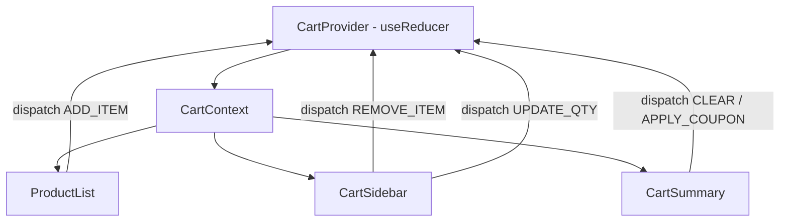

# Part 5: useReducer — Ketika useState Udah Nggak Cukup 🏗️

## Cerita Dulu: Warung Makan & Sistem Order

Bayangin kalian punya warung makan. Awalnya kecil — cuma jual nasi goreng. Kalian catat order di sticky note: "1 nasgor pedas". Simple, pake `useState` aja cukup.

Tapi warung kalian rame. Sekarang ada:
- Menu yang bisa ditambah/kurang
- Jumlah porsi yang bisa diubah
- Diskon member
- Status order: pending → cooking → ready → delivered
- Cancel order
- Split bill

Sticky note udah nggak cukup, bro. Kalian butuh **sistem kasir** — yang punya aturan jelas: "kalau action-nya TAMBAH_MENU, update daftar order. Kalau BAYAR, hitung total." 

Nah, `useReducer` itu sistem kasir-nya React. Dan hari ini gua bakal tunjukin kenapa ini game changer buat complex state.

---

## Kapan useState Nggak Cukup?

Coba liat kode ini:

```tsx
const [items, setItems] = useState<CartItem[]>([]);
const [total, setTotal] = useState(0);
const [discount, setDiscount] = useState(0);
const [isLoading, setIsLoading] = useState(false);
const [error, setError] = useState<string | null>(null);
const [couponApplied, setCouponApplied] = useState(false);

// Tambah item — harus update items DAN total
const addItem = (item: CartItem) => {
  setItems(prev => [...prev, item]);
  setTotal(prev => prev + item.price);
  // Oops, lupa update discount kalau ada coupon...
  if (couponApplied) {
    setTotal(prev => prev * 0.9);
    // Bug: ini jalan SETELAH setTotal di atas? Race condition!
  }
};
```

**Red flags** useState udah nggak cukup:
1. **Banyak state yang saling terkait** — update 1 harus update yang lain
2. **Logic update complex** — if/else bertumpuk
3. **Next state depends on multiple current states** — bukan cuma 1 value
4. **Banyak cara berbeda untuk update state** — add, remove, update, clear, apply coupon...

---

## useReducer 101: The Mental Model

```
┌─────────────────────────────────────────────┐
│                                             │
│   Component  ──dispatch(action)──►  Reducer │
│       ▲                               │     │
│       │                               │     │
│       └──────── new state ◄───────────┘     │
│                                             │
└─────────────────────────────────────────────┘
```

Tiga konsep utama:
1. **State** — data saat ini
2. **Action** — "apa yang terjadi" (event, bukan command)
3. **Reducer** — function yang terima `(state, action)` → return `newState`

```tsx
import { useReducer } from 'react';

// 1. Definisikan tipe state
interface CounterState {
  count: number;
  history: number[];
}

// 2. Definisikan action types
type CounterAction =
  | { type: 'INCREMENT' }
  | { type: 'DECREMENT' }
  | { type: 'RESET' }
  | { type: 'SET'; payload: number };

// 3. Initial state
const initialState: CounterState = {
  count: 0,
  history: [],
};

// 4. Reducer function — PURE function, no side effects!
function counterReducer(state: CounterState, action: CounterAction): CounterState {
  switch (action.type) {
    case 'INCREMENT':
      return {
        count: state.count + 1,
        history: [...state.history, state.count + 1],
      };
    case 'DECREMENT':
      return {
        count: state.count - 1,
        history: [...state.history, state.count - 1],
      };
    case 'RESET':
      return initialState;
    case 'SET':
      return {
        count: action.payload,
        history: [...state.history, action.payload],
      };
    default:
      return state;
  }
}

// 5. Pake di component
function Counter() {
  const [state, dispatch] = useReducer(counterReducer, initialState);

  return (
    <div>
      <h1>Count: {state.count}</h1>
      <button onClick={() => dispatch({ type: 'INCREMENT' })}>+</button>
      <button onClick={() => dispatch({ type: 'DECREMENT' })}>-</button>
      <button onClick={() => dispatch({ type: 'RESET' })}>Reset</button>
      <button onClick={() => dispatch({ type: 'SET', payload: 100 })}>Set 100</button>
      <p>History: {state.history.join(' → ')}</p>
    </div>
  );
}
```

### Kenapa Reducer Harus Pure?

Kayak aturan di kasir: **input sama = output sama**. Nggak boleh kasir-nya tiba-tiba ngasih harga beda buat order yang sama.

```tsx
// ❌ JANGAN gini — side effects di reducer
function badReducer(state: State, action: Action) {
  switch (action.type) {
    case 'SAVE':
      localStorage.setItem('data', JSON.stringify(state)); // SIDE EFFECT!
      fetch('/api/save', { method: 'POST', body: JSON.stringify(state) }); // SIDE EFFECT!
      return state;
  }
}

// ✅ Reducer cuma return new state, side effects di tempat lain
function goodReducer(state: State, action: Action) {
  switch (action.type) {
    case 'SAVE_SUCCESS':
      return { ...state, saved: true };
    case 'SAVE_ERROR':
      return { ...state, error: action.payload };
  }
}
```

---

## Discriminated Unions: Type-Safe Actions

Ini salah satu hal paling powerful dari TypeScript + useReducer. Setiap action punya type yang **beda**, dan TypeScript bisa **narrow** payload-nya:

```tsx
type CartAction =
  | { type: 'ADD_ITEM'; payload: { id: string; name: string; price: number } }
  | { type: 'REMOVE_ITEM'; payload: { id: string } }
  | { type: 'UPDATE_QUANTITY'; payload: { id: string; quantity: number } }
  | { type: 'APPLY_COUPON'; payload: { code: string; discount: number } }
  | { type: 'CLEAR_CART' };

function cartReducer(state: CartState, action: CartAction): CartState {
  switch (action.type) {
    case 'ADD_ITEM':
      // TypeScript TAHU action.payload punya id, name, price
      return { ...state };
    case 'REMOVE_ITEM':
      // TypeScript TAHU action.payload cuma punya id
      return { ...state };
    case 'CLEAR_CART':
      // TypeScript TAHU nggak ada payload
      return { ...state };
  }
}
```

Coba aja ketik `action.payload.` setelah `case 'ADD_ITEM':` — autocomplete-nya **persis** sesuai type. Ini yang bikin useReducer + TypeScript = best friends.

---

## 🛒 Project: Shopping Cart dengan useReducer + Context

Ini yang kalian tunggu-tunggu. Kita bikin shopping cart full-featured. Arsitekturnya:



### Step 1: Types & Reducer

```tsx
// types/cart.ts
export interface Product {
  id: string;
  name: string;
  price: number;
  image: string;
}

export interface CartItem extends Product {
  quantity: number;
}

export interface CartState {
  items: CartItem[];
  coupon: { code: string; discount: number } | null;
}

export type CartAction =
  | { type: 'ADD_ITEM'; payload: Product }
  | { type: 'REMOVE_ITEM'; payload: { id: string } }
  | { type: 'UPDATE_QUANTITY'; payload: { id: string; quantity: number } }
  | { type: 'APPLY_COUPON'; payload: { code: string; discount: number } }
  | { type: 'REMOVE_COUPON' }
  | { type: 'CLEAR_CART' };

// Computed values — bukan di state, tapi di-derive
export function getCartTotal(state: CartState): number {
  const subtotal = state.items.reduce(
    (sum, item) => sum + item.price * item.quantity,
    0
  );
  if (state.coupon) {
    return subtotal * (1 - state.coupon.discount / 100);
  }
  return subtotal;
}

export function getCartItemCount(state: CartState): number {
  return state.items.reduce((sum, item) => sum + item.quantity, 0);
}
```

```tsx
// reducers/cartReducer.ts
import type { CartState, CartAction } from '../types/cart';

export const initialCartState: CartState = {
  items: [],
  coupon: null,
};

export function cartReducer(state: CartState, action: CartAction): CartState {
  switch (action.type) {
    case 'ADD_ITEM': {
      const existingIndex = state.items.findIndex(
        (item) => item.id === action.payload.id
      );

      if (existingIndex >= 0) {
        // Item udah ada — tambah quantity
        const newItems = state.items.map((item, index) =>
          index === existingIndex
            ? { ...item, quantity: item.quantity + 1 }
            : item
        );
        return { ...state, items: newItems };
      }

      // Item baru
      return {
        ...state,
        items: [...state.items, { ...action.payload, quantity: 1 }],
      };
    }

    case 'REMOVE_ITEM': {
      return {
        ...state,
        items: state.items.filter((item) => item.id !== action.payload.id),
      };
    }

    case 'UPDATE_QUANTITY': {
      if (action.payload.quantity <= 0) {
        // Quantity 0 atau negatif = remove
        return {
          ...state,
          items: state.items.filter((item) => item.id !== action.payload.id),
        };
      }

      return {
        ...state,
        items: state.items.map((item) =>
          item.id === action.payload.id
            ? { ...item, quantity: action.payload.quantity }
            : item
        ),
      };
    }

    case 'APPLY_COUPON': {
      return {
        ...state,
        coupon: {
          code: action.payload.code,
          discount: action.payload.discount,
        },
      };
    }

    case 'REMOVE_COUPON': {
      return { ...state, coupon: null };
    }

    case 'CLEAR_CART': {
      return initialCartState;
    }

    default:
      return state;
  }
}
```

### Step 2: Context Provider (Poor Man's Redux)

```tsx
// context/CartContext.tsx
import { createContext, useContext, useReducer, type ReactNode } from 'react';
import { cartReducer, initialCartState } from '../reducers/cartReducer';
import type { CartState, CartAction } from '../types/cart';

interface CartContextType {
  state: CartState;
  dispatch: React.Dispatch<CartAction>;
}

const CartContext = createContext<CartContextType | null>(null);

export function CartProvider({ children }: { children: ReactNode }) {
  const [state, dispatch] = useReducer(cartReducer, initialCartState);

  return (
    <CartContext.Provider value={{ state, dispatch }}>
      {children}
    </CartContext.Provider>
  );
}

// Custom hook — biar nggak perlu null check terus
export function useCart() {
  const context = useContext(CartContext);
  if (!context) {
    throw new Error('useCart must be used within CartProvider');
  }
  return context;
}
```

**Pro tip:** Kalau mau lebih aman, bisa pisah state dan dispatch jadi 2 context. Kenapa? Karena component yang cuma dispatch (kayak tombol Add to Cart) nggak perlu re-render ketika state berubah:

```tsx
const CartStateContext = createContext<CartState | null>(null);
const CartDispatchContext = createContext<React.Dispatch<CartAction> | null>(null);

export function CartProvider({ children }: { children: ReactNode }) {
  const [state, dispatch] = useReducer(cartReducer, initialCartState);

  return (
    <CartStateContext.Provider value={state}>
      <CartDispatchContext.Provider value={dispatch}>
        {children}
      </CartDispatchContext.Provider>
    </CartStateContext.Provider>
  );
}

export function useCartState() {
  const state = useContext(CartStateContext);
  if (!state) throw new Error('useCartState must be used within CartProvider');
  return state;
}

export function useCartDispatch() {
  const dispatch = useContext(CartDispatchContext);
  if (!dispatch) throw new Error('useCartDispatch must be used within CartProvider');
  return dispatch;
}
```

### Step 3: Components

```tsx
// components/ProductList.tsx
import { useCart } from '../context/CartContext';
import type { Product } from '../types/cart';

const PRODUCTS: Product[] = [
  { id: '1', name: 'Indomie Goreng', price: 3500, image: '🍜' },
  { id: '2', name: 'Teh Botol', price: 5000, image: '🧃' },
  { id: '3', name: 'Nasi Padang', price: 25000, image: '🍛' },
  { id: '4', name: 'Es Cendol', price: 8000, image: '🥤' },
  { id: '5', name: 'Martabak Manis', price: 35000, image: '🥞' },
  { id: '6', name: 'Bakso Urat', price: 15000, image: '🍲' },
];

function ProductCard({ product }: { product: Product }) {
  const { dispatch } = useCart();

  const handleAdd = () => {
    dispatch({ type: 'ADD_ITEM', payload: product });
  };

  return (
    <div style={{
      border: '1px solid #e2e8f0',
      borderRadius: 12,
      padding: 16,
      textAlign: 'center',
    }}>
      <div style={{ fontSize: 48 }}>{product.image}</div>
      <h3 style={{ margin: '8px 0 4px' }}>{product.name}</h3>
      <p style={{ color: '#64748b' }}>
        Rp {product.price.toLocaleString('id-ID')}
      </p>
      <button
        onClick={handleAdd}
        style={{
          background: '#3b82f6',
          color: 'white',
          border: 'none',
          borderRadius: 8,
          padding: '8px 16px',
          cursor: 'pointer',
          width: '100%',
        }}
      >
        + Tambah
      </button>
    </div>
  );
}

export function ProductList() {
  return (
    <div>
      <h2>🛍️ Menu</h2>
      <div style={{
        display: 'grid',
        gridTemplateColumns: 'repeat(auto-fill, minmax(180px, 1fr))',
        gap: 16,
      }}>
        {PRODUCTS.map((product) => (
          <ProductCard key={product.id} product={product} />
        ))}
      </div>
    </div>
  );
}
```

```tsx
// components/CartSidebar.tsx
import { useCart } from '../context/CartContext';
import { getCartTotal, getCartItemCount } from '../types/cart';
import { useState } from 'react';

const VALID_COUPONS: Record<string, number> = {
  'ETHJKT10': 10,
  'MERDEKA17': 17,
  'DISKON50': 50,
};

export function CartSidebar() {
  const { state, dispatch } = useCart();
  const [couponInput, setCouponInput] = useState('');
  const [couponError, setCouponError] = useState('');

  const total = getCartTotal(state);
  const itemCount = getCartItemCount(state);

  const handleApplyCoupon = () => {
    const code = couponInput.toUpperCase().trim();
    const discount = VALID_COUPONS[code];

    if (discount) {
      dispatch({ type: 'APPLY_COUPON', payload: { code, discount } });
      setCouponError('');
      setCouponInput('');
    } else {
      setCouponError('Kode kupon nggak valid, bro!');
    }
  };

  return (
    <div style={{
      border: '1px solid #e2e8f0',
      borderRadius: 12,
      padding: 16,
      minWidth: 300,
    }}>
      <h2>🛒 Keranjang ({itemCount})</h2>

      {state.items.length === 0 ? (
        <p style={{ color: '#94a3b8' }}>Keranjang masih kosong nih...</p>
      ) : (
        <>
          {state.items.map((item) => (
            <div
              key={item.id}
              style={{
                display: 'flex',
                alignItems: 'center',
                gap: 8,
                padding: '8px 0',
                borderBottom: '1px solid #f1f5f9',
              }}
            >
              <span style={{ fontSize: 24 }}>{item.image}</span>
              <div style={{ flex: 1 }}>
                <div style={{ fontWeight: 600 }}>{item.name}</div>
                <div style={{ color: '#64748b', fontSize: 14 }}>
                  Rp {item.price.toLocaleString('id-ID')} × {item.quantity}
                </div>
              </div>
              <div style={{ display: 'flex', gap: 4, alignItems: 'center' }}>
                <button
                  onClick={() =>
                    dispatch({
                      type: 'UPDATE_QUANTITY',
                      payload: { id: item.id, quantity: item.quantity - 1 },
                    })
                  }
                  style={{ width: 28, height: 28, borderRadius: '50%', border: '1px solid #e2e8f0', background: 'white', cursor: 'pointer' }}
                >
                  -
                </button>
                <span style={{ minWidth: 24, textAlign: 'center' }}>
                  {item.quantity}
                </span>
                <button
                  onClick={() =>
                    dispatch({
                      type: 'UPDATE_QUANTITY',
                      payload: { id: item.id, quantity: item.quantity + 1 },
                    })
                  }
                  style={{ width: 28, height: 28, borderRadius: '50%', border: '1px solid #e2e8f0', background: 'white', cursor: 'pointer' }}
                >
                  +
                </button>
                <button
                  onClick={() =>
                    dispatch({ type: 'REMOVE_ITEM', payload: { id: item.id } })
                  }
                  style={{ background: 'none', border: 'none', cursor: 'pointer', fontSize: 16 }}
                >
                  🗑️
                </button>
              </div>
            </div>
          ))}

          {/* Coupon Section */}
          <div style={{ marginTop: 16 }}>
            {state.coupon ? (
              <div style={{
                display: 'flex',
                justifyContent: 'space-between',
                alignItems: 'center',
                background: '#f0fdf4',
                padding: 8,
                borderRadius: 8,
              }}>
                <span>🎟️ {state.coupon.code} (-{state.coupon.discount}%)</span>
                <button
                  onClick={() => dispatch({ type: 'REMOVE_COUPON' })}
                  style={{ background: 'none', border: 'none', cursor: 'pointer' }}
                >
                  ✕
                </button>
              </div>
            ) : (
              <div style={{ display: 'flex', gap: 8 }}>
                <input
                  value={couponInput}
                  onChange={(e) => setCouponInput(e.target.value)}
                  placeholder="Kode kupon..."
                  style={{ flex: 1, padding: 8, borderRadius: 8, border: '1px solid #e2e8f0' }}
                />
                <button
                  onClick={handleApplyCoupon}
                  style={{ padding: '8px 12px', borderRadius: 8, border: '1px solid #3b82f6', color: '#3b82f6', background: 'white', cursor: 'pointer' }}
                >
                  Apply
                </button>
              </div>
            )}
            {couponError && (
              <p style={{ color: '#ef4444', fontSize: 14, margin: '4px 0 0' }}>{couponError}</p>
            )}
          </div>

          {/* Total */}
          <div style={{
            marginTop: 16,
            paddingTop: 16,
            borderTop: '2px solid #e2e8f0',
            display: 'flex',
            justifyContent: 'space-between',
            fontWeight: 700,
            fontSize: 18,
          }}>
            <span>Total</span>
            <span>Rp {total.toLocaleString('id-ID')}</span>
          </div>

          <button
            onClick={() => dispatch({ type: 'CLEAR_CART' })}
            style={{
              marginTop: 12,
              width: '100%',
              padding: 10,
              borderRadius: 8,
              border: '1px solid #ef4444',
              color: '#ef4444',
              background: 'white',
              cursor: 'pointer',
            }}
          >
            🗑️ Kosongkan Keranjang
          </button>

          <button
            style={{
              marginTop: 8,
              width: '100%',
              padding: 12,
              borderRadius: 8,
              border: 'none',
              color: 'white',
              background: '#22c55e',
              cursor: 'pointer',
              fontWeight: 700,
              fontSize: 16,
            }}
          >
            💳 Checkout
          </button>
        </>
      )}
    </div>
  );
}
```

### Step 4: App Assembly

```tsx
// App.tsx
import { CartProvider } from './context/CartContext';
import { ProductList } from './components/ProductList';
import { CartSidebar } from './components/CartSidebar';

export default function App() {
  return (
    <CartProvider>
      <div style={{
        maxWidth: 1000,
        margin: '0 auto',
        padding: 24,
        display: 'flex',
        gap: 24,
        flexWrap: 'wrap',
      }}>
        <div style={{ flex: 1, minWidth: 400 }}>
          <h1>🏪 Warung ETHJKT</h1>
          <p style={{ color: '#64748b' }}>Coba kupon: ETHJKT10, MERDEKA17, DISKON50</p>
          <ProductList />
        </div>
        <CartSidebar />
      </div>
    </CartProvider>
  );
}
```

---

## useReducer vs useState: Cheat Sheet

| Situasi | Pilih |
|---------|-------|
| 1-2 state independen | `useState` |
| State saling terkait (items + total) | `useReducer` |
| Banyak cara update (add/remove/edit/clear) | `useReducer` |
| Next state butuh current state complex | `useReducer` |
| Form sederhana (1 input) | `useState` |
| Form complex (multi-step, validation) | `useReducer` |
| Mau testable logic (unit test reducer) | `useReducer` |

### Bonus: Testing Reducer itu Gampang Banget

Karena reducer itu pure function, test-nya straight forward:

```tsx
import { cartReducer, initialCartState } from './cartReducer';

describe('cartReducer', () => {
  it('should add item to empty cart', () => {
    const product = { id: '1', name: 'Indomie', price: 3500, image: '🍜' };
    const result = cartReducer(initialCartState, {
      type: 'ADD_ITEM',
      payload: product,
    });

    expect(result.items).toHaveLength(1);
    expect(result.items[0].quantity).toBe(1);
  });

  it('should increment quantity for existing item', () => {
    const stateWithItem = {
      items: [{ id: '1', name: 'Indomie', price: 3500, image: '🍜', quantity: 2 }],
      coupon: null,
    };

    const result = cartReducer(stateWithItem, {
      type: 'ADD_ITEM',
      payload: { id: '1', name: 'Indomie', price: 3500, image: '🍜' },
    });

    expect(result.items[0].quantity).toBe(3);
  });

  it('should remove item when quantity reaches 0', () => {
    const stateWithItem = {
      items: [{ id: '1', name: 'Indomie', price: 3500, image: '🍜', quantity: 1 }],
      coupon: null,
    };

    const result = cartReducer(stateWithItem, {
      type: 'UPDATE_QUANTITY',
      payload: { id: '1', quantity: 0 },
    });

    expect(result.items).toHaveLength(0);
  });
});
```

Nggak perlu render component, nggak perlu mock. Pure input → output. **Chef's kiss** 🤌

---

## Pattern: Action Creators

Kalau dispatch-nya mulai repetitive, bisa bikin action creators:

```tsx
// actions/cartActions.ts
import type { CartAction, Product } from '../types/cart';

export const cartActions = {
  addItem: (product: Product): CartAction => ({
    type: 'ADD_ITEM',
    payload: product,
  }),

  removeItem: (id: string): CartAction => ({
    type: 'REMOVE_ITEM',
    payload: { id },
  }),

  updateQuantity: (id: string, quantity: number): CartAction => ({
    type: 'UPDATE_QUANTITY',
    payload: { id, quantity },
  }),

  applyCoupon: (code: string, discount: number): CartAction => ({
    type: 'APPLY_COUPON',
    payload: { code, discount },
  }),

  removeCoupon: (): CartAction => ({ type: 'REMOVE_COUPON' }),

  clearCart: (): CartAction => ({ type: 'CLEAR_CART' }),
};

// Usage di component:
dispatch(cartActions.addItem(product));
dispatch(cartActions.updateQuantity('1', 5));
```

---

## Recap

1. **useReducer** = centralized state logic dengan predictable updates
2. **Action types** = discriminated unions buat type safety
3. **Reducer** = pure function, gampang di-test
4. **useReducer + Context** = state management yang cukup buat kebanyakan app
5. **Pisah state/dispatch context** kalau mau optimize re-renders
6. **Action creators** bikin dispatch calls lebih clean

Sekarang kalian punya fondasi buat manage complex state tanpa external library. Redux? Zustand? Bagus — tapi **pahami dulu** useReducer. Semua state management library pada dasarnya cuma wrapper di atas konsep yang sama: state, action, reducer.

---

**Next Part → [Advanced Patterns](https://github.com/Ethereum-Jakarta/phase-2-week3-frontend-advance/blob/main/study-material/06-advanced-patterns.md)**
