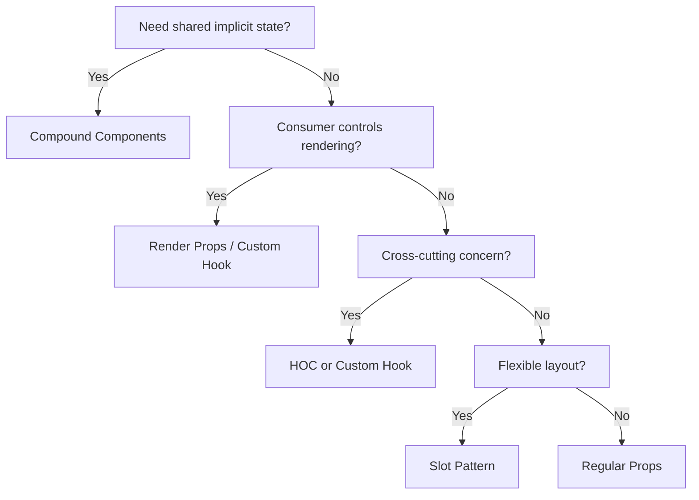

# Part 6: Advanced Component Patterns — Bikin Component Kayak Pro 🧩

## Cerita Dulu: LEGO vs Action Figure

Waktu kecil, kalian pasti pernah main LEGO sama action figure. Bedanya apa?

**Action figure** itu fixed — Spider-Man ya Spider-Man. Mau diapain juga tetep Spider-Man. Kalau mau Iron Man, beli lagi. Ini kayak component yang rigid: `<Modal title="Hello" onClose={fn} variant="success" showIcon={true} size="lg" />` — 15 props, nggak flexible.

**LEGO** itu composable — dari balok yang sama, kalian bisa bikin rumah, mobil, pesawat. Masing-masing balok simple, tapi **kombinasinya** powerful. Ini kayak:

```tsx
<Modal>
  <Modal.Header>
    <Modal.Title>Hello</Modal.Title>
    <Modal.CloseButton />
  </Modal.Header>
  <Modal.Body>Content here</Modal.Body>
  <Modal.Footer>
    <Button>OK</Button>
  </Modal.Footer>
</Modal>
```

Hari ini gua bakal tunjukin 4 pattern yang bikin component kalian dari action figure jadi LEGO. Library kayak Radix UI, Headless UI, Shadcn — semua pake pattern ini.

---

## Pattern 1: Compound Components 🧱

### Analogi: Warung Nasi Padang

Di warung Padang, kalian nggak order "Paket A" yang isinya fixed. Kalian **compose** sendiri: nasi + rendang + daun singkong + sambal ijo + es teh. Masing-masing item independent, tapi **konteks warungnya** (meja, piring, harga) shared.

Compound Components = component yang **bermakna cuma kalau dipakai bersama**, dan mereka **share state implisit** lewat parent.

### Build: Compound Accordion

```tsx
import {
  createContext,
  useContext,
  useState,
  type ReactNode,
} from 'react';

// -------- Context (shared state) --------
interface AccordionContextType {
  activeItems: Set<string>;
  toggle: (id: string) => void;
  multiple: boolean;
}

const AccordionContext = createContext<AccordionContextType | null>(null);

function useAccordionContext() {
  const ctx = useContext(AccordionContext);
  if (!ctx) throw new Error('Accordion components must be used within <Accordion>');
  return ctx;
}

// -------- Item Context --------
interface ItemContextType {
  id: string;
  isOpen: boolean;
}

const ItemContext = createContext<ItemContextType | null>(null);

function useItemContext() {
  const ctx = useContext(ItemContext);
  if (!ctx) throw new Error('Must be used within <Accordion.Item>');
  return ctx;
}

// -------- Root --------
interface AccordionProps {
  children: ReactNode;
  multiple?: boolean;
  defaultOpen?: string[];
}

function AccordionRoot({ children, multiple = false, defaultOpen = [] }: AccordionProps) {
  const [activeItems, setActiveItems] = useState<Set<string>>(
    new Set(defaultOpen)
  );

  const toggle = (id: string) => {
    setActiveItems((prev) => {
      const next = new Set(prev);
      if (next.has(id)) {
        next.delete(id);
      } else {
        if (!multiple) next.clear();
        next.add(id);
      }
      return next;
    });
  };

  return (
    <AccordionContext.Provider value={{ activeItems, toggle, multiple }}>
      <div style={{ border: '1px solid #e2e8f0', borderRadius: 12, overflow: 'hidden' }}>
        {children}
      </div>
    </AccordionContext.Provider>
  );
}

// -------- Item --------
function AccordionItem({ children, id }: { children: ReactNode; id: string }) {
  const { activeItems } = useAccordionContext();
  const isOpen = activeItems.has(id);

  return (
    <ItemContext.Provider value={{ id, isOpen }}>
      <div style={{ borderBottom: '1px solid #e2e8f0' }}>{children}</div>
    </ItemContext.Provider>
  );
}

// -------- Trigger --------
function AccordionTrigger({ children }: { children: ReactNode }) {
  const { toggle } = useAccordionContext();
  const { id, isOpen } = useItemContext();

  return (
    <button
      onClick={() => toggle(id)}
      style={{
        width: '100%',
        padding: '12px 16px',
        display: 'flex',
        justifyContent: 'space-between',
        alignItems: 'center',
        background: 'none',
        border: 'none',
        cursor: 'pointer',
        fontSize: 16,
        fontWeight: 600,
        textAlign: 'left',
      }}
    >
      {children}
      <span style={{
        transform: isOpen ? 'rotate(180deg)' : 'rotate(0deg)',
        transition: 'transform 200ms',
      }}>
        ▼
      </span>
    </button>
  );
}

// -------- Content --------
function AccordionContent({ children }: { children: ReactNode }) {
  const { isOpen } = useItemContext();

  if (!isOpen) return null;

  return (
    <div style={{ padding: '0 16px 12px', color: '#64748b' }}>
      {children}
    </div>
  );
}

// -------- Compose & Export --------
export const Accordion = Object.assign(AccordionRoot, {
  Item: AccordionItem,
  Trigger: AccordionTrigger,
  Content: AccordionContent,
});
```

### Pake-nya:

```tsx
function FAQ() {
  return (
    <Accordion multiple defaultOpen={['faq-1']}>
      <Accordion.Item id="faq-1">
        <Accordion.Trigger>Apa itu Ethereum Jakarta?</Accordion.Trigger>
        <Accordion.Content>
          Komunitas developer Ethereum di Jakarta. Kita belajar bareng
          Web3, smart contracts, dan frontend dApp development.
        </Accordion.Content>
      </Accordion.Item>

      <Accordion.Item id="faq-2">
        <Accordion.Trigger>Gratis nggak?</Accordion.Trigger>
        <Accordion.Content>
          100% gratis! Kita open community, siapa aja boleh join.
        </Accordion.Content>
      </Accordion.Item>

      <Accordion.Item id="faq-3">
        <Accordion.Trigger>Perlu pengalaman blockchain?</Accordion.Trigger>
        <Accordion.Content>
          Nggak perlu. Asal kalian ngerti dasar JavaScript/TypeScript,
          udah bisa mulai.
        </Accordion.Content>
      </Accordion.Item>
    </Accordion>
  );
}
```

Liat betapa **flexible**-nya? Mau tambahin icon custom di trigger? Tinggal taruh aja. Mau bikin content yang ada button? Bebas. Parent nggak perlu tau apa isi children-nya.

### Build: Compound Tabs

```tsx
import {
  createContext,
  useContext,
  useState,
  type ReactNode,
} from 'react';

// -------- Tabs Context --------
interface TabsContextType {
  activeTab: string;
  setActiveTab: (id: string) => void;
}

const TabsContext = createContext<TabsContextType | null>(null);

function useTabsContext() {
  const ctx = useContext(TabsContext);
  if (!ctx) throw new Error('Tabs components must be used within <Tabs>');
  return ctx;
}

// -------- Root --------
function TabsRoot({
  children,
  defaultTab,
}: {
  children: ReactNode;
  defaultTab: string;
}) {
  const [activeTab, setActiveTab] = useState(defaultTab);

  return (
    <TabsContext.Provider value={{ activeTab, setActiveTab }}>
      <div>{children}</div>
    </TabsContext.Provider>
  );
}

// -------- List (container for triggers) --------
function TabsList({ children }: { children: ReactNode }) {
  return (
    <div
      style={{
        display: 'flex',
        gap: 0,
        borderBottom: '2px solid #e2e8f0',
      }}
    >
      {children}
    </div>
  );
}

// -------- Trigger --------
function TabsTrigger({
  children,
  id,
}: {
  children: ReactNode;
  id: string;
}) {
  const { activeTab, setActiveTab } = useTabsContext();
  const isActive = activeTab === id;

  return (
    <button
      onClick={() => setActiveTab(id)}
      style={{
        padding: '10px 20px',
        border: 'none',
        background: 'none',
        cursor: 'pointer',
        fontWeight: isActive ? 700 : 400,
        color: isActive ? '#3b82f6' : '#64748b',
        borderBottom: isActive ? '2px solid #3b82f6' : '2px solid transparent',
        marginBottom: -2,
        transition: 'all 150ms',
      }}
    >
      {children}
    </button>
  );
}

// -------- Content --------
function TabsContent({
  children,
  id,
}: {
  children: ReactNode;
  id: string;
}) {
  const { activeTab } = useTabsContext();

  if (activeTab !== id) return null;

  return <div style={{ padding: 16 }}>{children}</div>;
}

// -------- Export --------
export const Tabs = Object.assign(TabsRoot, {
  List: TabsList,
  Trigger: TabsTrigger,
  Content: TabsContent,
});
```

```tsx
// Usage
function Dashboard() {
  return (
    <Tabs defaultTab="overview">
      <Tabs.List>
        <Tabs.Trigger id="overview">📊 Overview</Tabs.Trigger>
        <Tabs.Trigger id="transactions">💸 Transactions</Tabs.Trigger>
        <Tabs.Trigger id="settings">⚙️ Settings</Tabs.Trigger>
      </Tabs.List>

      <Tabs.Content id="overview">
        <h3>Dashboard Overview</h3>
        <p>Total gas spent: 0.42 ETH</p>
      </Tabs.Content>

      <Tabs.Content id="transactions">
        <h3>Recent Transactions</h3>
        <ul>
          <li>Swap 1 ETH → 2400 USDC</li>
          <li>Mint NFT: 0.01 ETH</li>
        </ul>
      </Tabs.Content>

      <Tabs.Content id="settings">
        <h3>Settings</h3>
        <p>Network: Sepolia Testnet</p>
      </Tabs.Content>
    </Tabs>
  );
}
```

---

## Pattern 2: Render Props — Still Relevant! 🎨

### Analogi: Ojol vs Taksi

Taksi (regular component): driver tentuin rute, AC, musik. Lo cuma duduk.

Ojol (render props): lo yang tentuin mau kemana, lewat mana, driver cuma **eksekusi**. Component handle logic, **tapi kalian yang tentuin tampilannya**.

```tsx
import { useState, useEffect, type ReactNode } from 'react';

// Component yang handle logic mouse position
interface MousePosition {
  x: number;
  y: number;
}

interface MouseTrackerProps {
  children: (position: MousePosition) => ReactNode;
}

function MouseTracker({ children }: MouseTrackerProps) {
  const [position, setPosition] = useState<MousePosition>({ x: 0, y: 0 });

  useEffect(() => {
    const handleMove = (e: MouseEvent) => {
      setPosition({ x: e.clientX, y: e.clientY });
    };
    window.addEventListener('mousemove', handleMove);
    return () => window.removeEventListener('mousemove', handleMove);
  }, []);

  return <>{children(position)}</>;
}

// Usage — LO yang decide rendering-nya
function App() {
  return (
    <div>
      {/* Render as text */}
      <MouseTracker>
        {({ x, y }) => (
          <p>Mouse: {x}, {y}</p>
        )}
      </MouseTracker>

      {/* Render as a follower dot */}
      <MouseTracker>
        {({ x, y }) => (
          <div
            style={{
              position: 'fixed',
              left: x - 10,
              top: y - 10,
              width: 20,
              height: 20,
              borderRadius: '50%',
              background: '#3b82f6',
              pointerEvents: 'none',
            }}
          />
        )}
      </MouseTracker>
    </div>
  );
}
```

### Real-World: Toggle Render Prop

```tsx
interface ToggleRenderProps {
  isOn: boolean;
  toggle: () => void;
  turnOn: () => void;
  turnOff: () => void;
}

function Toggle({
  children,
  initialOn = false,
}: {
  children: (props: ToggleRenderProps) => ReactNode;
  initialOn?: boolean;
}) {
  const [isOn, setIsOn] = useState(initialOn);

  const api: ToggleRenderProps = {
    isOn,
    toggle: () => setIsOn((p) => !p),
    turnOn: () => setIsOn(true),
    turnOff: () => setIsOn(false),
  };

  return <>{children(api)}</>;
}

// Usage — full control over rendering
function Settings() {
  return (
    <Toggle initialOn={false}>
      {({ isOn, toggle }) => (
        <div style={{ display: 'flex', alignItems: 'center', gap: 12 }}>
          <span>{isOn ? '🌙 Dark Mode' : '☀️ Light Mode'}</span>
          <button
            onClick={toggle}
            style={{
              width: 48,
              height: 28,
              borderRadius: 14,
              border: 'none',
              background: isOn ? '#3b82f6' : '#cbd5e1',
              cursor: 'pointer',
              position: 'relative',
              transition: 'background 200ms',
            }}
          >
            <div
              style={{
                width: 22,
                height: 22,
                borderRadius: '50%',
                background: 'white',
                position: 'absolute',
                top: 3,
                left: isOn ? 23 : 3,
                transition: 'left 200ms',
              }}
            />
          </button>
        </div>
      )}
    </Toggle>
  );
}
```

**Kapan pake render props?**
- Kalau consumer butuh **full control** atas rendering
- Library components yang nggak mau opinionated soal UI
- Sekarang sering diganti custom hooks, tapi pattern-nya masih muncul di library kayak Downshift, React Table v7, dll.

---

## Pattern 3: Higher-Order Components (HOC) 🎁

### Analogi: Bungkus Kado

HOC itu kayak bungkus kado. Kalian punya barang (component), terus kalian **bungkus** dengan sesuatu yang nambahin fitur — tanpa ubah barangnya sendiri.

```tsx
import { type ComponentType, useEffect, useState } from 'react';

// HOC yang nambahin loading state
interface WithLoadingProps {
  isLoading: boolean;
}

function withLoading<P extends object>(
  WrappedComponent: ComponentType<P>
): ComponentType<P & { isLoading?: boolean }> {
  return function WithLoadingComponent({ isLoading = false, ...props }: P & { isLoading?: boolean }) {
    if (isLoading) {
      return (
        <div style={{ padding: 40, textAlign: 'center' }}>
          <div style={{ fontSize: 32 }}>⏳</div>
          <p>Loading...</p>
        </div>
      );
    }
    return <WrappedComponent {...(props as P)} />;
  };
}

// HOC buat auth protection
interface WithAuthProps {
  user: { name: string; role: string } | null;
}

function withAuth<P extends WithAuthProps>(
  WrappedComponent: ComponentType<P>,
  requiredRole?: string
): ComponentType<Omit<P, 'user'>> {
  return function WithAuthComponent(props: Omit<P, 'user'>) {
    const [user, setUser] = useState<{ name: string; role: string } | null>(null);

    useEffect(() => {
      // Simulate auth check
      const stored = localStorage.getItem('user');
      if (stored) setUser(JSON.parse(stored));
    }, []);

    if (!user) {
      return (
        <div style={{ padding: 40, textAlign: 'center' }}>
          <p>🔒 Please login first</p>
        </div>
      );
    }

    if (requiredRole && user.role !== requiredRole) {
      return (
        <div style={{ padding: 40, textAlign: 'center' }}>
          <p>⛔ Access denied. Required role: {requiredRole}</p>
        </div>
      );
    }

    return <WrappedComponent {...(props as unknown as P)} user={user} />;
  };
}

// Usage
function AdminPanel({ user }: WithAuthProps) {
  return <h1>Welcome, {user?.name}! You are admin.</h1>;
}

const ProtectedAdminPanel = withAuth(AdminPanel, 'admin');

// In your app:
// <ProtectedAdminPanel />
```

**Kapan pake HOC?**
- Cross-cutting concerns (auth, logging, error boundary)
- Nggak mau ubah component aslinya
- **Caveat**: HOC bikin component tree susah di-debug. Sekarang custom hooks lebih preferred buat kebanyakan use case.

---

## Pattern 4: Slot Pattern 🎰

### Analogi: Template Undangan

Kalian bikin template undangan nikah. Ada **slot** buat nama mempelai, tanggal, lokasi. Orang tinggal isi slot-nya. Component layout tetap sama, content yang beda.

```tsx
import type { ReactNode } from 'react';

// Card with named slots
interface CardProps {
  header?: ReactNode;
  children: ReactNode;
  footer?: ReactNode;
  sidebar?: ReactNode;
}

function Card({ header, children, footer, sidebar }: CardProps) {
  return (
    <div style={{
      border: '1px solid #e2e8f0',
      borderRadius: 12,
      overflow: 'hidden',
      display: 'flex',
    }}>
      <div style={{ flex: 1 }}>
        {header && (
          <div style={{
            padding: '12px 16px',
            borderBottom: '1px solid #e2e8f0',
            background: '#f8fafc',
            fontWeight: 600,
          }}>
            {header}
          </div>
        )}

        <div style={{ padding: 16 }}>{children}</div>

        {footer && (
          <div style={{
            padding: '12px 16px',
            borderTop: '1px solid #e2e8f0',
            background: '#f8fafc',
          }}>
            {footer}
          </div>
        )}
      </div>

      {sidebar && (
        <div style={{
          width: 200,
          borderLeft: '1px solid #e2e8f0',
          padding: 16,
          background: '#f8fafc',
        }}>
          {sidebar}
        </div>
      )}
    </div>
  );
}

// Usage — isi slot sesuka hati
function TransactionCard() {
  return (
    <Card
      header={
        <div style={{ display: 'flex', justifyContent: 'space-between' }}>
          <span>Transaction #0x1234</span>
          <span style={{ color: '#22c55e' }}>✅ Success</span>
        </div>
      }
      footer={
        <div style={{ display: 'flex', gap: 8 }}>
          <button>View on Etherscan</button>
          <button>Copy TX Hash</button>
        </div>
      }
      sidebar={
        <div>
          <h4>Details</h4>
          <p>Gas: 21000</p>
          <p>Block: 18542981</p>
        </div>
      }
    >
      <p>Sent 0.5 ETH to 0xAbCd...EfGh</p>
      <p style={{ color: '#64748b' }}>2 minutes ago</p>
    </Card>
  );
}
```

### Advanced Slot: Page Layout

```tsx
interface PageLayoutProps {
  nav: ReactNode;
  children: ReactNode;
  aside?: ReactNode;
}

function PageLayout({ nav, children, aside }: PageLayoutProps) {
  return (
    <div style={{ minHeight: '100vh', display: 'flex', flexDirection: 'column' }}>
      <header style={{
        padding: '12px 24px',
        borderBottom: '1px solid #e2e8f0',
        background: 'white',
        position: 'sticky',
        top: 0,
        zIndex: 10,
      }}>
        {nav}
      </header>

      <div style={{ display: 'flex', flex: 1 }}>
        <main style={{ flex: 1, padding: 24 }}>{children}</main>
        {aside && (
          <aside style={{
            width: 280,
            padding: 24,
            borderLeft: '1px solid #e2e8f0',
            background: '#fafafa',
          }}>
            {aside}
          </aside>
        )}
      </div>
    </div>
  );
}

// Different pages, same layout
function DashboardPage() {
  return (
    <PageLayout
      nav={
        <div style={{ display: 'flex', gap: 16, alignItems: 'center' }}>
          <strong>⟠ ETHJKT dApp</strong>
          <a href="/dashboard">Dashboard</a>
          <a href="/swap">Swap</a>
          <a href="/nft">NFTs</a>
        </div>
      }
      aside={
        <div>
          <h3>Wallet</h3>
          <p>0xAbCd...EfGh</p>
          <p>Balance: 2.5 ETH</p>
        </div>
      }
    >
      <h1>Dashboard</h1>
      <p>Your portfolio overview...</p>
    </PageLayout>
  );
}
```

---

## When to Use Which Pattern?



| Pattern | Use When | Example Libraries |
|---------|----------|-------------------|
| Compound Components | Related components share state | Radix UI, Headless UI, Reach UI |
| Render Props | Consumer needs full render control | Downshift, React Table v7 |
| HOC | Wrap with cross-cutting behavior | `connect()` Redux, `withRouter` |
| Slot Pattern | Flexible layouts with named areas | Layout components, Card, Dialog |

### Modern Trend

Kebanyakan sekarang **custom hooks** replace render props dan HOC buat logic reuse. Tapi **compound components** dan **slot pattern** masih the go-to buat component composition. Kalau kalian liat source code Radix UI atau Shadcn, 90% pake compound components.

---

## Recap

1. **Compound Components** — share implicit state via Context. Kayak LEGO blocks.
2. **Render Props** — component handle logic, consumer handle UI. Maximum flexibility.
3. **HOC** — wrap component dengan extra behavior. Good for cross-cutting concerns.
4. **Slot Pattern** — named ReactNode props buat flexible layouts.
5. **`Object.assign`** trick buat bikin `Component.SubComponent` syntax.

Pattern ini bukan mutually exclusive. Sering kalian combine: compound components yang pake slot pattern di dalamnya, dengan custom hooks buat logic. The more patterns you know, the better your API design.

---

**Next Part → [Custom Hooks](https://github.com/Ethereum-Jakarta/phase-2-week3-frontend-advance/blob/main/study-material/07-custom-hooks.md)**
