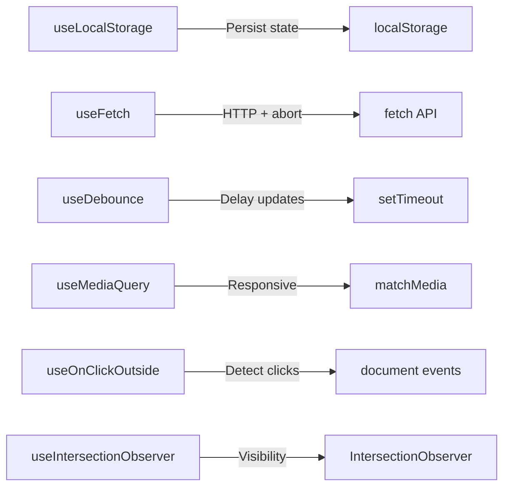

# Part 7: Custom Hooks — Bikin Toolkit Sendiri 🔧

## Cerita Dulu: Tukang yang Bikin Alat Sendiri

Ada dua tukang bangunan. Tukang A beli semua alat dari toko. Tukang B? Dia bikin alat sendiri — khusus buat kebutuhannya. Bor yang pas buat tembok rumah Indonesia (yang keras banget), palu yang grip-nya cocok buat tangannya.

Tukang B lebih lambat di awal, tapi setelah alat-alatnya jadi? **Dia 5x lebih cepat** dari tukang A. Karena alatnya **persis** buat masalahnya.

Custom hooks itu alat buatan sendiri. React kasih kalian `useState`, `useEffect`, `useRef` — itu raw materials. Dari situ, kalian bikin hooks yang **solve masalah spesifik kalian**. Dan hari ini, gua bakal kasih 6 production-grade hooks yang bisa kalian langsung pake di project.

---

## Rules of Hooks — Quick Recap

Sebelum bikin custom hooks, inget rules-nya:

1. **Only call hooks at the top level** — jangan di dalam if, loop, atau nested function
2. **Only call hooks from React functions** — component atau custom hook (yang namanya `use...`)
3. **Custom hooks HARUS diawali `use`** — biar React tau itu hook

```tsx
// ❌ SALAH
function getLocalStorage(key: string) {  // bukan hook — nggak ada "use"
  const [value, setValue] = useState('');  // Error! Hook di non-hook function
  return value;
}

// ❌ SALAH
function useConditionalData(shouldFetch: boolean) {
  if (shouldFetch) {
    const [data, setData] = useState(null);  // Error! Hook di dalam if
  }
}

// ✅ BENAR
function useLocalStorage(key: string) {  // dimulai "use" ✓
  const [value, setValue] = useState('');  // top level ✓
  return [value, setValue] as const;
}
```

---

## Hook 1: useLocalStorage 💾

Persist state ke localStorage. Auto sync, type-safe, SSR-safe.

```tsx
import { useState, useEffect, useCallback } from 'react';

function useLocalStorage<T>(
  key: string,
  initialValue: T
): [T, (value: T | ((prev: T) => T)) => void, () => void] {
  // Lazy initialization — baca dari localStorage cuma sekali
  const [storedValue, setStoredValue] = useState<T>(() => {
    if (typeof window === 'undefined') return initialValue;
    
    try {
      const item = localStorage.getItem(key);
      return item ? (JSON.parse(item) as T) : initialValue;
    } catch (error) {
      console.warn(`Error reading localStorage key "${key}":`, error);
      return initialValue;
    }
  });

  // Update localStorage setiap storedValue berubah
  useEffect(() => {
    if (typeof window === 'undefined') return;
    
    try {
      localStorage.setItem(key, JSON.stringify(storedValue));
    } catch (error) {
      console.warn(`Error setting localStorage key "${key}":`, error);
    }
  }, [key, storedValue]);

  // Listen to changes from other tabs
  useEffect(() => {
    const handleStorageChange = (e: StorageEvent) => {
      if (e.key === key && e.newValue !== null) {
        try {
          setStoredValue(JSON.parse(e.newValue) as T);
        } catch {
          // ignore parse errors
        }
      }
    };

    window.addEventListener('storage', handleStorageChange);
    return () => window.removeEventListener('storage', handleStorageChange);
  }, [key]);

  // Remove from storage
  const remove = useCallback(() => {
    setStoredValue(initialValue);
    localStorage.removeItem(key);
  }, [key, initialValue]);

  return [storedValue, setStoredValue, remove];
}
```

### Usage:

```tsx
function ThemeToggle() {
  const [theme, setTheme] = useLocalStorage<'light' | 'dark'>('theme', 'light');

  return (
    <div style={{
      background: theme === 'dark' ? '#1e293b' : '#ffffff',
      color: theme === 'dark' ? '#f1f5f9' : '#1e293b',
      padding: 24,
      minHeight: '100vh',
    }}>
      <h1>{theme === 'dark' ? '🌙' : '☀️'} Current theme: {theme}</h1>
      <button onClick={() => setTheme(prev => prev === 'light' ? 'dark' : 'light')}>
        Toggle Theme
      </button>
      <p>Refresh the page — theme persists!</p>
    </div>
  );
}

function UserPreferences() {
  const [prefs, setPrefs, resetPrefs] = useLocalStorage('user-prefs', {
    language: 'id',
    currency: 'IDR',
    notifications: true,
  });

  return (
    <div>
      <p>Language: {prefs.language}</p>
      <button onClick={() => setPrefs({ ...prefs, language: 'en' })}>
        Switch to English
      </button>
      <button onClick={resetPrefs}>Reset Preferences</button>
    </div>
  );
}
```

---

## Hook 2: useFetch — Data Fetching Done Right 🌐

Loading state, error handling, abort on unmount. The whole package.

```tsx
import { useState, useEffect, useRef, useCallback } from 'react';

interface UseFetchResult<T> {
  data: T | null;
  isLoading: boolean;
  error: string | null;
  refetch: () => void;
}

function useFetch<T>(url: string | null, options?: RequestInit): UseFetchResult<T> {
  const [data, setData] = useState<T | null>(null);
  const [isLoading, setIsLoading] = useState(false);
  const [error, setError] = useState<string | null>(null);
  const abortControllerRef = useRef<AbortController | null>(null);
  const [fetchTrigger, setFetchTrigger] = useState(0);

  const refetch = useCallback(() => {
    setFetchTrigger(prev => prev + 1);
  }, []);

  useEffect(() => {
    if (!url) {
      setData(null);
      setIsLoading(false);
      setError(null);
      return;
    }

    // Abort previous request
    abortControllerRef.current?.abort();
    const controller = new AbortController();
    abortControllerRef.current = controller;

    const fetchData = async () => {
      setIsLoading(true);
      setError(null);

      try {
        const response = await fetch(url, {
          ...options,
          signal: controller.signal,
        });

        if (!response.ok) {
          throw new Error(`HTTP ${response.status}: ${response.statusText}`);
        }

        const json = (await response.json()) as T;

        if (!controller.signal.aborted) {
          setData(json);
          setIsLoading(false);
        }
      } catch (err) {
        if (err instanceof Error && err.name === 'AbortError') {
          return; // Aborted — do nothing
        }
        if (!controller.signal.aborted) {
          setError(err instanceof Error ? err.message : 'Unknown error');
          setIsLoading(false);
        }
      }
    };

    fetchData();

    // Cleanup: abort on unmount or url change
    return () => controller.abort();
  }, [url, fetchTrigger]); // eslint-disable-line react-hooks/exhaustive-deps

  return { data, isLoading, error, refetch };
}
```

### Usage:

```tsx
interface Pokemon {
  name: string;
  height: number;
  weight: number;
  types: Array<{ type: { name: string } }>;
}

function PokemonCard({ name }: { name: string }) {
  const { data, isLoading, error, refetch } = useFetch<Pokemon>(
    `https://pokeapi.co/api/v2/pokemon/${name}`
  );

  if (isLoading) return <p>⏳ Loading {name}...</p>;
  if (error) return (
    <div>
      <p>❌ Error: {error}</p>
      <button onClick={refetch}>🔄 Retry</button>
    </div>
  );
  if (!data) return null;

  return (
    <div style={{
      border: '1px solid #e2e8f0',
      borderRadius: 12,
      padding: 16,
    }}>
      <h2 style={{ textTransform: 'capitalize' }}>{data.name}</h2>
      <p>Height: {data.height / 10}m | Weight: {data.weight / 10}kg</p>
      <div style={{ display: 'flex', gap: 8 }}>
        {data.types.map((t) => (
          <span
            key={t.type.name}
            style={{
              background: '#e0f2fe',
              padding: '2px 8px',
              borderRadius: 12,
              fontSize: 14,
            }}
          >
            {t.type.name}
          </span>
        ))}
      </div>
      <button onClick={refetch} style={{ marginTop: 8 }}>🔄 Refresh</button>
    </div>
  );
}

function App() {
  const [search, setSearch] = useState('');
  const [pokemon, setPokemon] = useState('pikachu');

  return (
    <div style={{ padding: 24 }}>
      <div style={{ display: 'flex', gap: 8, marginBottom: 16 }}>
        <input
          value={search}
          onChange={(e) => setSearch(e.target.value)}
          placeholder="Pokemon name..."
          style={{ padding: 8, borderRadius: 8, border: '1px solid #e2e8f0' }}
        />
        <button onClick={() => setPokemon(search.toLowerCase())}>
          Search
        </button>
      </div>
      <PokemonCard name={pokemon} />
    </div>
  );
}
```

---

## Hook 3: useDebounce ⏱️

Delay value update — perfect buat search input, form validation, auto-save.

```tsx
import { useState, useEffect } from 'react';

function useDebounce<T>(value: T, delay: number = 500): T {
  const [debouncedValue, setDebouncedValue] = useState(value);

  useEffect(() => {
    const timer = setTimeout(() => {
      setDebouncedValue(value);
    }, delay);

    return () => clearTimeout(timer);
  }, [value, delay]);

  return debouncedValue;
}
```

### Usage:

```tsx
interface SearchResult {
  name: string;
  url: string;
}

interface PokemonListResponse {
  results: SearchResult[];
}

function PokemonSearch() {
  const [query, setQuery] = useState('');
  const debouncedQuery = useDebounce(query, 300);

  const { data, isLoading } = useFetch<PokemonListResponse>(
    debouncedQuery.length >= 2
      ? `https://pokeapi.co/api/v2/pokemon?limit=20`
      : null
  );

  const filtered = data?.results.filter((p) =>
    p.name.includes(debouncedQuery.toLowerCase())
  );

  return (
    <div style={{ padding: 24 }}>
      <input
        value={query}
        onChange={(e) => setQuery(e.target.value)}
        placeholder="🔍 Search Pokemon... (type at least 2 chars)"
        style={{
          width: '100%',
          padding: 12,
          borderRadius: 8,
          border: '1px solid #e2e8f0',
          fontSize: 16,
        }}
      />
      <p style={{ color: '#94a3b8', fontSize: 14 }}>
        Searching for: "{debouncedQuery}" {isLoading && '⏳'}
      </p>
      <ul>
        {filtered?.map((p) => (
          <li key={p.name} style={{ textTransform: 'capitalize', padding: 4 }}>
            {p.name}
          </li>
        ))}
      </ul>
    </div>
  );
}
```

Tanpa debounce, setiap keystroke = 1 API call. Dengan debounce 300ms, user ngetik "pikachu" = **1 API call** instead of 7. Server kalian bilang makasih. 🙏

---

## Hook 4: useMediaQuery 📱

Responsive logic di JavaScript. Detect screen size, dark mode preference, dll.

```tsx
import { useState, useEffect } from 'react';

function useMediaQuery(query: string): boolean {
  const [matches, setMatches] = useState(() => {
    if (typeof window === 'undefined') return false;
    return window.matchMedia(query).matches;
  });

  useEffect(() => {
    const mediaQuery = window.matchMedia(query);

    const handler = (e: MediaQueryListEvent) => {
      setMatches(e.matches);
    };

    // Set initial value
    setMatches(mediaQuery.matches);

    mediaQuery.addEventListener('change', handler);
    return () => mediaQuery.removeEventListener('change', handler);
  }, [query]);

  return matches;
}

// Convenience hooks
function useIsMobile() {
  return useMediaQuery('(max-width: 768px)');
}

function usePrefersDarkMode() {
  return useMediaQuery('(prefers-color-scheme: dark)');
}
```

### Usage:

```tsx
function ResponsiveNav() {
  const isMobile = useIsMobile();
  const prefersDark = usePrefersDarkMode();

  if (isMobile) {
    return (
      <nav style={{
        position: 'fixed',
        bottom: 0,
        left: 0,
        right: 0,
        display: 'flex',
        justifyContent: 'space-around',
        padding: 12,
        background: prefersDark ? '#1e293b' : 'white',
        borderTop: '1px solid #e2e8f0',
      }}>
        <button>🏠</button>
        <button>🔍</button>
        <button>💼</button>
        <button>👤</button>
      </nav>
    );
  }

  return (
    <nav style={{
      display: 'flex',
      gap: 24,
      padding: '16px 24px',
      background: prefersDark ? '#1e293b' : 'white',
    }}>
      <a href="/">Home</a>
      <a href="/explore">Explore</a>
      <a href="/portfolio">Portfolio</a>
      <a href="/profile">Profile</a>
    </nav>
  );
}
```

---

## Hook 5: useOnClickOutside 🎯

Close dropdown, modal, popup ketika user klik di luar. Essential buat UI.

```tsx
import { useEffect, type RefObject } from 'react';

function useOnClickOutside<T extends HTMLElement>(
  ref: RefObject<T | null>,
  handler: (event: MouseEvent | TouchEvent) => void
): void {
  useEffect(() => {
    const listener = (event: MouseEvent | TouchEvent) => {
      const el = ref.current;
      // Klik di dalam element — skip
      if (!el || el.contains(event.target as Node)) {
        return;
      }
      handler(event);
    };

    document.addEventListener('mousedown', listener);
    document.addEventListener('touchstart', listener);

    return () => {
      document.removeEventListener('mousedown', listener);
      document.removeEventListener('touchstart', listener);
    };
  }, [ref, handler]);
}
```

### Usage:

```tsx
import { useState, useRef, useCallback } from 'react';

function Dropdown() {
  const [isOpen, setIsOpen] = useState(false);
  const dropdownRef = useRef<HTMLDivElement>(null);

  // useCallback biar reference stable — penting buat useOnClickOutside
  const handleClose = useCallback(() => setIsOpen(false), []);
  useOnClickOutside(dropdownRef, handleClose);

  const networks = [
    { id: 1, name: 'Ethereum Mainnet', icon: '⟠' },
    { id: 2, name: 'Sepolia Testnet', icon: '🧪' },
    { id: 3, name: 'Polygon', icon: '🟣' },
    { id: 4, name: 'Arbitrum', icon: '🔵' },
  ];

  const [selected, setSelected] = useState(networks[0]);

  return (
    <div ref={dropdownRef} style={{ position: 'relative', display: 'inline-block' }}>
      <button
        onClick={() => setIsOpen(!isOpen)}
        style={{
          display: 'flex',
          alignItems: 'center',
          gap: 8,
          padding: '8px 16px',
          borderRadius: 8,
          border: '1px solid #e2e8f0',
          background: 'white',
          cursor: 'pointer',
        }}
      >
        <span>{selected.icon}</span>
        <span>{selected.name}</span>
        <span>{isOpen ? '▲' : '▼'}</span>
      </button>

      {isOpen && (
        <div style={{
          position: 'absolute',
          top: '100%',
          left: 0,
          marginTop: 4,
          background: 'white',
          border: '1px solid #e2e8f0',
          borderRadius: 8,
          boxShadow: '0 4px 12px rgba(0,0,0,0.1)',
          overflow: 'hidden',
          minWidth: 200,
          zIndex: 50,
        }}>
          {networks.map((network) => (
            <button
              key={network.id}
              onClick={() => {
                setSelected(network);
                setIsOpen(false);
              }}
              style={{
                display: 'flex',
                alignItems: 'center',
                gap: 8,
                width: '100%',
                padding: '10px 16px',
                border: 'none',
                background: selected.id === network.id ? '#f0f9ff' : 'white',
                cursor: 'pointer',
                textAlign: 'left',
              }}
            >
              <span>{network.icon}</span>
              <span>{network.name}</span>
            </button>
          ))}
        </div>
      )}
    </div>
  );
}
```

---

## Hook 6: useIntersectionObserver 👁️

Detect kapan element masuk viewport. Buat lazy loading, infinite scroll, animations on scroll.

```tsx
import { useState, useEffect, type RefObject } from 'react';

interface UseIntersectionObserverOptions {
  threshold?: number | number[];
  rootMargin?: string;
  root?: Element | null;
  freezeOnceVisible?: boolean;
}

interface IntersectionResult {
  isIntersecting: boolean;
  entry: IntersectionObserverEntry | null;
}

function useIntersectionObserver<T extends HTMLElement>(
  ref: RefObject<T | null>,
  options: UseIntersectionObserverOptions = {}
): IntersectionResult {
  const {
    threshold = 0,
    rootMargin = '0px',
    root = null,
    freezeOnceVisible = false,
  } = options;

  const [result, setResult] = useState<IntersectionResult>({
    isIntersecting: false,
    entry: null,
  });

  useEffect(() => {
    const element = ref.current;
    if (!element) return;

    // Kalau udah visible dan freeze = true, stop observing
    if (freezeOnceVisible && result.isIntersecting) return;

    const observer = new IntersectionObserver(
      ([entry]) => {
        setResult({
          isIntersecting: entry.isIntersecting,
          entry,
        });
      },
      { threshold, rootMargin, root }
    );

    observer.observe(element);

    return () => observer.disconnect();
  }, [ref, threshold, rootMargin, root, freezeOnceVisible, result.isIntersecting]);

  return result;
}
```

### Usage: Lazy Load + Animate on Scroll

```tsx
import { useRef } from 'react';

function AnimatedCard({ title, delay }: { title: string; delay: number }) {
  const cardRef = useRef<HTMLDivElement>(null);
  const { isIntersecting } = useIntersectionObserver(cardRef, {
    threshold: 0.2,
    freezeOnceVisible: true,
  });

  return (
    <div
      ref={cardRef}
      style={{
        padding: 24,
        border: '1px solid #e2e8f0',
        borderRadius: 12,
        opacity: isIntersecting ? 1 : 0,
        transform: isIntersecting ? 'translateY(0)' : 'translateY(30px)',
        transition: `all 600ms ease ${delay}ms`,
      }}
    >
      <h3>{title}</h3>
      <p>This card animates when scrolled into view! ✨</p>
    </div>
  );
}

function InfiniteScrollDemo() {
  const loadMoreRef = useRef<HTMLDivElement>(null);
  const { isIntersecting } = useIntersectionObserver(loadMoreRef, {
    rootMargin: '200px', // Start loading 200px before visible
  });

  const [items, setItems] = useState<number[]>(() =>
    Array.from({ length: 20 }, (_, i) => i)
  );

  useEffect(() => {
    if (isIntersecting) {
      // Load more items
      setItems((prev) => [
        ...prev,
        ...Array.from({ length: 10 }, (_, i) => prev.length + i),
      ]);
    }
  }, [isIntersecting]);

  return (
    <div style={{ padding: 24 }}>
      <h1>Infinite Scroll Demo</h1>
      {items.map((item) => (
        <div
          key={item}
          style={{
            padding: 16,
            margin: '8px 0',
            background: '#f8fafc',
            borderRadius: 8,
          }}
        >
          Item #{item}
        </div>
      ))}
      <div ref={loadMoreRef} style={{ padding: 24, textAlign: 'center' }}>
        ⏳ Loading more...
      </div>
    </div>
  );
}

function AnimatedPage() {
  const sections = [
    'Welcome to ETHJKT',
    'Learn Web3 Development',
    'Build dApps Together',
    'Join the Community',
  ];

  return (
    <div style={{ padding: 24 }}>
      <h1>Scroll down to see animations ⬇️</h1>
      <div style={{ height: 300 }} /> {/* spacer */}
      <div style={{ display: 'flex', flexDirection: 'column', gap: 24 }}>
        {sections.map((title, i) => (
          <AnimatedCard key={title} title={title} delay={i * 100} />
        ))}
      </div>
    </div>
  );
}
```

---

## All Hooks at a Glance



| Hook | Use Case | Browser API |
|------|----------|-------------|
| `useLocalStorage` | Persist preferences, theme, form draft | localStorage |
| `useFetch` | Data fetching with loading/error/abort | fetch + AbortController |
| `useDebounce` | Search input, auto-save, resize handler | setTimeout |
| `useMediaQuery` | Responsive UI, dark mode detection | matchMedia |
| `useOnClickOutside` | Close dropdown/modal on outside click | mousedown/touchstart |
| `useIntersectionObserver` | Lazy load, infinite scroll, animations | IntersectionObserver |

---

## Tips Bikin Custom Hooks

1. **Satu hook, satu responsibility** — jangan bikin hook yang fetch data DAN handle form DAN manage cache
2. **Return tuple atau object** — tuple `[value, setter]` buat simple, object `{ data, isLoading, error }` buat complex
3. **Handle cleanup** — useEffect cleanup function itu wajib buat subscriptions, timers, abort
4. **SSR-safe** — cek `typeof window !== 'undefined'` sebelum akses browser APIs
5. **Stable references** — pake `useCallback`/`useRef` buat functions yang jadi dependency

Sekarang kalian punya toolkit sendiri. Nggak perlu install library buat hal-hal basic ini. Dan kalau someday kalian bikin library — kalian udah tau fondasinya.

---

**Next Part → [React Performance](https://github.com/Ethereum-Jakarta/phase-2-week3-frontend-advance/blob/main/study-material/08-react-performance.md)**
