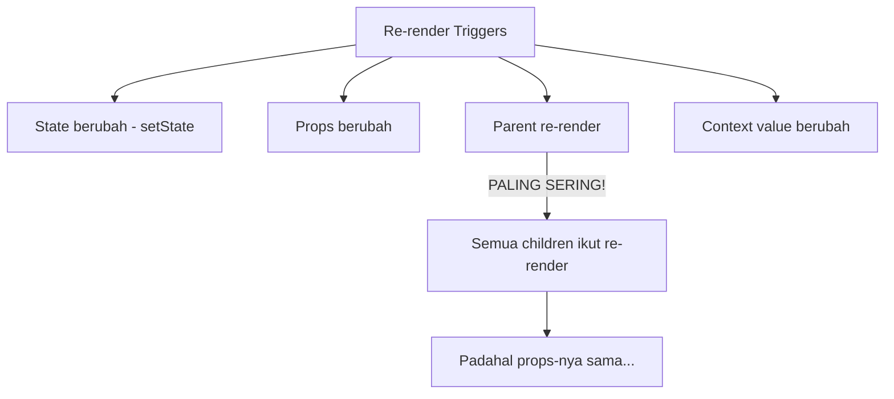
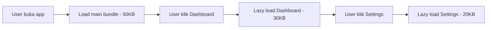
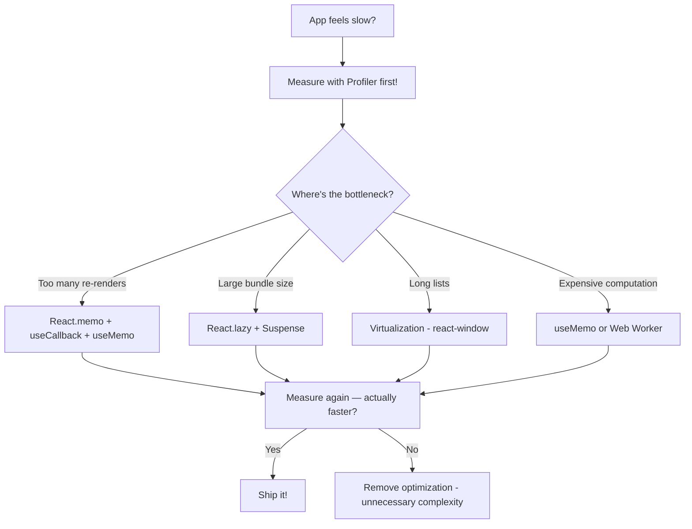

# Part 8: React Performance — Dari 47 Re-renders ke 2 🚀

## Cerita Dulu: Angkot vs MRT

Naik angkot dari Blok M ke Kota: berhenti di setiap tiang listrik, naikkan penumpang satu-satu, supirnya ngetem 10 menit nunggu penuh. Total 2.5 jam.

Naik MRT: **cuma berhenti di stasiun yang penting**, langsung jalan, 30 menit sampe.

React app yang lambat = angkot. **Berhenti (re-render) di setiap component**, padahal yang berubah cuma 1. Hari ini gua bakal tunjukin cara bikin app kalian jadi MRT — cuma render yang perlu aja.

---

## Step 1: Understand Re-renders

### Kapan React Re-render?



**Key insight**: Kalau parent re-render, **SEMUA children ikut re-render** by default. Mau props-nya sama, mau component-nya cuma render `<p>hello</p>`. Ini by design — React defaultnya safe (render ulang) daripada risky (skip, tapi mungkin stale).

### Demo: The Problem

```tsx
import { useState } from 'react';

// Counter berapa kali component render
let renderCount = { list: 0, item: 0, header: 0, footer: 0 };

function SlowProductList() {
  const [searchQuery, setSearchQuery] = useState('');
  const [cart, setCart] = useState<string[]>([]);

  console.log('📊 ProductList renders:', ++renderCount.list);

  const products = Array.from({ length: 100 }, (_, i) => ({
    id: `product-${i}`,
    name: `Product ${i}`,
    price: Math.floor(Math.random() * 500000) + 10000,
  }));

  const filtered = products.filter((p) =>
    p.name.toLowerCase().includes(searchQuery.toLowerCase())
  );

  return (
    <div style={{ padding: 24 }}>
      <Header cartCount={cart.length} />

      <input
        value={searchQuery}
        onChange={(e) => setSearchQuery(e.target.value)}
        placeholder="Search products..."
        style={{ padding: 12, width: '100%', marginBottom: 16, borderRadius: 8, border: '1px solid #e2e8f0' }}
      />

      <div style={{ display: 'grid', gridTemplateColumns: 'repeat(3, 1fr)', gap: 16 }}>
        {filtered.map((product) => (
          <ProductItem
            key={product.id}
            product={product}
            onAddToCart={() => setCart((prev) => [...prev, product.id])}
          />
        ))}
      </div>

      <Footer />
    </div>
  );
}

function Header({ cartCount }: { cartCount: number }) {
  console.log('📊 Header renders:', ++renderCount.header);
  return (
    <header style={{ padding: 16, borderBottom: '1px solid #e2e8f0', marginBottom: 16 }}>
      <h1>🏪 Toko Online</h1>
      <span>🛒 Cart: {cartCount} items</span>
    </header>
  );
}

function ProductItem({
  product,
  onAddToCart,
}: {
  product: { id: string; name: string; price: number };
  onAddToCart: () => void;
}) {
  console.log('📊 ProductItem renders:', ++renderCount.item);
  
  // Simulate expensive render
  const startTime = performance.now();
  while (performance.now() - startTime < 1) {
    // Artificial 1ms delay per item
  }

  return (
    <div style={{ border: '1px solid #e2e8f0', borderRadius: 8, padding: 16 }}>
      <h3>{product.name}</h3>
      <p>Rp {product.price.toLocaleString('id-ID')}</p>
      <button onClick={onAddToCart}>Add to Cart</button>
    </div>
  );
}

function Footer() {
  console.log('📊 Footer renders:', ++renderCount.footer);
  return (
    <footer style={{ padding: 16, marginTop: 16, borderTop: '1px solid #e2e8f0', color: '#94a3b8' }}>
      © 2024 ETHJKT Store
    </footer>
  );
}
```

**Problem**: Ketik 1 huruf di search → **100 ProductItem + Header + Footer re-render**. Setiap item 1ms = 100ms per keystroke. Laggy!

---

## Step 2: React DevTools Profiler

Sebelum optimize, kalian harus **measure**. Jangan asal tebak.

1. Install **React Developer Tools** browser extension
2. Buka DevTools → Tab **Profiler**
3. Klik **Record** (⏺️), interact dengan app, **Stop**
4. Liat **Flamegraph** — component mana yang re-render dan berapa lama

### Settings penting:
- ⚙️ → **"Highlight updates when components render"** — nyalain! Component yang re-render bakal flash hijau/kuning/merah
- ⚙️ → **"Record why each component rendered"** — ini kasih tau WHY component re-render

### Apa yang dicari:
- Component yang render **banyak kali** tapi hasilnya **sama** → candidate buat `React.memo`
- Component yang render **lama** → candidate buat lazy loading atau virtualization
- Component yang re-render karena **parent** padahal props-nya sama → `React.memo`

---

## Step 3: React.memo — Skip Unnecessary Re-renders

`React.memo` = "Hey React, kalau props-nya sama kayak sebelumnya, skip re-render."

```tsx
import { memo, useState, useCallback, useMemo } from 'react';

// Wrap dengan memo — ONLY re-render kalau props berubah
const ProductItem = memo(function ProductItem({
  product,
  onAddToCart,
}: {
  product: { id: string; name: string; price: number };
  onAddToCart: () => void;
}) {
  console.log(`📊 ProductItem ${product.id} renders`);

  return (
    <div style={{ border: '1px solid #e2e8f0', borderRadius: 8, padding: 16 }}>
      <h3>{product.name}</h3>
      <p>Rp {product.price.toLocaleString('id-ID')}</p>
      <button onClick={onAddToCart}>Add to Cart</button>
    </div>
  );
});

const Header = memo(function Header({ cartCount }: { cartCount: number }) {
  console.log('📊 Header renders');
  return (
    <header style={{ padding: 16, borderBottom: '1px solid #e2e8f0', marginBottom: 16 }}>
      <h1>🏪 Toko Online</h1>
      <span>🛒 Cart: {cartCount} items</span>
    </header>
  );
});

const Footer = memo(function Footer() {
  console.log('📊 Footer renders');
  return (
    <footer style={{ padding: 16, marginTop: 16, borderTop: '1px solid #e2e8f0', color: '#94a3b8' }}>
      © 2024 ETHJKT Store
    </footer>
  );
});
```

### ⚠️ Tapi WAIT — Ada Gotcha!

```tsx
function OptimizedProductList() {
  const [searchQuery, setSearchQuery] = useState('');
  const [cart, setCart] = useState<string[]>([]);

  // ❌ PROBLEM: products dibuat ulang setiap render!
  // React.memo compare by reference — array baru = props beda = re-render!
  const products = Array.from({ length: 100 }, (_, i) => ({
    id: `product-${i}`,
    name: `Product ${i}`,
    price: (i + 1) * 5000,
  }));

  // ❌ PROBLEM: onAddToCart dibuat ulang setiap render!
  // Arrow function baru = reference beda = memo percuma!
  // onAddToCart={() => setCart(prev => [...prev, product.id])}

  // ✅ FIX: useMemo buat stable data reference
  const stableProducts = useMemo(
    () =>
      Array.from({ length: 100 }, (_, i) => ({
        id: `product-${i}`,
        name: `Product ${i}`,
        price: (i + 1) * 5000,
      })),
    [] // empty deps = computed once
  );

  const filtered = useMemo(
    () =>
      stableProducts.filter((p) =>
        p.name.toLowerCase().includes(searchQuery.toLowerCase())
      ),
    [stableProducts, searchQuery]
  );

  // ✅ FIX: useCallback buat stable function reference
  const handleAddToCart = useCallback((productId: string) => {
    setCart((prev) => [...prev, productId]);
  }, []);

  return (
    <div style={{ padding: 24 }}>
      <Header cartCount={cart.length} />

      <input
        value={searchQuery}
        onChange={(e) => setSearchQuery(e.target.value)}
        placeholder="Search products..."
        style={{ padding: 12, width: '100%', marginBottom: 16, borderRadius: 8, border: '1px solid #e2e8f0' }}
      />

      <div style={{ display: 'grid', gridTemplateColumns: 'repeat(3, 1fr)', gap: 16 }}>
        {filtered.map((product) => (
          <MemoProductItem
            key={product.id}
            product={product}
            onAddToCart={() => handleAddToCart(product.id)}
          />
        ))}
      </div>

      <Footer />
    </div>
  );
}

// Tapi tunggu... `() => handleAddToCart(product.id)` masih bikin arrow function baru!
// Fix: pass productId sebagai prop, handle di dalem

const MemoProductItem = memo(function MemoProductItem({
  product,
  onAddToCart,
}: {
  product: { id: string; name: string; price: number };
  onAddToCart: () => void;
}) {
  return (
    <div style={{ border: '1px solid #e2e8f0', borderRadius: 8, padding: 16 }}>
      <h3>{product.name}</h3>
      <p>Rp {product.price.toLocaleString('id-ID')}</p>
      <button onClick={onAddToCart}>Add to Cart</button>
    </div>
  );
});

// Better approach — pass ID, use single callback
const BetterProductItem = memo(function BetterProductItem({
  product,
  onAddToCart,
}: {
  product: { id: string; name: string; price: number };
  onAddToCart: (id: string) => void;
}) {
  return (
    <div style={{ border: '1px solid #e2e8f0', borderRadius: 8, padding: 16 }}>
      <h3>{product.name}</h3>
      <p>Rp {product.price.toLocaleString('id-ID')}</p>
      <button onClick={() => onAddToCart(product.id)}>Add to Cart</button>
    </div>
  );
});
```

---

## Step 4: React.lazy + Suspense — Code Splitting

Jangan load semua code sekaligus. Load cuma yang dibutuhkan.



```tsx
import { lazy, Suspense, useState } from 'react';

// Lazy load components — nggak masuk main bundle
const Dashboard = lazy(() => import('./pages/Dashboard'));
const Analytics = lazy(() => import('./pages/Analytics'));
const Settings = lazy(() => import('./pages/Settings'));

// Bisa bikin named export work
const HeavyChart = lazy(() =>
  import('./components/HeavyChart').then((module) => ({
    default: module.HeavyChart,
  }))
);

function LoadingSpinner() {
  return (
    <div style={{ padding: 40, textAlign: 'center' }}>
      <div style={{ fontSize: 32, animation: 'spin 1s linear infinite' }}>⏳</div>
      <p>Loading...</p>
    </div>
  );
}

function App() {
  const [page, setPage] = useState<'dashboard' | 'analytics' | 'settings'>('dashboard');

  return (
    <div>
      <nav style={{ display: 'flex', gap: 16, padding: 16, borderBottom: '1px solid #e2e8f0' }}>
        <button onClick={() => setPage('dashboard')}>Dashboard</button>
        <button onClick={() => setPage('analytics')}>Analytics</button>
        <button onClick={() => setPage('settings')}>Settings</button>
      </nav>

      <Suspense fallback={<LoadingSpinner />}>
        {page === 'dashboard' && <Dashboard />}
        {page === 'analytics' && <Analytics />}
        {page === 'settings' && <Settings />}
      </Suspense>
    </div>
  );
}
```

### Tips Code Splitting:
- Split **per route** — setiap page jadi chunk sendiri
- Split **heavy components** — charts, editors, maps
- **Preload on hover** — load chunk sebelum user klik:

```tsx
const DashboardChunk = () => import('./pages/Dashboard');
const Dashboard = lazy(DashboardChunk);

// Preload when user hovers the nav link
<button
  onMouseEnter={() => DashboardChunk()}
  onClick={() => setPage('dashboard')}
>
  Dashboard
</button>
```

---

## Step 5: Virtualization — Render 10,000+ Items

Kalau punya list 10,000 items, jangan render semua. Render cuma yang **visible di viewport**.

```
┌──────────────────────┐
│  ▓▓▓ invisible ▓▓▓   │  ← Not rendered (above viewport)
│  ▓▓▓▓▓▓▓▓▓▓▓▓▓▓▓▓   │
├──────────────────────┤
│  Item 47              │  ← Rendered (visible)
│  Item 48              │
│  Item 49              │
│  Item 50              │
│  Item 51              │
├──────────────────────┤
│  ▓▓▓ invisible ▓▓▓   │  ← Not rendered (below viewport)
│  ▓▓▓▓▓▓▓▓▓▓▓▓▓▓▓▓   │
└──────────────────────┘
```

Install: `npm install react-window`

```tsx
import { FixedSizeList as List } from 'react-window';
import { memo } from 'react';

interface Product {
  id: number;
  name: string;
  price: number;
  category: string;
}

// Generate 10,000 products
const products: Product[] = Array.from({ length: 10000 }, (_, i) => ({
  id: i,
  name: `Product #${i} - ${['Sepatu', 'Baju', 'Celana', 'Topi', 'Tas'][i % 5]}`,
  price: Math.floor(Math.random() * 1000000) + 50000,
  category: ['Fashion', 'Electronics', 'Food', 'Sports'][i % 4],
}));

// Row component — MUST be memoized for virtualization to work
const ProductRow = memo(function ProductRow({
  index,
  style,
}: {
  index: number;
  style: React.CSSProperties;
}) {
  const product = products[index];

  return (
    <div
      style={{
        ...style,
        display: 'flex',
        alignItems: 'center',
        padding: '0 16px',
        borderBottom: '1px solid #f1f5f9',
        background: index % 2 === 0 ? '#ffffff' : '#f8fafc',
      }}
    >
      <span style={{ flex: 1, fontWeight: 600 }}>{product.name}</span>
      <span style={{ width: 120, color: '#64748b' }}>{product.category}</span>
      <span style={{ width: 150, textAlign: 'right' }}>
        Rp {product.price.toLocaleString('id-ID')}
      </span>
    </div>
  );
});

function VirtualizedProductList() {
  return (
    <div style={{ padding: 24 }}>
      <h1>🏪 10,000 Products (Virtualized)</h1>
      <p style={{ color: '#64748b' }}>
        Only ~15 items rendered at a time. Scroll is buttery smooth!
      </p>

      <div style={{ border: '1px solid #e2e8f0', borderRadius: 8, overflow: 'hidden' }}>
        {/* Header */}
        <div style={{
          display: 'flex',
          padding: '12px 16px',
          background: '#f1f5f9',
          fontWeight: 700,
          borderBottom: '2px solid #e2e8f0',
        }}>
          <span style={{ flex: 1 }}>Name</span>
          <span style={{ width: 120 }}>Category</span>
          <span style={{ width: 150, textAlign: 'right' }}>Price</span>
        </div>

        {/* Virtualized list */}
        <List
          height={500}
          itemCount={products.length}
          itemSize={50}
          width="100%"
        >
          {ProductRow}
        </List>
      </div>

      <p style={{ marginTop: 8, color: '#94a3b8', fontSize: 14 }}>
        Total items: {products.length.toLocaleString()} | DOM nodes: ~15
      </p>
    </div>
  );
}
```

### Variable Size List (items dengan tinggi beda):

```tsx
import { VariableSizeList } from 'react-window';

const messages = Array.from({ length: 1000 }, (_, i) => ({
  id: i,
  text: i % 3 === 0
    ? 'Short message'
    : i % 3 === 1
    ? 'Medium length message that takes a bit more space in the list item.'
    : 'This is a very long message that probably needs multiple lines to display properly in our chat interface. It contains a lot of text!',
  sender: i % 2 === 0 ? 'Alice' : 'Bob',
}));

// Estimate height based on text length
const getItemSize = (index: number) => {
  const text = messages[index].text;
  if (text.length < 30) return 60;
  if (text.length < 80) return 80;
  return 100;
};

function ChatMessages() {
  return (
    <VariableSizeList
      height={400}
      itemCount={messages.length}
      itemSize={getItemSize}
      width="100%"
    >
      {({ index, style }) => {
        const msg = messages[index];
        return (
          <div style={{
            ...style,
            padding: '8px 16px',
            display: 'flex',
            flexDirection: 'column',
            justifyContent: 'center',
            borderBottom: '1px solid #f1f5f9',
          }}>
            <strong>{msg.sender}</strong>
            <span style={{ color: '#64748b' }}>{msg.text}</span>
          </div>
        );
      }}
    </VariableSizeList>
  );
}
```

---

## The Full Optimization: Before vs After

### Before (47 re-renders per keystroke):
- ❌ Products array recreated every render
- ❌ All 100 ProductItems re-render on search
- ❌ Header re-renders even when cart unchanged
- ❌ Footer re-renders every time (no reason)
- ❌ All 100 items in DOM (slow scroll with 10K+)

### After (2 re-renders per keystroke):
- ✅ Products memoized with `useMemo`
- ✅ ProductItem wrapped with `React.memo`
- ✅ Callbacks stabilized with `useCallback`
- ✅ Header only re-renders when `cartCount` changes
- ✅ Footer rendered once, never again
- ✅ Only visible items in DOM (virtualization)

---

## Performance Optimization Checklist



### Rules of Performance:

1. **Measure first** — jangan optimize berdasarkan feeling
2. **Profile, don't guess** — React DevTools Profiler is your friend
3. **Premature optimization is the root of all evil** — optimize kalau ada actual problem
4. **React.memo isn't free** — ada cost buat compare props. Kalau component murah, memo bisa lebih lambat
5. **Start simple** — useState → useMemo → React.memo → virtualization, jangan loncat

---

## Recap

1. **React DevTools Profiler** — measure sebelum optimize
2. **React.memo** — skip re-render kalau props sama (+ useCallback/useMemo buat stable references)
3. **React.lazy + Suspense** — code splitting per route/heavy component
4. **Virtualization** — render cuma yang visible, perfect buat long lists
5. **Measure again** — pastiin optimization actually bikin improvement

Performance bukan tentang bikin semua secepat mungkin. Ini tentang bikin user experience **smooth** — 60fps, instant response, no jank. Optimize yang perlu, skip yang nggak.

---

**Next Part → [TanStack Query](https://github.com/Ethereum-Jakarta/phase-2-week3-frontend-advance/blob/main/study-material/09-tanstack-query.md)**
