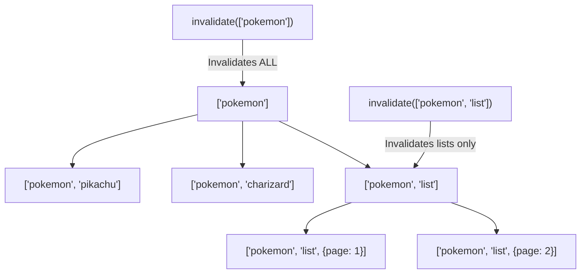
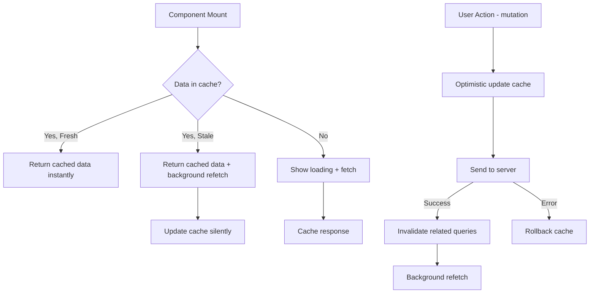

# Part 9: TanStack Query — Server State Management yang Bener 🔄

## Cerita Dulu: Kulkas vs Warung

Kalian punya 2 cara dapetin makanan:

**Cara 1 (tanpa cache):** Setiap lapar → jalan ke warung → beli → makan. Lapar lagi? Jalan ke warung lagi. Capek, lama, boros bensin.

**Cara 2 (dengan cache):** Pertama kali ke warung → beli banyak → simpen di kulkas. Lapar? Buka kulkas. Kulkas kosong? Baru ke warung lagi. **Tapi** kalian juga cek: "Makanan ini masih fresh nggak?" Kalau udah basi (stale), buang dan beli baru.

TanStack Query = **kulkas pintar** buat data dari server. Dia cache data, tau kapan data stale, auto-refetch di background, dan handle loading/error states. Tanpa kalian harus bikin `isLoading`, `error`, `useEffect` fetch manual yang penuh bug.

---

## Kenapa Nggak useFetch Aja?

Coba recall `useFetch` dari Part 7. Bagus buat simple cases, tapi:

- ❌ Nggak ada caching — fetch ulang setiap mount
- ❌ Nggak ada deduplication — 3 component fetch URL sama = 3 requests
- ❌ Nggak ada background refetch — data basi tanpa user tau
- ❌ Manual invalidation — update data? Harus manual refetch semua yang terkait
- ❌ No optimistic updates — UI nunggu server response
- ❌ No infinite scroll support built-in

TanStack Query solve semua itu. Let's go.

---

## Setup

```bash
npm install @tanstack/react-query @tanstack/react-query-devtools
```

```tsx
// main.tsx
import { QueryClient, QueryClientProvider } from '@tanstack/react-query';
import { ReactQueryDevtools } from '@tanstack/react-query-devtools';
import App from './App';

const queryClient = new QueryClient({
  defaultOptions: {
    queries: {
      staleTime: 1000 * 60 * 5, // 5 minutes — data dianggap fresh selama ini
      gcTime: 1000 * 60 * 30,   // 30 minutes — cache disimpan selama ini
      retry: 3,                   // retry 3x kalau gagal
      refetchOnWindowFocus: true, // refetch saat user balik ke tab
    },
  },
});

function Root() {
  return (
    <QueryClientProvider client={queryClient}>
      <App />
      <ReactQueryDevtools initialIsOpen={false} />
    </QueryClientProvider>
  );
}
```

### DevTools

`ReactQueryDevtools` itu **game changer**. Buka app, liat panel di kiri bawah — semua query, cache status, timing. Always include in development.

---

## useQuery — Fetch Data the Right Way

```tsx
import { useQuery } from '@tanstack/react-query';

interface Pokemon {
  id: number;
  name: string;
  height: number;
  weight: number;
  sprites: {
    front_default: string;
    other: {
      'official-artwork': {
        front_default: string;
      };
    };
  };
  types: Array<{ type: { name: string } }>;
  stats: Array<{ base_stat: number; stat: { name: string } }>;
}

// Fetch function — TERPISAH dari hook
async function fetchPokemon(name: string): Promise<Pokemon> {
  const response = await fetch(`https://pokeapi.co/api/v2/pokemon/${name}`);
  if (!response.ok) {
    throw new Error(`Pokemon "${name}" not found`);
  }
  return response.json();
}

function PokemonCard({ name }: { name: string }) {
  const {
    data,          // Pokemon | undefined
    isLoading,     // true saat fetch pertama kali
    isError,       // true kalau error
    error,         // Error object
    isFetching,    // true saat fetch (termasuk background refetch)
    isStale,       // true kalau data udah stale
    refetch,       // manual refetch
  } = useQuery({
    queryKey: ['pokemon', name],   // unique key buat cache
    queryFn: () => fetchPokemon(name), // fetch function
    enabled: name.length > 0,         // conditional fetch
    staleTime: 1000 * 60 * 10,        // fresh selama 10 menit
  });

  if (isLoading) {
    return <div style={{ padding: 24, textAlign: 'center' }}>⏳ Loading {name}...</div>;
  }

  if (isError) {
    return (
      <div style={{ padding: 24, color: '#ef4444' }}>
        <p>❌ {error.message}</p>
        <button onClick={() => refetch()}>🔄 Retry</button>
      </div>
    );
  }

  if (!data) return null;

  return (
    <div style={{
      border: '1px solid #e2e8f0',
      borderRadius: 12,
      padding: 24,
      maxWidth: 400,
    }}>
      {isFetching && (
        <div style={{ color: '#3b82f6', fontSize: 12, marginBottom: 8 }}>
          🔄 Refreshing in background...
        </div>
      )}
      <h2 style={{ textTransform: 'capitalize' }}>{data.name}</h2>
      <p>Height: {data.height / 10}m | Weight: {data.weight / 10}kg</p>
      <div style={{ display: 'flex', gap: 8, marginTop: 8 }}>
        {data.types.map((t) => (
          <span
            key={t.type.name}
            style={{
              background: '#e0f2fe',
              padding: '4px 12px',
              borderRadius: 16,
              fontSize: 14,
              textTransform: 'capitalize',
            }}
          >
            {t.type.name}
          </span>
        ))}
      </div>
      <div style={{ marginTop: 16 }}>
        <h4>Stats</h4>
        {data.stats.map((s) => (
          <div key={s.stat.name} style={{ display: 'flex', gap: 8, marginBottom: 4 }}>
            <span style={{ width: 120, textTransform: 'capitalize', fontSize: 14 }}>
              {s.stat.name}
            </span>
            <div style={{ flex: 1, background: '#f1f5f9', borderRadius: 4, overflow: 'hidden' }}>
              <div
                style={{
                  width: `${Math.min(s.base_stat, 150) / 1.5}%`,
                  height: 16,
                  background: s.base_stat > 100 ? '#22c55e' : s.base_stat > 60 ? '#eab308' : '#ef4444',
                  borderRadius: 4,
                }}
              />
            </div>
            <span style={{ width: 30, fontSize: 14, textAlign: 'right' }}>{s.base_stat}</span>
          </div>
        ))}
      </div>
    </div>
  );
}
```

---

## Query Keys — The Caching Strategy

Query keys = **identitas cache**. Kalau key-nya sama, data di-cache dan reuse.

```tsx
// ✅ Good key strategies
useQuery({ queryKey: ['pokemon', 'pikachu'], queryFn: ... });
useQuery({ queryKey: ['pokemon', 'charizard'], queryFn: ... });
useQuery({ queryKey: ['pokemon', 'list', { page: 1, limit: 20 }], queryFn: ... });
useQuery({ queryKey: ['pokemon', 'list', { page: 2, limit: 20 }], queryFn: ... });

// Keys are compared by DEEP equality
// { page: 1, limit: 20 } === { limit: 20, page: 1 }  ← same cache!
```



---

## staleTime vs gcTime

Ini yang sering bikin bingung. Analogi kulkas:

```
staleTime = "Berapa lama makanan dianggap fresh?"
  - Selama fresh → serve dari cache, TANPA refetch
  - Setelah stale → serve dari cache, TAPI refetch di background

gcTime = "Berapa lama makanan disimpen di kulkas?"
  - Selama di kulkas → bisa serve (walau stale)
  - Setelah expired → buang dari kulkas, fetch dari awal (loading state)
```

```
Timeline: ─────────────────────────────────────────►

Fetch!    staleTime (5min)         gcTime (30min)
  │          │                          │
  ▼──────────▼──────────────────────────▼
  │  FRESH   │         STALE           │  GARBAGE COLLECTED
  │  (cache) │  (cache + bg refetch)   │  (gone, loading state)
```

```tsx
useQuery({
  queryKey: ['pokemon', name],
  queryFn: () => fetchPokemon(name),
  staleTime: 1000 * 60 * 5,    // 5 min fresh
  gcTime: 1000 * 60 * 30,      // 30 min in cache
});
```

---

## useMutation — Create, Update, Delete

```tsx
import { useMutation, useQueryClient } from '@tanstack/react-query';

interface NewPokemonTeam {
  name: string;
  pokemon: string[];
}

interface PokemonTeam extends NewPokemonTeam {
  id: string;
  createdAt: string;
}

async function createTeam(team: NewPokemonTeam): Promise<PokemonTeam> {
  const response = await fetch('/api/teams', {
    method: 'POST',
    headers: { 'Content-Type': 'application/json' },
    body: JSON.stringify(team),
  });
  if (!response.ok) throw new Error('Failed to create team');
  return response.json();
}

function CreateTeamForm() {
  const queryClient = useQueryClient();

  const mutation = useMutation({
    mutationFn: createTeam,

    // Called BEFORE mutationFn — for optimistic updates
    onMutate: async (newTeam) => {
      // Cancel outgoing refetches
      await queryClient.cancelQueries({ queryKey: ['teams'] });

      // Snapshot current data
      const previousTeams = queryClient.getQueryData<PokemonTeam[]>(['teams']);

      // Optimistically add to cache
      queryClient.setQueryData<PokemonTeam[]>(['teams'], (old) => [
        ...(old || []),
        {
          ...newTeam,
          id: `temp-${Date.now()}`,
          createdAt: new Date().toISOString(),
        },
      ]);

      return { previousTeams }; // context for onError rollback
    },

    onError: (_error, _newTeam, context) => {
      // Rollback on error
      if (context?.previousTeams) {
        queryClient.setQueryData(['teams'], context.previousTeams);
      }
    },

    onSettled: () => {
      // Always refetch after mutation (success or error)
      queryClient.invalidateQueries({ queryKey: ['teams'] });
    },

    onSuccess: (data) => {
      console.log('Team created:', data);
    },
  });

  const handleSubmit = (e: React.FormEvent) => {
    e.preventDefault();
    mutation.mutate({
      name: 'Dream Team',
      pokemon: ['pikachu', 'charizard', 'mewtwo'],
    });
  };

  return (
    <form onSubmit={handleSubmit}>
      <button
        type="submit"
        disabled={mutation.isPending}
        style={{
          padding: '12px 24px',
          borderRadius: 8,
          border: 'none',
          background: mutation.isPending ? '#94a3b8' : '#3b82f6',
          color: 'white',
          cursor: mutation.isPending ? 'not-allowed' : 'pointer',
        }}
      >
        {mutation.isPending ? '⏳ Creating...' : '✨ Create Team'}
      </button>

      {mutation.isError && (
        <p style={{ color: '#ef4444' }}>❌ {mutation.error.message}</p>
      )}
      {mutation.isSuccess && (
        <p style={{ color: '#22c55e' }}>✅ Team created!</p>
      )}
    </form>
  );
}
```

---

## Invalidation Patterns

```tsx
const queryClient = useQueryClient();

// Invalidate semua pokemon queries
queryClient.invalidateQueries({ queryKey: ['pokemon'] });

// Invalidate specific pokemon
queryClient.invalidateQueries({ queryKey: ['pokemon', 'pikachu'] });

// Invalidate semua queries (nuclear option)
queryClient.invalidateQueries();

// Remove from cache completely
queryClient.removeQueries({ queryKey: ['pokemon', 'pikachu'] });

// Update cache directly (tanpa refetch)
queryClient.setQueryData(['pokemon', 'pikachu'], (old: Pokemon | undefined) => {
  if (!old) return old;
  return { ...old, name: 'Updated Pikachu' };
});
```

---

## useInfiniteQuery — Infinite Scroll 📜

Sekarang kita build Pokemon browser with infinite scroll!

```tsx
import { useInfiniteQuery } from '@tanstack/react-query';
import { useRef, useEffect, useCallback } from 'react';

interface PokemonListItem {
  name: string;
  url: string;
}

interface PokemonListResponse {
  count: number;
  next: string | null;
  previous: string | null;
  results: PokemonListItem[];
}

async function fetchPokemonList({
  pageParam = 0,
}: {
  pageParam?: number;
}): Promise<PokemonListResponse> {
  const response = await fetch(
    `https://pokeapi.co/api/v2/pokemon?offset=${pageParam}&limit=20`
  );
  if (!response.ok) throw new Error('Failed to fetch');
  return response.json();
}

function getPokemonId(url: string): number {
  const parts = url.split('/').filter(Boolean);
  return parseInt(parts[parts.length - 1], 10);
}

function PokemonBrowser() {
  const observerRef = useRef<HTMLDivElement>(null);

  const {
    data,
    isLoading,
    isError,
    error,
    fetchNextPage,
    hasNextPage,
    isFetchingNextPage,
  } = useInfiniteQuery({
    queryKey: ['pokemon', 'infinite-list'],
    queryFn: fetchPokemonList,
    initialPageParam: 0,
    getNextPageParam: (lastPage) => {
      if (!lastPage.next) return undefined;
      const url = new URL(lastPage.next);
      return parseInt(url.searchParams.get('offset') || '0', 10);
    },
  });

  // Intersection Observer for infinite scroll
  const handleObserver = useCallback(
    (entries: IntersectionObserverEntry[]) => {
      const [entry] = entries;
      if (entry.isIntersecting && hasNextPage && !isFetchingNextPage) {
        fetchNextPage();
      }
    },
    [fetchNextPage, hasNextPage, isFetchingNextPage]
  );

  useEffect(() => {
    const element = observerRef.current;
    if (!element) return;

    const observer = new IntersectionObserver(handleObserver, {
      rootMargin: '200px',
    });

    observer.observe(element);
    return () => observer.disconnect();
  }, [handleObserver]);

  if (isLoading) {
    return (
      <div style={{ padding: 40, textAlign: 'center' }}>
        <p style={{ fontSize: 32 }}>⏳</p>
        <p>Loading Pokemon...</p>
      </div>
    );
  }

  if (isError) {
    return (
      <div style={{ padding: 40, textAlign: 'center', color: '#ef4444' }}>
        <p>❌ {error.message}</p>
      </div>
    );
  }

  // Flatten all pages into single array
  const allPokemon = data?.pages.flatMap((page) => page.results) ?? [];
  const totalCount = data?.pages[0]?.count ?? 0;

  return (
    <div style={{ maxWidth: 800, margin: '0 auto', padding: 24 }}>
      <h1>🎮 Pokemon Browser</h1>
      <p style={{ color: '#64748b' }}>
        Showing {allPokemon.length} of {totalCount} Pokemon
      </p>

      <div style={{
        display: 'grid',
        gridTemplateColumns: 'repeat(auto-fill, minmax(180px, 1fr))',
        gap: 16,
        marginTop: 16,
      }}>
        {allPokemon.map((pokemon) => {
          const id = getPokemonId(pokemon.url);
          return (
            <div
              key={pokemon.name}
              style={{
                border: '1px solid #e2e8f0',
                borderRadius: 12,
                padding: 16,
                textAlign: 'center',
                transition: 'transform 150ms, box-shadow 150ms',
                cursor: 'pointer',
              }}
              onMouseEnter={(e) => {
                e.currentTarget.style.transform = 'translateY(-2px)';
                e.currentTarget.style.boxShadow = '0 4px 12px rgba(0,0,0,0.1)';
              }}
              onMouseLeave={(e) => {
                e.currentTarget.style.transform = 'translateY(0)';
                e.currentTarget.style.boxShadow = 'none';
              }}
            >
              <div style={{ fontSize: 14, color: '#94a3b8' }}>#{id}</div>
              <div style={{ fontSize: 18, fontWeight: 600, textTransform: 'capitalize', marginTop: 4 }}>
                {pokemon.name}
              </div>
            </div>
          );
        })}
      </div>

      {/* Infinite scroll trigger */}
      <div
        ref={observerRef}
        style={{ padding: 24, textAlign: 'center', marginTop: 16 }}
      >
        {isFetchingNextPage ? (
          <p>⏳ Loading more Pokemon...</p>
        ) : hasNextPage ? (
          <p style={{ color: '#94a3b8' }}>Scroll down for more</p>
        ) : (
          <p style={{ color: '#22c55e' }}>✅ You've caught 'em all! ({totalCount} Pokemon)</p>
        )}
      </div>
    </div>
  );
}

export default PokemonBrowser;
```

---

## Prefetching — Load Before User Needs It

```tsx
import { useQueryClient } from '@tanstack/react-query';

function PokemonListItem({ name }: { name: string }) {
  const queryClient = useQueryClient();

  // Prefetch on hover — data ready saat user klik!
  const handleMouseEnter = () => {
    queryClient.prefetchQuery({
      queryKey: ['pokemon', name],
      queryFn: () => fetchPokemon(name),
      staleTime: 1000 * 60 * 5,
    });
  };

  return (
    <div
      onMouseEnter={handleMouseEnter}
      style={{
        padding: 12,
        cursor: 'pointer',
        textTransform: 'capitalize',
        borderBottom: '1px solid #f1f5f9',
      }}
    >
      {name}
    </div>
  );
}
```

User hover → data di-prefetch → user klik → **instant**. Zero loading time. User-nya mikir app-nya super cepat. 🏎️

---

## Putting It All Together



---

## Common Patterns Cheat Sheet

```tsx
// Dependent queries — query B depends on query A
const { data: user } = useQuery({
  queryKey: ['user', userId],
  queryFn: () => fetchUser(userId),
});

const { data: teams } = useQuery({
  queryKey: ['teams', user?.id],
  queryFn: () => fetchUserTeams(user!.id),
  enabled: !!user?.id, // Only fetch when user is loaded
});

// Parallel queries — fetch multiple at once
const pokemonQueries = useQueries({
  queries: ['pikachu', 'charizard', 'mewtwo'].map((name) => ({
    queryKey: ['pokemon', name],
    queryFn: () => fetchPokemon(name),
  })),
});

// Select/transform data
const { data: pokemonNames } = useQuery({
  queryKey: ['pokemon', 'list'],
  queryFn: () => fetchPokemonList({ pageParam: 0 }),
  select: (data) => data.results.map((p) => p.name), // Only re-render when names change
});

// Placeholder data (show something while loading)
const { data } = useQuery({
  queryKey: ['pokemon', name],
  queryFn: () => fetchPokemon(name),
  placeholderData: (previousData) => previousData, // Keep showing old data while fetching new
});
```

---

## Recap

1. **useQuery** — fetch + cache + auto refetch. Replace all your `useEffect` + `useState` fetch patterns
2. **Query Keys** — hierarchical cache IDs. Design them like API routes
3. **staleTime vs gcTime** — fresh duration vs cache lifetime
4. **useMutation** — create/update/delete with optimistic updates
5. **Invalidation** — `invalidateQueries` with key matching
6. **useInfiniteQuery** — pagination/infinite scroll built-in
7. **Prefetching** — load data before user needs it
8. **DevTools** — always include, best debugging tool

TanStack Query bukan "just another fetch library." Ini **server state management**. Dia mengerti bahwa data dari server itu fundamentally beda dari client state — bisa stale, bisa di-cache, bisa di-share antar component. Dan dia handle semua itu buat kalian.

---

**Next Part → [TanStack Router](https://github.com/Ethereum-Jakarta/phase-2-week3-frontend-advance/blob/main/study-material/10-tanstack-router.md)**
