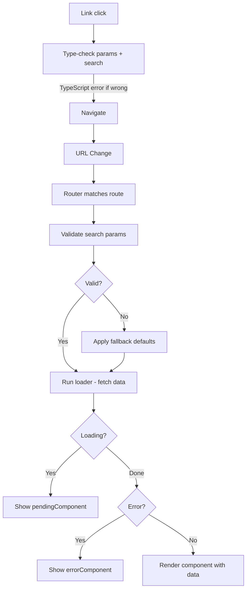

# Part 10: TanStack Router — Type-Safe Routing yang Next Level 🛣️

## Cerita Dulu: GPS Jadul vs Google Maps

Dulu navigasi pake GPS jadul: ketik alamat manual, nggak ada autocomplete, salah ketik = nyasar. Sampai tujuan? Mungkin. Mungkin juga masuk sawah.

Google Maps: ketik "Indom..." → autocomplete "Indomaret Tebet". Salah jalan? Auto-reroute. Ada macet? Kasih alternatif. **Semua type-safe** — nggak mungkin navigasi ke alamat yang nggak exist.

React Router itu GPS jadul. URL params? String semua, parse sendiri. Typo di path? Runtime error. Search params? `URLSearchParams` manual, nggak ada type safety.

TanStack Router itu Google Maps. **Setiap route, setiap param, setiap search param — fully typed.** Typo? TypeScript error sebelum app jalan. Dan fitur kayak loaders, pending UI, error boundaries — built-in.

---

## TanStack Router vs React Router v6

| Feature | React Router v6 | TanStack Router |
|---------|-----------------|-----------------|
| Type safety | ❌ Paths are strings | ✅ Fully typed routes |
| Search params | ❌ Manual URLSearchParams | ✅ Type-safe, validated |
| Data loading | `loader` (Remix-style) | `loader` with type inference |
| Pending UI | Manual | Built-in `pendingComponent` |
| Error UI | `errorElement` | `errorComponent` with typed errors |
| Devtools | ❌ | ✅ TanStack Router Devtools |
| File-based routing | ❌ (need Remix/Next) | ✅ Built-in code gen |
| Bundle size | ~13KB | ~12KB |

---

## Setup

```bash
npm install @tanstack/react-router zod @tanstack/router-zod-adapter
# For file-based routing (optional but recommended):
npm install -D @tanstack/router-plugin @tanstack/router-devtools
```

### Vite Config (file-based routing):

```ts
// vite.config.ts
import { defineConfig } from 'vite';
import react from '@vitejs/plugin-react';
import { TanStackRouterVite } from '@tanstack/router-plugin/vite';

export default defineConfig({
  plugins: [
    TanStackRouterVite(),  // Auto-generates route tree
    react(),
  ],
});
```

---

## Code-Based Routing (Manual)

Kalau nggak mau file-based, bisa manual. Gua tunjukin dua-duanya.

```tsx
// routes.tsx
import {
  createRootRoute,
  createRoute,
  createRouter,
  Outlet,
  Link,
} from '@tanstack/react-router';

// -------- Root Layout --------
const rootRoute = createRootRoute({
  component: function RootLayout() {
    return (
      <div style={{ minHeight: '100vh' }}>
        <nav style={{
          display: 'flex',
          gap: 16,
          padding: '12px 24px',
          borderBottom: '1px solid #e2e8f0',
          background: 'white',
          position: 'sticky',
          top: 0,
          zIndex: 10,
        }}>
          <Link
            to="/"
            style={{ fontWeight: 700, fontSize: 18 }}
            activeProps={{ style: { color: '#3b82f6' } }}
          >
            ⟠ ETHJKT Store
          </Link>
          <Link
            to="/products"
            activeProps={{ style: { color: '#3b82f6', fontWeight: 600 } }}
          >
            Products
          </Link>
          <Link
            to="/about"
            activeProps={{ style: { color: '#3b82f6', fontWeight: 600 } }}
          >
            About
          </Link>
        </nav>
        <main style={{ padding: 24 }}>
          <Outlet />
        </main>
      </div>
    );
  },
});

// -------- Index Route --------
const indexRoute = createRoute({
  getParentRoute: () => rootRoute,
  path: '/',
  component: function HomePage() {
    return (
      <div>
        <h1>🏠 Welcome to ETHJKT Store</h1>
        <p>Your favorite Web3 merch shop.</p>
        <Link
          to="/products"
          search={{ category: 'all', sort: 'newest' }}
          style={{
            display: 'inline-block',
            marginTop: 16,
            padding: '12px 24px',
            background: '#3b82f6',
            color: 'white',
            borderRadius: 8,
            textDecoration: 'none',
          }}
        >
          Browse Products →
        </Link>
      </div>
    );
  },
});

// -------- About Route --------
const aboutRoute = createRoute({
  getParentRoute: () => rootRoute,
  path: '/about',
  component: function AboutPage() {
    return (
      <div>
        <h1>About ETHJKT Store</h1>
        <p>Built with TanStack Router. Fully type-safe.</p>
      </div>
    );
  },
});
```

---

## Type-Safe Search Params — The Killer Feature 🎯

Ini yang bikin TanStack Router beda dari yang lain. Search params (query string) jadi **first-class citizen** dengan full type safety.

```tsx
import { z } from 'zod';  // or use valibot
import { createRoute } from '@tanstack/react-router';
import { fallback, zodSearchValidator } from '@tanstack/router-zod-adapter';

// Install: npm install @tanstack/router-zod-adapter zod

// Define search params schema
const productSearchSchema = z.object({
  category: fallback(z.enum(['all', 'clothing', 'accessories', 'stickers']), 'all'),
  sort: fallback(z.enum(['newest', 'price-asc', 'price-desc', 'popular']), 'newest'),
  minPrice: fallback(z.number().min(0), 0),
  maxPrice: fallback(z.number().max(10000000), 10000000),
  page: fallback(z.number().min(1), 1),
  q: fallback(z.string(), ''),
});

type ProductSearch = z.infer<typeof productSearchSchema>;

// Products layout route
const productsRoute = createRoute({
  getParentRoute: () => rootRoute,
  path: '/products',
  validateSearch: zodSearchValidator(productSearchSchema),
  // Loader runs BEFORE component renders
  loaderDeps: ({ search }) => ({
    category: search.category,
    sort: search.sort,
    page: search.page,
    q: search.q,
    minPrice: search.minPrice,
    maxPrice: search.maxPrice,
  }),
  loader: async ({ deps }) => {
    // Fetch products based on search params
    // In real app, this would be an API call
    const allProducts = generateProducts();
    
    let filtered = allProducts;
    
    if (deps.category !== 'all') {
      filtered = filtered.filter(p => p.category === deps.category);
    }
    
    if (deps.q) {
      filtered = filtered.filter(p => 
        p.name.toLowerCase().includes(deps.q.toLowerCase())
      );
    }
    
    filtered = filtered.filter(p => 
      p.price >= deps.minPrice && p.price <= deps.maxPrice
    );
    
    // Sort
    switch (deps.sort) {
      case 'price-asc':
        filtered.sort((a, b) => a.price - b.price);
        break;
      case 'price-desc':
        filtered.sort((a, b) => b.price - a.price);
        break;
      case 'popular':
        filtered.sort((a, b) => b.rating - a.rating);
        break;
      default: // newest
        filtered.sort((a, b) => b.id - a.id);
    }
    
    // Paginate
    const pageSize = 12;
    const start = (deps.page - 1) * pageSize;
    const paginated = filtered.slice(start, start + pageSize);
    
    return {
      products: paginated,
      total: filtered.length,
      totalPages: Math.ceil(filtered.length / pageSize),
    };
  },
  pendingComponent: () => (
    <div style={{ padding: 40, textAlign: 'center' }}>
      <p style={{ fontSize: 32 }}>⏳</p>
      <p>Loading products...</p>
    </div>
  ),
  errorComponent: ({ error }) => (
    <div style={{ padding: 40, textAlign: 'center', color: '#ef4444' }}>
      <h2>❌ Something went wrong</h2>
      <p>{error.message}</p>
    </div>
  ),
  component: ProductsPage,
});

// Helper: generate fake products
interface Product {
  id: number;
  name: string;
  price: number;
  category: 'clothing' | 'accessories' | 'stickers';
  rating: number;
}

function generateProducts(): Product[] {
  const categories: Product['category'][] = ['clothing', 'accessories', 'stickers'];
  const items = [
    'ETH Logo Tee', 'Solidity Hoodie', 'Web3 Cap', 'DeFi Sticker Pack',
    'NFT Keychain', 'Blockchain Bracelet', 'WAGMI Tote Bag', 'GM Socks',
    'Metaverse Sunglasses', 'DAO Pin Set', 'Smart Contract Mug',
    'Gas Fee Tears Tissue', 'Diamond Hands Gloves', 'HODL Hat',
    'Rug Pull Insurance Card', 'Yield Farm Apron',
  ];

  return Array.from({ length: 48 }, (_, i) => ({
    id: i + 1,
    name: items[i % items.length] + (i >= items.length ? ` v${Math.floor(i / items.length) + 1}` : ''),
    price: (Math.floor(Math.random() * 20) + 1) * 25000,
    category: categories[i % 3],
    rating: Math.round((3 + Math.random() * 2) * 10) / 10,
  }));
}
```

### Products Page Component

```tsx
import { useSearch, useNavigate, Link } from '@tanstack/react-router';

function ProductsPage() {
  // search is FULLY TYPED — autocomplete for category, sort, etc.
  const search = useSearch({ from: '/products' });
  const navigate = useNavigate();
  const { products, total, totalPages } = productsRoute.useLoaderData();

  const updateSearch = (updates: Partial<ProductSearch>) => {
    navigate({
      to: '/products',
      search: (prev) => ({ ...prev, ...updates, page: updates.page ?? 1 }),
    });
  };

  return (
    <div>
      <h1>🛍️ Products ({total} items)</h1>

      {/* Filters */}
      <div style={{
        display: 'flex',
        gap: 12,
        flexWrap: 'wrap',
        marginBottom: 24,
        padding: 16,
        background: '#f8fafc',
        borderRadius: 12,
      }}>
        {/* Search */}
        <input
          value={search.q}
          onChange={(e) => updateSearch({ q: e.target.value })}
          placeholder="🔍 Search..."
          style={{ padding: 8, borderRadius: 8, border: '1px solid #e2e8f0', minWidth: 200 }}
        />

        {/* Category filter */}
        <select
          value={search.category}
          onChange={(e) => updateSearch({ category: e.target.value as ProductSearch['category'] })}
          style={{ padding: 8, borderRadius: 8, border: '1px solid #e2e8f0' }}
        >
          <option value="all">All Categories</option>
          <option value="clothing">👕 Clothing</option>
          <option value="accessories">💍 Accessories</option>
          <option value="stickers">🏷️ Stickers</option>
        </select>

        {/* Sort */}
        <select
          value={search.sort}
          onChange={(e) => updateSearch({ sort: e.target.value as ProductSearch['sort'] })}
          style={{ padding: 8, borderRadius: 8, border: '1px solid #e2e8f0' }}
        >
          <option value="newest">🆕 Newest</option>
          <option value="price-asc">💰 Price: Low → High</option>
          <option value="price-desc">💰 Price: High → Low</option>
          <option value="popular">⭐ Most Popular</option>
        </select>
      </div>

      {/* Active filters as URL */}
      <p style={{ color: '#94a3b8', fontSize: 12, marginBottom: 16 }}>
        URL reflects all filters — shareable & bookmarkable!
      </p>

      {/* Product Grid */}
      <div style={{
        display: 'grid',
        gridTemplateColumns: 'repeat(auto-fill, minmax(200px, 1fr))',
        gap: 16,
      }}>
        {products.map((product) => (
          <Link
            key={product.id}
            to="/products/$productId"
            params={{ productId: String(product.id) }}
            style={{ textDecoration: 'none', color: 'inherit' }}
          >
            <div style={{
              border: '1px solid #e2e8f0',
              borderRadius: 12,
              padding: 16,
              transition: 'transform 150ms, box-shadow 150ms',
              cursor: 'pointer',
            }}>
              <div style={{
                background: '#f1f5f9',
                borderRadius: 8,
                height: 120,
                display: 'flex',
                alignItems: 'center',
                justifyContent: 'center',
                fontSize: 32,
                marginBottom: 12,
              }}>
                {product.category === 'clothing' ? '👕' :
                 product.category === 'accessories' ? '💍' : '🏷️'}
              </div>
              <h3 style={{ fontSize: 14, margin: '0 0 4px' }}>{product.name}</h3>
              <p style={{ fontWeight: 700, color: '#3b82f6', margin: 0 }}>
                Rp {product.price.toLocaleString('id-ID')}
              </p>
              <p style={{ color: '#eab308', margin: '4px 0 0', fontSize: 14 }}>
                ⭐ {product.rating}
              </p>
            </div>
          </Link>
        ))}
      </div>

      {/* Pagination */}
      {totalPages > 1 && (
        <div style={{
          display: 'flex',
          justifyContent: 'center',
          gap: 8,
          marginTop: 24,
        }}>
          <button
            disabled={search.page <= 1}
            onClick={() => updateSearch({ page: search.page - 1 })}
            style={{
              padding: '8px 16px',
              borderRadius: 8,
              border: '1px solid #e2e8f0',
              background: 'white',
              cursor: search.page <= 1 ? 'not-allowed' : 'pointer',
              opacity: search.page <= 1 ? 0.5 : 1,
            }}
          >
            ← Prev
          </button>
          
          {Array.from({ length: totalPages }, (_, i) => i + 1).map((p) => (
            <button
              key={p}
              onClick={() => updateSearch({ page: p })}
              style={{
                padding: '8px 12px',
                borderRadius: 8,
                border: '1px solid',
                borderColor: p === search.page ? '#3b82f6' : '#e2e8f0',
                background: p === search.page ? '#3b82f6' : 'white',
                color: p === search.page ? 'white' : '#1e293b',
                cursor: 'pointer',
              }}
            >
              {p}
            </button>
          ))}

          <button
            disabled={search.page >= totalPages}
            onClick={() => updateSearch({ page: search.page + 1 })}
            style={{
              padding: '8px 16px',
              borderRadius: 8,
              border: '1px solid #e2e8f0',
              background: 'white',
              cursor: search.page >= totalPages ? 'not-allowed' : 'pointer',
              opacity: search.page >= totalPages ? 0.5 : 1,
            }}
          >
            Next →
          </button>
        </div>
      )}
    </div>
  );
}
```

---

## Dynamic Route Params — Product Detail

```tsx
const productDetailRoute = createRoute({
  getParentRoute: () => rootRoute,
  path: '/products/$productId',  // $productId = dynamic param
  loader: async ({ params }) => {
    // params.productId is typed as string
    const id = parseInt(params.productId, 10);
    const products = generateProducts();
    const product = products.find(p => p.id === id);
    
    if (!product) {
      throw new Error(`Product #${params.productId} not found`);
    }
    
    // Simulate API delay
    await new Promise(resolve => setTimeout(resolve, 300));
    
    return { product };
  },
  pendingComponent: () => (
    <div style={{ padding: 40, textAlign: 'center' }}>⏳ Loading product...</div>
  ),
  errorComponent: ({ error }) => (
    <div style={{ padding: 40, textAlign: 'center' }}>
      <h2>😢 Product Not Found</h2>
      <p>{error.message}</p>
      <Link to="/products" search={{ category: 'all', sort: 'newest', minPrice: 0, maxPrice: 10000000, page: 1, q: '' }}>
        ← Back to Products
      </Link>
    </div>
  ),
  component: function ProductDetailPage() {
    const { product } = productDetailRoute.useLoaderData();
    const navigate = useNavigate();

    return (
      <div style={{ maxWidth: 600, margin: '0 auto' }}>
        <button
          onClick={() => navigate({ to: '/products' })}
          style={{
            background: 'none',
            border: 'none',
            cursor: 'pointer',
            color: '#3b82f6',
            marginBottom: 16,
          }}
        >
          ← Back to Products
        </button>

        <div style={{
          background: '#f1f5f9',
          borderRadius: 12,
          height: 200,
          display: 'flex',
          alignItems: 'center',
          justifyContent: 'center',
          fontSize: 64,
          marginBottom: 24,
        }}>
          {product.category === 'clothing' ? '👕' :
           product.category === 'accessories' ? '💍' : '🏷️'}
        </div>

        <h1>{product.name}</h1>
        
        <div style={{ display: 'flex', gap: 16, alignItems: 'center', marginBottom: 16 }}>
          <span style={{ fontSize: 24, fontWeight: 700, color: '#3b82f6' }}>
            Rp {product.price.toLocaleString('id-ID')}
          </span>
          <span style={{
            background: '#f0fdf4',
            color: '#16a34a',
            padding: '4px 12px',
            borderRadius: 16,
            fontSize: 14,
            textTransform: 'capitalize',
          }}>
            {product.category}
          </span>
          <span style={{ color: '#eab308' }}>⭐ {product.rating}</span>
        </div>

        <p style={{ color: '#64748b', lineHeight: 1.6 }}>
          Premium quality {product.category} from the ETHJKT Store collection.
          Perfect for showing your Web3 spirit at meetups, hackathons, and everyday life.
        </p>

        <button style={{
          width: '100%',
          padding: 16,
          borderRadius: 12,
          border: 'none',
          background: '#3b82f6',
          color: 'white',
          fontSize: 16,
          fontWeight: 700,
          cursor: 'pointer',
          marginTop: 24,
        }}>
          🛒 Add to Cart
        </button>
      </div>
    );
  },
});
```

---

## Create the Router & Route Tree

```tsx
// Create route tree
const routeTree = rootRoute.addChildren([
  indexRoute,
  aboutRoute,
  productsRoute,
  productDetailRoute,
]);

// Create router
export const router = createRouter({
  routeTree,
  defaultPendingComponent: () => (
    <div style={{ padding: 40, textAlign: 'center' }}>⏳ Loading...</div>
  ),
  defaultErrorComponent: ({ error }) => (
    <div style={{ padding: 40, textAlign: 'center', color: '#ef4444' }}>
      <h2>Something went wrong</h2>
      <pre>{error.message}</pre>
    </div>
  ),
});

// Type registration — THIS is what makes everything type-safe
declare module '@tanstack/react-router' {
  interface Register {
    router: typeof router;
  }
}
```

```tsx
// main.tsx
import { RouterProvider } from '@tanstack/react-router';
import { router } from './routes';

function App() {
  return <RouterProvider router={router} />;
}
```

---

## File-Based Routing

Kalau pake `@tanstack/router-plugin`, routes auto-generated dari file structure:

```
src/routes/
├── __root.tsx          → Root layout
├── index.tsx           → /
├── about.tsx           → /about
├── products/
│   ├── index.tsx       → /products
│   └── $productId.tsx  → /products/:productId
```

```tsx
// src/routes/__root.tsx
import { createRootRoute, Outlet, Link } from '@tanstack/react-router';

export const Route = createRootRoute({
  component: () => (
    <div>
      <nav style={{ display: 'flex', gap: 16, padding: 16 }}>
        <Link to="/">Home</Link>
        <Link to="/products">Products</Link>
        <Link to="/about">About</Link>
      </nav>
      <Outlet />
    </div>
  ),
});

// src/routes/products/index.tsx
import { createFileRoute } from '@tanstack/react-router';

export const Route = createFileRoute('/products/')({
  validateSearch: zodSearchValidator(productSearchSchema),
  loader: async ({ search }) => {
    // same loader as above
  },
  component: ProductsPage,
});

// src/routes/products/$productId.tsx
import { createFileRoute } from '@tanstack/react-router';

export const Route = createFileRoute('/products/$productId')({
  loader: async ({ params }) => {
    // params.productId is typed!
  },
  component: ProductDetailPage,
});
```

Plugin auto-generates `routeTree.gen.ts` — kalian nggak perlu manual wire routes.

---

## Architecture Overview



---

## Recap

1. **Type-safe routes** — paths, params, search params — all typed. Typo = compile error.
2. **Search params as state** — filter, sort, pagination — all in URL. Shareable, bookmarkable, back-button works.
3. **Loaders** — fetch data BEFORE render. No loading spinners inside components.
4. **Pending/Error UI** — built-in components for loading and error states per route.
5. **File-based routing** — auto code-gen from file structure. Zero manual wiring.
6. **`Link` with type checking** — can't link to a route that doesn't exist.

TanStack Router is where routing is heading. React Router is catching up (v7/Remix merger), but TanStack Router's type safety is unmatched right now. Buat app yang serius — type-safe routes save hours of debugging.

Selamat! Kalian udah selesai Phase 2 Week 3. Dari Vite setup, hooks deep dive, patterns, performance, sampe full-stack data management dengan TanStack. Go build something awesome! 🚀

---

**Back to Start → [Vite Setup](https://github.com/Ethereum-Jakarta/phase-2-week3-frontend-advance/blob/main/study-material/01-vite-setup.md)**
