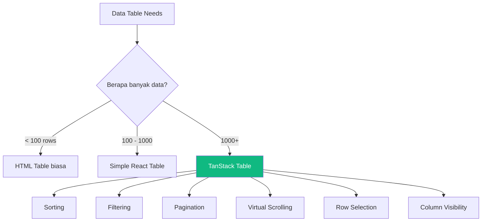
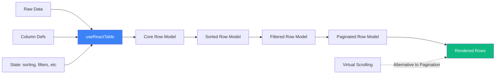

# 11 — TanStack Table: Data Table yang Beneran Production-Ready

## Cerita Dulu: Nightmare Data Table di Startup Fintech

Gue pernah kerja di startup fintech Jakarta — yang handle ribuan transaksi per hari. Suatu hari, PM dateng: "Eh, kita butuh tabel buat nampilin data 50.000 karyawan partner. Harus bisa sort, filter, pagination, select row buat bulk action."

Gue pikir, "Gampang, pake HTML table biasa aja." WRONG. Begitu data udah 5.000 row, browser nge-lag parah. Sorting? Butuh 3 detik. Filter? Freeze. Row selection? Chaos.

Terus senior gue bilang: "Pake TanStack Table." Dan hidup gue berubah.

TanStack Table itu **headless UI library** — dia ngasih kalian semua logic (sorting, filtering, pagination, dll) tapi GAK ngasih UI. Kalian yang decide mau pake Tailwind, shadcn, atau plain CSS. Freedom total.

---

## Kenapa TanStack Table?



**Keunggulan TanStack Table:**
- **Headless** — zero styling opinion, kalian full control
- **Framework agnostic** — React, Vue, Solid, Svelte
- **Type-safe** — TypeScript first class citizen
- **Performant** — handle 100K+ rows with virtual scrolling
- **Tiny bundle** — ~15KB gzipped

---

## Setup Project

```bash
npm create vite@latest tanstack-table-demo -- --template react-ts
cd tanstack-table-demo
npm install @tanstack/react-table @tanstack/react-virtual
npm install -D @faker-js/faker
```

---

## Step 1: Define Data Type & Generate Fake Data

```typescript
// src/types/employee.ts
export type Employee = {
  id: number;
  nama: string;
  email: string;
  departemen: 'Engineering' | 'Marketing' | 'Finance' | 'HR' | 'Operations';
  jabatan: string;
  gaji: number;
  tanggalMasuk: string;
  status: 'Aktif' | 'Cuti' | 'Resign';
  kota: string;
};
```

```typescript
// src/data/generateEmployees.ts
import { faker } from '@faker-js/faker/locale/id_ID';
import type { Employee } from '../types/employee';

const departemen = ['Engineering', 'Marketing', 'Finance', 'HR', 'Operations'] as const;
const status = ['Aktif', 'Cuti', 'Resign'] as const;
const kotaIndonesia = ['Jakarta', 'Bandung', 'Surabaya', 'Yogyakarta', 'Medan', 'Bali', 'Semarang', 'Makassar'];

export function generateEmployees(count: number): Employee[] {
  return Array.from({ length: count }, (_, i) => ({
    id: i + 1,
    nama: faker.person.fullName(),
    email: faker.internet.email(),
    departemen: departemen[Math.floor(Math.random() * departemen.length)],
    jabatan: faker.person.jobTitle(),
    gaji: Math.floor(Math.random() * 40_000_000) + 5_000_000, // 5jt - 45jt
    tanggalMasuk: faker.date.between({ from: '2018-01-01', to: '2024-12-31' }).toISOString().split('T')[0],
    status: status[Math.floor(Math.random() * status.length)],
    kota: kotaIndonesia[Math.floor(Math.random() * kotaIndonesia.length)],
  }));
}
```

---

## Step 2: Column Definitions

Column definition itu **blueprint** dari tabel kalian. Di sinilah kalian define: data apa yang ditampilin, gimana format-nya, bisa di-sort gak, dll.

```typescript
// src/columns/employeeColumns.tsx
import { createColumnHelper } from '@tanstack/react-table';
import type { Employee } from '../types/employee';

const columnHelper = createColumnHelper<Employee>();

export const employeeColumns = [
  // Column untuk checkbox selection
  columnHelper.display({
    id: 'select',
    header: ({ table }) => (
      <input
        type="checkbox"
        checked={table.getIsAllRowsSelected()}
        onChange={table.getToggleAllRowsSelectedHandler()}
      />
    ),
    cell: ({ row }) => (
      <input
        type="checkbox"
        checked={row.getIsSelected()}
        onChange={row.getToggleSelectedHandler()}
      />
    ),
    size: 40,
  }),

  columnHelper.accessor('id', {
    header: 'ID',
    size: 60,
  }),

  columnHelper.accessor('nama', {
    header: 'Nama Lengkap',
    cell: (info) => <span className="font-medium">{info.getValue()}</span>,
    size: 200,
  }),

  columnHelper.accessor('email', {
    header: 'Email',
    size: 250,
  }),

  columnHelper.accessor('departemen', {
    header: 'Departemen',
    filterFn: 'equals', // exact match untuk dropdown filter
    size: 140,
  }),

  columnHelper.accessor('jabatan', {
    header: 'Jabatan',
    size: 200,
  }),

  columnHelper.accessor('gaji', {
    header: 'Gaji (IDR)',
    cell: (info) =>
      new Intl.NumberFormat('id-ID', {
        style: 'currency',
        currency: 'IDR',
        maximumFractionDigits: 0,
      }).format(info.getValue()),
    size: 160,
  }),

  columnHelper.accessor('tanggalMasuk', {
    header: 'Tanggal Masuk',
    cell: (info) =>
      new Date(info.getValue()).toLocaleDateString('id-ID', {
        day: 'numeric',
        month: 'long',
        year: 'numeric',
      }),
    size: 160,
  }),

  columnHelper.accessor('status', {
    header: 'Status',
    cell: (info) => {
      const val = info.getValue();
      const color =
        val === 'Aktif' ? 'bg-green-100 text-green-800' :
        val === 'Cuti' ? 'bg-yellow-100 text-yellow-800' :
        'bg-red-100 text-red-800';
      return <span className={`px-2 py-1 rounded-full text-xs ${color}`}>{val}</span>;
    },
    filterFn: 'equals',
    size: 100,
  }),

  columnHelper.accessor('kota', {
    header: 'Kota',
    size: 120,
  }),
];
```

**Breakdown column types:**

| Type | Fungsi | Contoh |
|------|--------|--------|
| `accessor` | Kolom yang terhubung ke data | `nama`, `email`, `gaji` |
| `display` | Kolom tanpa data (UI only) | Checkbox, action buttons |
| `group` | Header group (merge columns) | "Info Pribadi" spanning nama + email |

---

## Step 3: Global Filter Component

```typescript
// src/components/GlobalFilter.tsx
import { useState, useEffect } from 'react';

type Props = {
  value: string;
  onChange: (value: string) => void;
  debounceMs?: number;
};

export function GlobalFilter({ value, onChange, debounceMs = 300 }: Props) {
  const [internal, setInternal] = useState(value);

  useEffect(() => {
    setInternal(value);
  }, [value]);

  useEffect(() => {
    const timeout = setTimeout(() => {
      onChange(internal);
    }, debounceMs);
    return () => clearTimeout(timeout);
  }, [internal, debounceMs, onChange]);

  return (
    <div className="flex items-center gap-2">
      <span>🔍</span>
      <input
        value={internal}
        onChange={(e) => setInternal(e.target.value)}
        placeholder="Cari nama, email, kota..."
        className="border rounded px-3 py-2 w-80"
      />
    </div>
  );
}
```

---

## Step 4: Column Filter (Dropdown)

```typescript
// src/components/ColumnFilter.tsx
import type { Column } from '@tanstack/react-table';

type Props<T> = {
  column: Column<T, unknown>;
  options: string[];
};

export function ColumnFilter<T>({ column, options }: Props<T>) {
  return (
    <select
      value={(column.getFilterValue() as string) ?? ''}
      onChange={(e) => column.setFilterValue(e.target.value || undefined)}
      className="border rounded px-2 py-1 text-sm"
    >
      <option value="">Semua</option>
      {options.map((opt) => (
        <option key={opt} value={opt}>{opt}</option>
      ))}
    </select>
  );
}
```

---

## Step 5: Column Visibility Toggle

```typescript
// src/components/ColumnVisibilityToggle.tsx
import type { Table } from '@tanstack/react-table';

type Props<T> = {
  table: Table<T>;
};

export function ColumnVisibilityToggle<T>({ table }: Props<T>) {
  return (
    <div className="flex flex-wrap gap-2 p-2 bg-gray-50 rounded">
      <span className="text-sm font-medium">Kolom:</span>
      {table.getAllLeafColumns().map((column) => {
        if (column.id === 'select') return null;
        return (
          <label key={column.id} className="flex items-center gap-1 text-sm">
            <input
              type="checkbox"
              checked={column.getIsVisible()}
              onChange={column.getToggleVisibilityHandler()}
            />
            {typeof column.columnDef.header === 'string'
              ? column.columnDef.header
              : column.id}
          </label>
        );
      })}
    </div>
  );
}
```

---

## Step 6: The Main Table (All Features Combined)

```typescript
// src/components/EmployeeTable.tsx
import { useMemo, useState } from 'react';
import {
  useReactTable,
  getCoreRowModel,
  getSortedRowModel,
  getFilteredRowModel,
  getPaginationRowModel,
  flexRender,
  type SortingState,
  type ColumnFiltersState,
  type VisibilityState,
  type RowSelectionState,
} from '@tanstack/react-table';
import { generateEmployees } from '../data/generateEmployees';
import { employeeColumns } from '../columns/employeeColumns';
import { GlobalFilter } from './GlobalFilter';
import { ColumnFilter } from './ColumnFilter';
import { ColumnVisibilityToggle } from './ColumnVisibilityToggle';

export function EmployeeTable() {
  // Generate 1000 employees (for client-side pagination demo)
  const data = useMemo(() => generateEmployees(1000), []);

  // State management
  const [sorting, setSorting] = useState<SortingState>([]);
  const [globalFilter, setGlobalFilter] = useState('');
  const [columnFilters, setColumnFilters] = useState<ColumnFiltersState>([]);
  const [columnVisibility, setColumnVisibility] = useState<VisibilityState>({});
  const [rowSelection, setRowSelection] = useState<RowSelectionState>({});

  const table = useReactTable({
    data,
    columns: employeeColumns,
    state: {
      sorting,
      globalFilter,
      columnFilters,
      columnVisibility,
      rowSelection,
    },
    onSortingChange: setSorting,
    onGlobalFilterChange: setGlobalFilter,
    onColumnFiltersChange: setColumnFilters,
    onColumnVisibilityChange: setColumnVisibility,
    onRowSelectionChange: setRowSelection,
    getCoreRowModel: getCoreRowModel(),
    getSortedRowModel: getSortedRowModel(),
    getFilteredRowModel: getFilteredRowModel(),
    getPaginationRowModel: getPaginationRowModel(),
    enableRowSelection: true,
  });

  return (
    <div className="p-4 space-y-4">
      <h1 className="text-2xl font-bold">📊 Data Karyawan</h1>

      {/* Toolbar */}
      <div className="flex flex-wrap items-center gap-4">
        <GlobalFilter value={globalFilter} onChange={setGlobalFilter} />

        <ColumnFilter
          column={table.getColumn('departemen')!}
          options={['Engineering', 'Marketing', 'Finance', 'HR', 'Operations']}
        />

        <ColumnFilter
          column={table.getColumn('status')!}
          options={['Aktif', 'Cuti', 'Resign']}
        />

        {Object.keys(rowSelection).length > 0 && (
          <span className="text-sm text-blue-600">
            {Object.keys(rowSelection).length} row dipilih
          </span>
        )}
      </div>

      {/* Column Visibility */}
      <ColumnVisibilityToggle table={table} />

      {/* Table */}
      <div className="overflow-x-auto border rounded-lg">
        <table className="w-full text-sm">
          <thead className="bg-gray-100">
            {table.getHeaderGroups().map((headerGroup) => (
              <tr key={headerGroup.id}>
                {headerGroup.headers.map((header) => (
                  <th
                    key={header.id}
                    onClick={header.column.getToggleSortingHandler()}
                    className="px-4 py-3 text-left cursor-pointer select-none hover:bg-gray-200"
                    style={{ width: header.getSize() }}
                  >
                    <div className="flex items-center gap-1">
                      {flexRender(header.column.columnDef.header, header.getContext())}
                      {{
                        asc: ' 🔼',
                        desc: ' 🔽',
                      }[header.column.getIsSorted() as string] ?? ''}
                    </div>
                  </th>
                ))}
              </tr>
            ))}
          </thead>
          <tbody>
            {table.getRowModel().rows.map((row) => (
              <tr
                key={row.id}
                className={`border-t hover:bg-blue-50 ${
                  row.getIsSelected() ? 'bg-blue-100' : ''
                }`}
              >
                {row.getVisibleCells().map((cell) => (
                  <td key={cell.id} className="px-4 py-2">
                    {flexRender(cell.column.columnDef.cell, cell.getContext())}
                  </td>
                ))}
              </tr>
            ))}
          </tbody>
        </table>
      </div>

      {/* Pagination */}
      <div className="flex items-center justify-between">
        <div className="flex items-center gap-2">
          <button
            onClick={() => table.setPageIndex(0)}
            disabled={!table.getCanPreviousPage()}
            className="px-3 py-1 border rounded disabled:opacity-50"
          >
            {'<<'}
          </button>
          <button
            onClick={() => table.previousPage()}
            disabled={!table.getCanPreviousPage()}
            className="px-3 py-1 border rounded disabled:opacity-50"
          >
            {'<'}
          </button>
          <button
            onClick={() => table.nextPage()}
            disabled={!table.getCanNextPage()}
            className="px-3 py-1 border rounded disabled:opacity-50"
          >
            {'>'}
          </button>
          <button
            onClick={() => table.setPageIndex(table.getPageCount() - 1)}
            disabled={!table.getCanNextPage()}
            className="px-3 py-1 border rounded disabled:opacity-50"
          >
            {'>>'}
          </button>
        </div>

        <span className="text-sm">
          Halaman {table.getState().pagination.pageIndex + 1} dari{' '}
          {table.getPageCount()} ({table.getFilteredRowModel().rows.length} data)
        </span>

        <select
          value={table.getState().pagination.pageSize}
          onChange={(e) => table.setPageSize(Number(e.target.value))}
          className="border rounded px-2 py-1"
        >
          {[10, 25, 50, 100].map((size) => (
            <option key={size} value={size}>
              Tampilkan {size}
            </option>
          ))}
        </select>
      </div>
    </div>
  );
}
```

---

## Step 7: Server-Side Pagination

Untuk data yang BANYAK banget, kalian gak mau load semua ke client. Server-side pagination cuma fetch data per page.

```typescript
// src/hooks/useServerPagination.ts
import { useState, useEffect } from 'react';
import type { PaginationState } from '@tanstack/react-table';

type ServerResponse<T> = {
  data: T[];
  totalRows: number;
  pageCount: number;
};

export function useServerPagination<T>(endpoint: string) {
  const [pagination, setPagination] = useState<PaginationState>({
    pageIndex: 0,
    pageSize: 10,
  });
  const [result, setResult] = useState<ServerResponse<T>>({
    data: [],
    totalRows: 0,
    pageCount: 0,
  });
  const [loading, setLoading] = useState(false);

  useEffect(() => {
    const fetchData = async () => {
      setLoading(true);
      try {
        const res = await fetch(
          `${endpoint}?page=${pagination.pageIndex}&size=${pagination.pageSize}`
        );
        const json = await res.json();
        setResult(json);
      } catch (err) {
        console.error('Fetch error:', err);
      } finally {
        setLoading(false);
      }
    };
    fetchData();
  }, [endpoint, pagination.pageIndex, pagination.pageSize]);

  return { ...result, pagination, setPagination, loading };
}

// Usage in table:
// const table = useReactTable({
//   data: result.data,
//   pageCount: result.pageCount,
//   state: { pagination },
//   onPaginationChange: setPagination,
//   manualPagination: true, // <-- KEY: tells TanStack "I handle pagination"
//   getCoreRowModel: getCoreRowModel(),
// });
```

---

## Step 8: Virtual Scrolling untuk 10K+ Rows

Ini game changer. Daripada render 10.000 DOM element, virtual scrolling cuma render yang **keliatan di viewport** (~20-30 rows).

```typescript
// src/components/VirtualTable.tsx
import { useMemo, useRef } from 'react';
import {
  useReactTable,
  getCoreRowModel,
  getSortedRowModel,
  flexRender,
  type SortingState,
} from '@tanstack/react-table';
import { useVirtualizer } from '@tanstack/react-virtual';
import { useState } from 'react';
import { generateEmployees } from '../data/generateEmployees';
import { employeeColumns } from '../columns/employeeColumns';

export function VirtualTable() {
  // 10.000 rows — no sweat!
  const data = useMemo(() => generateEmployees(10_000), []);
  const [sorting, setSorting] = useState<SortingState>([]);

  const table = useReactTable({
    data,
    columns: employeeColumns,
    state: { sorting },
    onSortingChange: setSorting,
    getCoreRowModel: getCoreRowModel(),
    getSortedRowModel: getSortedRowModel(),
  });

  const { rows } = table.getRowModel();

  const parentRef = useRef<HTMLDivElement>(null);

  const virtualizer = useVirtualizer({
    count: rows.length,
    getScrollElement: () => parentRef.current,
    estimateSize: () => 48, // estimated row height in px
    overscan: 10, // render 10 extra rows above/below viewport
  });

  return (
    <div className="p-4">
      <h1 className="text-2xl font-bold mb-4">
        🚀 Virtual Table — {data.length.toLocaleString('id-ID')} rows
      </h1>

      <div
        ref={parentRef}
        className="overflow-auto border rounded-lg"
        style={{ height: '600px' }}
      >
        <table className="w-full text-sm">
          <thead className="bg-gray-100 sticky top-0 z-10">
            {table.getHeaderGroups().map((headerGroup) => (
              <tr key={headerGroup.id}>
                {headerGroup.headers.map((header) => (
                  <th
                    key={header.id}
                    onClick={header.column.getToggleSortingHandler()}
                    className="px-4 py-3 text-left cursor-pointer"
                  >
                    {flexRender(header.column.columnDef.header, header.getContext())}
                    {{
                      asc: ' 🔼',
                      desc: ' 🔽',
                    }[header.column.getIsSorted() as string] ?? ''}
                  </th>
                ))}
              </tr>
            ))}
          </thead>
          <tbody>
            {/* Spacer for virtual scroll positioning */}
            <tr>
              <td
                colSpan={table.getVisibleLeafColumns().length}
                style={{ height: `${virtualizer.getTotalSize()}px`, padding: 0 }}
              >
                <div style={{ position: 'relative', width: '100%' }}>
                  {virtualizer.getVirtualItems().map((virtualRow) => {
                    const row = rows[virtualRow.index];
                    return (
                      <div
                        key={row.id}
                        className="flex border-t hover:bg-blue-50"
                        style={{
                          position: 'absolute',
                          top: 0,
                          left: 0,
                          width: '100%',
                          height: `${virtualRow.size}px`,
                          transform: `translateY(${virtualRow.start}px)`,
                        }}
                      >
                        {row.getVisibleCells().map((cell) => (
                          <div
                            key={cell.id}
                            className="px-4 py-2 flex items-center"
                            style={{ width: cell.column.getSize() }}
                          >
                            {flexRender(cell.column.columnDef.cell, cell.getContext())}
                          </div>
                        ))}
                      </div>
                    );
                  })}
                </div>
              </td>
            </tr>
          </tbody>
        </table>
      </div>

      <p className="mt-2 text-sm text-gray-500">
        Rendered rows: {virtualizer.getVirtualItems().length} / {rows.length}
      </p>
    </div>
  );
}
```

---

## Step 9: Wire It All Together

```typescript
// src/App.tsx
import { useState } from 'react';
import { EmployeeTable } from './components/EmployeeTable';
import { VirtualTable } from './components/VirtualTable';

function App() {
  const [mode, setMode] = useState<'paginated' | 'virtual'>('paginated');

  return (
    <div className="min-h-screen bg-white">
      <div className="p-4 flex gap-4">
        <button
          onClick={() => setMode('paginated')}
          className={`px-4 py-2 rounded ${
            mode === 'paginated' ? 'bg-blue-600 text-white' : 'bg-gray-200'
          }`}
        >
          📄 Paginated (1K rows)
        </button>
        <button
          onClick={() => setMode('virtual')}
          className={`px-4 py-2 rounded ${
            mode === 'virtual' ? 'bg-blue-600 text-white' : 'bg-gray-200'
          }`}
        >
          🚀 Virtual (10K rows)
        </button>
      </div>

      {mode === 'paginated' ? <EmployeeTable /> : <VirtualTable />}
    </div>
  );
}

export default App;
```

---

## TanStack Table Architecture



---

## Cheat Sheet: TanStack Table Features

| Feature | Hook/Option | Key Concept |
|---------|-------------|-------------|
| Sorting | `getSortedRowModel()` | Multi-column sort with Shift+Click |
| Global Filter | `getFilteredRowModel()` + `globalFilter` | Searches all columns |
| Column Filter | `columnFilters` state | Per-column, supports custom `filterFn` |
| Pagination | `getPaginationRowModel()` | Client-side auto-slicing |
| Server Pagination | `manualPagination: true` | You fetch, TanStack displays |
| Row Selection | `enableRowSelection: true` | Checkbox or click-based |
| Column Visibility | `columnVisibility` state | Toggle columns on/off |
| Virtual Scroll | `@tanstack/react-virtual` | Only render visible rows |

---

## Common Mistakes

1. **Lupa `useMemo` untuk data** — Tanpa memo, data re-creates tiap render = infinite loop sorting
2. **Gak set `filterFn`** — Default filter pake `includesString`, kalau butuh exact match set `'equals'`
3. **Mix pagination + virtual scroll** — Pilih salah satu! Jangan dua-duanya
4. **Forget `manualPagination` untuk server-side** — TanStack bakal try slice data yang udah sliced

---

## Exercises

1. **Tambah column "Aksi"** — Button edit & delete per row
2. **Export to CSV** — Ambil `table.getFilteredRowModel().rows` dan convert ke CSV
3. **Sticky first column** — Biar kolom nama tetep keliatan pas scroll horizontal
4. **Custom sort** — Sort gaji descending by default
5. **Multi-select dropdown filter** — Filter multiple departemen sekaligus

---

Next Part -> [12-tanstack-form.md](https://github.com/Ethereum-Jakarta/phase-2-week3-frontend-advance/blob/main/study-material/12-tanstack-form.md)
