# 12 — TanStack Form: Form Management yang Gak Bikin Pusing

## Cerita Dulu: Form Registration dari Neraka

Tahun lalu gue diminta bikin form registrasi event blockchain di Jakarta. Kedengerannya simple kan? Nama, email, nomor HP, done.

Tapi requirement-nya makin gila:
- Multi-step (3 halaman: data diri, data profesional, konfirmasi)
- Validasi async (cek email udah terdaftar belum ke API)
- Dynamic fields (bisa tambah "pengalaman kerja" unlimited)
- Real-time validation (gak nunggu submit baru keliatan error)

Gue pake `useState` biasa. 200 baris state management, 150 baris validation logic, bugs everywhere. Error message muncul di tempat yang salah. Submit button disabled pas gak seharusnya.

Terus gue coba TanStack Form. **Satu hook, semua kelar.**

---

## TanStack Form vs The Others

```mermaid
graph TD
    A[Form Library Options] --> B[React Hook Form]
    A --> C[Formik]
    A --> D[TanStack Form]
    
    B --> B1[✅ Mature ecosystem]
    B --> B2[✅ Great with Zod]
    B --> B3[❌ Uncontrolled by default]
    
    C --> C1[❌ Heavy re-renders]
    C --> C2[❌ Declining maintenance]
    C --> C3[✅ Simple API]
    
    D --> D1[✅ Type-safe dari lahir]
    D --> D2[✅ Framework agnostic]
    D --> D3[✅ Built-in async validation]
    D --> D4[✅ Field arrays native]
    
    style D fill:#10b981,color:#fff
```



| Feature | react-hook-form | TanStack Form | Formik |
|---------|----------------|---------------|--------|
| Bundle Size | ~9KB | ~12KB | ~44KB |
| TypeScript | Good | Excellent | OK |
| Async Validation | Via resolver | Built-in | Manual |
| Field Arrays | `useFieldArray` | Native | Via FieldArray |
| Framework | React only | React/Vue/Solid/Svelte | React only |
| Re-renders | Minimal (uncontrolled) | Minimal (signal-like) | Heavy |
| Learning Curve | Medium | Medium | Easy |

**Kapan pake apa?**
- **react-hook-form + zod** → Kalau project udah pake, ecosystem-nya mature
- **TanStack Form** → New project, butuh type-safety max, atau multi-framework
- **Formik** → Legacy project, gak recommend buat project baru

---

## Setup

```bash
npm create vite@latest tanstack-form-demo -- --template react-ts
cd tanstack-form-demo
npm install @tanstack/react-form @tanstack/zod-form-adapter zod
npm install -D tailwindcss @tailwindcss/vite
```

---

## Step 1: Basic Form — Understand the Core

Sebelum bikin yang complex, pahami dulu basic-nya:

```typescript
// src/components/BasicForm.tsx
import { useForm } from '@tanstack/react-form';

export function BasicForm() {
  const form = useForm({
    defaultValues: {
      nama: '',
      email: '',
    },
    onSubmit: async ({ value }) => {
      // value udah fully typed!
      console.log('Submit:', value);
      alert(`Halo ${value.nama}! Email: ${value.email}`);
    },
  });

  return (
    <form
      onSubmit={(e) => {
        e.preventDefault();
        e.stopPropagation();
        form.handleSubmit();
      }}
      className="space-y-4 max-w-md mx-auto p-6"
    >
      <div>
        <form.Field
          name="nama"
          validators={{
            onChange: ({ value }) =>
              value.length < 3 ? 'Nama minimal 3 karakter' : undefined,
          }}
        >
          {(field) => (
            <div>
              <label className="block text-sm font-medium">Nama</label>
              <input
                value={field.state.value}
                onBlur={field.handleBlur}
                onChange={(e) => field.handleChange(e.target.value)}
                className="border rounded px-3 py-2 w-full"
              />
              {field.state.meta.errors.length > 0 && (
                <p className="text-red-500 text-sm mt-1">
                  {field.state.meta.errors.join(', ')}
                </p>
              )}
            </div>
          )}
        </form.Field>
      </div>

      <div>
        <form.Field
          name="email"
          validators={{
            onChange: ({ value }) => {
              if (!value) return 'Email wajib diisi';
              if (!/^[^\s@]+@[^\s@]+\.[^\s@]+$/.test(value))
                return 'Format email gak valid';
              return undefined;
            },
          }}
        >
          {(field) => (
            <div>
              <label className="block text-sm font-medium">Email</label>
              <input
                type="email"
                value={field.state.value}
                onBlur={field.handleBlur}
                onChange={(e) => field.handleChange(e.target.value)}
                className="border rounded px-3 py-2 w-full"
              />
              {field.state.meta.errors.length > 0 && (
                <p className="text-red-500 text-sm mt-1">
                  {field.state.meta.errors.join(', ')}
                </p>
              )}
            </div>
          )}
        </form.Field>
      </div>

      <form.Subscribe selector={(state) => [state.canSubmit, state.isSubmitting]}>
        {([canSubmit, isSubmitting]) => (
          <button
            type="submit"
            disabled={!canSubmit}
            className="bg-blue-600 text-white px-4 py-2 rounded disabled:opacity-50"
          >
            {isSubmitting ? 'Submitting...' : 'Submit'}
          </button>
        )}
      </form.Subscribe>
    </form>
  );
}
```

**Key concepts:**
- `useForm` — bikin form instance, define default values & submit handler
- `form.Field` — render prop pattern, tiap field punya state sendiri
- `validators` — object dengan `onChange`, `onBlur`, `onSubmit`, `onChangeAsync`
- `form.Subscribe` — subscribe ke form state tanpa re-render seluruh form

---

## Step 2: Async Validation

Ini yang bikin TanStack Form shine. Mau cek email udah terdaftar? Gampang:

```typescript
// src/utils/checkEmail.ts
// Simulasi API call
export async function checkEmailExists(email: string): Promise<boolean> {
  await new Promise((r) => setTimeout(r, 800)); // simulate latency
  const existing = ['budi@gmail.com', 'siti@yahoo.com', 'admin@ethjkt.id'];
  return existing.includes(email.toLowerCase());
}
```

```typescript
// Di dalam form.Field untuk email:
<form.Field
  name="email"
  validators={{
    onChange: ({ value }) => {
      if (!value) return 'Email wajib diisi';
      if (!/^[^\s@]+@[^\s@]+\.[^\s@]+$/.test(value))
        return 'Format email gak valid';
      return undefined;
    },
    onChangeAsyncDebounceMs: 500, // debounce 500ms sebelum async validation
    onChangeAsync: async ({ value }) => {
      const exists = await checkEmailExists(value);
      return exists ? 'Email udah terdaftar!' : undefined;
    },
  }}
>
  {(field) => (
    <div>
      <label className="block text-sm font-medium">Email</label>
      <input
        type="email"
        value={field.state.value}
        onBlur={field.handleBlur}
        onChange={(e) => field.handleChange(e.target.value)}
        className="border rounded px-3 py-2 w-full"
      />
      {field.state.meta.isValidating && (
        <p className="text-gray-500 text-sm mt-1">⏳ Checking email...</p>
      )}
      {field.state.meta.errors.length > 0 && (
        <p className="text-red-500 text-sm mt-1">
          {field.state.meta.errors.join(', ')}
        </p>
      )}
    </div>
  )}
</form.Field>
```

---

## Step 3: Field Arrays (Dynamic Fields)

Bayangin user bisa nambahin pengalaman kerja unlimited. Ini pake field arrays:

```typescript
// src/components/FieldArrayDemo.tsx
import { useForm } from '@tanstack/react-form';

type FormValues = {
  nama: string;
  pengalaman: Array<{
    perusahaan: string;
    posisi: string;
    tahun: number;
  }>;
};

export function FieldArrayDemo() {
  const form = useForm<FormValues>({
    defaultValues: {
      nama: '',
      pengalaman: [{ perusahaan: '', posisi: '', tahun: 2024 }],
    },
    onSubmit: async ({ value }) => {
      console.log('Submitted:', value);
      alert(JSON.stringify(value, null, 2));
    },
  });

  return (
    <form
      onSubmit={(e) => {
        e.preventDefault();
        form.handleSubmit();
      }}
      className="max-w-2xl mx-auto p-6 space-y-6"
    >
      <form.Field name="nama">
        {(field) => (
          <div>
            <label className="block font-medium">Nama Lengkap</label>
            <input
              value={field.state.value}
              onChange={(e) => field.handleChange(e.target.value)}
              className="border rounded px-3 py-2 w-full"
            />
          </div>
        )}
      </form.Field>

      <div>
        <h3 className="font-medium text-lg mb-2">💼 Pengalaman Kerja</h3>

        <form.Field name="pengalaman" mode="array">
          {(field) => (
            <div className="space-y-4">
              {field.state.value.map((_, i) => (
                <div key={i} className="border rounded p-4 bg-gray-50 space-y-3">
                  <div className="flex justify-between items-center">
                    <span className="font-medium">Pengalaman #{i + 1}</span>
                    {field.state.value.length > 1 && (
                      <button
                        type="button"
                        onClick={() => field.removeValue(i)}
                        className="text-red-500 text-sm hover:underline"
                      >
                        ❌ Hapus
                      </button>
                    )}
                  </div>

                  <form.Field name={`pengalaman[${i}].perusahaan`}>
                    {(subField) => (
                      <div>
                        <label className="block text-sm">Perusahaan</label>
                        <input
                          value={subField.state.value}
                          onChange={(e) => subField.handleChange(e.target.value)}
                          className="border rounded px-3 py-2 w-full"
                          placeholder="PT. Tokopedia"
                        />
                      </div>
                    )}
                  </form.Field>

                  <form.Field name={`pengalaman[${i}].posisi`}>
                    {(subField) => (
                      <div>
                        <label className="block text-sm">Posisi</label>
                        <input
                          value={subField.state.value}
                          onChange={(e) => subField.handleChange(e.target.value)}
                          className="border rounded px-3 py-2 w-full"
                          placeholder="Frontend Engineer"
                        />
                      </div>
                    )}
                  </form.Field>

                  <form.Field name={`pengalaman[${i}].tahun`}>
                    {(subField) => (
                      <div>
                        <label className="block text-sm">Tahun</label>
                        <input
                          type="number"
                          value={subField.state.value}
                          onChange={(e) => subField.handleChange(Number(e.target.value))}
                          className="border rounded px-3 py-2 w-32"
                        />
                      </div>
                    )}
                  </form.Field>
                </div>
              ))}

              <button
                type="button"
                onClick={() =>
                  field.pushValue({ perusahaan: '', posisi: '', tahun: 2024 })
                }
                className="text-blue-600 text-sm hover:underline"
              >
                ➕ Tambah Pengalaman
              </button>
            </div>
          )}
        </form.Field>
      </div>

      <button
        type="submit"
        className="bg-blue-600 text-white px-6 py-2 rounded"
      >
        Submit
      </button>
    </form>
  );
}
```

---

## Step 4: Multi-Step Registration Form (The Big Build)

Sekarang kita gabungin semuanya jadi form registrasi multi-step yang production-ready:

```typescript
// src/components/MultiStepForm.tsx
import { useForm } from '@tanstack/react-form';
import { useState } from 'react';
import { checkEmailExists } from '../utils/checkEmail';

type RegistrationForm = {
  // Step 1: Data Diri
  namaLengkap: string;
  email: string;
  noHP: string;
  tanggalLahir: string;
  
  // Step 2: Data Profesional
  pekerjaan: string;
  perusahaan: string;
  pengalamanBlockchain: 'pemula' | 'menengah' | 'mahir';
  skills: Array<{ nama: string; level: number }>;
  
  // Step 3: Preferensi
  topikMinat: string[];
  motivasi: string;
  setujuSyarat: boolean;
};

const STEPS = ['Data Diri', 'Data Profesional', 'Konfirmasi'] as const;

export function MultiStepForm() {
  const [step, setStep] = useState(0);

  const form = useForm<RegistrationForm>({
    defaultValues: {
      namaLengkap: '',
      email: '',
      noHP: '',
      tanggalLahir: '',
      pekerjaan: '',
      perusahaan: '',
      pengalamanBlockchain: 'pemula',
      skills: [{ nama: '', level: 1 }],
      topikMinat: [],
      motivasi: '',
      setujuSyarat: false,
    },
    onSubmit: async ({ value }) => {
      // Simulate API call
      await new Promise((r) => setTimeout(r, 1000));
      console.log('Registration complete:', value);
      alert('🎉 Registrasi berhasil! Cek email kamu.');
    },
  });

  const nextStep = async () => {
    // Validate current step fields before proceeding
    const isValid = await validateStep(step);
    if (isValid) setStep((s) => Math.min(s + 1, 2));
  };

  const prevStep = () => setStep((s) => Math.max(s - 1, 0));

  const validateStep = async (currentStep: number): Promise<boolean> => {
    // TanStack Form validates on change, so we check meta.errors
    // For simplicity, we do a basic check here
    if (currentStep === 0) {
      const values = form.state.values;
      if (!values.namaLengkap || !values.email || !values.noHP) {
        alert('Lengkapi semua field dulu!');
        return false;
      }
    }
    return true;
  };

  return (
    <div className="max-w-2xl mx-auto p-6">
      <h1 className="text-2xl font-bold mb-6">📝 Registrasi ETHJKT Workshop</h1>

      {/* Step Indicator */}
      <div className="flex items-center mb-8">
        {STEPS.map((label, i) => (
          <div key={label} className="flex items-center">
            <div
              className={`w-8 h-8 rounded-full flex items-center justify-center text-sm font-bold
                ${i <= step ? 'bg-blue-600 text-white' : 'bg-gray-200 text-gray-500'}`}
            >
              {i + 1}
            </div>
            <span className={`ml-2 text-sm ${i <= step ? 'text-blue-600 font-medium' : 'text-gray-400'}`}>
              {label}
            </span>
            {i < STEPS.length - 1 && (
              <div className={`w-16 h-0.5 mx-3 ${i < step ? 'bg-blue-600' : 'bg-gray-200'}`} />
            )}
          </div>
        ))}
      </div>

      <form
        onSubmit={(e) => {
          e.preventDefault();
          form.handleSubmit();
        }}
      >
        {/* Step 1: Data Diri */}
        {step === 0 && (
          <div className="space-y-4">
            <form.Field
              name="namaLengkap"
              validators={{
                onChange: ({ value }) =>
                  value.length < 3 ? 'Minimal 3 karakter' : undefined,
              }}
            >
              {(field) => (
                <div>
                  <label className="block font-medium">Nama Lengkap *</label>
                  <input
                    value={field.state.value}
                    onChange={(e) => field.handleChange(e.target.value)}
                    onBlur={field.handleBlur}
                    className="border rounded px-3 py-2 w-full"
                    placeholder="Budi Santoso"
                  />
                  {field.state.meta.isTouched && field.state.meta.errors.length > 0 && (
                    <p className="text-red-500 text-sm">{field.state.meta.errors[0]}</p>
                  )}
                </div>
              )}
            </form.Field>

            <form.Field
              name="email"
              validators={{
                onChange: ({ value }) => {
                  if (!value) return 'Email wajib diisi';
                  if (!/^[^\s@]+@[^\s@]+\.[^\s@]+$/.test(value)) return 'Format email salah';
                  return undefined;
                },
                onChangeAsyncDebounceMs: 500,
                onChangeAsync: async ({ value }) => {
                  const exists = await checkEmailExists(value);
                  return exists ? 'Email udah terdaftar' : undefined;
                },
              }}
            >
              {(field) => (
                <div>
                  <label className="block font-medium">Email *</label>
                  <input
                    type="email"
                    value={field.state.value}
                    onChange={(e) => field.handleChange(e.target.value)}
                    onBlur={field.handleBlur}
                    className="border rounded px-3 py-2 w-full"
                    placeholder="budi@gmail.com"
                  />
                  {field.state.meta.isValidating && (
                    <p className="text-gray-400 text-sm">⏳ Mengecek email...</p>
                  )}
                  {field.state.meta.isTouched && field.state.meta.errors.length > 0 && (
                    <p className="text-red-500 text-sm">{field.state.meta.errors[0]}</p>
                  )}
                </div>
              )}
            </form.Field>

            <form.Field
              name="noHP"
              validators={{
                onChange: ({ value }) => {
                  if (!value) return 'Nomor HP wajib diisi';
                  if (!/^(\+62|08)\d{8,12}$/.test(value)) return 'Format: 08xx atau +62xx';
                  return undefined;
                },
              }}
            >
              {(field) => (
                <div>
                  <label className="block font-medium">No. HP *</label>
                  <input
                    value={field.state.value}
                    onChange={(e) => field.handleChange(e.target.value)}
                    onBlur={field.handleBlur}
                    className="border rounded px-3 py-2 w-full"
                    placeholder="081234567890"
                  />
                  {field.state.meta.isTouched && field.state.meta.errors.length > 0 && (
                    <p className="text-red-500 text-sm">{field.state.meta.errors[0]}</p>
                  )}
                </div>
              )}
            </form.Field>

            <form.Field name="tanggalLahir">
              {(field) => (
                <div>
                  <label className="block font-medium">Tanggal Lahir</label>
                  <input
                    type="date"
                    value={field.state.value}
                    onChange={(e) => field.handleChange(e.target.value)}
                    className="border rounded px-3 py-2 w-full"
                  />
                </div>
              )}
            </form.Field>
          </div>
        )}

        {/* Step 2: Data Profesional */}
        {step === 1 && (
          <div className="space-y-4">
            <form.Field name="pekerjaan">
              {(field) => (
                <div>
                  <label className="block font-medium">Pekerjaan</label>
                  <input
                    value={field.state.value}
                    onChange={(e) => field.handleChange(e.target.value)}
                    className="border rounded px-3 py-2 w-full"
                    placeholder="Frontend Developer"
                  />
                </div>
              )}
            </form.Field>

            <form.Field name="perusahaan">
              {(field) => (
                <div>
                  <label className="block font-medium">Perusahaan</label>
                  <input
                    value={field.state.value}
                    onChange={(e) => field.handleChange(e.target.value)}
                    className="border rounded px-3 py-2 w-full"
                    placeholder="PT. Gojek Indonesia"
                  />
                </div>
              )}
            </form.Field>

            <form.Field name="pengalamanBlockchain">
              {(field) => (
                <div>
                  <label className="block font-medium">Level Blockchain</label>
                  <select
                    value={field.state.value}
                    onChange={(e) => field.handleChange(e.target.value as any)}
                    className="border rounded px-3 py-2 w-full"
                  >
                    <option value="pemula">🌱 Pemula — baru denger</option>
                    <option value="menengah">🌿 Menengah — pernah deploy contract</option>
                    <option value="mahir">🌳 Mahir — udah bikin dApp</option>
                  </select>
                </div>
              )}
            </form.Field>

            {/* Dynamic Skills Field Array */}
            <div>
              <h3 className="font-medium mb-2">🛠 Skills</h3>
              <form.Field name="skills" mode="array">
                {(field) => (
                  <div className="space-y-3">
                    {field.state.value.map((_, i) => (
                      <div key={i} className="flex gap-3 items-end">
                        <form.Field name={`skills[${i}].nama`}>
                          {(sub) => (
                            <div className="flex-1">
                              <label className="block text-sm">Skill</label>
                              <input
                                value={sub.state.value}
                                onChange={(e) => sub.handleChange(e.target.value)}
                                className="border rounded px-3 py-2 w-full"
                                placeholder="React, Solidity, etc"
                              />
                            </div>
                          )}
                        </form.Field>

                        <form.Field name={`skills[${i}].level`}>
                          {(sub) => (
                            <div className="w-32">
                              <label className="block text-sm">Level (1-5)</label>
                              <input
                                type="number"
                                min={1}
                                max={5}
                                value={sub.state.value}
                                onChange={(e) => sub.handleChange(Number(e.target.value))}
                                className="border rounded px-3 py-2 w-full"
                              />
                            </div>
                          )}
                        </form.Field>

                        {field.state.value.length > 1 && (
                          <button
                            type="button"
                            onClick={() => field.removeValue(i)}
                            className="text-red-500 pb-2"
                          >
                            ❌
                          </button>
                        )}
                      </div>
                    ))}

                    <button
                      type="button"
                      onClick={() => field.pushValue({ nama: '', level: 1 })}
                      className="text-blue-600 text-sm"
                    >
                      ➕ Tambah Skill
                    </button>
                  </div>
                )}
              </form.Field>
            </div>
          </div>
        )}

        {/* Step 3: Konfirmasi */}
        {step === 2 && (
          <div className="space-y-4">
            <form.Field name="motivasi"
              validators={{
                onChange: ({ value }) =>
                  value.length < 20 ? 'Ceritain minimal 20 karakter dong' : undefined,
              }}
            >
              {(field) => (
                <div>
                  <label className="block font-medium">Motivasi ikut ETHJKT</label>
                  <textarea
                    value={field.state.value}
                    onChange={(e) => field.handleChange(e.target.value)}
                    onBlur={field.handleBlur}
                    rows={4}
                    className="border rounded px-3 py-2 w-full"
                    placeholder="Gue mau belajar blockchain karena..."
                  />
                  {field.state.meta.isTouched && field.state.meta.errors.length > 0 && (
                    <p className="text-red-500 text-sm">{field.state.meta.errors[0]}</p>
                  )}
                </div>
              )}
            </form.Field>

            <form.Field
              name="setujuSyarat"
              validators={{
                onChange: ({ value }) =>
                  !value ? 'Harus setuju syarat & ketentuan' : undefined,
              }}
            >
              {(field) => (
                <div>
                  <label className="flex items-center gap-2">
                    <input
                      type="checkbox"
                      checked={field.state.value}
                      onChange={(e) => field.handleChange(e.target.checked)}
                    />
                    <span>Saya setuju dengan syarat & ketentuan ETHJKT</span>
                  </label>
                  {field.state.meta.errors.length > 0 && (
                    <p className="text-red-500 text-sm">{field.state.meta.errors[0]}</p>
                  )}
                </div>
              )}
            </form.Field>

            {/* Summary */}
            <form.Subscribe selector={(state) => state.values}>
              {(values) => (
                <div className="bg-gray-50 rounded p-4 space-y-2">
                  <h3 className="font-bold">📋 Ringkasan</h3>
                  <p><strong>Nama:</strong> {values.namaLengkap}</p>
                  <p><strong>Email:</strong> {values.email}</p>
                  <p><strong>HP:</strong> {values.noHP}</p>
                  <p><strong>Pekerjaan:</strong> {values.pekerjaan} di {values.perusahaan}</p>
                  <p><strong>Level:</strong> {values.pengalamanBlockchain}</p>
                  <p><strong>Skills:</strong> {values.skills.map(s => `${s.nama} (${s.level}/5)`).join(', ')}</p>
                </div>
              )}
            </form.Subscribe>
          </div>
        )}

        {/* Navigation Buttons */}
        <div className="flex justify-between mt-8">
          {step > 0 && (
            <button
              type="button"
              onClick={prevStep}
              className="px-6 py-2 border rounded hover:bg-gray-50"
            >
              ← Sebelumnya
            </button>
          )}
          <div className="ml-auto">
            {step < 2 ? (
              <button
                type="button"
                onClick={nextStep}
                className="bg-blue-600 text-white px-6 py-2 rounded"
              >
                Selanjutnya →
              </button>
            ) : (
              <form.Subscribe selector={(state) => [state.canSubmit, state.isSubmitting]}>
                {([canSubmit, isSubmitting]) => (
                  <button
                    type="submit"
                    disabled={!canSubmit}
                    className="bg-green-600 text-white px-6 py-2 rounded disabled:opacity-50"
                  >
                    {isSubmitting ? '⏳ Mendaftar...' : '🚀 Daftar Sekarang!'}
                  </button>
                )}
              </form.Subscribe>
            )}
          </div>
        </div>
      </form>
    </div>
  );
}
```

---

## Step 5: Integrasi dengan Zod (Schema Validation)

Kalau kalian udah punya Zod schema, bisa plug langsung:

```typescript
// src/schemas/registration.ts
import { z } from 'zod';

export const registrationSchema = z.object({
  namaLengkap: z.string().min(3, 'Minimal 3 karakter'),
  email: z.string().email('Email gak valid'),
  noHP: z.string().regex(/^(\+62|08)\d{8,12}$/, 'Format: 08xx atau +62xx'),
  pekerjaan: z.string().optional(),
  setujuSyarat: z.literal(true, {
    errorMap: () => ({ message: 'Harus setuju!' }),
  }),
});

export type RegistrationValues = z.infer<typeof registrationSchema>;
```

```typescript
// Pake Zod adapter di form:
import { zodValidator } from '@tanstack/zod-form-adapter';

const form = useForm({
  defaultValues: { ... },
  validatorAdapter: zodValidator(),
  onSubmit: async ({ value }) => { ... },
});

// Di field, bisa pake zod schema:
<form.Field
  name="email"
  validators={{
    onChange: z.string().email('Email gak valid'),
  }}
>
  {/* ... */}
</form.Field>
```

---

## TanStack Form Data Flow


---

## Validation Timing Cheat Sheet

| Timing | Kapan jalan | Use case |
|--------|-------------|----------|
| `onChange` | Setiap keystroke | Format validation (email, phone) |
| `onBlur` | Pindah field | Hemat resource, less aggressive |
| `onSubmit` | Klik submit | Final check |
| `onChangeAsync` | Setelah debounce | API call (cek email exists) |
| `onBlurAsync` | Blur + debounce | Heavy validation on blur |

---

## Comparison: react-hook-form + zod vs TanStack Form

```typescript
// ===== react-hook-form + zod =====
import { useForm } from 'react-hook-form';
import { zodResolver } from '@hookform/resolvers/zod';
import { z } from 'zod';

const schema = z.object({ nama: z.string().min(3) });

function RHFForm() {
  const { register, handleSubmit, formState: { errors } } = useForm({
    resolver: zodResolver(schema),
  });
  
  return (
    <form onSubmit={handleSubmit((data) => console.log(data))}>
      <input {...register('nama')} />
      {errors.nama && <span>{errors.nama.message}</span>}
      <button type="submit">Submit</button>
    </form>
  );
}

// ===== TanStack Form =====
import { useForm } from '@tanstack/react-form';

function TSForm() {
  const form = useForm({
    defaultValues: { nama: '' },
    onSubmit: async ({ value }) => console.log(value),
  });

  return (
    <form onSubmit={(e) => { e.preventDefault(); form.handleSubmit(); }}>
      <form.Field
        name="nama"
        validators={{ onChange: ({ value }) => value.length < 3 ? 'Min 3' : undefined }}
      >
        {(field) => (
          <>
            <input value={field.state.value} onChange={(e) => field.handleChange(e.target.value)} />
            {field.state.meta.errors[0] && <span>{field.state.meta.errors[0]}</span>}
          </>
        )}
      </form.Field>
      <button type="submit">Submit</button>
    </form>
  );
}
```

**Verdict:**
- RHF lebih concise buat form simple (register pattern powerful)
- TanStack Form lebih explicit, type-safe, dan flexible buat complex forms
- Async validation di TanStack Form jauh lebih clean

---

## Exercises

1. **Tambah step 4** — Upload foto profil (preview sebelum submit)
2. **Cross-field validation** — Password & confirm password harus match
3. **Persist form state** — Simpen ke localStorage biar gak ilang kalo refresh
4. **Conditional fields** — Kalo pengalaman "mahir", tampilin field "Link Portfolio"
5. **Form reset** — Tombol reset yang clear semua fields ke default

---

Next Part -> [13-redux-toolkit.md](https://github.com/Ethereum-Jakarta/phase-2-week3-frontend-advance/blob/main/study-material/13-redux-toolkit.md)
