# 13 — Redux Toolkit: State Management yang Scalable

## Cerita Dulu: Kenapa Redux Masih Relevan?

Gue tau apa yang kalian pikirin: "Redux? Bukannya udah mati? Kan ada Zustand, Jotai, Context API?"

Dengerin dulu. Gue pernah kerja di e-commerce gede di Jakarta. Awalnya pake Context API + useReducer. Works fine buat 10 fitur. Tapi begitu grow ke 50+ fitur, tim 15 orang, yang terjadi:

- Context provider nesting 12 level deep (provider hell)
- Re-render cascade — ubah 1 state, 30 component re-render
- Gak ada devtools yang proper — debugging jadi tebak-tebakan
- Async logic (API calls) scattered everywhere
- New hire butuh 2 minggu buat paham "state ada di mana?"

Senior gue bilang: "Kita migrasi ke Redux Toolkit." Gue skeptis. Tapi setelah migrasi — devtools Redux itu **game changer**. Time-travel debugging. Action log. State diff. Semua keliatan jelas.

Redux Toolkit (RTK) itu Redux yang **gak boilerplate**. Dulu Redux butuh 100 baris buat 1 feature (action types, action creators, reducers, switch cases). RTK? **20 baris**.

---

## Kapan Pake Apa?

```mermaid
flowchart TD
    A[Butuh Global State?] -->|Gak| B[useState / useReducer cukup]
    A -->|Ya| C{Seberapa complex?}
    
    C -->|Simple: theme, auth, lang| D[Context API]
    C -->|Medium: beberapa shared state| E{Tim seberapa gede?}
    C -->|Complex: banyak async, cache| F[Redux Toolkit / RTK Query]
    
    E -->|1-3 dev| G[Zustand]
    E -->|4+ dev, enterprise| F
    
    D --> D1[⚠️ Hati-hati re-render!]
    G --> G1[✅ Simple, minimal boilerplate]
    F --> F1[✅ DevTools, middleware, scalable]
    
    style F fill:#764abc,color:#fff
    style G fill:#f59e0b,color:#fff
    style D fill:#3b82f6,color:#fff
```



| Kriteria | Context | Zustand | Redux Toolkit |
|----------|---------|---------|---------------|
| Bundle Size | 0 (built-in) | ~1KB | ~11KB |
| Boilerplate | Minimal | Minimal | Low (RTK) |
| DevTools | React DevTools | Limited | 🔥 Redux DevTools |
| Async | Manual | Manual | createAsyncThunk / RTK Query |
| Middleware | ❌ | Limited | ✅ Full |
| Team Scale | 1-3 | 1-5 | 5+ |
| Learning Curve | Easy | Easy | Medium |
| Time-Travel Debug | ❌ | ❌ | ✅ |

---

## Setup

```bash
npm create vite@latest redux-cart-demo -- --template react-ts
cd redux-cart-demo
npm install @reduxjs/toolkit react-redux
```

---

## Step 1: createSlice — The Core of RTK

`createSlice` itu senjata utama RTK. Dia auto-generate action creators + action types dari reducers yang kalian define.

```typescript
// src/store/cartSlice.ts
import { createSlice, type PayloadAction } from '@reduxjs/toolkit';

export type CartItem = {
  id: string;
  nama: string;
  harga: number;
  qty: number;
  gambar: string;
};

type CartState = {
  items: CartItem[];
  isOpen: boolean;
};

const initialState: CartState = {
  items: [],
  isOpen: false,
};

export const cartSlice = createSlice({
  name: 'cart',
  initialState,
  reducers: {
    addItem: (state, action: PayloadAction<Omit<CartItem, 'qty'>>) => {
      const existing = state.items.find((i) => i.id === action.payload.id);
      if (existing) {
        existing.qty += 1; // Immer bikin ini safe! (mutasi = immutable under the hood)
      } else {
        state.items.push({ ...action.payload, qty: 1 });
      }
    },

    removeItem: (state, action: PayloadAction<string>) => {
      state.items = state.items.filter((i) => i.id !== action.payload);
    },

    updateQty: (state, action: PayloadAction<{ id: string; qty: number }>) => {
      const item = state.items.find((i) => i.id === action.payload.id);
      if (item) {
        item.qty = Math.max(0, action.payload.qty);
        if (item.qty === 0) {
          state.items = state.items.filter((i) => i.id !== action.payload.id);
        }
      }
    },

    clearCart: (state) => {
      state.items = [];
    },

    toggleCart: (state) => {
      state.isOpen = !state.isOpen;
    },
  },
});

// Auto-generated action creators!
export const { addItem, removeItem, updateQty, clearCart, toggleCart } = cartSlice.actions;

// Selectors (derived state)
export const selectCartItems = (state: { cart: CartState }) => state.cart.items;
export const selectCartTotal = (state: { cart: CartState }) =>
  state.cart.items.reduce((sum, item) => sum + item.harga * item.qty, 0);
export const selectCartCount = (state: { cart: CartState }) =>
  state.cart.items.reduce((sum, item) => sum + item.qty, 0);
export const selectIsCartOpen = (state: { cart: CartState }) => state.cart.isOpen;

export default cartSlice.reducer;
```

**Kenapa bisa "mutate" state?** RTK pake [Immer](https://immerjs.github.io/immer/) under the hood. Kalian tulis code yang keliatan mutable (`state.items.push(...)`), tapi Immer convert jadi immutable update. Best of both worlds.

---

## Step 2: configureStore

```typescript
// src/store/index.ts
import { configureStore } from '@reduxjs/toolkit';
import cartReducer from './cartSlice';
import productsReducer from './productsSlice';

export const store = configureStore({
  reducer: {
    cart: cartReducer,
    products: productsReducer,
  },
  // DevTools otomatis enabled di development!
  // Middleware (thunk) otomatis included!
});

// Infer types dari store
export type RootState = ReturnType<typeof store.getState>;
export type AppDispatch = typeof store.dispatch;
```

```typescript
// src/store/hooks.ts — Typed hooks (best practice!)
import { useDispatch, useSelector } from 'react-redux';
import type { RootState, AppDispatch } from './index';

// Gunakan INI instead of plain useDispatch/useSelector
export const useAppDispatch = useDispatch.withTypes<AppDispatch>();
export const useAppSelector = useSelector.withTypes<RootState>();
```

---

## Step 3: createAsyncThunk — Async Operations

```typescript
// src/store/productsSlice.ts
import { createSlice, createAsyncThunk } from '@reduxjs/toolkit';

export type Product = {
  id: string;
  nama: string;
  harga: number;
  kategori: string;
  gambar: string;
  stok: number;
};

type ProductsState = {
  items: Product[];
  status: 'idle' | 'loading' | 'succeeded' | 'failed';
  error: string | null;
};

const initialState: ProductsState = {
  items: [],
  status: 'idle',
  error: null,
};

// Async thunk — handles pending/fulfilled/rejected automatically
export const fetchProducts = createAsyncThunk(
  'products/fetchProducts',
  async (_, { rejectWithValue }) => {
    try {
      // Simulasi API call
      await new Promise((r) => setTimeout(r, 1000));
      
      const products: Product[] = [
        { id: '1', nama: 'Indomie Goreng', harga: 3500, kategori: 'Makanan', gambar: '🍜', stok: 100 },
        { id: '2', nama: 'Teh Botol Sosro', harga: 5000, kategori: 'Minuman', gambar: '🧃', stok: 50 },
        { id: '3', nama: 'Kopi Kapal Api', harga: 2000, kategori: 'Minuman', gambar: '☕', stok: 200 },
        { id: '4', nama: 'Chitato Sapi Panggang', harga: 12000, kategori: 'Snack', gambar: '🥔', stok: 30 },
        { id: '5', nama: 'Aqua 600ml', harga: 4000, kategori: 'Minuman', gambar: '💧', stok: 500 },
        { id: '6', nama: 'Nasi Padang', harga: 25000, kategori: 'Makanan', gambar: '🍛', stok: 20 },
        { id: '7', nama: 'Es Teler 77', harga: 15000, kategori: 'Minuman', gambar: '🧊', stok: 15 },
        { id: '8', nama: 'Martabak Manis', harga: 45000, kategori: 'Makanan', gambar: '🥞', stok: 10 },
      ];
      
      return products;
    } catch (err) {
      return rejectWithValue('Gagal fetch products. Cek koneksi internet lu.');
    }
  }
);

const productsSlice = createSlice({
  name: 'products',
  initialState,
  reducers: {},
  // Handle async thunk lifecycle
  extraReducers: (builder) => {
    builder
      .addCase(fetchProducts.pending, (state) => {
        state.status = 'loading';
        state.error = null;
      })
      .addCase(fetchProducts.fulfilled, (state, action) => {
        state.status = 'succeeded';
        state.items = action.payload;
      })
      .addCase(fetchProducts.rejected, (state, action) => {
        state.status = 'failed';
        state.error = action.payload as string;
      });
  },
});

export default productsSlice.reducer;
```

---

## Step 4: RTK Query — API Fetching Built-In

RTK Query itu kayak React Query tapi built-in di Redux. Kalau kalian udah pake Redux, gak perlu install React Query terpisah.

```typescript
// src/store/api.ts
import { createApi, fetchBaseQuery } from '@reduxjs/toolkit/query/react';
import type { Product } from './productsSlice';

// Define API service
export const productApi = createApi({
  reducerPath: 'productApi',
  baseQuery: fetchBaseQuery({ baseUrl: 'https://api.example.com' }),
  tagTypes: ['Product'],
  endpoints: (builder) => ({
    getProducts: builder.query<Product[], void>({
      query: () => '/products',
      providesTags: ['Product'],
    }),
    
    getProductById: builder.query<Product, string>({
      query: (id) => `/products/${id}`,
      providesTags: (_result, _err, id) => [{ type: 'Product', id }],
    }),
    
    addProduct: builder.mutation<Product, Partial<Product>>({
      query: (body) => ({
        url: '/products',
        method: 'POST',
        body,
      }),
      invalidatesTags: ['Product'], // Auto-refetch after mutation!
    }),
    
    updateProduct: builder.mutation<Product, { id: string; data: Partial<Product> }>({
      query: ({ id, data }) => ({
        url: `/products/${id}`,
        method: 'PATCH',
        body: data,
      }),
      invalidatesTags: (_result, _err, { id }) => [{ type: 'Product', id }],
    }),
  }),
});

// Auto-generated hooks!
export const {
  useGetProductsQuery,
  useGetProductByIdQuery,
  useAddProductMutation,
  useUpdateProductMutation,
} = productApi;

// Add to store:
// configureStore({
//   reducer: {
//     cart: cartReducer,
//     [productApi.reducerPath]: productApi.reducer,
//   },
//   middleware: (getDefault) => getDefault().concat(productApi.middleware),
// });
```


---

## Step 5: Entity Adapter — Normalize Your Data

Kalau data kalian punya ID (which is almost always), Entity Adapter bikin CRUD operations super clean:

```typescript
// src/store/employeeSlice.ts
import { createSlice, createEntityAdapter, type PayloadAction } from '@reduxjs/toolkit';
import type { RootState } from './index';

type Employee = {
  id: string;
  nama: string;
  departemen: string;
  gaji: number;
};

// Entity adapter handles normalization (ids + entities)
const employeeAdapter = createEntityAdapter<Employee>();

const employeeSlice = createSlice({
  name: 'employees',
  initialState: employeeAdapter.getInitialState({
    loading: false,
  }),
  reducers: {
    addEmployee: employeeAdapter.addOne,
    updateEmployee: employeeAdapter.updateOne,
    removeEmployee: employeeAdapter.removeOne,
    setAllEmployees: employeeAdapter.setAll,
    upsertEmployee: employeeAdapter.upsertOne,
  },
});

// Auto-generated selectors!
export const {
  selectAll: selectAllEmployees,
  selectById: selectEmployeeById,
  selectIds: selectEmployeeIds,
  selectTotal: selectEmployeeCount,
} = employeeAdapter.getSelectors<RootState>((state) => state.employees);

export const { addEmployee, updateEmployee, removeEmployee, setAllEmployees } = employeeSlice.actions;
export default employeeSlice.reducer;

// Usage:
// dispatch(addEmployee({ id: '1', nama: 'Budi', departemen: 'Engineering', gaji: 15000000 }));
// dispatch(updateEmployee({ id: '1', changes: { gaji: 20000000 } }));
// dispatch(removeEmployee('1'));
// const employees = useAppSelector(selectAllEmployees);
```

**State shape with Entity Adapter:**
```json
{
  "ids": ["1", "2", "3"],
  "entities": {
    "1": { "id": "1", "nama": "Budi", "departemen": "Engineering", "gaji": 15000000 },
    "2": { "id": "2", "nama": "Siti", "departemen": "Marketing", "gaji": 12000000 },
    "3": { "id": "3", "nama": "Andi", "departemen": "Finance", "gaji": 18000000 }
  },
  "loading": false
}
```

Normalized = O(1) lookup by ID. Gak perlu `.find()` lagi.

---

## Step 6: Build the Shopping Cart UI

```typescript
// src/components/ProductList.tsx
import { useEffect } from 'react';
import { useAppDispatch, useAppSelector } from '../store/hooks';
import { fetchProducts } from '../store/productsSlice';
import { addItem } from '../store/cartSlice';

export function ProductList() {
  const dispatch = useAppDispatch();
  const { items: products, status, error } = useAppSelector((state) => state.products);

  useEffect(() => {
    if (status === 'idle') {
      dispatch(fetchProducts());
    }
  }, [status, dispatch]);

  if (status === 'loading') return <div className="text-center py-8">⏳ Loading produk...</div>;
  if (status === 'failed') return <div className="text-center py-8 text-red-500">❌ {error}</div>;

  return (
    <div className="grid grid-cols-2 md:grid-cols-4 gap-4 p-4">
      {products.map((product) => (
        <div key={product.id} className="border rounded-lg p-4 hover:shadow-lg transition">
          <div className="text-4xl text-center mb-2">{product.gambar}</div>
          <h3 className="font-bold">{product.nama}</h3>
          <p className="text-sm text-gray-500">{product.kategori}</p>
          <p className="text-lg font-bold text-green-600">
            {new Intl.NumberFormat('id-ID', { style: 'currency', currency: 'IDR', maximumFractionDigits: 0 }).format(product.harga)}
          </p>
          <p className="text-xs text-gray-400">Stok: {product.stok}</p>
          <button
            onClick={() =>
              dispatch(addItem({
                id: product.id,
                nama: product.nama,
                harga: product.harga,
                gambar: product.gambar,
              }))
            }
            className="mt-2 w-full bg-blue-600 text-white py-2 rounded hover:bg-blue-700"
          >
            🛒 Tambah
          </button>
        </div>
      ))}
    </div>
  );
}
```

```typescript
// src/components/Cart.tsx
import { useAppDispatch, useAppSelector } from '../store/hooks';
import {
  selectCartItems,
  selectCartTotal,
  selectCartCount,
  selectIsCartOpen,
  updateQty,
  removeItem,
  clearCart,
  toggleCart,
} from '../store/cartSlice';

export function Cart() {
  const dispatch = useAppDispatch();
  const items = useAppSelector(selectCartItems);
  const total = useAppSelector(selectCartTotal);
  const count = useAppSelector(selectCartCount);
  const isOpen = useAppSelector(selectIsCartOpen);

  return (
    <>
      {/* Cart Toggle Button */}
      <button
        onClick={() => dispatch(toggleCart())}
        className="fixed top-4 right-4 bg-blue-600 text-white px-4 py-2 rounded-full shadow-lg z-50"
      >
        🛒 {count > 0 && <span className="ml-1 bg-red-500 px-2 py-0.5 rounded-full text-xs">{count}</span>}
      </button>

      {/* Cart Sidebar */}
      {isOpen && (
        <div className="fixed inset-0 z-40 flex justify-end">
          <div className="bg-black/50 flex-1" onClick={() => dispatch(toggleCart())} />
          <div className="bg-white w-96 p-6 overflow-y-auto shadow-2xl">
            <div className="flex justify-between items-center mb-4">
              <h2 className="text-xl font-bold">🛒 Keranjang</h2>
              <button onClick={() => dispatch(toggleCart())} className="text-2xl">✕</button>
            </div>

            {items.length === 0 ? (
              <p className="text-gray-500 text-center py-8">Keranjang kosong 😢</p>
            ) : (
              <>
                <div className="space-y-4">
                  {items.map((item) => (
                    <div key={item.id} className="flex gap-3 border-b pb-3">
                      <span className="text-2xl">{item.gambar}</span>
                      <div className="flex-1">
                        <h3 className="font-medium">{item.nama}</h3>
                        <p className="text-sm text-green-600">
                          {new Intl.NumberFormat('id-ID', { style: 'currency', currency: 'IDR', maximumFractionDigits: 0 }).format(item.harga)}
                        </p>
                        <div className="flex items-center gap-2 mt-1">
                          <button
                            onClick={() => dispatch(updateQty({ id: item.id, qty: item.qty - 1 }))}
                            className="w-6 h-6 border rounded text-sm"
                          >-</button>
                          <span className="text-sm font-medium">{item.qty}</span>
                          <button
                            onClick={() => dispatch(updateQty({ id: item.id, qty: item.qty + 1 }))}
                            className="w-6 h-6 border rounded text-sm"
                          >+</button>
                          <button
                            onClick={() => dispatch(removeItem(item.id))}
                            className="text-red-500 text-xs ml-auto"
                          >Hapus</button>
                        </div>
                      </div>
                    </div>
                  ))}
                </div>

                <div className="mt-6 border-t pt-4">
                  <div className="flex justify-between font-bold text-lg">
                    <span>Total:</span>
                    <span className="text-green-600">
                      {new Intl.NumberFormat('id-ID', { style: 'currency', currency: 'IDR', maximumFractionDigits: 0 }).format(total)}
                    </span>
                  </div>
                  <button className="mt-3 w-full bg-green-600 text-white py-3 rounded-lg font-bold">
                    💳 Checkout
                  </button>
                  <button
                    onClick={() => dispatch(clearCart())}
                    className="mt-2 w-full border py-2 rounded-lg text-sm text-gray-500"
                  >
                    Kosongkan Keranjang
                  </button>
                </div>
              </>
            )}
          </div>
        </div>
      )}
    </>
  );
}
```

```typescript
// src/App.tsx
import { Provider } from 'react-redux';
import { store } from './store';
import { ProductList } from './components/ProductList';
import { Cart } from './components/Cart';

function App() {
  return (
    <Provider store={store}>
      <div className="min-h-screen bg-gray-50">
        <header className="bg-white shadow px-6 py-4">
          <h1 className="text-2xl font-bold">🏪 Warung Digital ETHJKT</h1>
        </header>
        <ProductList />
        <Cart />
      </div>
    </Provider>
  );
}

export default App;
```

---

## Redux DevTools

Install [Redux DevTools Extension](https://chrome.google.com/webstore/detail/redux-devtools/lmhkpmbekcpmknklioeibfkpmmfibljd) di Chrome. RTK auto-connect. Kalian bisa:

1. **Action Log** — Lihat setiap action yang di-dispatch
2. **State Diff** — Lihat perubahan state per action
3. **Time-Travel** — Undo/redo actions
4. **State Inspector** — Browse entire state tree
5. **Dispatch** — Manual dispatch actions dari devtools

---

## Redux Architecture


---

## Common Mistakes

1. **Putting EVERYTHING in Redux** — Local UI state (modal open, hover) stays in `useState`
2. **Not using selectors** — Always derive state with selectors, gak langsung akses `state.cart.items`
3. **Forget to wrap with Provider** — Store harus di top-level `<Provider store={store}>`
4. **Mutating outside of createSlice** — Immer cuma works INSIDE reducers, gak di components
5. **Over-fetching with RTK Query** — Set `pollingInterval` dan `refetchOnFocus` wisely

---

## Exercises

1. **Persist cart ke localStorage** — Pake `redux-persist` atau manual middleware
2. **Add product search/filter** — Tambah filter per kategori di ProductList
3. **Quantity limit** — Max qty = stok produk, disable button kalo udah max
4. **Order history** — Simpan completed orders ke separate slice
5. **Optimistic update** — Update UI before API confirms (RTK Query)

---

Next Part -> [14-cypress-testing.md](https://github.com/Ethereum-Jakarta/phase-2-week3-frontend-advance/blob/main/study-material/14-cypress-testing.md)
