# 14 — Cypress: E2E Testing yang Bikin Kalian Tidur Nyenyak

## Cerita Dulu: Deploy Jumat Malam, Sabtu Pagi Panik

Gue punya trauma. Tahun 2023, tim gue deploy feature baru hari Jumat sore. "Udah di-test manual kok, aman." Sabtu pagi, HP gue bunyi terus — user gak bisa login. Ternyata, pas fix bug di halaman profile, kita gak sengaja break login flow.

Kalau aja kita punya **E2E test yang jalan otomatis sebelum deploy**, bug itu ketangkep sebelum masuk production. Dari hari itu, gue jadi test evangelist. Dan tool favorit gue? **Cypress**.

Kenapa Cypress? Karena dia:
- **Runs in browser** — bukan headless yang abstrak, kalian literally LIHAT test jalan
- **Time-travel debugging** — screenshot setiap step, bisa di-rewind
- **Auto-wait** — gak perlu `sleep(2000)` kayak Selenium
- **API intercept** — mock API responses tanpa backend
- **Developer experience** — real-time reload, great error messages

---

## Cypress vs Playwright vs Selenium

```mermaid
graph TD
    A[E2E Testing Tools] --> B[Cypress]
    A --> C[Playwright]
    A --> D[Selenium]
    
    B --> B1[✅ Best DX, visual runner]
    B --> B2[✅ Auto-wait, time travel]
    B --> B3[⚠️ Single tab only]
    B --> B4[⚠️ Chromium-focused]
    
    C --> C1[✅ Multi-browser native]
    C --> C2[✅ Multi-tab support]
    C --> C3[⚠️ Steeper learning curve]
    
    D --> D1[❌ Slow, flaky]
    D --> D2[❌ Needs WebDriver]
    D --> D3[✅ Legacy support]
    
    style B fill:#10b981,color:#fff
```



---

## Setup

```bash
# Di project React yang udah ada (misal dari part 13)
npm install -D cypress @testing-library/cypress

# Open Cypress GUI pertama kali
npx cypress open
```

Cypress bakal generate folder structure:
```
cypress/
├── e2e/           # E2E test specs
├── fixtures/      # Mock data (JSON)
├── support/       # Custom commands, setup
│   ├── commands.ts
│   └── e2e.ts
└── tsconfig.json
```

```typescript
// cypress.config.ts
import { defineConfig } from 'cypress';

export default defineConfig({
  e2e: {
    baseUrl: 'http://localhost:5173',
    viewportWidth: 1280,
    viewportHeight: 720,
    video: true,
    screenshotOnRunFailure: true,
    defaultCommandTimeout: 10000,
    setupNodeEvents(on, config) {
      // implement node event listeners here
    },
  },
  component: {
    devServer: {
      framework: 'react',
      bundler: 'vite',
    },
  },
});
```

---

## Step 1: First Test — Login Flow

```typescript
// cypress/e2e/login.cy.ts
describe('Login Flow', () => {
  beforeEach(() => {
    // Visit login page before each test
    cy.visit('/login');
  });

  it('should display login form', () => {
    cy.get('h1').should('contain', 'Login');
    cy.get('input[name="email"]').should('be.visible');
    cy.get('input[name="password"]').should('be.visible');
    cy.get('button[type="submit"]').should('contain', 'Masuk');
  });

  it('should show error for invalid credentials', () => {
    cy.get('input[name="email"]').type('wrong@email.com');
    cy.get('input[name="password"]').type('wrongpassword');
    cy.get('button[type="submit"]').click();

    // Cypress auto-waits for element to appear!
    cy.get('[data-testid="error-message"]')
      .should('be.visible')
      .and('contain', 'Email atau password salah');
  });

  it('should login successfully and redirect to dashboard', () => {
    cy.get('input[name="email"]').type('budi@ethjkt.id');
    cy.get('input[name="password"]').type('password123');
    cy.get('button[type="submit"]').click();

    // Should redirect
    cy.url().should('include', '/dashboard');
    cy.get('[data-testid="welcome-message"]').should('contain', 'Halo, Budi');
  });

  it('should show validation errors for empty fields', () => {
    cy.get('button[type="submit"]').click();

    cy.get('[data-testid="email-error"]').should('contain', 'Email wajib diisi');
    cy.get('[data-testid="password-error"]').should('contain', 'Password wajib diisi');
  });
});
```

---

## Step 2: Intercepting API Calls (cy.intercept)

Ini power move. Kalian bisa **mock API responses** tanpa perlu backend running:

```typescript
// cypress/e2e/products.cy.ts
describe('Product CRUD', () => {
  beforeEach(() => {
    // Intercept API calls BEFORE visiting the page
    cy.intercept('GET', '/api/products', {
      fixture: 'products.json', // Load from cypress/fixtures/
    }).as('getProducts');

    cy.intercept('POST', '/api/products', {
      statusCode: 201,
      body: {
        id: '99',
        nama: 'Rendang Digital',
        harga: 50000,
        kategori: 'Makanan',
      },
    }).as('createProduct');

    cy.visit('/products');
    cy.wait('@getProducts'); // Wait for products to load
  });

  it('should display list of products', () => {
    cy.get('[data-testid="product-card"]').should('have.length.greaterThan', 0);
  });

  it('should search products', () => {
    cy.get('[data-testid="search-input"]').type('Indomie');
    cy.get('[data-testid="product-card"]').should('have.length', 1);
    cy.get('[data-testid="product-card"]').first().should('contain', 'Indomie');
  });

  it('should add product to cart', () => {
    cy.get('[data-testid="product-card"]').first()
      .find('[data-testid="add-to-cart"]')
      .click();

    cy.get('[data-testid="cart-count"]').should('contain', '1');
  });

  it('should create new product', () => {
    cy.get('[data-testid="add-product-btn"]').click();

    // Fill form
    cy.get('input[name="nama"]').type('Rendang Digital');
    cy.get('input[name="harga"]').type('50000');
    cy.get('select[name="kategori"]').select('Makanan');
    cy.get('button[type="submit"]').click();

    // Wait for POST to complete
    cy.wait('@createProduct').its('request.body').should('include', {
      nama: 'Rendang Digital',
    });

    // Success message
    cy.get('[data-testid="toast"]').should('contain', 'Produk berhasil ditambahkan');
  });
});
```

```json
// cypress/fixtures/products.json
[
  {
    "id": "1",
    "nama": "Indomie Goreng",
    "harga": 3500,
    "kategori": "Makanan",
    "gambar": "🍜",
    "stok": 100
  },
  {
    "id": "2",
    "nama": "Teh Botol Sosro",
    "harga": 5000,
    "kategori": "Minuman",
    "gambar": "🧃",
    "stok": 50
  },
  {
    "id": "3",
    "nama": "Chitato Sapi Panggang",
    "harga": 12000,
    "kategori": "Snack",
    "gambar": "🥔",
    "stok": 30
  }
]
```

---

## Step 3: Custom Commands

DRY principle. Kalo kalian login di setiap test, bikin custom command:

```typescript
// cypress/support/commands.ts
declare global {
  namespace Cypress {
    interface Chainable {
      login(email: string, password: string): Chainable<void>;
      mockAuth(user?: object): Chainable<void>;
      getByTestId(testId: string): Chainable<JQuery<HTMLElement>>;
    }
  }
}

// Login via UI
Cypress.Commands.add('login', (email: string, password: string) => {
  cy.visit('/login');
  cy.get('input[name="email"]').type(email);
  cy.get('input[name="password"]').type(password);
  cy.get('button[type="submit"]').click();
  cy.url().should('include', '/dashboard');
});

// Login via API (faster — skip UI)
Cypress.Commands.add('mockAuth', (user = { id: '1', nama: 'Budi', email: 'budi@ethjkt.id' }) => {
  cy.intercept('GET', '/api/auth/me', {
    statusCode: 200,
    body: user,
  }).as('authCheck');

  // Set token in localStorage (simulating logged-in state)
  window.localStorage.setItem('token', 'fake-jwt-token-for-testing');
});

// Shorthand for data-testid
Cypress.Commands.add('getByTestId', (testId: string) => {
  return cy.get(`[data-testid="${testId}"]`);
});

export {};
```

```typescript
// cypress/support/e2e.ts
import './commands';

// Runs before each test file
beforeEach(() => {
  // Clear state between tests
  cy.clearLocalStorage();
  cy.clearCookies();
});
```

Usage:
```typescript
// cypress/e2e/dashboard.cy.ts
describe('Dashboard', () => {
  beforeEach(() => {
    cy.mockAuth(); // Fast auth setup
    cy.visit('/dashboard');
  });

  it('should show user name', () => {
    cy.getByTestId('welcome-message').should('contain', 'Budi');
  });
});
```

---

## Step 4: Complete Login + CRUD Flow Test

```typescript
// cypress/e2e/full-crud-flow.cy.ts
describe('Full CRUD Flow: Product Management', () => {
  const testProduct = {
    nama: 'Bakso Malang Digital',
    harga: '20000',
    kategori: 'Makanan',
  };

  beforeEach(() => {
    // Mock auth
    cy.mockAuth();

    // Mock existing products
    cy.intercept('GET', '/api/products', {
      fixture: 'products.json',
    }).as('getProducts');
  });

  it('should complete full CRUD lifecycle', () => {
    // ===== READ =====
    cy.visit('/products');
    cy.wait('@getProducts');
    cy.getByTestId('product-card').should('have.length', 3);

    // ===== CREATE =====
    cy.intercept('POST', '/api/products', {
      statusCode: 201,
      body: { id: '99', ...testProduct, harga: 20000 },
    }).as('createProduct');

    cy.getByTestId('add-product-btn').click();
    cy.get('input[name="nama"]').type(testProduct.nama);
    cy.get('input[name="harga"]').type(testProduct.harga);
    cy.get('select[name="kategori"]').select(testProduct.kategori);
    cy.get('button[type="submit"]').click();

    cy.wait('@createProduct');
    cy.getByTestId('toast').should('contain', 'berhasil');

    // ===== UPDATE =====
    cy.intercept('PATCH', '/api/products/99', {
      statusCode: 200,
      body: { id: '99', nama: 'Bakso Malang Premium', harga: 25000, kategori: 'Makanan' },
    }).as('updateProduct');

    // Simulate clicking edit on the new product
    cy.fixture('products.json').then((existingProducts) => {
      cy.intercept('GET', '/api/products', {
        body: [
          ...existingProducts,
          { id: '99', nama: 'Bakso Malang Digital', harga: 20000, kategori: 'Makanan', gambar: '🍲', stok: 50 },
        ],
      });
    });

    cy.visit('/products');
    cy.contains('Bakso Malang Digital').parents('[data-testid="product-card"]')
      .find('[data-testid="edit-btn"]').click();

    cy.get('input[name="nama"]').clear().type('Bakso Malang Premium');
    cy.get('input[name="harga"]').clear().type('25000');
    cy.get('button[type="submit"]').click();

    cy.wait('@updateProduct').its('request.body').should('include', {
      nama: 'Bakso Malang Premium',
    });

    // ===== DELETE =====
    cy.intercept('DELETE', '/api/products/99', {
      statusCode: 204,
    }).as('deleteProduct');

    cy.contains('Bakso Malang Premium').parents('[data-testid="product-card"]')
      .find('[data-testid="delete-btn"]').click();

    // Confirm dialog
    cy.getByTestId('confirm-dialog').should('be.visible');
    cy.getByTestId('confirm-yes').click();

    cy.wait('@deleteProduct');
    cy.contains('Bakso Malang Premium').should('not.exist');
  });
});
```

---

## Step 5: Component Testing

Cypress juga bisa test individual components (bukan cuma full pages):

```typescript
// cypress/component/Cart.cy.tsx
import { Cart } from '../../src/components/Cart';
import { Provider } from 'react-redux';
import { configureStore } from '@reduxjs/toolkit';
import cartReducer from '../../src/store/cartSlice';

describe('Cart Component', () => {
  const createStore = (initialItems = []) =>
    configureStore({
      reducer: { cart: cartReducer },
      preloadedState: {
        cart: {
          items: initialItems,
          isOpen: true,
        },
      },
    });

  it('should show empty state', () => {
    const store = createStore();
    cy.mount(
      <Provider store={store}>
        <Cart />
      </Provider>
    );
    cy.contains('Keranjang kosong').should('be.visible');
  });

  it('should display cart items', () => {
    const store = createStore([
      { id: '1', nama: 'Indomie Goreng', harga: 3500, qty: 3, gambar: '🍜' },
      { id: '2', nama: 'Teh Botol', harga: 5000, qty: 1, gambar: '🧃' },
    ]);

    cy.mount(
      <Provider store={store}>
        <Cart />
      </Provider>
    );

    cy.contains('Indomie Goreng').should('be.visible');
    cy.contains('Teh Botol').should('be.visible');
  });

  it('should update quantity', () => {
    const store = createStore([
      { id: '1', nama: 'Indomie Goreng', harga: 3500, qty: 1, gambar: '🍜' },
    ]);

    cy.mount(
      <Provider store={store}>
        <Cart />
      </Provider>
    );

    // Click + button
    cy.contains('Indomie Goreng').parent().find('button').contains('+').click();
    
    // Check store updated
    cy.wrap(store).invoke('getState').its('cart.items.0.qty').should('eq', 2);
  });
});
```

---

## Step 6: GitHub Actions CI Integration

```yaml
# .github/workflows/cypress.yml
name: Cypress E2E Tests

on:
  push:
    branches: [main, develop]
  pull_request:
    branches: [main]

jobs:
  cypress-run:
    runs-on: ubuntu-latest
    
    steps:
      - name: Checkout
        uses: actions/checkout@v4

      - name: Setup Node
        uses: actions/setup-node@v4
        with:
          node-version: 20
          cache: 'npm'

      - name: Install dependencies
        run: npm ci

      - name: Build app
        run: npm run build

      - name: Cypress run
        uses: cypress-io/github-action@v6
        with:
          start: npm run preview -- --port 5173
          wait-on: 'http://localhost:5173'
          wait-on-timeout: 120
          browser: chrome
          record: false

      - name: Upload screenshots on failure
        uses: actions/upload-artifact@v4
        if: failure()
        with:
          name: cypress-screenshots
          path: cypress/screenshots

      - name: Upload videos
        uses: actions/upload-artifact@v4
        if: always()
        with:
          name: cypress-videos
          path: cypress/videos
```

---

## Cypress Test Lifecycle


---

## Best Practices & Anti-Patterns

**DO ✅:**
```typescript
// Use data-testid for test selectors
cy.get('[data-testid="submit-btn"]').click();

// Use cy.intercept to control API
cy.intercept('GET', '/api/users', { fixture: 'users.json' });

// Assert on visible text
cy.contains('Login berhasil').should('be.visible');

// Chain assertions
cy.get('.error').should('be.visible').and('contain', 'Invalid');
```

**DON'T ❌:**
```typescript
// Don't use CSS classes (fragile!)
cy.get('.btn-primary-lg-mt-4').click();

// Don't use arbitrary waits
cy.wait(3000); // NEVER DO THIS

// Don't test implementation details
cy.get('.MuiButton-root-123').click(); // Material UI internal class

// Don't share state between tests
let savedId; // Tests should be independent!
```

---

## Cheat Sheet

| Command | Fungsi |
|---------|--------|
| `cy.visit(url)` | Navigate ke URL |
| `cy.get(selector)` | Find element |
| `cy.contains(text)` | Find by text content |
| `cy.type(text)` | Ketik di input |
| `cy.click()` | Klik element |
| `cy.intercept(method, url, response)` | Mock API |
| `cy.wait('@alias')` | Tunggu intercept selesai |
| `cy.should('be.visible')` | Assert visible |
| `cy.fixture('file.json')` | Load mock data |
| `cy.screenshot()` | Take screenshot |
| `cy.url()` | Get current URL |
| `cy.clearLocalStorage()` | Clear storage |

---

## Exercises

1. **Test responsive** — Pake `cy.viewport('iphone-x')` dan test mobile layout
2. **Test error states** — Mock API return 500, assert error UI muncul
3. **Test pagination** — Navigate page 1 → 2 → 3, verify data changes
4. **Visual regression** — Install `cypress-image-snapshot`, compare screenshots
5. **Performance test** — Assert page load under 3 seconds with `cy.lighthouse()` plugin

---

Next Part -> [15-stripe-clerk.md](https://github.com/Ethereum-Jakarta/phase-2-week3-frontend-advance/blob/main/study-material/15-stripe-clerk.md)
