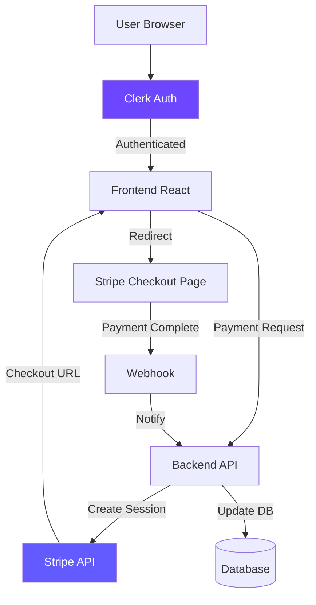
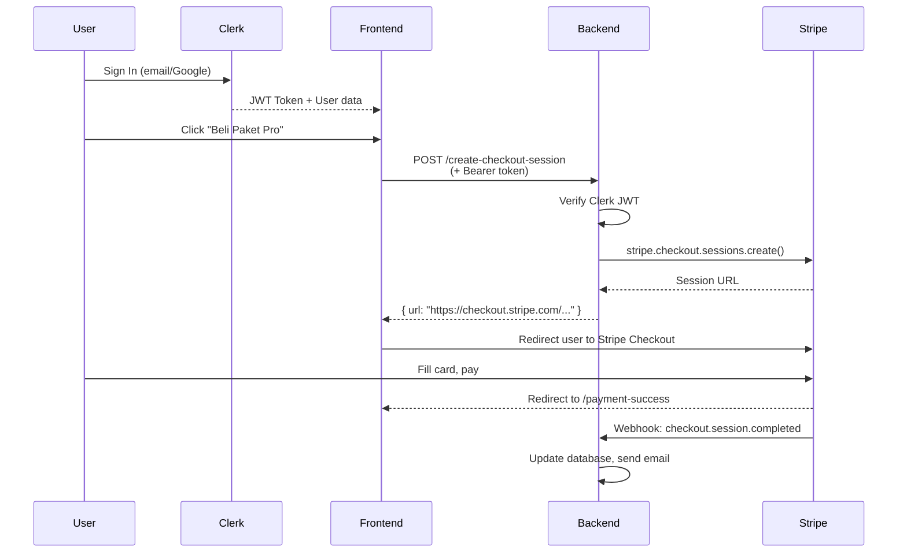

# 15 — Stripe + Clerk: Payment & Auth yang Production-Ready

## Cerita Dulu: Bikin Payment Flow Sendiri = Disaster

Dua tahun lalu, temen gue coba bikin payment system sendiri buat platform kursus online-nya. "Gue connect langsung ke bank API aja, hemat fee." Hasilnya?

- 3 bulan development buat handle edge cases (expired sessions, double charge, refund)
- Security audit gagal karena nyimpen kartu kredit di database sendiri (PCI compliance violation)
- Kena charge balik Rp 15 juta karena gak ada fraud detection

Dia akhirnya migrasi ke **Stripe**. 2 minggu selesai. Zero fraud issues. Payment success rate naik 30%.

Dan buat auth? Dulu dia bikin sendiri: hash password, JWT, refresh token, email verification, forgot password, OAuth... 2 bulan. Pindah ke **Clerk**? 2 jam. Literally.

Hari ini kita belajar dua tools yang bakal save kalian ratusan jam development time.

---

## Architecture Overview



---

## Part A: Stripe — Accept Payments

### Setup

```bash
npm create vite@latest stripe-clerk-demo -- --template react-ts
cd stripe-clerk-demo
npm install @stripe/stripe-js @stripe/react-stripe-js
npm install express stripe cors dotenv  # Backend dependencies
```

### Get Your Test Keys

1. Buka [dashboard.stripe.com](https://dashboard.stripe.com)
2. Sign up (gratis)
3. Toggle **"Test mode"** (PENTING! Jangan pake live keys buat development)
4. Ambil keys dari Developers > API Keys:
   - `pk_test_...` — Publishable key (frontend, safe to expose)
   - `sk_test_...` — Secret key (backend only, NEVER expose!)

```bash
# .env (root project — backend)
STRIPE_SECRET_KEY=sk_test_51abc...
STRIPE_PUBLISHABLE_KEY=pk_test_51abc...
STRIPE_WEBHOOK_SECRET=whsec_...

# .env (frontend — Vite)
VITE_STRIPE_PUBLISHABLE_KEY=pk_test_51abc...
```

### Stripe Checkout Session (Easiest Method)

Checkout Session = Stripe hosts the payment page. Kalian redirect user ke sana. Zero PCI compliance headache.

```typescript
// server/index.ts (Express backend)
import express from 'express';
import Stripe from 'stripe';
import cors from 'cors';
import 'dotenv/config';

const app = express();
const stripe = new Stripe(process.env.STRIPE_SECRET_KEY!);

app.use(cors({ origin: 'http://localhost:5173' }));
app.use(express.json());

// Products (in real app, this comes from DB)
const PRODUCTS = {
  'workshop-basic': {
    name: 'ETHJKT Workshop Basic',
    price: 150_000, // Rp 150.000 (Stripe uses smallest unit: 150000 = Rp 150.000)
    currency: 'idr',
  },
  'workshop-pro': {
    name: 'ETHJKT Workshop Pro + Mentoring',
    price: 500_000,
    currency: 'idr',
  },
  'workshop-vip': {
    name: 'ETHJKT VIP (Workshop + NFT Certificate)',
    price: 1_000_000,
    currency: 'idr',
  },
};

// Create Checkout Session
app.post('/api/create-checkout-session', async (req, res) => {
  const { productId, userEmail } = req.body;
  const product = PRODUCTS[productId as keyof typeof PRODUCTS];

  if (!product) {
    return res.status(400).json({ error: 'Product not found' });
  }

  try {
    const session = await stripe.checkout.sessions.create({
      payment_method_types: ['card'],
      customer_email: userEmail,
      line_items: [
        {
          price_data: {
            currency: product.currency,
            product_data: {
              name: product.name,
              description: `Tiket ${product.name} — Ethereum Jakarta`,
            },
            unit_amount: product.price,
          },
          quantity: 1,
        },
      ],
      mode: 'payment',
      success_url: `http://localhost:5173/payment-success?session_id={CHECKOUT_SESSION_ID}`,
      cancel_url: `http://localhost:5173/payment-cancel`,
      metadata: {
        productId,
        userEmail,
      },
    });

    res.json({ url: session.url, sessionId: session.id });
  } catch (err: any) {
    res.status(500).json({ error: err.message });
  }
});

// Verify payment status
app.get('/api/payment-status/:sessionId', async (req, res) => {
  try {
    const session = await stripe.checkout.sessions.retrieve(req.params.sessionId);
    res.json({
      status: session.payment_status,
      customerEmail: session.customer_email,
      amountTotal: session.amount_total,
    });
  } catch (err: any) {
    res.status(500).json({ error: err.message });
  }
});

app.listen(3001, () => console.log('🚀 Server running on :3001'));
```

### Payment Intents (More Control)

Untuk flow yang lebih custom (embedded form, gak redirect):

```typescript
// server — Create Payment Intent
app.post('/api/create-payment-intent', async (req, res) => {
  const { amount, currency = 'idr' } = req.body;

  try {
    const paymentIntent = await stripe.paymentIntents.create({
      amount,
      currency,
      automatic_payment_methods: { enabled: true },
    });

    res.json({ clientSecret: paymentIntent.client_secret });
  } catch (err: any) {
    res.status(500).json({ error: err.message });
  }
});
```

### Frontend: Embedded Payment Form

```typescript
// src/components/PaymentForm.tsx
import { useState } from 'react';
import {
  Elements,
  PaymentElement,
  useStripe,
  useElements,
} from '@stripe/react-stripe-js';
import { loadStripe } from '@stripe/stripe-js';

const stripePromise = loadStripe(import.meta.env.VITE_STRIPE_PUBLISHABLE_KEY);

function CheckoutForm() {
  const stripe = useStripe();
  const elements = useElements();
  const [loading, setLoading] = useState(false);
  const [error, setError] = useState<string | null>(null);

  const handleSubmit = async (e: React.FormEvent) => {
    e.preventDefault();
    if (!stripe || !elements) return;

    setLoading(true);
    setError(null);

    const result = await stripe.confirmPayment({
      elements,
      confirmParams: {
        return_url: 'http://localhost:5173/payment-success',
      },
    });

    if (result.error) {
      setError(result.error.message ?? 'Payment failed');
      setLoading(false);
    }
    // If success, user gets redirected to return_url
  };

  return (
    <form onSubmit={handleSubmit} className="max-w-md mx-auto space-y-4">
      <PaymentElement />
      {error && <p className="text-red-500 text-sm">{error}</p>}
      <button
        type="submit"
        disabled={!stripe || loading}
        className="w-full bg-indigo-600 text-white py-3 rounded-lg font-bold disabled:opacity-50"
      >
        {loading ? '⏳ Processing...' : '💳 Bayar Sekarang'}
      </button>
    </form>
  );
}

// Wrapper with Elements provider
export function PaymentForm({ clientSecret }: { clientSecret: string }) {
  return (
    <Elements
      stripe={stripePromise}
      options={{
        clientSecret,
        appearance: {
          theme: 'stripe',
          variables: {
            colorPrimary: '#6366f1',
          },
        },
      }}
    >
      <CheckoutForm />
    </Elements>
  );
}
```

### Webhooks — The Critical Piece

**JANGAN rely on frontend redirect buat confirm payment.** User bisa close tab sebelum redirect. Webhooks itu server-to-server notification dari Stripe.

```typescript
// server/webhook.ts
import express from 'express';
import Stripe from 'stripe';

const stripe = new Stripe(process.env.STRIPE_SECRET_KEY!);

// PENTING: webhook endpoint harus pake raw body, bukan JSON parsed
export const webhookRouter = express.Router();

webhookRouter.post(
  '/webhook',
  express.raw({ type: 'application/json' }),
  async (req, res) => {
    const sig = req.headers['stripe-signature'] as string;

    let event: Stripe.Event;

    try {
      event = stripe.webhooks.constructEvent(
        req.body,
        sig,
        process.env.STRIPE_WEBHOOK_SECRET!
      );
    } catch (err: any) {
      console.log(`⚠️ Webhook signature verification failed:`, err.message);
      return res.status(400).send(`Webhook Error: ${err.message}`);
    }

    // Handle the event
    switch (event.type) {
      case 'checkout.session.completed': {
        const session = event.data.object as Stripe.Checkout.Session;
        console.log('✅ Payment successful!', {
          email: session.customer_email,
          amount: session.amount_total,
          productId: session.metadata?.productId,
        });

        // TODO: Update database, send confirmation email, grant access
        // await db.orders.create({ ... });
        // await sendEmail(session.customer_email, 'Payment confirmed!');
        break;
      }

      case 'payment_intent.payment_failed': {
        const intent = event.data.object as Stripe.PaymentIntent;
        console.log('❌ Payment failed:', intent.last_payment_error?.message);
        break;
      }

      default:
        console.log(`Unhandled event type: ${event.type}`);
    }

    res.json({ received: true });
  }
);
```

### Stripe CLI — Test Webhooks Locally

```bash
# Install Stripe CLI
# Mac: brew install stripe/stripe-cli/stripe
# Linux: download from https://stripe.com/docs/stripe-cli

# Login
stripe login

# Forward webhooks to your local server
stripe listen --forward-to localhost:3001/webhook

# Trigger test events
stripe trigger checkout.session.completed
stripe trigger payment_intent.payment_failed
```

---

## Part B: Clerk — Authentication

### Setup

```bash
npm install @clerk/clerk-react
```

1. Buka [clerk.com](https://clerk.com), buat account (free tier = 10K MAU)
2. Create application
3. Ambil keys dari Dashboard:

```bash
# .env
VITE_CLERK_PUBLISHABLE_KEY=pk_test_...
```

### ClerkProvider

```typescript
// src/main.tsx
import React from 'react';
import ReactDOM from 'react-dom/client';
import { ClerkProvider } from '@clerk/clerk-react';
import App from './App';

const CLERK_KEY = import.meta.env.VITE_CLERK_PUBLISHABLE_KEY;

if (!CLERK_KEY) throw new Error('Missing VITE_CLERK_PUBLISHABLE_KEY');

ReactDOM.createRoot(document.getElementById('root')!).render(
  <React.StrictMode>
    <ClerkProvider publishableKey={CLERK_KEY}>
      <App />
    </ClerkProvider>
  </React.StrictMode>
);
```

### SignIn & SignUp Components

Clerk kasih pre-built components yang udah handle EVERYTHING (email/password, Google OAuth, magic link, dll):

```typescript
// src/pages/SignInPage.tsx
import { SignIn } from '@clerk/clerk-react';

export function SignInPage() {
  return (
    <div className="min-h-screen flex items-center justify-center bg-gray-50">
      <SignIn
        appearance={{
          elements: {
            rootBox: 'mx-auto',
            card: 'shadow-xl',
          },
        }}
        routing="path"
        path="/sign-in"
        signUpUrl="/sign-up"
      />
    </div>
  );
}

// src/pages/SignUpPage.tsx
import { SignUp } from '@clerk/clerk-react';

export function SignUpPage() {
  return (
    <div className="min-h-screen flex items-center justify-center bg-gray-50">
      <SignUp
        appearance={{
          elements: {
            rootBox: 'mx-auto',
          },
        }}
        routing="path"
        path="/sign-up"
        signInUrl="/sign-in"
      />
    </div>
  );
}
```

### useUser & useAuth Hooks

```typescript
// src/components/UserProfile.tsx
import { useUser, useAuth, UserButton } from '@clerk/clerk-react';

export function UserProfile() {
  const { user, isLoaded, isSignedIn } = useUser();
  const { getToken, signOut } = useAuth();

  if (!isLoaded) return <div>Loading...</div>;
  if (!isSignedIn) return <div>Please sign in</div>;

  const callProtectedAPI = async () => {
    // Get JWT token to send to your backend
    const token = await getToken();
    
    const res = await fetch('http://localhost:3001/api/protected', {
      headers: {
        Authorization: `Bearer ${token}`,
      },
    });
    
    const data = await res.json();
    console.log('Protected data:', data);
  };

  return (
    <div className="p-6">
      <div className="flex items-center gap-4 mb-6">
        <UserButton afterSignOutUrl="/" />
        <div>
          <h2 className="font-bold text-xl">
            Halo, {user.firstName} {user.lastName}! 👋
          </h2>
          <p className="text-gray-500">{user.primaryEmailAddress?.emailAddress}</p>
        </div>
      </div>

      <div className="space-y-2 text-sm">
        <p><strong>User ID:</strong> {user.id}</p>
        <p><strong>Created:</strong> {user.createdAt?.toLocaleDateString('id-ID')}</p>
      </div>

      <button
        onClick={callProtectedAPI}
        className="mt-4 bg-blue-600 text-white px-4 py-2 rounded"
      >
        Call Protected API
      </button>
    </div>
  );
}
```

### Protected Routes

```typescript
// src/components/ProtectedRoute.tsx
import { useAuth } from '@clerk/clerk-react';
import { Navigate } from 'react-router-dom';

type Props = {
  children: React.ReactNode;
};

export function ProtectedRoute({ children }: Props) {
  const { isLoaded, isSignedIn } = useAuth();

  if (!isLoaded) {
    return (
      <div className="min-h-screen flex items-center justify-center">
        <div className="animate-spin w-8 h-8 border-4 border-blue-600 border-t-transparent rounded-full" />
      </div>
    );
  }

  if (!isSignedIn) {
    return <Navigate to="/sign-in" replace />;
  }

  return <>{children}</>;
}
```

---

## Part C: Combine Stripe + Clerk — Authenticated Payment Page

```typescript
// src/App.tsx
import { BrowserRouter, Routes, Route } from 'react-router-dom';
import { SignInPage } from './pages/SignInPage';
import { SignUpPage } from './pages/SignUpPage';
import { ProtectedRoute } from './components/ProtectedRoute';
import { PaymentPage } from './pages/PaymentPage';
import { PaymentSuccess } from './pages/PaymentSuccess';
import { HomePage } from './pages/HomePage';

function App() {
  return (
    <BrowserRouter>
      <Routes>
        <Route path="/" element={<HomePage />} />
        <Route path="/sign-in/*" element={<SignInPage />} />
        <Route path="/sign-up/*" element={<SignUpPage />} />
        
        {/* Protected routes — must be signed in */}
        <Route path="/payment" element={
          <ProtectedRoute>
            <PaymentPage />
          </ProtectedRoute>
        } />
        <Route path="/payment-success" element={
          <ProtectedRoute>
            <PaymentSuccess />
          </ProtectedRoute>
        } />
      </Routes>
    </BrowserRouter>
  );
}

export default App;
```

```typescript
// src/pages/PaymentPage.tsx
import { useState } from 'react';
import { useUser, useAuth } from '@clerk/clerk-react';

type Product = {
  id: string;
  name: string;
  price: number;
  emoji: string;
  features: string[];
};

const products: Product[] = [
  {
    id: 'workshop-basic',
    name: 'Basic',
    price: 150_000,
    emoji: '🌱',
    features: ['Akses materi online', 'Sertifikat digital', 'Group Telegram'],
  },
  {
    id: 'workshop-pro',
    name: 'Pro',
    price: 500_000,
    emoji: '🚀',
    features: ['Semua fitur Basic', '1-on-1 mentoring (2x)', 'Code review', 'Priority support'],
  },
  {
    id: 'workshop-vip',
    name: 'VIP',
    price: 1_000_000,
    emoji: '👑',
    features: ['Semua fitur Pro', 'NFT Certificate', 'Lifetime access', 'Job referral network'],
  },
];

export function PaymentPage() {
  const { user } = useUser();
  const { getToken } = useAuth();
  const [loading, setLoading] = useState<string | null>(null);

  const handleCheckout = async (productId: string) => {
    setLoading(productId);
    
    try {
      const token = await getToken();
      
      const res = await fetch('http://localhost:3001/api/create-checkout-session', {
        method: 'POST',
        headers: {
          'Content-Type': 'application/json',
          Authorization: `Bearer ${token}`,
        },
        body: JSON.stringify({
          productId,
          userEmail: user?.primaryEmailAddress?.emailAddress,
        }),
      });

      const data = await res.json();

      if (data.url) {
        window.location.href = data.url; // Redirect to Stripe Checkout
      } else {
        alert('Error: ' + data.error);
      }
    } catch (err) {
      console.error(err);
      alert('Checkout failed. Coba lagi.');
    } finally {
      setLoading(null);
    }
  };

  const formatIDR = (amount: number) =>
    new Intl.NumberFormat('id-ID', {
      style: 'currency',
      currency: 'IDR',
      maximumFractionDigits: 0,
    }).format(amount);

  return (
    <div className="min-h-screen bg-gray-50 py-12">
      <div className="max-w-5xl mx-auto px-4">
        <div className="text-center mb-12">
          <h1 className="text-3xl font-bold">🎫 Pilih Paket Workshop ETHJKT</h1>
          <p className="text-gray-500 mt-2">
            Halo {user?.firstName}! Pilih paket yang sesuai buat perjalanan blockchain kamu.
          </p>
        </div>

        <div className="grid md:grid-cols-3 gap-6">
          {products.map((product) => (
            <div
              key={product.id}
              className={`bg-white rounded-2xl shadow-lg p-6 border-2 transition hover:shadow-xl ${
                product.id === 'workshop-pro' ? 'border-indigo-500 scale-105' : 'border-transparent'
              }`}
            >
              {product.id === 'workshop-pro' && (
                <span className="bg-indigo-500 text-white text-xs px-3 py-1 rounded-full">
                  MOST POPULAR
                </span>
              )}
              
              <div className="text-4xl text-center my-4">{product.emoji}</div>
              <h2 className="text-xl font-bold text-center">{product.name}</h2>
              <p className="text-3xl font-bold text-center mt-2">
                {formatIDR(product.price)}
              </p>

              <ul className="mt-6 space-y-2">
                {product.features.map((f) => (
                  <li key={f} className="flex items-center gap-2 text-sm">
                    <span className="text-green-500">✓</span> {f}
                  </li>
                ))}
              </ul>

              <button
                onClick={() => handleCheckout(product.id)}
                disabled={loading === product.id}
                className={`mt-6 w-full py-3 rounded-lg font-bold transition ${
                  product.id === 'workshop-pro'
                    ? 'bg-indigo-600 text-white hover:bg-indigo-700'
                    : 'bg-gray-900 text-white hover:bg-gray-800'
                } disabled:opacity-50`}
              >
                {loading === product.id ? '⏳ Processing...' : '💳 Beli Sekarang'}
              </button>
            </div>
          ))}
        </div>

        {/* Test Card Info */}
        <div className="mt-12 bg-yellow-50 border border-yellow-200 rounded-lg p-4 text-sm">
          <h3 className="font-bold text-yellow-800">🧪 Test Mode — Pake kartu test ini:</h3>
          <ul className="mt-2 space-y-1 text-yellow-700">
            <li><strong>Success:</strong> 4242 4242 4242 4242</li>
            <li><strong>Decline:</strong> 4000 0000 0000 0002</li>
            <li><strong>3D Secure:</strong> 4000 0025 0000 3155</li>
            <li>Expiry: any future date | CVC: any 3 digits</li>
          </ul>
        </div>
      </div>
    </div>
  );
}
```

```typescript
// src/pages/PaymentSuccess.tsx
import { useEffect, useState } from 'react';
import { useSearchParams, Link } from 'react-router-dom';

export function PaymentSuccess() {
  const [searchParams] = useSearchParams();
  const sessionId = searchParams.get('session_id');
  const [status, setStatus] = useState<any>(null);

  useEffect(() => {
    if (sessionId) {
      fetch(`http://localhost:3001/api/payment-status/${sessionId}`)
        .then((r) => r.json())
        .then(setStatus);
    }
  }, [sessionId]);

  return (
    <div className="min-h-screen flex items-center justify-center bg-gray-50">
      <div className="bg-white rounded-2xl shadow-lg p-8 text-center max-w-md">
        <div className="text-6xl mb-4">🎉</div>
        <h1 className="text-2xl font-bold text-green-600">Pembayaran Berhasil!</h1>
        <p className="text-gray-500 mt-2">
          Terima kasih sudah mendaftar ETHJKT Workshop.
        </p>

        {status && (
          <div className="mt-4 bg-gray-50 rounded p-4 text-sm text-left">
            <p><strong>Status:</strong> {status.status}</p>
            <p><strong>Email:</strong> {status.customerEmail}</p>
            <p><strong>Total:</strong> {
              new Intl.NumberFormat('id-ID', { style: 'currency', currency: 'IDR', maximumFractionDigits: 0 })
                .format(status.amountTotal)
            }</p>
          </div>
        )}

        <Link
          to="/"
          className="mt-6 inline-block bg-indigo-600 text-white px-6 py-2 rounded-lg"
        >
          Kembali ke Home
        </Link>
      </div>
    </div>
  );
}
```

---

## Stripe + Clerk Flow



---

## Security Checklist

| Item | Status |
|------|--------|
| Secret key ONLY on backend | ✅ Never in frontend code |
| Webhook signature verification | ✅ `constructEvent()` validates |
| HTTPS in production | ✅ Stripe requires it |
| Test mode for development | ✅ `pk_test_` / `sk_test_` |
| Clerk JWT verification on backend | ✅ Before creating payment |
| No card data on your server | ✅ Stripe handles PCI compliance |
| Idempotency keys for retries | ⚠️ Add for production |

---

## Exercises

1. **Subscription model** — Change `mode: 'payment'` to `mode: 'subscription'` with recurring prices
2. **Refund endpoint** — Build `POST /api/refund/:sessionId`
3. **Role-based access** — After payment, set Clerk metadata `plan: 'pro'`, then protect routes by plan
4. **Receipt email** — Use Stripe's built-in receipt or send custom email via webhook
5. **Multiple currencies** — Support USD dan IDR, let user choose

---

Next Part -> [16-sk-code-review.md](https://github.com/Ethereum-Jakarta/phase-2-week3-frontend-advance/blob/main/study-material/16-sk-code-review.md)
