# 16 — Soft Skill: Code Review Culture yang Bikin Tim Solid

## Cerita Dulu: "Code Lu Jelek"

Gue masih inget pertama kali dapet code review di kerja pertama. Senior gue nulis di PR: "Ini ngapain? Gak masuk akal. Rewrite." Gak ada penjelasan. Gak ada saran. Gak ada context.

Gue ngerasa bodoh. Gue hampir resign minggu itu.

Beberapa bulan kemudian, gue pindah tim. Senior baru gue review PR gue: "Nice approach! Gue punya sedikit concern soal performance di sini — kalau data-nya 10K+, `.filter().map()` bakal jalan 2x. Gimana kalau kita combine jadi `.reduce()`? Ini contohnya: ..."

**Exact same feedback** — code gue kurang optimal. Tapi delivery-nya? Night and day. Gue belajar sesuatu. Gue semangat improve.

Code review bukan soal nunjukin siapa yang lebih pinter. Code review itu **transfer knowledge, catch bugs, dan maintain code quality** — TOGETHER.

---

## Kenapa Code Review Penting?

```mermaid
graph TD
    A[Code Review] --> B[🐛 Bug Prevention]
    A --> C[📚 Knowledge Sharing]
    A --> D[📏 Code Consistency]
    A --> E[🛡️ Security Check]
    A --> F[👥 Team Growth]
    
    B --> B1[Catch bugs sebelum production]
    C --> C1[Junior belajar dari senior]
    C --> C2[Senior belajar perspektif baru]
    D --> D1[Semua code looks like 1 person wrote it]
    E --> E1[SQL injection, XSS, auth bypass]
    F --> F1[Build trust & communication]
    
    style A fill:#10b981,color:#fff
```



**Stats:**
- Code review catch **60-90% bugs** sebelum testing (IBM study)
- Teams yang review code punya **30% fewer defects** in production
- Knowledge sharing lewat review reduce **bus factor** (kalau 1 orang resign, tim gak collapse)

---

## Code Review Checklist (10 Points)

Setiap kali review PR, cek 10 hal ini:

### 1. ✅ Functionality — Apakah code-nya WORKS?

```typescript
// ❌ Bug: off-by-one error
const lastItem = items[items.length]; // undefined!

// ✅ Fix
const lastItem = items[items.length - 1];
```

### 2. ✅ Readability — Bisa dipahami tanpa penjelasan?

```typescript
// ❌ Apa ini???
const x = d.filter(i => i.s === 'a' && i.p > 100).map(i => ({ ...i, t: i.p * 0.11 }));

// ✅ Self-documenting
const activeExpensiveProducts = products
  .filter(product => product.status === 'active' && product.price > 100)
  .map(product => ({
    ...product,
    tax: product.price * TAX_RATE,
  }));
```

### 3. ✅ Performance — Ada bottleneck?

```typescript
// ❌ N+1 query di loop
for (const user of users) {
  const orders = await db.orders.findMany({ where: { userId: user.id } }); // N queries!
}

// ✅ Batch query
const orders = await db.orders.findMany({
  where: { userId: { in: users.map(u => u.id) } }, // 1 query!
});
```

### 4. ✅ Security — Ada vulnerability?

```typescript
// ❌ SQL Injection
const query = `SELECT * FROM users WHERE email = '${email}'`;

// ✅ Parameterized query
const user = await db.query('SELECT * FROM users WHERE email = $1', [email]);
```

### 5. ✅ Error Handling — Edge cases ke-handle?

```typescript
// ❌ No error handling
const data = await fetch('/api/users').then(r => r.json());

// ✅ Proper error handling
try {
  const res = await fetch('/api/users');
  if (!res.ok) throw new Error(`HTTP ${res.status}`);
  const data = await res.json();
} catch (err) {
  console.error('Failed to fetch users:', err);
  showToast('Gagal memuat data. Coba lagi.');
}
```

### 6. ✅ Types — TypeScript dipakai bener?

```typescript
// ❌ any everywhere
const handleClick = (e: any) => { ... }
const data: any = response.data;

// ✅ Proper types
const handleClick = (e: React.MouseEvent<HTMLButtonElement>) => { ... }
type ApiResponse = { users: User[]; total: number };
const data: ApiResponse = response.data;
```

### 7. ✅ Tests — Ada test buat changes?

- New feature → ada unit/integration test?
- Bug fix → ada regression test?
- Edge case → di-test?

### 8. ✅ Naming — Clear dan consistent?

```typescript
// ❌ Unclear
const flag = true;
const handleIt = () => { ... };
function proc(d: any) { ... }

// ✅ Clear
const isModalOpen = true;
const handleDeleteUser = () => { ... };
function processPayment(paymentData: PaymentIntent) { ... }
```

### 9. ✅ DRY — Ada duplikasi yang bisa di-extract?

```typescript
// ❌ Copy-paste
const formatDate1 = new Date(item1.date).toLocaleDateString('id-ID');
const formatDate2 = new Date(item2.date).toLocaleDateString('id-ID');
const formatDate3 = new Date(item3.date).toLocaleDateString('id-ID');

// ✅ Extract function
const formatDate = (date: string) => new Date(date).toLocaleDateString('id-ID');
```

### 10. ✅ Architecture — Sesuai pattern tim?

- File di tempat yang bener? (components/, hooks/, utils/)
- Naming convention consistent? (camelCase, PascalCase)
- State management sesuai guideline? (local vs global)

---

## Giving Constructive Feedback

### The Formula: Observation + Impact + Suggestion

```
❌ "Code lu jelek"
❌ "Ini salah"  
❌ "Kenapa gak pake X?"

✅ "Gue notice [observation]. Concern gue [impact]. Gimana kalau [suggestion]?"
```

### Examples:

**Instead of:** "Gak pake useMemo?"
**Say:** "Array ini di-create ulang setiap render. Kalau products-nya banyak (1000+), bisa bikin lag. Gimana kalau wrap pake `useMemo`?"

**Instead of:** "Penamaan variabel ancur"
**Say:** "Gue agak bingung pas baca `const x = ...`. Mungkin bisa di-rename jadi `filteredActiveUsers` biar konteks-nya lebih jelas? 🙏"

**Instead of:** "Ini gak perlu"
**Say:** "Nice idea pake custom hook di sini! Tapi kayaknya case ini cukup simple buat ditaro langsung di component. Kalau nanti di-reuse di tempat lain, baru kita extract. WDYT?"

### Feedback Tones

| Tone | Prefix | Contoh |
|------|--------|--------|
| **Blocking** (must fix) | `[BLOCKER]` | "Ini bisa kena SQL injection. Harus di-fix sebelum merge." |
| **Suggestion** (nice to have) | `[NIT]` atau `[SUGGESTION]` | "Nit: bisa pake optional chaining di sini `user?.name`" |
| **Question** (learning) | `[Q]` | "Q: kenapa pilih `useReducer` instead of `useState`? Curious aja" |
| **Praise** (good job!) | `[NICE]` | "Nice! Gue baru tau bisa gini. TIL 🔥" |

---

## Responding to Code Reviews

### As the Author:

1. **Don't take it personal** — Review itu ke code-nya, bukan ke orangnya
2. **Say thank you** — Reviewer spend time buat improve code kalian
3. **Explain your reasoning** — Kalau gak setuju, explain WHY (bukan "pokoknya gini")
4. **Ask clarifying questions** — "Bisa elaborate concern performance-nya?"
5. **Be open** — Kadang reviewer bener, kadang kalian bener. Diskusi, jangan debat

```
Reviewer: "Kayaknya ini bisa O(n) instead of O(n²)"
  
❌ "Gak ngaruh, data-nya dikit"
✅ "Good point! Untuk sekarang data-nya max 100, tapi gue setuju buat future-proof. 
    Gue update pake Map buat O(1) lookup. Thanks! 🙏"
```

### As the Reviewer:

1. **Review the code, not the coder** — "This function" bukan "You"
2. **Be specific** — Tunjukin exactly what & why, kasih contoh
3. **Praise good code** — Jangan cuma nyari yang salah
4. **Timebox yourself** — Review shouldn't take more than 30-60 min
5. **Approve when good enough** — Perfect is the enemy of shipped

---

## Git Branching Strategies


### Comparison Table

| Aspect | GitFlow | GitHub Flow | Trunk-Based |
|--------|---------|-------------|-------------|
| **Branches** | main, develop, feature, release, hotfix | main + feature branches | main (+ short-lived features) |
| **Complexity** | High | Low | Very Low |
| **Release** | Scheduled releases | Deploy anytime | Continuous deploy |
| **Best for** | Enterprise, versioned software | SaaS, web apps | High-trust, senior teams |
| **PR Required** | Yes | Yes | Optional (pair programming) |
| **CI/CD** | Complex pipelines | Simple pipelines | Must have excellent CI |
| **Feature Flags** | Rarely needed | Sometimes | Often needed |
| **Team Size** | 10+ devs | 3-10 devs | 2-8 devs |

**Recommendation buat kebanyakan web project:** **GitHub Flow**. Simple, effective, gak over-engineered.

### GitHub Flow in Practice:

```bash
# 1. Create feature branch from main
git checkout main
git pull origin main
git checkout -b feature/add-payment-page

# 2. Work on your feature (multiple commits OK)
git add .
git commit -m "feat: add payment page UI"
git commit -m "feat: integrate Stripe checkout"
git commit -m "test: add payment flow tests"

# 3. Push and create PR
git push origin feature/add-payment-page
# -> Open PR on GitHub

# 4. After review & approval -> Merge (squash or merge commit)
# 5. Delete feature branch
git branch -d feature/add-payment-page
```

---

## Conventional Commits

Standard format buat commit messages yang bikin history readable dan auto-generate changelogs.

### Format:
```
<type>(<scope>): <description>

[optional body]

[optional footer]
```

### Types:

| Type | Kapan | Contoh |
|------|-------|--------|
| `feat` | New feature | `feat(cart): add remove item button` |
| `fix` | Bug fix | `fix(auth): resolve token expiry redirect loop` |
| `docs` | Documentation | `docs: update API endpoint docs` |
| `style` | Formatting (no logic change) | `style: fix eslint warnings` |
| `refactor` | Code change (no feature/fix) | `refactor(utils): extract date formatter` |
| `test` | Adding tests | `test(cart): add unit tests for cartSlice` |
| `chore` | Maintenance | `chore: update dependencies` |
| `perf` | Performance | `perf(table): virtualize 10K row render` |
| `ci` | CI/CD changes | `ci: add Cypress to GitHub Actions` |

### Breaking Changes:
```
feat(api)!: change payment endpoint response format

BREAKING CHANGE: /api/payment now returns { session } instead of { url }
```

### Real PR Commit History:

```bash
# ❌ Bad history
git log --oneline
# a1b2c3d fix
# d4e5f6g update
# g7h8i9j wip
# j0k1l2m stuff
# m3n4o5p more stuff

# ✅ Good history
git log --oneline
# a1b2c3d feat(payment): add Stripe checkout integration
# d4e5f6g feat(payment): add payment success page
# g7h8i9j test(payment): add E2E tests for checkout flow
# j0k1l2m docs(payment): add Stripe setup instructions to README
# m3n4o5p chore: add stripe and clerk env variables to .env.example
```

### Setup Conventional Commits Enforcement:

```bash
npm install -D @commitlint/cli @commitlint/config-conventional husky

# Init husky
npx husky init

# Add commit-msg hook
echo 'npx --no -- commitlint --edit "$1"' > .husky/commit-msg
```

```javascript
// commitlint.config.js
export default {
  extends: ['@commitlint/config-conventional'],
  rules: {
    'scope-enum': [2, 'always', [
      'auth', 'cart', 'payment', 'table', 'form', 'ui', 'api', 'test', 'ci',
    ]],
  },
};
```

---

## Merge Conflict Resolution Walkthrough

Merge conflicts itu NORMAL. Jangan panik. Ini step-by-step:

### Scenario:
Kalian dan teammate edit file yang sama.

```bash
# Your branch: feature/update-header
# Teammate's branch: feature/fix-nav (already merged to main)

git checkout feature/update-header
git pull origin main
# CONFLICT! Auto-merging src/components/Header.tsx
```

### What You See:

```typescript
// src/components/Header.tsx
function Header() {
  return (
    <header>
<<<<<<< HEAD (your changes)
      <h1 className="text-3xl font-bold text-blue-600">ETHJKT Workshop</h1>
      <p>Belajar Blockchain Bareng</p>
=======
      <h1 className="text-2xl font-semibold text-indigo-700">Ethereum Jakarta</h1>
      <nav>
        <a href="/about">About</a>
        <a href="/events">Events</a>
      </nav>
>>>>>>> main (teammate's changes)
    </header>
  );
}
```

### Resolution Steps:

**1. Understand both changes:**
- Your change: updated title styling + added subtitle
- Teammate's change: updated title + added navigation

**2. Decide: keep yours, keep theirs, or COMBINE:**

```typescript
// ✅ Combined resolution — best of both
function Header() {
  return (
    <header>
      <h1 className="text-3xl font-bold text-indigo-700">Ethereum Jakarta</h1>
      <p>Belajar Blockchain Bareng</p>
      <nav>
        <a href="/about">About</a>
        <a href="/events">Events</a>
      </nav>
    </header>
  );
}
```

**3. Mark as resolved:**
```bash
git add src/components/Header.tsx
git commit -m "merge: resolve header conflict, combine styling + nav"
git push origin feature/update-header
```

### Pro Tips:
- **Pull main often** — `git pull origin main` daily, conflicts stay small
- **Communicate** — "Hey, gue lagi edit Header.tsx, lu juga?" Di Slack/Discord
- **Use VS Code merge editor** — Visual diff, click to accept left/right/both
- **When in doubt** — Ask the other person. "Lu prefer yang mana?"

---

## PR Template

Bikin file `.github/pull_request_template.md`:

```markdown
## 📝 Description
<!-- Apa yang di-change dan kenapa? -->

## 🔗 Related Issue
<!-- Link ke issue/ticket: closes #123 -->

## 📸 Screenshots
<!-- Kalau ada UI changes, tambahin screenshot -->

## ✅ Checklist
- [ ] Code follows project style guide
- [ ] Self-reviewed my own code
- [ ] Added/updated tests
- [ ] No new warnings/errors
- [ ] Tested on mobile viewport
- [ ] Updated documentation if needed

## 🧪 How to Test
1. Checkout branch
2. `npm install`
3. ...

## ⚠️ Breaking Changes
<!-- List breaking changes, or "None" -->
```

---

## Code Review Culture Summary


---

## Exercises

1. **Review a real PR** — Go ke any open source repo, baca 3 PRs, observe gimana maintainers kasih feedback
2. **Write 5 commits** — Practice conventional commits buat project kalian sendiri
3. **Create a merge conflict** — Intentionally, lalu resolve it. Practice makes perfect
4. **Set up PR template** — Buat `.github/pull_request_template.md` di repo kalian
5. **Pair review** — Review code temen sebelah, practice giving feedback yang constructive

---

## Final Words

Soft skills itu bukan bonus — itu **multiplier**. Developer yang bisa code bagus DAN communicate well itu 10x more valuable daripada yang cuma bisa code.

Code review culture yang sehat bikin:
- Bugs lebih dikit
- Tim lebih solid
- Knowledge lebih merata
- Onboarding lebih cepet
- Code quality naik terus

Remember: **"Great code is written by great teams, not great individuals."**

---

🎉 **Congratulations!** Kalian udah selesain semua materi Phase 2 Week 3. Dari TanStack Table sampai soft skills, kalian sekarang punya toolkit yang lengkap buat jadi frontend developer yang production-ready.

Keep building. Keep reviewing. Keep learning. See you di phase selanjutnya! 🚀

---

Next Part -> [Back to README](https://github.com/Ethereum-Jakarta/phase-2-week3-frontend-advance/blob/main/study-material/README.md)
