# 01 — The State Spectrum: Dari useState Sampe Server State

> *"Bayangin lo punya warung kopi. Awalnya lo cuma perlu inget pesanan satu orang — gampang, taruh di kepala. Terus warung lo rame, 10 orang pesen bareng. Lo mulai nulis di kertas. Tambah rame lagi, 100 orang — lo butuh sistem POS. State management di React itu persis kayak gitu. Makin complex app lo, makin canggih tools yang lo butuh."*

## 🎯 Yang Bakal Lo Pelajarin

- Apa itu "state" dan kenapa penting banget
- Spectrum lengkap: useState → useReducer → Context → Zustand → Redux → Server State
- Props drilling: masalah yang bikin developer frustasi
- Decision flowchart: kapan pake apa
- Mental model yang bener buat state management

## 🧠 Apa Sih State Itu?

Sebelum gue masuk ke tools, lo harus paham dulu **apa itu state**.

State itu **data yang berubah** dan **mempengaruhi tampilan UI**. Titik.

```
User klik tombol → State berubah → UI ke-render ulang → User liat perubahan
```

Contoh state:
- 🔘 Modal lagi buka atau tutup? → `isOpen: true/false`
- 📝 Isi form yang user lagi ketik? → `formData: { name: "Budi", email: "..." }`
- 🛒 Isi shopping cart? → `cartItems: [{ id: 1, qty: 2 }, ...]`
- 👤 User yang lagi login? → `user: { id: 1, name: "Budi", role: "admin" }`
- 📊 Data dari API? → `products: [{ id: 1, name: "ETH Hoodie", price: 500000 }]`

### State vs Props

Ini bedanya yang HARUS lo paham:

| | State | Props |
|---|---|---|
| **Siapa yang punya?** | Component itu sendiri | Parent component |
| **Bisa diubah?** | Yes, pake setter | No, read-only |
| **Trigger re-render?** | Yes | Yes (kalau berubah dari parent) |
| **Analogi** | Pikiran lo sendiri | Perintah dari bos |

```jsx
// State: gue yang punya, gue yang ubah
const [count, setCount] = useState(0);

// Props: dapet dari parent, gak bisa diubah langsung
function Button({ label, onClick }) {
  return <button onClick={onClick}>{label}</button>;
}
```

## 🌈 The State Spectrum

Oke, ini dia panorama lengkapnya. Gue bakal jelasin satu-satu dari yang paling simple sampe yang paling complex.


### Level 1: `useState` — Warung Kecil

```jsx
function Counter() {
  const [count, setCount] = useState(0);
  
  return (
    <div>
      <p>Count: {count}</p>
      <button onClick={() => setCount(count + 1)}>+1</button>
    </div>
  );
}
```

**Kapan pake:** State yang cuma dipake di 1 component. Toggle, form input, counter, modal open/close.

**Kelebihan:**
- Simple banget
- Built-in React, gak perlu install apa-apa
- Perfect buat local state

**Kekurangan:**
- Kalau state perlu di-share ke component lain? Props drilling.
- Kalau logic-nya complex? Spaghetti code.

**Analogi:** Lo inget pesanan 1 orang di kepala. Gampang.

### Level 2: `useReducer` — Warung Mulai Rame

```jsx
const initialState = { count: 0, step: 1 };

function reducer(state, action) {
  switch (action.type) {
    case 'INCREMENT':
      return { ...state, count: state.count + state.step };
    case 'DECREMENT':
      return { ...state, count: state.count - state.step };
    case 'SET_STEP':
      return { ...state, step: action.payload };
    case 'RESET':
      return initialState;
    default:
      return state;
  }
}

function Counter() {
  const [state, dispatch] = useReducer(reducer, initialState);
  
  return (
    <div>
      <p>Count: {state.count} (step: {state.step})</p>
      <button onClick={() => dispatch({ type: 'INCREMENT' })}>+</button>
      <button onClick={() => dispatch({ type: 'DECREMENT' })}>-</button>
      <button onClick={() => dispatch({ type: 'SET_STEP', payload: 5 })}>
        Set Step to 5
      </button>
      <button onClick={() => dispatch({ type: 'RESET' })}>Reset</button>
    </div>
  );
}
```

**Kapan pake:** State yang punya banyak sub-values dan logic transisi yang complex. Form wizard, game state, complex UI state.

**Kelebihan:**
- Logic terpusat di reducer function
- Predictable state transitions
- Gampang di-test (pure function)
- Mirip Redux tanpa library tambahan

**Kekurangan:**
- Boilerplate lebih banyak dari useState
- Masih local ke component (atau butuh Context buat share)
- Overkill buat state simple

**Analogi:** Lo mulai nulis pesanan di kertas. Ada format: "TAMBAH kopi 1", "HAPUS teh". Jelas dan terstruktur.

### Level 3: `Context API` — Warung Buka Cabang

```jsx
// 1. Buat Context
const ThemeContext = createContext();

// 2. Provider (taruh di atas component tree)
function ThemeProvider({ children }) {
  const [theme, setTheme] = useState('dark');
  
  const toggleTheme = () => {
    setTheme(prev => prev === 'dark' ? 'light' : 'dark');
  };
  
  return (
    <ThemeContext.Provider value={{ theme, toggleTheme }}>
      {children}
    </ThemeContext.Provider>
  );
}

// 3. Custom hook biar gampang dipake
function useTheme() {
  const context = useContext(ThemeContext);
  if (!context) throw new Error('useTheme must be used within ThemeProvider');
  return context;
}

// 4. Pake di mana aja
function Navbar() {
  const { theme, toggleTheme } = useTheme();
  return (
    <nav className={theme}>
      <button onClick={toggleTheme}>Toggle Theme</button>
    </nav>
  );
}
```

**Kapan pake:** State yang perlu diakses banyak component di berbagai level. Theme, auth user, language/locale.

**Kelebihan:**
- Built-in React
- Solve props drilling
- Bagus buat state yang jarang berubah

**Kekurangan:**
- ⚠️ **PERFORMANCE KILLER** kalau gak hati-hati! Setiap value berubah, SEMUA consumer re-render
- Provider hell (nesting banyak provider)
- Gak ada built-in devtools
- Gak cocok buat state yang sering berubah

**Analogi:** Lo bikin grup WhatsApp buat semua cabang warung. Semua bisa liat info terbaru. Tapi tiap ada update, SEMUA orang dapet notif — even yang gak perlu.

### 🚨 Props Drilling — Masalah yang Bikin Pusing

Sebelum lanjut ke Zustand, lo harus paham kenapa Context (dan state management libraries) itu exist. Jawabannya: **Props Drilling**.

```
App
 └── Dashboard
      └── Sidebar
           └── UserPanel
                └── UserAvatar  ← butuh user data
```

Tanpa state management, lo harus passing `user` dari App → Dashboard → Sidebar → UserPanel → UserAvatar. **Dashboard dan Sidebar gak butuh user data**, tapi tetep harus "terusin" props-nya.

```jsx
// ❌ PROPS DRILLING HELL
function App() {
  const [user, setUser] = useState({ name: 'Budi', avatar: '...' });
  
  return <Dashboard user={user} setUser={setUser} />;
}

function Dashboard({ user, setUser }) {
  // Gue gak butuh user, tapi harus terusin...
  return <Sidebar user={user} setUser={setUser} />;
}

function Sidebar({ user, setUser }) {
  // Gue juga gak butuh...
  return <UserPanel user={user} setUser={setUser} />;
}

function UserPanel({ user, setUser }) {
  // Akhirnya sampe sini
  return <UserAvatar src={user.avatar} name={user.name} />;
}
```

Visualisasi props drilling:

```
┌─────────────────────────────┐
│           App               │
│  user ──────────────┐       │
│                     ▼       │
│  ┌─────────────────────┐    │
│  │    Dashboard         │    │
│  │  user ──────────┐   │    │
│  │                 ▼   │    │
│  │  ┌──────────────────┐   │
│  │  │   Sidebar        │   │
│  │  │  user ───────┐   │   │
│  │  │              ▼   │   │
│  │  │  ┌───────────────┐   │
│  │  │  │  UserPanel    │   │
│  │  │  │  user ────┐   │   │
│  │  │  │           ▼   │   │
│  │  │  │  ┌────────────┐   │
│  │  │  │  │ UserAvatar │   │  ← Akhirnya sampe!
│  │  │  │  └────────────┘   │
│  │  │  └───────────────┘   │
│  │  └──────────────────┘   │
│  └─────────────────────┘    │
└─────────────────────────────┘

Props "menetes" lewat 4 level
3 component di tengah cuma jadi "kurir"
```

Ini masih 4 level. Bayangin app beneran yang punya 10-15 level deep. Nightmare.

### Level 4: `Zustand` — Sistem POS Modern 🐻

```jsx
import { create } from 'zustand';

// Buat store — gak perlu Provider!
const useStore = create((set) => ({
  count: 0,
  increment: () => set((state) => ({ count: state.count + 1 })),
  decrement: () => set((state) => ({ count: state.count - 1 })),
  reset: () => set({ count: 0 }),
}));

// Pake di component mana aja
function Counter() {
  const count = useStore((state) => state.count);
  const increment = useStore((state) => state.increment);
  
  return (
    <div>
      <p>Count: {count}</p>
      <button onClick={increment}>+1</button>
    </div>
  );
}
```

**Kapan pake:** Hampir semua kasus di mana lo butuh global state. Shopping cart, auth state, UI state, etc.

**Kelebihan:**
- 🔥 Minimal boilerplate
- 🔥 Gak perlu Provider wrapper
- 🔥 Selectors prevent unnecessary re-renders
- 🔥 Middleware ecosystem (persist, devtools, immer)
- 🔥 TypeScript support excellent
- 🔥 Tiny bundle size (~1KB)

**Kekurangan:**
- Third-party library (tapi tiny)
- Kurang mature daripada Redux buat enterprise-scale

**Analogi:** Lo install sistem POS tablet di warung. Simple, cepet, semua karyawan bisa akses dari mana aja.

> 📖 **Deep dive Zustand di file 02 dan 03!**

### Level 5: `Redux Toolkit` — ERP System Enterprise

```jsx
import { configureStore, createSlice } from '@reduxjs/toolkit';
import { Provider, useSelector, useDispatch } from 'react-redux';

// Slice
const counterSlice = createSlice({
  name: 'counter',
  initialState: { value: 0 },
  reducers: {
    increment: (state) => { state.value += 1; },
    decrement: (state) => { state.value -= 1; },
  },
});

// Store
const store = configureStore({
  reducer: { counter: counterSlice.reducer },
});

// Component
function Counter() {
  const count = useSelector((state) => state.counter.value);
  const dispatch = useDispatch();
  
  return (
    <div>
      <p>Count: {count}</p>
      <button onClick={() => dispatch(counterSlice.actions.increment())}>+1</button>
    </div>
  );
}

// App harus di-wrap Provider
function App() {
  return (
    <Provider store={store}>
      <Counter />
    </Provider>
  );
}
```

**Kapan pake:** Enterprise apps dengan tim besar, state yang sangat complex, butuh strict patterns & devtools canggih.

**Kelebihan:**
- Battle-tested (dipakai Facebook, Instagram, dll)
- Redux DevTools luar biasa powerful
- Strict unidirectional data flow
- Huge ecosystem & community
- RTK Query buat server state

**Kekurangan:**
- Boilerplate lebih banyak (meskipun RTK udah ngurangin banyak)
- Learning curve steep
- Overkill buat most apps
- Provider wrapper required

**Analogi:** Lo install ERP system SAP di warung kopi. Bisa? Bisa. Perlu? Probably not. Kecuali warung lo udah jadi Starbucks.

### Level 6: `Server State` (React Query) — Delivery Service

```jsx
import { useQuery, useMutation, useQueryClient } from '@tanstack/react-query';
import axios from 'axios';

function Products() {
  // GET - auto caching, refetching, loading/error states
  const { data, isLoading, error } = useQuery({
    queryKey: ['products'],
    queryFn: () => axios.get('/api/products').then(res => res.data),
  });

  const queryClient = useQueryClient();
  
  // POST - with auto-invalidation
  const createMutation = useMutation({
    mutationFn: (newProduct) => axios.post('/api/products', newProduct),
    onSuccess: () => {
      queryClient.invalidateQueries({ queryKey: ['products'] });
    },
  });

  if (isLoading) return <p>Loading...</p>;
  if (error) return <p>Error: {error.message}</p>;

  return (
    <div>
      {data.map(product => (
        <div key={product.id}>{product.name}</div>
      ))}
    </div>
  );
}
```

**PENTING: Server State ≠ Client State!**

Ini konsep yang banyak developer gak paham:

| | Client State | Server State |
|---|---|---|
| **Contoh** | Theme, sidebar open, form input | Products, users, orders |
| **Sumber** | Browser/client | Database/API |
| **Siapa yang kontrol?** | Lo | Server (orang lain bisa ubah!) |
| **Perlu sync?** | No | Yes — bisa outdated! |
| **Caching?** | Gak terlalu perlu | WAJIB |
| **Tool** | useState/Zustand/Redux | React Query/SWR |

```
┌──────────────────────────────────────────────┐
│                 YOUR APP                      │
│                                               │
│  ┌─────────────┐     ┌──────────────────┐    │
│  │ Client State│     │  Server State     │    │
│  │             │     │                   │    │
│  │ • theme     │     │ • products []     │    │
│  │ • sidebar   │     │ • user profile    │    │
│  │ • modal     │     │ • orders []       │    │
│  │ • form data │     │ • notifications   │    │
│  │             │     │                   │    │
│  │  Zustand    │     │  React Query      │    │
│  └─────────────┘     └────────┬──────────┘    │
│                               │               │
│                        ┌──────┴──────┐        │
│                        │    API      │        │
│                        │  (Axios)    │        │
│                        └──────┬──────┘        │
└───────────────────────────────┼───────────────┘
                                │
                         ┌──────┴──────┐
                         │   Server    │
                         │ (Express)   │
                         │ (Phase 1!)  │
                         └─────────────┘
```

**Analogi:** Client state itu kayak lo ngatur meja di warung (lo yang kontrol). Server state itu kayak stok bahan dari supplier — bisa berubah kapan aja, lo harus selalu cek update terbaru.

> 📖 **Deep dive React Query di file 06 dan 07!**

## 🔀 Decision Flowchart

Ini yang paling penting. Kapan pake apa?

```mermaid
graph TD
    A[Butuh manage state?] --> B{State dipake<br/>di 1 component aja?}
    B -->|Ya| C{Logic complex?}
    C -->|Gak| D[✅ useState]
    C -->|Ya| E[✅ useReducer]
    
    B -->|Gak, perlu di-share| F{State jarang berubah?<br/>theme/locale/auth}
    F -->|Ya, jarang| G{Cuma 1-2 context?}
    G -->|Ya| H[✅ Context API]
    G -->|Banyak| I[✅ Zustand]
    
    F -->|Sering berubah| J{App scale?}
    J -->|Small-Medium| I
    J -->|Enterprise + Tim besar| K[✅ Redux Toolkit]
    
    A --> L{Data dari server/API?}
    L -->|Ya| M[✅ React Query<br/>+ Axios]
    
    style D fill:#22c55e,color:#000
    style E fill:#84cc16,color:#000
    style H fill:#eab308,color:#000
    style I fill:#f97316,color:#000
    style K fill:#ef4444,color:#fff
    style M fill:#8b5cf6,color:#fff
```



### Cheat Sheet — Quick Decision

| Situasi | Pilihan | Contoh |
|---|---|---|
| Toggle, counter, form input | `useState` | `isOpen`, `inputValue` |
| Complex local state transitions | `useReducer` | Form wizard, game state |
| Theme, language (jarang berubah, semua butuh) | `Context` | Dark mode toggle |
| Global client state | `Zustand` | Cart, auth, UI state |
| Enterprise dengan tim 10+ dev | `Redux Toolkit` | Huge e-commerce |
| Data dari API/server | `React Query` | Products, users, orders |

### Combo yang Gue Recommend buat ETHJKT

Buat project-project yang kalian bakal bikin di Week 4:

```
Client State → Zustand (simple, powerful, tiny)
Server State → React Query (caching, refetching, mutations)
API Layer   → Axios (interceptors, transforms)
```

Kenapa gak Redux? Karena buat skala project kalian, Redux itu overkill. Zustand + React Query udah lebih dari cukup. Lo bisa belajar Redux nanti kalau masuk perusahaan yang pake itu.

## 🏗️ Architecture Overview

Ini overall architecture yang bakal kalian build di Week 4:


## 🧪 Latihan Kecil

Sebelum lanjut ke file berikutnya, jawab pertanyaan ini di kepala lo:

1. Kalau gue mau bikin toggle dark mode yang dipake di semua page, gue pake apa?
2. Kalau gue mau fetch list products dari API, gue pake apa?
3. Kalau gue mau bikin shopping cart yang persist di localStorage, gue pake apa?
4. Kalau gue mau manage complex form dengan 10 fields dan validation, gue pake apa?
5. Apa bedanya client state dan server state?

<details>
<summary>🔑 Jawaban</summary>

1. **Context API** (jarang berubah, semua component butuh)
2. **React Query** (server state, perlu caching & auto-refetch)
3. **Zustand** (global client state + middleware persist)
4. **useReducer** (complex local state) atau **React Hook Form** (library khusus form)
5. **Client state** = data yang dikontrol di browser (theme, modal, form). **Server state** = data dari API yang bisa berubah oleh siapapun (products, users).

</details>

## 🔑 Key Takeaways

1. **Gak ada silver bullet.** Setiap tool punya use case masing-masing.
2. **Start simple.** useState → upgrade kalau perlu. Jangan langsung Redux buat counter.
3. **Pisahin client state dan server state.** Ini game changer.
4. **Zustand + React Query** = combo terbaik buat most apps di 2024-2025.
5. **Props drilling bukan bug, tapi 2-3 level masih OK.** Jangan buru-buru pake global state.

## 📊 Popularity & Usage (2024-2025)

```
npm Weekly Downloads (approximate):
─────────────────────────────────────
Redux:        8M ████████████████████
React Query:  5M █████████████
Zustand:      4M ██████████
Jotai:        1M ███
Recoil:       0.5M █
MobX:         1M ███

Note: Redux masih dominan karena legacy apps.
Tapi project BARU increasingly pake Zustand/React Query combo.
```

---

Oke, sekarang lo udah punya big picture. Lo tau landscape-nya, lo tau kapan pake apa. Next, kita deep dive ke Zustand — state management library yang bakal jadi best friend lo di Week 4 (dan beyond).

**Next Part → [02 — Zustand Fundamentals](https://github.com/Ethereum-Jakarta/phase-2-week4-state-and-api/blob/main/study-material/02-zustand.md)**
