# 04 — Data Fetching Patterns: Kenapa useEffect + fetch Itu Bencana

> *"Bayangin lo lagi chat sama gebetan. Lo ngirim 'Makan yuk?', tapi belom dibales. Lo panik, ngirim lagi 'Nonton yuk?'. Gebetan bales yang kedua duluan: 'Oke nonton'. Terus bales yang pertama: 'Oke makan'. Sekarang lo bingung — gebetan mau makan atau nonton? Inilah yang terjadi kalau lo fetch data di useEffect tanpa handle race condition. Lo dapet jawaban, tapi jawaban yang SALAH."*

## 🎯 Yang Bakal Lo Pelajarin

- Kenapa `useEffect` + `fetch` itu landmine tersembunyi
- Race condition bug — demo LANGSUNG yang BROKEN
- AbortController — cara bener cancel request
- Perbandingan: fetch vs axios vs ky
- SWR pattern — stale-while-revalidate
- Pattern BAD vs GOOD side by side

## 🔥 Demo: Kode yang BROKEN (Tapi "Keliatan" Jalan)

Gue mau mulai dengan sesuatu yang 90% developer React pemula lakuin. Dan ini **BAHAYA** karena keliatannya jalan, tapi sebenernya bug.

### Skenario: Search User GitHub

Lo bikin fitur search. User ketik username, app fetch data dari GitHub API.

```tsx
// ❌ BROKEN CODE — jangan pake di production!
import { useState, useEffect } from 'react';

interface GitHubUser {
  login: string;
  avatar_url: string;
  public_repos: number;
}

function UserSearch() {
  const [query, setQuery] = useState('');
  const [user, setUser] = useState<GitHubUser | null>(null);
  const [loading, setLoading] = useState(false);

  useEffect(() => {
    if (!query) {
      setUser(null);
      return;
    }

    setLoading(true);

    fetch(`https://api.github.com/users/${query}`)
      .then(res => res.json())
      .then(data => {
        setUser(data);     // ← 💣 BUG DI SINI
        setLoading(false);
      })
      .catch(() => {
        setUser(null);
        setLoading(false);
      });
  }, [query]);

  return (
    <div>
      <input
        value={query}
        onChange={e => setQuery(e.target.value)}
        placeholder="Search GitHub user..."
      />
      {loading && <p>Loading...</p>}
      {user && (
        <div>
          
          <h3>{user.login}</h3>
          <p>{user.public_repos} repos</p>
        </div>
      )}
    </div>
  );
}
```

### Keliatannya Jalan, Kan?

Coba gue jelasin apa yang terjadi kalau user ngetik "vitalik" pelan-pelan:

```
Ketik "v"   → fetch /users/v        → response 404 (200ms)
Ketik "vi"  → fetch /users/vi       → response 404 (150ms)  
Ketik "vit" → fetch /users/vit      → response 404 (300ms)  ← LAMBAT
Ketik "vita" → fetch /users/vita    → response 200 (100ms)  ← CEPET
```

Urutan request: v → vi → vit → vita

Tapi urutan RESPONSE? Bisa aja: v → vi → vita → **vit**

Response "vit" dateng TERAKHIR, jadi `setUser(data)` yang terakhir dipanggil adalah data untuk "vit" — padahal user udah ngetik "vita"!

**User liat data untuk "vit", bukan "vita".** Ini namanya **race condition**.

```mermaid
sequenceDiagram
    participant User
    participant React
    participant API

    User->>React: ketik "vit"
    React->>API: GET /users/vit
    User->>React: ketik "vita"
    React->>API: GET /users/vita
    API-->>React: Response "vita" ✅ (100ms)
    React->>React: setUser(vita) 
    API-->>React: Response "vit" ❌ (300ms)
    React->>React: setUser(vit) 😱 OVERWRITE!
    Note over React: UI nunjukin data "vit"<br/>padahal user cari "vita"
```



## 🩹 Fix #1: Boolean Flag (Cleanup Function)

Cara paling basic fix race condition — pake cleanup function di useEffect:

```tsx
// ✅ FIX dengan boolean flag
useEffect(() => {
  if (!query) {
    setUser(null);
    return;
  }

  let cancelled = false; // 🛡️ flag
  setLoading(true);

  fetch(`https://api.github.com/users/${query}`)
    .then(res => res.json())
    .then(data => {
      if (!cancelled) {  // ← cek dulu sebelum setState
        setUser(data);
        setLoading(false);
      }
    })
    .catch(() => {
      if (!cancelled) {
        setUser(null);
        setLoading(false);
      }
    });

  return () => {
    cancelled = true; // 🛡️ effect lama di-cancel
  };
}, [query]);
```

**Gimana cara kerjanya?**

Tiap kali `query` berubah, React jalanin cleanup function dari effect SEBELUMNYA dulu. Cleanup set `cancelled = true`. Jadi response lama yang dateng belakangan gak akan `setState`.

**Masalahnya:** Request-nya masih JALAN di background. Lo cuma ignore response-nya. Bandwidth tetep kepake. Gak efisien.

## 🚀 Fix #2: AbortController (Yang Bener)

`AbortController` beneran CANCEL request di level network. Browser gak perlu nunggu response.

```tsx
// ✅ FIX PROPER dengan AbortController
useEffect(() => {
  if (!query) {
    setUser(null);
    return;
  }

  const controller = new AbortController(); // 🎮
  setLoading(true);

  fetch(`https://api.github.com/users/${query}`, {
    signal: controller.signal, // 🔗 connect signal
  })
    .then(res => {
      if (!res.ok) throw new Error('User not found');
      return res.json();
    })
    .then(data => {
      setUser(data);
      setLoading(false);
    })
    .catch(err => {
      if (err.name !== 'AbortError') {
        // Cuma handle error yang BUKAN dari abort
        setUser(null);
        setLoading(false);
      }
    });

  return () => {
    controller.abort(); // ✂️ CANCEL request!
  };
}, [query]);
```



```mermaid
sequenceDiagram
    participant User
    participant React
    participant Browser
    participant API

    User->>React: ketik "vit"
    React->>Browser: fetch /users/vit
    Browser->>API: GET /users/vit
    User->>React: ketik "vita"
    React->>React: cleanup → abort()
    Browser->>Browser: Cancel request "vit" ✂️
    React->>Browser: fetch /users/vita
    Browser->>API: GET /users/vita
    API-->>Browser: Response "vita" ✅
    Browser-->>React: data vita
    Note over React: UI nunjukin data "vita" ✅
```

## 📊 Perbandingan: fetch vs axios vs ky

Sekarang lo udah tau masalah dasar fetching. Tapi `fetch` API itu... primitif banget. Mari kita bandingin opsi-opsi yang ada.

### Native fetch — Bare Metal

```tsx
// fetch: lo harus handle SEMUANYA manual
const response = await fetch('https://api.example.com/users', {
  method: 'POST',
  headers: {
    'Content-Type': 'application/json',
    'Authorization': `Bearer ${token}`,
  },
  body: JSON.stringify({ name: 'Budi' }),
});

// fetch TIDAK throw error untuk 4xx/5xx!
if (!response.ok) {
  throw new Error(`HTTP ${response.status}: ${response.statusText}`);
}

const data = await response.json();
```

**Kekurangan fetch:**
- ❌ Gak auto-throw error untuk 4xx/5xx (lo harus cek `response.ok` manual)
- ❌ Gak ada timeout built-in
- ❌ Gak ada interceptors
- ❌ Gak ada retry
- ❌ `body` harus `JSON.stringify()` manual

### axios — Swiss Army Knife

```tsx
import axios from 'axios';

// axios: jauh lebih ergonomic
const { data } = await axios.post('https://api.example.com/users', {
  name: 'Budi', // ← auto JSON.stringify
}, {
  headers: { Authorization: `Bearer ${token}` },
});

// axios AUTO throw error untuk 4xx/5xx ✅
// data udah di-parse jadi JSON ✅
```

### ky — Modern & Lightweight

```tsx
import ky from 'ky';

// ky: fetch wrapper yang modern
const data = await ky.post('https://api.example.com/users', {
  json: { name: 'Budi' }, // ← auto Content-Type + stringify
  headers: { Authorization: `Bearer ${token}` },
  timeout: 10000,
  retry: { limit: 3, methods: ['get'] },
}).json();
```

### Side-by-Side Comparison

| Feature | `fetch` | `axios` | `ky` |
|---|---|---|---|
| Built-in browser | ✅ | ❌ (45kb) | ❌ (9kb) |
| Auto JSON parse | ❌ | ✅ | ✅ |
| Throw on 4xx/5xx | ❌ | ✅ | ✅ |
| Interceptors | ❌ | ✅ | ✅ (hooks) |
| Timeout | ❌ | ✅ | ✅ |
| Retry | ❌ | ❌ (plugin) | ✅ |
| Cancel (AbortController) | ✅ | ✅ | ✅ |
| Progress tracking | ❌ | ✅ | ❌ |
| Node.js support | ✅ (18+) | ✅ | ❌ (browser only) |

**Rekomendasi gue:**
- 🏠 **Project kecil / learning:** `fetch` (belajar fundamental dulu)
- 🏢 **Project real / production:** `axios` (ecosystem paling mature, interceptors powerful)
- 🚀 **Modern, lightweight:** `ky` (kalau lo suka fetch API tapi mau ergonomic)

**Buat course ini, kita bakal pake `axios` karena ecosystem-nya paling lengkap dan banyak dipake di industri.**

## 🔄 SWR Pattern: Stale-While-Revalidate

SWR itu bukan cuma nama library. Ini **pattern** yang diambil dari HTTP cache strategy `stale-while-revalidate`.

### Konsepnya:

```
1. User buka halaman
2. Tampilin data LAMA (stale) dari cache → instant!
3. Di background, fetch data BARU dari server
4. Kalau data baru udah dateng, update UI
```



```mermaid
sequenceDiagram
    participant User
    participant Cache
    participant Server

    User->>Cache: Minta data
    Cache-->>User: Data lama (INSTANT) ⚡
    Cache->>Server: Fetch data baru (background)
    Server-->>Cache: Data fresh
    Cache-->>User: Update dengan data baru 🔄
    Note over User: User gak pernah liat loading spinner!
```

**Kenapa ini powerful?**

User gak perlu nunggu. Mereka langsung liat data (walaupun mungkin slightly outdated), terus UI auto-update begitu data fresh dateng.

### DIY SWR Hook (Simplified)

Biar lo paham pattern-nya, gue bikin versi sederhana:

```tsx
import { useState, useEffect, useRef } from 'react';

interface SWRResult<T> {
  data: T | undefined;
  error: Error | undefined;
  isLoading: boolean;
  isValidating: boolean;
  mutate: () => void;
}

// Cache global sederhana
const cache = new Map<string, unknown>();

function useSWRCustom<T>(key: string, fetcher: () => Promise<T>): SWRResult<T> {
  const [data, setData] = useState<T | undefined>(
    cache.get(key) as T | undefined // ← ambil dari cache dulu
  );
  const [error, setError] = useState<Error>();
  const [isValidating, setIsValidating] = useState(false);
  const mountedRef = useRef(true);

  const isLoading = !data && !error;

  const fetchData = async () => {
    setIsValidating(true);
    try {
      const result = await fetcher();
      if (mountedRef.current) {
        cache.set(key, result); // ← simpen ke cache
        setData(result);
        setError(undefined);
      }
    } catch (err) {
      if (mountedRef.current) {
        setError(err as Error);
      }
    } finally {
      if (mountedRef.current) {
        setIsValidating(false);
      }
    }
  };

  useEffect(() => {
    mountedRef.current = true;
    fetchData();
    return () => {
      mountedRef.current = false;
    };
  }, [key]);

  return { data, error, isLoading, isValidating, mutate: fetchData };
}

// Cara pake:
function UserProfile({ userId }: { userId: string }) {
  const { data, error, isLoading, isValidating } = useSWRCustom(
    `user-${userId}`,
    () => fetch(`/api/users/${userId}`).then(r => r.json())
  );

  if (isLoading) return <p>Loading...</p>;
  if (error) return <p>Error: {error.message}</p>;

  return (
    <div>
      <h2>{data.name}</h2>
      {isValidating && <small>Updating...</small>}
    </div>
  );
}
```

**Tapi...** jangan bikin sendiri di production. Pake library yang udah battle-tested:
- **React Query (TanStack Query)** — yang bakal kita pake
- **SWR by Vercel** — alternatif yang lebih simple
- **RTK Query** — kalau lo udah pake Redux

## ❌ vs ✅ Side by Side: BAD vs GOOD

### Fetching Data di Component

```tsx
// ❌ BAD: Raw useEffect + fetch
function ProductList() {
  const [products, setProducts] = useState([]);
  const [loading, setLoading] = useState(true);
  const [error, setError] = useState(null);

  useEffect(() => {
    let cancelled = false;

    async function load() {
      try {
        setLoading(true);
        const res = await fetch('/api/products');
        if (!res.ok) throw new Error('Failed');
        const data = await res.json();
        if (!cancelled) {
          setProducts(data);
          setError(null);
        }
      } catch (err) {
        if (!cancelled) setError(err.message);
      } finally {
        if (!cancelled) setLoading(false);
      }
    }

    load();
    return () => { cancelled = true; };
  }, []);

  // ... 30 baris boilerplate sebelum render apapun
}
```

```tsx
// ✅ GOOD: React Query (preview — detail di chapter 06)
import { useQuery } from '@tanstack/react-query';

function ProductList() {
  const { data: products, isLoading, error } = useQuery({
    queryKey: ['products'],
    queryFn: () => fetch('/api/products').then(r => r.json()),
  });

  // Langsung render! 3 baris vs 30 baris.
}
```

### Loading + Error + Data States

```tsx
// ❌ BAD: Handle loading state manual
function UserProfile({ id }) {
  const [user, setUser] = useState(null);
  const [loading, setLoading] = useState(false);
  const [error, setError] = useState(null);

  useEffect(() => {
    setLoading(true);
    fetch(`/api/users/${id}`)
      .then(r => r.json())
      .then(data => { setUser(data); setLoading(false); })
      .catch(err => { setError(err); setLoading(false); });
  }, [id]);

  if (loading) return <Spinner />;
  if (error) return <ErrorMessage error={error} />;
  if (!user) return null;

  return <div>{user.name}</div>;
}
```

```tsx
// ✅ GOOD: Deklaratif, clean, auto-cache
function UserProfile({ id }) {
  const { data: user, isLoading, error } = useQuery({
    queryKey: ['user', id],
    queryFn: () => axios.get(`/api/users/${id}`).then(r => r.data),
    staleTime: 5 * 60 * 1000, // cache 5 menit
  });

  if (isLoading) return <Spinner />;
  if (error) return <ErrorMessage error={error} />;

  return <div>{user.name}</div>;
}
```

### Refetch & Cache Invalidation

```tsx
// ❌ BAD: Manual refetch
function Dashboard() {
  const [data, setData] = useState(null);
  
  const loadData = () => {
    fetch('/api/dashboard').then(r => r.json()).then(setData);
  };
  
  useEffect(() => { loadData(); }, []);
  
  const handleSubmit = async (formData) => {
    await fetch('/api/items', { method: 'POST', body: JSON.stringify(formData) });
    loadData(); // ← manual refetch, gampang lupa!
  };
}
```

```tsx
// ✅ GOOD: Auto invalidation
function Dashboard() {
  const { data } = useQuery({
    queryKey: ['dashboard'],
    queryFn: () => axios.get('/api/dashboard').then(r => r.data),
  });

  const mutation = useMutation({
    mutationFn: (formData) => axios.post('/api/items', formData),
    onSuccess: () => {
      queryClient.invalidateQueries({ queryKey: ['dashboard'] }); // ← auto refetch!
    },
  });
}
```

## 🧪 Mini Exercise: Fix the Bug!

Oke saatnya kalian praktek. Copy code broken di bawah, jalanin, dan fix race condition-nya.

```tsx
// file: exercise-fetch-race.tsx
// Bug: ketik cepet di search box, hasil yang muncul SALAH
// Task: Fix pake AbortController

import { useState, useEffect } from 'react';

interface Pokemon {
  name: string;
  sprites: { front_default: string };
  types: Array<{ type: { name: string } }>;
}

function PokemonSearch() {
  const [query, setQuery] = useState('');
  const [pokemon, setPokemon] = useState<Pokemon | null>(null);
  const [error, setError] = useState('');
  const [loading, setLoading] = useState(false);

  useEffect(() => {
    if (!query) {
      setPokemon(null);
      setError('');
      return;
    }

    setLoading(true);
    setError('');

    // 🐛 BUG: Gak ada race condition handling!
    fetch(`https://pokeapi.co/api/v2/pokemon/${query.toLowerCase()}`)
      .then(res => {
        if (!res.ok) throw new Error('Pokemon not found');
        return res.json();
      })
      .then(data => {
        setPokemon(data);
        setLoading(false);
      })
      .catch(err => {
        setPokemon(null);
        setError(err.message);
        setLoading(false);
      });
  }, [query]);

  return (
    <div style={{ padding: 20, fontFamily: 'monospace' }}>
      <h2>🔍 Pokemon Search</h2>
      <input
        value={query}
        onChange={e => setQuery(e.target.value)}
        placeholder="pikachu, charizard, mewtwo..."
        style={{ padding: 8, fontSize: 16, width: 300 }}
      />
      
      {loading && <p>⏳ Searching...</p>}
      {error && <p style={{ color: 'red' }}>❌ {error}</p>}
      {pokemon && (
        <div>
          
          <h3>{pokemon.name}</h3>
          <p>Types: {pokemon.types.map(t => t.type.name).join(', ')}</p>
        </div>
      )}
    </div>
  );
}

export default PokemonSearch;
```

**Tantangan:**
1. Tambahin `AbortController` biar request lama di-cancel
2. Handle `AbortError` biar gak muncul sebagai error di UI
3. **Bonus:** Tambahin debounce 300ms biar gak fetch tiap keystroke

## 🗺️ Navigasi

| Prev | Next |
|---|---|
| [03 — Zustand Advanced](https://github.com/Ethereum-Jakarta/phase-2-week4-state-and-api/blob/main/study-material/03-zustand-advanced.md) | [05 — Axios Service Layer](https://github.com/Ethereum-Jakarta/phase-2-week4-state-and-api/blob/main/study-material/05-axios-service-layer.md) |
