# 05 — Axios Service Layer: Arsitektur API yang Bener

> *"Lo pernah kerja di restoran? Ada yang masak, ada yang nyajiin, ada yang nerima order. Sekarang bayangin semua dilakuin satu orang — kacau kan? Nah di React, banyak developer lakuin ini: fetch data, handle error, masukin token, semua di dalam component. Hari ini kita bikin 'dapur' yang proper — API service layer. Component lo cuma perlu bilang 'gue mau data user', dan dapur yang urus sisanya."*

## 🎯 Yang Bakal Lo Pelajarin

- Kenapa lo butuh API service layer (bukan fetch di component)
- Axios instance & base configuration
- Request interceptors (auto-attach token)
- Response interceptors (handle 401, transform error)
- Error transforms yang konsisten
- Retry dengan exponential backoff
- Build: complete `api.ts` service layer

## 🤮 Sebelum: Fetch di Mana-Mana

Ini yang sering gue liat di codebase pemula:

```tsx
// ❌ Component A
function UserList() {
  useEffect(() => {
    fetch('http://localhost:3001/api/users', {
      headers: { Authorization: `Bearer ${localStorage.getItem('token')}` },
    })
      .then(r => r.json())
      .then(setUsers);
  }, []);
}

// ❌ Component B — copas yang sama!
function UserProfile({ id }) {
  useEffect(() => {
    fetch(`http://localhost:3001/api/users/${id}`, {
      headers: { Authorization: `Bearer ${localStorage.getItem('token')}` },
    })
      .then(r => r.json())
      .then(setUser);
  }, [id]);
}

// ❌ Component C — copas lagi!
function CreateUser() {
  const handleSubmit = () => {
    fetch('http://localhost:3001/api/users', {
      method: 'POST',
      headers: {
        'Content-Type': 'application/json',
        Authorization: `Bearer ${localStorage.getItem('token')}`,
      },
      body: JSON.stringify(formData),
    });
  };
}
```

**Masalah:**
- 🔴 Base URL hardcoded di mana-mana. Ganti port? Edit 50 file.
- 🔴 Token logic duplikat di setiap component.
- 🔴 Error handling gak konsisten — tiap component handle beda.
- 🔴 Mau tambahin retry? Tambahin di SETIAP component.
- 🔴 Gak testable — business logic nyampur sama UI.

## 🏗️ Arsitektur yang Bener


**Tiga layer:**
1. **Components** — cuma render UI, panggil service
2. **Service Layer** — business logic per domain (user, auth, product)
3. **API Core** — Axios instance, interceptors, error handling

## 📦 Setup: Install axios

```bash
npm install axios
```

## 🔧 Step 1: Axios Instance — Base Config

```tsx
// src/lib/api.ts
import axios, { AxiosError, InternalAxiosRequestConfig, AxiosResponse } from 'axios';

// ===========================================
// 1. AXIOS INSTANCE
// ===========================================
const api = axios.create({
  baseURL: import.meta.env.VITE_API_URL || 'http://localhost:3001/api',
  timeout: 10000, // 10 detik timeout
  headers: {
    'Content-Type': 'application/json',
  },
});

export default api;
```

Sekarang di component, bukan lagi `fetch('http://localhost:3001/api/users')` tapi `api.get('/users')`. Base URL satu tempat doang.

```tsx
// .env
VITE_API_URL=http://localhost:3001/api

// .env.production
VITE_API_URL=https://api.myapp.com
```

## 🔧 Step 2: Request Interceptor — Auto Token

Interceptor itu kayak "middleware" di Express, tapi buat HTTP client. Setiap request yang keluar, lewat interceptor dulu.

```tsx
// src/lib/api.ts (lanjutan)

// ===========================================
// 2. REQUEST INTERCEPTOR
// ===========================================
api.interceptors.request.use(
  (config: InternalAxiosRequestConfig) => {
    // Ambil token dari localStorage
    const token = localStorage.getItem('access_token');
    
    if (token && config.headers) {
      config.headers.Authorization = `Bearer ${token}`;
    }

    // Debug logging (hapus di production)
    if (import.meta.env.DEV) {
      console.log(`🚀 ${config.method?.toUpperCase()} ${config.url}`);
    }

    return config;
  },
  (error: AxiosError) => {
    return Promise.reject(error);
  }
);
```


**Sekarang SEMUA request otomatis ada token.** Gak perlu nulis `headers: { Authorization: ... }` lagi. Pernah.

## 🔧 Step 3: Response Interceptor — Handle 401 & Transform Error

Ini yang powerful. Lo bisa handle error GLOBALLY — satu tempat buat semua.

```tsx
// src/lib/api.ts (lanjutan)

// ===========================================
// 3. CUSTOM ERROR TYPE
// ===========================================
export interface ApiError {
  message: string;
  status: number;
  code: string;
  details?: Record<string, string[]>; // validation errors
}

// ===========================================
// 4. RESPONSE INTERCEPTOR
// ===========================================
api.interceptors.response.use(
  // ✅ Success — pass through
  (response: AxiosResponse) => {
    return response;
  },
  
  // ❌ Error — transform & handle globally
  async (error: AxiosError<{ message?: string; errors?: Record<string, string[]> }>) => {
    const status = error.response?.status || 0;
    const data = error.response?.data;

    // 🔐 401 Unauthorized — token expired/invalid
    if (status === 401) {
      // Coba refresh token dulu
      const refreshed = await tryRefreshToken();
      
      if (refreshed && error.config) {
        // Retry request yang gagal dengan token baru
        return api.request(error.config);
      }
      
      // Refresh gagal — force logout
      localStorage.removeItem('access_token');
      localStorage.removeItem('refresh_token');
      window.location.href = '/login';
      
      return Promise.reject({
        message: 'Session expired. Please login again.',
        status: 401,
        code: 'UNAUTHORIZED',
      } satisfies ApiError);
    }

    // 🚫 403 Forbidden
    if (status === 403) {
      return Promise.reject({
        message: 'You do not have permission to perform this action.',
        status: 403,
        code: 'FORBIDDEN',
      } satisfies ApiError);
    }

    // 📝 422 Validation Error
    if (status === 422) {
      return Promise.reject({
        message: data?.message || 'Validation failed',
        status: 422,
        code: 'VALIDATION_ERROR',
        details: data?.errors,
      } satisfies ApiError);
    }

    // 💥 500 Server Error
    if (status >= 500) {
      return Promise.reject({
        message: 'Server error. Please try again later.',
        status,
        code: 'SERVER_ERROR',
      } satisfies ApiError);
    }

    // 🌐 Network Error (no response)
    if (!error.response) {
      return Promise.reject({
        message: 'Network error. Check your connection.',
        status: 0,
        code: 'NETWORK_ERROR',
      } satisfies ApiError);
    }

    // Default
    return Promise.reject({
      message: data?.message || error.message || 'Something went wrong',
      status,
      code: 'UNKNOWN_ERROR',
    } satisfies ApiError);
  }
);
```

## 🔧 Step 4: Refresh Token Logic

```tsx
// src/lib/api.ts (lanjutan)

// ===========================================
// 5. REFRESH TOKEN
// ===========================================
let isRefreshing = false;
let failedQueue: Array<{
  resolve: (value: unknown) => void;
  reject: (reason: unknown) => void;
}> = [];

function processQueue(error: unknown) {
  failedQueue.forEach(promise => {
    if (error) {
      promise.reject(error);
    } else {
      promise.resolve(undefined);
    }
  });
  failedQueue = [];
}

async function tryRefreshToken(): Promise<boolean> {
  const refreshToken = localStorage.getItem('refresh_token');
  if (!refreshToken) return false;

  // Kalau udah lagi refresh, queue aja
  if (isRefreshing) {
    return new Promise((resolve, reject) => {
      failedQueue.push({ resolve: () => resolve(true), reject: () => resolve(false) });
    });
  }

  isRefreshing = true;

  try {
    // Pake axios langsung (BUKAN api instance) biar gak kena interceptor
    const response = await axios.post(
      `${import.meta.env.VITE_API_URL || 'http://localhost:3001/api'}/auth/refresh`,
      { refreshToken }
    );

    const { accessToken, refreshToken: newRefresh } = response.data;
    localStorage.setItem('access_token', accessToken);
    localStorage.setItem('refresh_token', newRefresh);

    processQueue(null);
    return true;
  } catch (err) {
    processQueue(err);
    return false;
  } finally {
    isRefreshing = false;
  }
}
```

**Kenapa `isRefreshing` flag penting?**

Bayangin lo punya 5 request jalan bareng, semua dapet 401. Tanpa flag, lo bakal hit `/auth/refresh` 5 KALI. Dengan flag, cuma 1 kali — sisanya nunggu di queue.

```mermaid
sequenceDiagram
    participant R1 as Request 1
    participant R2 as Request 2
    participant R3 as Request 3
    participant Int as Interceptor
    participant Auth as /auth/refresh

    R1->>Int: 401!
    Int->>Auth: Refresh token (isRefreshing = true)
    R2->>Int: 401!
    Note over Int: isRefreshing = true<br/>→ masuk queue
    R3->>Int: 401!
    Note over Int: isRefreshing = true<br/>→ masuk queue
    Auth-->>Int: New token ✅
    Int->>Int: processQueue → resolve all
    Note over R1,R3: Semua request di-retry<br/>dengan token baru
```



## 🔧 Step 5: Retry dengan Exponential Backoff

Kadang server lagi overwhelmed. Retry langsung cuma bikin makin parah. Solusinya: exponential backoff — tunggu makin lama tiap retry.

```tsx
// src/lib/retry.ts
import api from './api';
import { AxiosRequestConfig } from 'axios';

interface RetryConfig {
  maxRetries?: number;
  baseDelay?: number;     // ms
  maxDelay?: number;       // ms
  retryableStatuses?: number[];
}

export async function requestWithRetry<T>(
  config: AxiosRequestConfig,
  retryConfig: RetryConfig = {}
): Promise<T> {
  const {
    maxRetries = 3,
    baseDelay = 1000,
    maxDelay = 10000,
    retryableStatuses = [408, 429, 500, 502, 503, 504],
  } = retryConfig;

  let lastError: unknown;

  for (let attempt = 0; attempt <= maxRetries; attempt++) {
    try {
      const response = await api.request<T>(config);
      return response.data;
    } catch (error: any) {
      lastError = error;
      
      const status = error?.status || 0;
      const isRetryable = retryableStatuses.includes(status) || status === 0;
      
      if (!isRetryable || attempt === maxRetries) {
        throw error;
      }

      // Exponential backoff: 1s → 2s → 4s (with jitter)
      const delay = Math.min(
        baseDelay * Math.pow(2, attempt) + Math.random() * 1000,
        maxDelay
      );

      console.log(`🔄 Retry ${attempt + 1}/${maxRetries} in ${Math.round(delay)}ms`);
      await new Promise(resolve => setTimeout(resolve, delay));
    }
  }

  throw lastError;
}
```

**Exponential backoff visualization:**

```
Attempt 1: gagal → tunggu ~1s
Attempt 2: gagal → tunggu ~2s
Attempt 3: gagal → tunggu ~4s
Attempt 4: gagal → THROW ERROR (max retries reached)

(+ random jitter biar gak semua client retry barengan)
```

## 🏗️ Step 6: Service Layer per Domain

Sekarang kita bikin service yang BERSIH pake api instance kita.

```tsx
// src/services/userService.ts
import api, { ApiError } from '../lib/api';

// ===========================================
// TYPES
// ===========================================
export interface User {
  id: string;
  name: string;
  email: string;
  role: 'admin' | 'user';
  avatar?: string;
  createdAt: string;
}

export interface CreateUserDTO {
  name: string;
  email: string;
  password: string;
  role?: 'admin' | 'user';
}

export interface UpdateUserDTO {
  name?: string;
  email?: string;
  avatar?: string;
}

export interface PaginatedResponse<T> {
  data: T[];
  total: number;
  page: number;
  limit: number;
  totalPages: number;
}

// ===========================================
// SERVICE
// ===========================================
export const userService = {
  // GET all users (with pagination)
  async getAll(page = 1, limit = 10): Promise<PaginatedResponse<User>> {
    const { data } = await api.get('/users', {
      params: { page, limit },
    });
    return data;
  },

  // GET single user
  async getById(id: string): Promise<User> {
    const { data } = await api.get(`/users/${id}`);
    return data;
  },

  // POST create user
  async create(dto: CreateUserDTO): Promise<User> {
    const { data } = await api.post('/users', dto);
    return data;
  },

  // PUT update user
  async update(id: string, dto: UpdateUserDTO): Promise<User> {
    const { data } = await api.put(`/users/${id}`, dto);
    return data;
  },

  // DELETE user
  async delete(id: string): Promise<void> {
    await api.delete(`/users/${id}`);
  },

  // GET search users
  async search(query: string): Promise<User[]> {
    const { data } = await api.get('/users/search', {
      params: { q: query },
    });
    return data;
  },
};
```

```tsx
// src/services/authService.ts
import api from '../lib/api';

export interface LoginDTO {
  email: string;
  password: string;
}

export interface RegisterDTO {
  name: string;
  email: string;
  password: string;
}

export interface AuthResponse {
  user: {
    id: string;
    name: string;
    email: string;
    role: 'admin' | 'user';
  };
  accessToken: string;
  refreshToken: string;
}

export const authService = {
  async login(dto: LoginDTO): Promise<AuthResponse> {
    const { data } = await api.post('/auth/login', dto);
    
    // Simpen token
    localStorage.setItem('access_token', data.accessToken);
    localStorage.setItem('refresh_token', data.refreshToken);
    
    return data;
  },

  async register(dto: RegisterDTO): Promise<AuthResponse> {
    const { data } = await api.post('/auth/register', dto);
    
    localStorage.setItem('access_token', data.accessToken);
    localStorage.setItem('refresh_token', data.refreshToken);
    
    return data;
  },

  async logout(): Promise<void> {
    try {
      await api.post('/auth/logout');
    } finally {
      // Always clear local state, even if API call fails
      localStorage.removeItem('access_token');
      localStorage.removeItem('refresh_token');
    }
  },

  async getMe(): Promise<AuthResponse['user']> {
    const { data } = await api.get('/auth/me');
    return data;
  },
};
```

### Pake di Component

Sekarang liat betapa bersihnya:

```tsx
// ✅ Component cuma panggil service
import { userService } from '../services/userService';

function UserList() {
  const [users, setUsers] = useState<User[]>([]);

  useEffect(() => {
    userService.getAll().then(res => setUsers(res.data));
  }, []);

  return (
    <ul>
      {users.map(user => (
        <li key={user.id}>{user.name} — {user.email}</li>
      ))}
    </ul>
  );
}
```

**Bandingkan sama yang tadi:** gak ada base URL, gak ada token logic, gak ada Content-Type header. Semua udah di-handle sama api instance.

## 📁 Folder Structure

```
src/
├── lib/
│   ├── api.ts           ← Axios instance + interceptors
│   └── retry.ts         ← Retry utility
├── services/
│   ├── userService.ts   ← User CRUD
│   ├── authService.ts   ← Auth flow
│   └── productService.ts
├── types/
│   └── api.ts           ← Shared API types
└── components/
    └── ...
```

## 🧪 Complete api.ts — Final Version

Ini file lengkapnya yang bisa langsung di-copy:

```tsx
// src/lib/api.ts — COMPLETE VERSION
import axios, {
  AxiosError,
  AxiosResponse,
  InternalAxiosRequestConfig,
} from 'axios';

// ===========================================
// TYPES
// ===========================================
export interface ApiError {
  message: string;
  status: number;
  code: string;
  details?: Record<string, string[]>;
}

// ===========================================
// INSTANCE
// ===========================================
const api = axios.create({
  baseURL: import.meta.env.VITE_API_URL || 'http://localhost:3001/api',
  timeout: 10000,
  headers: { 'Content-Type': 'application/json' },
});

// ===========================================
// REFRESH TOKEN STATE
// ===========================================
let isRefreshing = false;
let failedQueue: Array<{
  resolve: (v: unknown) => void;
  reject: (r: unknown) => void;
}> = [];

function processQueue(error: unknown) {
  failedQueue.forEach(p => (error ? p.reject(error) : p.resolve(undefined)));
  failedQueue = [];
}

async function tryRefreshToken(): Promise<boolean> {
  const refreshToken = localStorage.getItem('refresh_token');
  if (!refreshToken) return false;
  if (isRefreshing) {
    return new Promise(resolve => {
      failedQueue.push({
        resolve: () => resolve(true),
        reject: () => resolve(false),
      });
    });
  }
  isRefreshing = true;
  try {
    const { data } = await axios.post(
      `${api.defaults.baseURL}/auth/refresh`,
      { refreshToken }
    );
    localStorage.setItem('access_token', data.accessToken);
    localStorage.setItem('refresh_token', data.refreshToken);
    processQueue(null);
    return true;
  } catch (err) {
    processQueue(err);
    return false;
  } finally {
    isRefreshing = false;
  }
}

// ===========================================
// REQUEST INTERCEPTOR
// ===========================================
api.interceptors.request.use(
  (config: InternalAxiosRequestConfig) => {
    const token = localStorage.getItem('access_token');
    if (token && config.headers) {
      config.headers.Authorization = `Bearer ${token}`;
    }
    if (import.meta.env.DEV) {
      console.log(`🚀 ${config.method?.toUpperCase()} ${config.url}`);
    }
    return config;
  },
  (error: AxiosError) => Promise.reject(error)
);

// ===========================================
// RESPONSE INTERCEPTOR
// ===========================================
api.interceptors.response.use(
  (response: AxiosResponse) => response,
  async (error: AxiosError<{ message?: string; errors?: Record<string, string[]> }>) => {
    const status = error.response?.status || 0;
    const data = error.response?.data;

    if (status === 401) {
      const refreshed = await tryRefreshToken();
      if (refreshed && error.config) return api.request(error.config);
      localStorage.removeItem('access_token');
      localStorage.removeItem('refresh_token');
      window.location.href = '/login';
      return Promise.reject({ message: 'Session expired', status: 401, code: 'UNAUTHORIZED' });
    }

    if (status === 403) {
      return Promise.reject({ message: 'Forbidden', status: 403, code: 'FORBIDDEN' });
    }

    if (status === 422) {
      return Promise.reject({
        message: data?.message || 'Validation failed',
        status: 422,
        code: 'VALIDATION_ERROR',
        details: data?.errors,
      });
    }

    if (status >= 500) {
      return Promise.reject({ message: 'Server error', status, code: 'SERVER_ERROR' });
    }

    if (!error.response) {
      return Promise.reject({ message: 'Network error', status: 0, code: 'NETWORK_ERROR' });
    }

    return Promise.reject({
      message: data?.message || 'Something went wrong',
      status,
      code: 'UNKNOWN_ERROR',
    });
  }
);

export default api;
```

## 🗺️ Navigasi

| Prev | Next |
|---|---|
| [04 — Data Fetching Patterns](https://github.com/Ethereum-Jakarta/phase-2-week4-state-and-api/blob/main/study-material/04-data-fetching-patterns.md) | [06 — React Query CRUD](https://github.com/Ethereum-Jakarta/phase-2-week4-state-and-api/blob/main/study-material/06-react-query-crud.md) |
