# 06 — React Query CRUD: Server State Management yang Bener

> *"Lo pernah bikin TODO app di React? Pasti lo simpen todo di useState, fetch dari API, terus tiap kali add/edit/delete lo harus manual refetch. Belom lagi handle loading, error, cache, stale data... Capek kan? React Query itu kayak punya asisten yang ngurusin SEMUA itu. Lo cuma bilang 'ambil data todo', dia yang mikirin kapan fetch, kapan cache, kapan invalidate."*

## 🎯 Yang Bakal Lo Pelajarin

- Setup React Query (TanStack Query v5)
- `useQuery` — fetch data dengan caching otomatis
- `useMutation` — POST/PUT/DELETE yang clean
- `invalidateQueries` — auto-refresh setelah mutation
- Optimistic updates — UI update SEBELUM server response
- Query cancellation
- Prefetching on hover
- Infinite queries (infinite scroll)
- Connect ke real Express API

## 📦 Setup

```bash
npm install @tanstack/react-query @tanstack/react-query-devtools
```

```tsx
// src/main.tsx
import { QueryClient, QueryClientProvider } from '@tanstack/react-query';
import { ReactQueryDevtools } from '@tanstack/react-query-devtools';

const queryClient = new QueryClient({
  defaultOptions: {
    queries: {
      staleTime: 1000 * 60, // Data dianggap "fresh" selama 1 menit
      retry: 2,              // Retry 2x kalau gagal
      refetchOnWindowFocus: true, // Refetch kalau user balik ke tab
    },
  },
});

function App() {
  return (
    <QueryClientProvider client={queryClient}>
      <Router />
      <ReactQueryDevtools initialIsOpen={false} /> {/* ← DevTools! */}
    </QueryClientProvider>
  );
}
```

## 🟢 useQuery — GET Data

### Basic Usage

```tsx
import { useQuery } from '@tanstack/react-query';
import { userService, User } from '../services/userService';

function UserList() {
  const {
    data,        // data dari server
    isLoading,   // first load (belom ada data sama sekali)
    isFetching,  // sedang fetch (termasuk background refetch)
    error,       // error object
    isError,     // boolean shortcut
    refetch,     // manual refetch function
  } = useQuery({
    queryKey: ['users'],                    // ← unique key untuk caching
    queryFn: () => userService.getAll(),    // ← function yang return Promise
  });

  if (isLoading) return <p>Loading users...</p>;
  if (isError) return <p>Error: {(error as Error).message}</p>;

  return (
    <div>
      {isFetching && <small>Refreshing...</small>}
      <ul>
        {data?.data.map((user: User) => (
          <li key={user.id}>{user.name} — {user.email}</li>
        ))}
      </ul>
      <button onClick={() => refetch()}>🔄 Refresh</button>
    </div>
  );
}
```

### Query dengan Parameter

```tsx
function UserProfile({ userId }: { userId: string }) {
  const { data: user, isLoading } = useQuery({
    queryKey: ['users', userId],  // ← key berubah = fetch ulang
    queryFn: () => userService.getById(userId),
    enabled: !!userId,  // ← jangan fetch kalau userId kosong
  });

  if (isLoading) return <Skeleton />;

  return (
    <div>
      <h2>{user?.name}</h2>
      <p>{user?.email}</p>
    </div>
  );
}
```

### Query dengan Pagination

```tsx
function PaginatedUsers() {
  const [page, setPage] = useState(1);

  const { data, isLoading, isPlaceholderData } = useQuery({
    queryKey: ['users', { page }],
    queryFn: () => userService.getAll(page, 10),
    placeholderData: (previousData) => previousData, // ← keep data lama sementara loading
  });

  return (
    <div>
      <ul style={{ opacity: isPlaceholderData ? 0.5 : 1 }}>
        {data?.data.map(user => (
          <li key={user.id}>{user.name}</li>
        ))}
      </ul>
      
      <div>
        <button 
          onClick={() => setPage(p => Math.max(1, p - 1))}
          disabled={page === 1}
        >
          ← Prev
        </button>
        <span>Page {page} of {data?.totalPages}</span>
        <button
          onClick={() => setPage(p => p + 1)}
          disabled={page === (data?.totalPages ?? 1)}
        >
          Next →
        </button>
      </div>
    </div>
  );
}
```

## 🟡 useMutation — POST/PUT/DELETE

`useQuery` buat READ. `useMutation` buat WRITE (create, update, delete).

### Create User

```tsx
import { useMutation, useQueryClient } from '@tanstack/react-query';

function CreateUserForm() {
  const queryClient = useQueryClient();
  const [name, setName] = useState('');
  const [email, setEmail] = useState('');

  const createMutation = useMutation({
    mutationFn: (newUser: CreateUserDTO) => userService.create(newUser),
    
    onSuccess: (createdUser) => {
      // ✅ Invalidate cache → auto refetch list
      queryClient.invalidateQueries({ queryKey: ['users'] });
      
      // Reset form
      setName('');
      setEmail('');
      
      console.log('User created:', createdUser);
    },
    
    onError: (error) => {
      console.error('Failed:', error);
    },
  });

  const handleSubmit = (e: React.FormEvent) => {
    e.preventDefault();
    createMutation.mutate({ name, email, password: 'temp123' });
  };

  return (
    <form onSubmit={handleSubmit}>
      <input value={name} onChange={e => setName(e.target.value)} placeholder="Name" />
      <input value={email} onChange={e => setEmail(e.target.value)} placeholder="Email" />
      
      <button type="submit" disabled={createMutation.isPending}>
        {createMutation.isPending ? 'Creating...' : 'Create User'}
      </button>
      
      {createMutation.isError && (
        <p style={{ color: 'red' }}>Error: {createMutation.error.message}</p>
      )}
    </form>
  );
}
```

### Update User

```tsx
function EditUserForm({ user }: { user: User }) {
  const queryClient = useQueryClient();
  const [name, setName] = useState(user.name);

  const updateMutation = useMutation({
    mutationFn: (data: UpdateUserDTO) => userService.update(user.id, data),
    onSuccess: (updatedUser) => {
      // Invalidate BOTH list dan detail
      queryClient.invalidateQueries({ queryKey: ['users'] });
      queryClient.invalidateQueries({ queryKey: ['users', user.id] });
    },
  });

  return (
    <form onSubmit={e => {
      e.preventDefault();
      updateMutation.mutate({ name });
    }}>
      <input value={name} onChange={e => setName(e.target.value)} />
      <button disabled={updateMutation.isPending}>
        {updateMutation.isPending ? 'Saving...' : 'Save'}
      </button>
    </form>
  );
}
```

### Delete User

```tsx
function DeleteButton({ userId }: { userId: string }) {
  const queryClient = useQueryClient();

  const deleteMutation = useMutation({
    mutationFn: () => userService.delete(userId),
    onSuccess: () => {
      queryClient.invalidateQueries({ queryKey: ['users'] });
    },
  });

  return (
    <button
      onClick={() => {
        if (confirm('Yakin mau hapus?')) {
          deleteMutation.mutate();
        }
      }}
      disabled={deleteMutation.isPending}
      style={{ color: 'red' }}
    >
      {deleteMutation.isPending ? 'Deleting...' : '🗑️ Delete'}
    </button>
  );
}
```

### Flow invalidateQueries

```mermaid
sequenceDiagram
    participant UI as Component
    participant RQ as React Query
    participant API as Server

    UI->>RQ: useMutation → mutate(newUser)
    RQ->>API: POST /users
    API-->>RQ: 201 Created
    RQ->>RQ: onSuccess → invalidateQueries(['users'])
    RQ->>API: GET /users (auto refetch!)
    API-->>RQ: Updated user list
    RQ-->>UI: Re-render with fresh data ✅
    Note over UI: User liat list yang udah ke-update<br/>TANPA manual refetch!
```



## ⚡ Optimistic Updates — UI Update Duluan!

Kadang lo gak mau user nunggu server response buat liat perubahan. Optimistic update: update UI DULU, rollback kalau gagal.

```tsx
function TodoList() {
  const queryClient = useQueryClient();

  const { data: todos } = useQuery({
    queryKey: ['todos'],
    queryFn: () => api.get('/todos').then(r => r.data),
  });

  const toggleMutation = useMutation({
    mutationFn: (todo: Todo) =>
      api.patch(`/todos/${todo.id}`, { completed: !todo.completed }),

    // 🚀 OPTIMISTIC UPDATE
    onMutate: async (toggledTodo) => {
      // 1. Cancel ongoing refetch (biar gak overwrite optimistic data)
      await queryClient.cancelQueries({ queryKey: ['todos'] });

      // 2. Snapshot data sekarang (buat rollback)
      const previousTodos = queryClient.getQueryData<Todo[]>(['todos']);

      // 3. Optimistically update cache
      queryClient.setQueryData<Todo[]>(['todos'], (old) =>
        old?.map(todo =>
          todo.id === toggledTodo.id
            ? { ...todo, completed: !todo.completed }
            : todo
        )
      );

      // 4. Return snapshot buat rollback
      return { previousTodos };
    },

    // ❌ Kalau gagal, rollback ke snapshot
    onError: (_err, _todo, context) => {
      if (context?.previousTodos) {
        queryClient.setQueryData(['todos'], context.previousTodos);
      }
    },

    // ✅ Selalu refetch setelah selesai (success or error)
    onSettled: () => {
      queryClient.invalidateQueries({ queryKey: ['todos'] });
    },
  });

  return (
    <ul>
      {todos?.map((todo: Todo) => (
        <li
          key={todo.id}
          onClick={() => toggleMutation.mutate(todo)}
          style={{
            textDecoration: todo.completed ? 'line-through' : 'none',
            cursor: 'pointer',
            opacity: toggleMutation.isPending ? 0.5 : 1,
          }}
        >
          {todo.completed ? '✅' : '⬜'} {todo.title}
        </li>
      ))}
    </ul>
  );
}
```

**Optimistic update flow:**

```mermaid
sequenceDiagram
    participant User
    participant Cache as RQ Cache
    participant API

    User->>Cache: Click toggle
    Cache->>Cache: onMutate: update cache INSTANTLY
    Note over User: UI berubah LANGSUNG ⚡
    Cache->>API: PATCH /todos/1
    
    alt Success
        API-->>Cache: 200 OK
        Cache->>API: GET /todos (onSettled)
        API-->>Cache: Fresh data
    else Error  
        API-->>Cache: 500 Error
        Cache->>Cache: onError: ROLLBACK ke snapshot
        Note over User: UI balik ke state semula
    end
```



## 🖱️ Prefetching on Hover

User hover di link → kita prefetch data. Pas mereka klik, data udah di cache. INSTANT.

```tsx
function UserCard({ userId, name }: { userId: string; name: string }) {
  const queryClient = useQueryClient();

  const handleMouseEnter = () => {
    // Prefetch saat hover!
    queryClient.prefetchQuery({
      queryKey: ['users', userId],
      queryFn: () => userService.getById(userId),
      staleTime: 5 * 60 * 1000, // cache 5 menit
    });
  };

  return (
    <Link
      to={`/users/${userId}`}
      onMouseEnter={handleMouseEnter}
    >
      {name}
    </Link>
  );
}

// Di halaman detail, data udah di cache → no loading!
function UserDetailPage() {
  const { userId } = useParams();
  
  const { data, isLoading } = useQuery({
    queryKey: ['users', userId],
    queryFn: () => userService.getById(userId!),
  });

  // isLoading = false kalau udah di-prefetch! ⚡
  if (isLoading) return <Skeleton />;
  return <div>{data?.name}</div>;
}
```

## ♾️ Infinite Queries — Infinite Scroll

Buat feed atau list yang load more on scroll.

```tsx
import { useInfiniteQuery } from '@tanstack/react-query';
import { useInView } from 'react-intersection-observer';

interface PaginatedResponse<T> {
  data: T[];
  nextPage: number | null;
  total: number;
}

function InfiniteUserList() {
  const { ref, inView } = useInView(); // detect element visible di viewport

  const {
    data,
    fetchNextPage,
    hasNextPage,
    isFetchingNextPage,
    isLoading,
  } = useInfiniteQuery({
    queryKey: ['users', 'infinite'],
    queryFn: async ({ pageParam }): Promise<PaginatedResponse<User>> => {
      const response = await api.get('/users', {
        params: { page: pageParam, limit: 20 },
      });
      return response.data;
    },
    initialPageParam: 1,
    getNextPageParam: (lastPage) => lastPage.nextPage, // null = no more pages
  });

  // Auto fetch when sentinel is visible
  useEffect(() => {
    if (inView && hasNextPage && !isFetchingNextPage) {
      fetchNextPage();
    }
  }, [inView, hasNextPage, isFetchingNextPage, fetchNextPage]);

  if (isLoading) return <p>Loading...</p>;

  // data.pages = array of pages, each page has data array
  const allUsers = data?.pages.flatMap(page => page.data) ?? [];

  return (
    <div>
      <ul>
        {allUsers.map(user => (
          <li key={user.id}>{user.name} — {user.email}</li>
        ))}
      </ul>

      {/* Sentinel element — triggers fetchNextPage when visible */}
      <div ref={ref} style={{ height: 20 }}>
        {isFetchingNextPage && <p>Loading more...</p>}
        {!hasNextPage && <p>🎉 No more users</p>}
      </div>
    </div>
  );
}
```

## 🏗️ Build: Full CRUD App + Express API

### Backend: Express API

```tsx
// server/index.ts
import express from 'express';
import cors from 'cors';

const app = express();
app.use(cors());
app.use(express.json());

// In-memory database
interface Todo {
  id: string;
  title: string;
  completed: boolean;
  createdAt: string;
}

let todos: Todo[] = [
  { id: '1', title: 'Belajar React Query', completed: false, createdAt: new Date().toISOString() },
  { id: '2', title: 'Bikin API service layer', completed: true, createdAt: new Date().toISOString() },
  { id: '3', title: 'Deploy ke Vercel', completed: false, createdAt: new Date().toISOString() },
];

// GET all todos
app.get('/api/todos', (req, res) => {
  // Simulate network delay
  setTimeout(() => {
    res.json(todos);
  }, 300);
});

// GET single todo
app.get('/api/todos/:id', (req, res) => {
  const todo = todos.find(t => t.id === req.params.id);
  if (!todo) return res.status(404).json({ message: 'Not found' });
  res.json(todo);
});

// POST create todo
app.post('/api/todos', (req, res) => {
  const todo: Todo = {
    id: Date.now().toString(),
    title: req.body.title,
    completed: false,
    createdAt: new Date().toISOString(),
  };
  todos.push(todo);
  res.status(201).json(todo);
});

// PATCH update todo
app.patch('/api/todos/:id', (req, res) => {
  const index = todos.findIndex(t => t.id === req.params.id);
  if (index === -1) return res.status(404).json({ message: 'Not found' });
  
  todos[index] = { ...todos[index], ...req.body };
  res.json(todos[index]);
});

// DELETE todo
app.delete('/api/todos/:id', (req, res) => {
  todos = todos.filter(t => t.id !== req.params.id);
  res.status(204).send();
});

app.listen(3001, () => console.log('🚀 Server running on http://localhost:3001'));
```

### Frontend: Complete Todo CRUD

```tsx
// src/App.tsx
import { useState } from 'react';
import {
  useQuery,
  useMutation,
  useQueryClient,
  QueryClient,
  QueryClientProvider,
} from '@tanstack/react-query';
import { ReactQueryDevtools } from '@tanstack/react-query-devtools';
import axios from 'axios';

const api = axios.create({ baseURL: 'http://localhost:3001/api' });

interface Todo {
  id: string;
  title: string;
  completed: boolean;
  createdAt: string;
}

const queryClient = new QueryClient();

function TodoApp() {
  const client = useQueryClient();
  const [newTitle, setNewTitle] = useState('');

  // =================== QUERIES ===================
  const { data: todos = [], isLoading } = useQuery<Todo[]>({
    queryKey: ['todos'],
    queryFn: () => api.get('/todos').then(r => r.data),
  });

  // =================== MUTATIONS ===================
  const addMutation = useMutation({
    mutationFn: (title: string) => api.post('/todos', { title }).then(r => r.data),
    onSuccess: () => {
      client.invalidateQueries({ queryKey: ['todos'] });
      setNewTitle('');
    },
  });

  const toggleMutation = useMutation({
    mutationFn: (todo: Todo) =>
      api.patch(`/todos/${todo.id}`, { completed: !todo.completed }),
    // Optimistic update
    onMutate: async (toggledTodo) => {
      await client.cancelQueries({ queryKey: ['todos'] });
      const previous = client.getQueryData<Todo[]>(['todos']);
      client.setQueryData<Todo[]>(['todos'], old =>
        old?.map(t => t.id === toggledTodo.id ? { ...t, completed: !t.completed } : t)
      );
      return { previous };
    },
    onError: (_, __, ctx) => {
      if (ctx?.previous) client.setQueryData(['todos'], ctx.previous);
    },
    onSettled: () => client.invalidateQueries({ queryKey: ['todos'] }),
  });

  const deleteMutation = useMutation({
    mutationFn: (id: string) => api.delete(`/todos/${id}`),
    // Optimistic delete
    onMutate: async (deletedId) => {
      await client.cancelQueries({ queryKey: ['todos'] });
      const previous = client.getQueryData<Todo[]>(['todos']);
      client.setQueryData<Todo[]>(['todos'], old =>
        old?.filter(t => t.id !== deletedId)
      );
      return { previous };
    },
    onError: (_, __, ctx) => {
      if (ctx?.previous) client.setQueryData(['todos'], ctx.previous);
    },
    onSettled: () => client.invalidateQueries({ queryKey: ['todos'] }),
  });

  // =================== RENDER ===================
  if (isLoading) return <p>⏳ Loading todos...</p>;

  const completed = todos.filter(t => t.completed).length;

  return (
    <div style={{ maxWidth: 500, margin: '40px auto', fontFamily: 'system-ui' }}>
      <h1>📝 Todo App</h1>
      <p>{completed}/{todos.length} completed</p>

      {/* Add Form */}
      <form onSubmit={e => {
        e.preventDefault();
        if (newTitle.trim()) addMutation.mutate(newTitle.trim());
      }}>
        <input
          value={newTitle}
          onChange={e => setNewTitle(e.target.value)}
          placeholder="Add new todo..."
          style={{ padding: 8, width: '70%', fontSize: 16 }}
        />
        <button
          type="submit"
          disabled={addMutation.isPending}
          style={{ padding: 8, fontSize: 16, marginLeft: 8 }}
        >
          {addMutation.isPending ? '...' : '➕'}
        </button>
      </form>

      {/* Todo List */}
      <ul style={{ listStyle: 'none', padding: 0, marginTop: 16 }}>
        {todos.map(todo => (
          <li
            key={todo.id}
            style={{
              display: 'flex',
              alignItems: 'center',
              padding: '8px 0',
              borderBottom: '1px solid #eee',
            }}
          >
            <span
              onClick={() => toggleMutation.mutate(todo)}
              style={{
                flex: 1,
                cursor: 'pointer',
                textDecoration: todo.completed ? 'line-through' : 'none',
                color: todo.completed ? '#999' : '#000',
              }}
            >
              {todo.completed ? '✅' : '⬜'} {todo.title}
            </span>
            <button
              onClick={() => deleteMutation.mutate(todo.id)}
              style={{ color: 'red', border: 'none', cursor: 'pointer', fontSize: 18 }}
            >
              🗑️
            </button>
          </li>
        ))}
      </ul>
    </div>
  );
}

export default function App() {
  return (
    <QueryClientProvider client={queryClient}>
      <TodoApp />
      <ReactQueryDevtools />
    </QueryClientProvider>
  );
}
```

### Jalanin:

```bash
# Terminal 1: Backend
cd server && npx tsx index.ts

# Terminal 2: Frontend
cd client && npm run dev
```

## 📊 React Query vs Manual Fetching

| Feature | Manual (useEffect+fetch) | React Query |
|---|---|---|
| Loading state | 3 useState | Built-in |
| Error handling | Manual try/catch | Built-in |
| Caching | DIY atau gak ada | Automatic |
| Deduplication | Gak ada | Automatic |
| Background refetch | Manual interval | Built-in |
| Window focus refetch | Manual listener | Built-in |
| Retry | DIY loop | Configurable |
| Pagination | Custom logic | Built-in |
| Infinite scroll | Complex AF | `useInfiniteQuery` |
| Optimistic updates | Pain | Structured pattern |
| DevTools | console.log 😢 | React Query DevTools |
| Lines of code | 30+ per component | ~5 per component |

## 🗺️ Navigasi

| Prev | Next |
|---|---|
| [05 — Axios Service Layer](https://github.com/Ethereum-Jakarta/phase-2-week4-state-and-api/blob/main/study-material/05-axios-service-layer.md) | [07 — React Query Advanced](https://github.com/Ethereum-Jakarta/phase-2-week4-state-and-api/blob/main/study-material/07-react-query-advanced.md) |
