# 07 — React Query Advanced: Dashboard dengan Multiple Data Sources

> *"Bayangin lo jadi manajer warung kopi digital. Lo perlu pantau: stok bahan (tergantung supplier), pesanan masuk (tergantung customer), revenue (tergantung pesanan), dan staff schedule (independent). Semua data ini punya dependency — lo gak bisa hitung revenue kalau belom tau pesanan. React Query bisa handle semua ini dengan elegan."*

## 🎯 Yang Bakal Lo Pelajarin

- Query Key Factory pattern — organize query keys yang scalable
- Dependent queries — query yang tunggu query lain selesai
- Parallel queries — fetch banyak data sekaligus
- Placeholder data — instant UI sebelum data real dateng
- Error boundaries dengan React Query
- DevTools configuration
- Build: Dashboard dengan multiple dependent data sources

## 🏭 Query Key Factory — Stop Hardcode Keys!

Masalah paling sering: query key di mana-mana, typo bikin cache miss. Solusi: centralized key factory.

### ❌ BAD: Keys tersebar

```tsx
// Di component A
useQuery({ queryKey: ['users'] });

// Di component B
useQuery({ queryKey: ['users', userId] });

// Di component C — invalidate
queryClient.invalidateQueries({ queryKey: ['users'] }); // does this hit the right cache?

// Di component D — TYPO!
useQuery({ queryKey: ['user', userId] }); // 'user' bukan 'users' — MISS cache 😱
```

### ✅ GOOD: Query Key Factory

```tsx
// src/lib/queryKeys.ts
export const userKeys = {
  all: ['users'] as const,
  lists: () => [...userKeys.all, 'list'] as const,
  list: (filters: { page?: number; search?: string }) =>
    [...userKeys.lists(), filters] as const,
  details: () => [...userKeys.all, 'detail'] as const,
  detail: (id: string) => [...userKeys.details(), id] as const,
};

export const todoKeys = {
  all: ['todos'] as const,
  lists: () => [...todoKeys.all, 'list'] as const,
  list: (filters?: { completed?: boolean }) =>
    [...todoKeys.lists(), filters] as const,
  details: () => [...todoKeys.all, 'detail'] as const,
  detail: (id: string) => [...todoKeys.details(), id] as const,
};

export const orderKeys = {
  all: ['orders'] as const,
  lists: () => [...orderKeys.all, 'list'] as const,
  list: (filters: { status?: string; page?: number }) =>
    [...orderKeys.lists(), filters] as const,
  details: () => [...orderKeys.all, 'detail'] as const,
  detail: (id: string) => [...orderKeys.details(), id] as const,
  stats: () => [...orderKeys.all, 'stats'] as const,
};
```

**Cara pake:**

```tsx
// Query
useQuery({
  queryKey: userKeys.detail(userId),  // ['users', 'detail', '123']
  queryFn: () => userService.getById(userId),
});

// Invalidate semua users
queryClient.invalidateQueries({ queryKey: userKeys.all }); 
// Matches: ['users'], ['users', 'list', ...], ['users', 'detail', ...]

// Invalidate cuma list
queryClient.invalidateQueries({ queryKey: userKeys.lists() });
// Matches: ['users', 'list'], ['users', 'list', { page: 1 }]

// Invalidate satu user
queryClient.invalidateQueries({ queryKey: userKeys.detail('123') });
// Matches: ['users', 'detail', '123']
```

**Hierarchy visualization:**


`invalidateQueries({ queryKey: userKeys.all })` → invalidate SEMUA yang dimulai dengan `['users']`. Powerful!

## 🔗 Dependent Queries — Query yang Saling Tunggu

Kadang query B butuh data dari query A. Contoh: lo fetch user dulu, baru fetch orders berdasarkan user ID.

```tsx
function UserDashboard({ userId }: { userId: string }) {
  // 1️⃣ Fetch user dulu
  const {
    data: user,
    isLoading: userLoading,
  } = useQuery({
    queryKey: userKeys.detail(userId),
    queryFn: () => userService.getById(userId),
  });

  // 2️⃣ Fetch orders — TUNGGU user selesai
  const {
    data: orders,
    isLoading: ordersLoading,
  } = useQuery({
    queryKey: orderKeys.list({ status: 'all' }),
    queryFn: () => orderService.getByUserId(user!.id),
    enabled: !!user, // ← KEY: gak jalan sampai user ada
  });

  // 3️⃣ Fetch recommended products — TUNGGU orders selesai
  const { data: recommendations } = useQuery({
    queryKey: ['recommendations', user?.id],
    queryFn: () => recommendationService.getForUser(user!.id, orders!),
    enabled: !!user && !!orders, // ← TUNGGU dua-duanya
  });

  if (userLoading) return <p>Loading user...</p>;
  if (ordersLoading) return <p>Loading orders...</p>;

  return (
    <div>
      <h2>Welcome, {user?.name}</h2>
      <h3>Your Orders ({orders?.length})</h3>
      <ul>
        {orders?.map(order => (
          <li key={order.id}>{order.product} — Rp{order.total}</li>
        ))}
      </ul>
      {recommendations && (
        <div>
          <h3>Recommended for you</h3>
          {recommendations.map(r => <span key={r.id}>{r.name}</span>)}
        </div>
      )}
    </div>
  );
}
```



```mermaid
sequenceDiagram
    participant RQ as React Query
    participant API

    RQ->>API: 1️⃣ GET /users/123
    API-->>RQ: User data ✅
    Note over RQ: enabled: !!user → true
    RQ->>API: 2️⃣ GET /orders?userId=123
    API-->>RQ: Orders data ✅
    Note over RQ: enabled: !!user && !!orders → true
    RQ->>API: 3️⃣ GET /recommendations?userId=123
    API-->>RQ: Recommendations ✅
```

## ⚡ Parallel Queries — Fetch Semuanya Sekaligus

Kalau query-query lo GAKEPENDENSI satu sama lain, jangan sequential — fetch bareng!

### Option 1: Multiple useQuery (Simple)

```tsx
function Dashboard() {
  // Semua fetch PARALEL — gak saling nunggu
  const usersQuery = useQuery({
    queryKey: userKeys.lists(),
    queryFn: () => userService.getAll(),
  });

  const ordersQuery = useQuery({
    queryKey: orderKeys.lists(),
    queryFn: () => orderService.getAll(),
  });

  const statsQuery = useQuery({
    queryKey: orderKeys.stats(),
    queryFn: () => orderService.getStats(),
  });

  const isLoading = usersQuery.isLoading || ordersQuery.isLoading || statsQuery.isLoading;
  const isError = usersQuery.isError || ordersQuery.isError || statsQuery.isError;

  if (isLoading) return <DashboardSkeleton />;
  if (isError) return <ErrorFallback />;

  return (
    <div>
      <StatsCards stats={statsQuery.data!} />
      <RecentOrders orders={ordersQuery.data!} />
      <UserTable users={usersQuery.data!} />
    </div>
  );
}
```

### Option 2: useQueries (Dynamic)

Kalau jumlah query-nya dynamic (misal fetch detail untuk setiap item di list):

```tsx
import { useQueries } from '@tanstack/react-query';

function UserDetails({ userIds }: { userIds: string[] }) {
  const userQueries = useQueries({
    queries: userIds.map(id => ({
      queryKey: userKeys.detail(id),
      queryFn: () => userService.getById(id),
      staleTime: 5 * 60 * 1000,
    })),
  });

  const isLoading = userQueries.some(q => q.isLoading);
  const users = userQueries
    .filter(q => q.data)
    .map(q => q.data!);

  if (isLoading) return <p>Loading {userIds.length} users...</p>;

  return (
    <ul>
      {users.map(user => (
        <li key={user.id}>{user.name}</li>
      ))}
    </ul>
  );
}
```

## 🎭 Placeholder Data — Instant UI

Placeholder data bikin UI keliatan instant. User gak perlu liat loading spinner.

### Dari Cache (query lain)

```tsx
function UserDetail({ userId }: { userId: string }) {
  const { data } = useQuery({
    queryKey: userKeys.detail(userId),
    queryFn: () => userService.getById(userId),
    
    // Ambil dari list cache sebagai placeholder!
    placeholderData: () => {
      const allUsers = queryClient.getQueryData<PaginatedResponse<User>>(
        userKeys.lists()
      );
      return allUsers?.data.find(u => u.id === userId);
    },
  });

  // data langsung available (dari list cache),
  // tapi detail lengkap masih di-fetch di background
  return <div>{data?.name}</div>;
}
```

### Static Placeholder

```tsx
function StatsCard() {
  const { data, isPlaceholderData } = useQuery({
    queryKey: ['stats'],
    queryFn: () => api.get('/stats').then(r => r.data),
    placeholderData: {
      totalUsers: 0,
      totalOrders: 0,
      revenue: 0,
    },
  });

  return (
    <div style={{ opacity: isPlaceholderData ? 0.5 : 1 }}>
      <p>Users: {data?.totalUsers}</p>
      <p>Orders: {data?.totalOrders}</p>
      <p>Revenue: Rp{data?.revenue.toLocaleString()}</p>
    </div>
  );
}
```

## 🛡️ Error Boundaries + React Query

React Query bisa throw error ke React Error Boundary — biar error handling lebih declarative.

```tsx
// src/components/ErrorBoundary.tsx
import { Component, ReactNode } from 'react';

interface Props {
  children: ReactNode;
  fallback?: ReactNode;
}

interface State {
  hasError: boolean;
  error?: Error;
}

class ErrorBoundary extends Component<Props, State> {
  constructor(props: Props) {
    super(props);
    this.state = { hasError: false };
  }

  static getDerivedStateFromError(error: Error): State {
    return { hasError: true, error };
  }

  render() {
    if (this.state.hasError) {
      return this.props.fallback || (
        <div style={{ padding: 20, textAlign: 'center' }}>
          <h2>💥 Something went wrong</h2>
          <p>{this.state.error?.message}</p>
          <button onClick={() => this.setState({ hasError: false })}>
            Try Again
          </button>
        </div>
      );
    }
    return this.props.children;
  }
}
```

```tsx
// Pake dengan React Query
function App() {
  return (
    <QueryClientProvider client={queryClient}>
      <ErrorBoundary fallback={<h2>Dashboard error!</h2>}>
        <Dashboard />
      </ErrorBoundary>
    </QueryClientProvider>
  );
}

// Di query, set throwOnError
function Dashboard() {
  const { data } = useQuery({
    queryKey: ['critical-data'],
    queryFn: () => api.get('/critical').then(r => r.data),
    throwOnError: true, // ← throw ke ErrorBoundary!
  });

  return <div>{data?.value}</div>;
}
```

### Granular Error Boundaries

```tsx
function Dashboard() {
  return (
    <div className="grid grid-cols-3 gap-4">
      {/* Kalau stats error, cuma section ini yang fallback */}
      <ErrorBoundary fallback={<p>Stats unavailable</p>}>
        <StatsSection />
      </ErrorBoundary>
      
      {/* Orders tetep jalan walaupun stats error */}
      <ErrorBoundary fallback={<p>Orders unavailable</p>}>
        <OrdersSection />
      </ErrorBoundary>
      
      {/* Users juga independent */}
      <ErrorBoundary fallback={<p>Users unavailable</p>}>
        <UsersSection />
      </ErrorBoundary>
    </div>
  );
}
```

## 🔧 DevTools Configuration

```tsx
import { ReactQueryDevtools } from '@tanstack/react-query-devtools';

function App() {
  return (
    <QueryClientProvider client={queryClient}>
      <Router />
      <ReactQueryDevtools
        initialIsOpen={false}
        buttonPosition="bottom-left"
      />
    </QueryClientProvider>
  );
}
```

**DevTools ngasih lo:**
- 📊 Semua active queries dan statusnya
- 🔍 Inspect cache data
- 🔄 Manual trigger refetch
- 🗑️ Invalidate/remove queries
- ⏱️ Timing info

**Pro tip:** Buka DevTools, klik query, lo bisa liat:
- Query key
- Data di cache
- Status (fresh/stale/inactive)
- Last updated timestamp
- Observer count (berapa component pake query ini)

## 🏗️ Build: Multi-Source Dashboard

Ini full dashboard yang combine semua konsep di atas.

### Backend API (tambah endpoints)

```tsx
// server/index.ts — tambah endpoints
import express from 'express';
import cors from 'cors';

const app = express();
app.use(cors());
app.use(express.json());

// ============ DATA ============
const users = [
  { id: '1', name: 'Budi', email: 'budi@eth.jkt', role: 'admin', department: 'engineering' },
  { id: '2', name: 'Sari', email: 'sari@eth.jkt', role: 'user', department: 'design' },
  { id: '3', name: 'Andi', email: 'andi@eth.jkt', role: 'user', department: 'engineering' },
];

const orders = [
  { id: '1', userId: '1', product: 'ETH Hoodie', total: 500000, status: 'completed', date: '2025-02-01' },
  { id: '2', userId: '2', product: 'ETH Sticker Pack', total: 50000, status: 'pending', date: '2025-02-10' },
  { id: '3', userId: '1', product: 'ETH Cap', total: 200000, status: 'completed', date: '2025-02-12' },
  { id: '4', userId: '3', product: 'ETH Tee', total: 350000, status: 'processing', date: '2025-02-14' },
];

const departments = [
  { id: 'engineering', name: 'Engineering', budget: 50000000 },
  { id: 'design', name: 'Design', budget: 30000000 },
];

// ============ ENDPOINTS ============
app.get('/api/users', (_req, res) => {
  setTimeout(() => res.json(users), 200);
});

app.get('/api/users/:id', (req, res) => {
  const user = users.find(u => u.id === req.params.id);
  if (!user) return res.status(404).json({ message: 'Not found' });
  setTimeout(() => res.json(user), 150);
});

app.get('/api/orders', (req, res) => {
  let result = orders;
  if (req.query.userId) result = result.filter(o => o.userId === req.query.userId);
  if (req.query.status) result = result.filter(o => o.status === req.query.status);
  setTimeout(() => res.json(result), 300);
});

app.get('/api/stats', (_req, res) => {
  const stats = {
    totalUsers: users.length,
    totalOrders: orders.length,
    revenue: orders.filter(o => o.status === 'completed').reduce((sum, o) => sum + o.total, 0),
    pendingOrders: orders.filter(o => o.status === 'pending').length,
  };
  setTimeout(() => res.json(stats), 250);
});

app.get('/api/departments', (_req, res) => {
  setTimeout(() => res.json(departments), 100);
});

app.get('/api/departments/:id/members', (req, res) => {
  const members = users.filter(u => u.department === req.params.id);
  setTimeout(() => res.json(members), 200);
});

app.listen(3001, () => console.log('🚀 Server on http://localhost:3001'));
```

### Frontend Dashboard

```tsx
// src/Dashboard.tsx
import { useState } from 'react';
import {
  useQuery,
  useQueries,
  useQueryClient,
  QueryClient,
  QueryClientProvider,
} from '@tanstack/react-query';
import { ReactQueryDevtools } from '@tanstack/react-query-devtools';
import axios from 'axios';

const api = axios.create({ baseURL: 'http://localhost:3001/api' });

// ============ QUERY KEY FACTORY ============
const keys = {
  users: {
    all: ['users'] as const,
    detail: (id: string) => ['users', id] as const,
  },
  orders: {
    all: ['orders'] as const,
    byUser: (userId: string) => ['orders', { userId }] as const,
    byStatus: (status: string) => ['orders', { status }] as const,
  },
  stats: ['stats'] as const,
  departments: {
    all: ['departments'] as const,
    members: (deptId: string) => ['departments', deptId, 'members'] as const,
  },
};

// ============ STATS CARD ============
function StatsCards() {
  const { data: stats, isLoading, isPlaceholderData } = useQuery({
    queryKey: keys.stats,
    queryFn: () => api.get('/stats').then(r => r.data),
    placeholderData: { totalUsers: '-', totalOrders: '-', revenue: 0, pendingOrders: '-' },
  });

  return (
    <div style={{
      display: 'grid',
      gridTemplateColumns: 'repeat(4, 1fr)',
      gap: 16,
      opacity: isPlaceholderData ? 0.5 : 1,
    }}>
      <div style={cardStyle}>
        <h4>👥 Users</h4>
        <p style={{ fontSize: 32 }}>{stats?.totalUsers}</p>
      </div>
      <div style={cardStyle}>
        <h4>📦 Orders</h4>
        <p style={{ fontSize: 32 }}>{stats?.totalOrders}</p>
      </div>
      <div style={cardStyle}>
        <h4>💰 Revenue</h4>
        <p style={{ fontSize: 32 }}>Rp{stats?.revenue.toLocaleString()}</p>
      </div>
      <div style={cardStyle}>
        <h4>⏳ Pending</h4>
        <p style={{ fontSize: 32 }}>{stats?.pendingOrders}</p>
      </div>
    </div>
  );
}

// ============ USER + ORDERS (Dependent) ============
function UserOrdersPanel() {
  const [selectedUserId, setSelectedUserId] = useState<string | null>(null);

  // 1️⃣ Parallel: users list
  const { data: users = [] } = useQuery({
    queryKey: keys.users.all,
    queryFn: () => api.get('/users').then(r => r.data),
  });

  // 2️⃣ Dependent: orders for selected user
  const { data: userOrders = [], isLoading: ordersLoading } = useQuery({
    queryKey: keys.orders.byUser(selectedUserId!),
    queryFn: () => api.get('/orders', { params: { userId: selectedUserId } }).then(r => r.data),
    enabled: !!selectedUserId, // ← tunggu user dipilih
  });

  return (
    <div style={{ display: 'grid', gridTemplateColumns: '1fr 2fr', gap: 16 }}>
      <div style={cardStyle}>
        <h3>👥 Users</h3>
        <ul style={{ listStyle: 'none', padding: 0 }}>
          {users.map((user: any) => (
            <li
              key={user.id}
              onClick={() => setSelectedUserId(user.id)}
              style={{
                padding: 8,
                cursor: 'pointer',
                background: selectedUserId === user.id ? '#3b82f6' : 'transparent',
                color: selectedUserId === user.id ? '#fff' : '#000',
                borderRadius: 4,
                marginBottom: 4,
              }}
            >
              {user.name} ({user.role})
            </li>
          ))}
        </ul>
      </div>

      <div style={cardStyle}>
        <h3>📦 Orders {selectedUserId ? `(User ${selectedUserId})` : ''}</h3>
        {!selectedUserId && <p style={{ color: '#999' }}>← Pilih user dulu</p>}
        {ordersLoading && <p>Loading orders...</p>}
        {userOrders.length > 0 && (
          <table style={{ width: '100%', borderCollapse: 'collapse' }}>
            <thead>
              <tr>
                <th style={thStyle}>Product</th>
                <th style={thStyle}>Total</th>
                <th style={thStyle}>Status</th>
              </tr>
            </thead>
            <tbody>
              {userOrders.map((order: any) => (
                <tr key={order.id}>
                  <td style={tdStyle}>{order.product}</td>
                  <td style={tdStyle}>Rp{order.total.toLocaleString()}</td>
                  <td style={tdStyle}>
                    <span style={{
                      padding: '2px 8px',
                      borderRadius: 12,
                      fontSize: 12,
                      background:
                        order.status === 'completed' ? '#22c55e' :
                        order.status === 'pending' ? '#eab308' : '#3b82f6',
                      color: '#fff',
                    }}>
                      {order.status}
                    </span>
                  </td>
                </tr>
              ))}
            </tbody>
          </table>
        )}
        {selectedUserId && !ordersLoading && userOrders.length === 0 && (
          <p>No orders found</p>
        )}
      </div>
    </div>
  );
}

// ============ DEPARTMENT MEMBERS (Dynamic Parallel) ============
function DepartmentSection() {
  const { data: departments = [] } = useQuery({
    queryKey: keys.departments.all,
    queryFn: () => api.get('/departments').then(r => r.data),
  });

  // Dynamic parallel queries — satu per department
  const memberQueries = useQueries({
    queries: departments.map((dept: any) => ({
      queryKey: keys.departments.members(dept.id),
      queryFn: () => api.get(`/departments/${dept.id}/members`).then(r => r.data),
      enabled: departments.length > 0,
    })),
  });

  return (
    <div style={{ display: 'grid', gridTemplateColumns: 'repeat(auto-fit, minmax(250px, 1fr))', gap: 16 }}>
      {departments.map((dept: any, i: number) => (
        <div key={dept.id} style={cardStyle}>
          <h3>🏢 {dept.name}</h3>
          <p>Budget: Rp{dept.budget.toLocaleString()}</p>
          <h4>Members:</h4>
          {memberQueries[i]?.isLoading ? (
            <p>Loading...</p>
          ) : (
            <ul>
              {memberQueries[i]?.data?.map((member: any) => (
                <li key={member.id}>{member.name} ({member.email})</li>
              ))}
            </ul>
          )}
        </div>
      ))}
    </div>
  );
}

// ============ MAIN DASHBOARD ============
const queryClient = new QueryClient({
  defaultOptions: {
    queries: { staleTime: 30000, retry: 1 },
  },
});

function DashboardApp() {
  return (
    <div style={{ maxWidth: 1000, margin: '0 auto', padding: 20, fontFamily: 'system-ui' }}>
      <h1>📊 ETHJKT Dashboard</h1>
      
      <section style={{ marginBottom: 24 }}>
        <StatsCards />
      </section>

      <section style={{ marginBottom: 24 }}>
        <h2>User & Orders</h2>
        <UserOrdersPanel />
      </section>

      <section>
        <h2>Departments</h2>
        <DepartmentSection />
      </section>
    </div>
  );
}

// ============ STYLES ============
const cardStyle: React.CSSProperties = {
  border: '1px solid #e5e7eb',
  borderRadius: 8,
  padding: 16,
  background: '#fff',
};

const thStyle: React.CSSProperties = {
  textAlign: 'left',
  padding: 8,
  borderBottom: '2px solid #e5e7eb',
};

const tdStyle: React.CSSProperties = {
  padding: 8,
  borderBottom: '1px solid #f3f4f6',
};

// ============ EXPORT ============
export default function App() {
  return (
    <QueryClientProvider client={queryClient}>
      <DashboardApp />
      <ReactQueryDevtools initialIsOpen={false} buttonPosition="bottom-left" />
    </QueryClientProvider>
  );
}
```

## 📊 Recap: Semua Pattern dalam Satu Tempat

| Pattern | Kapan Pake | Contoh |
|---|---|---|
| **Query Key Factory** | Selalu. Dari awal. | `userKeys.detail(id)` |
| **Dependent Queries** | Query B butuh data dari query A | User → Orders |
| **Parallel Queries** | Data gak saling tergantung | Stats + Users + Orders bareng |
| **useQueries** | Jumlah query dynamic | Fetch detail per item |
| **Placeholder Data** | Mau instant UI | Ambil dari list cache |
| **Error Boundaries** | Error handling declarative | Per-section fallback |
| **throwOnError** | Critical data | Dashboard utama |

## 🗺️ Navigasi

| Prev | Next |
|---|---|
| [06 — React Query CRUD](https://github.com/Ethereum-Jakarta/phase-2-week4-state-and-api/blob/main/study-material/06-react-query-crud.md) | [08 — Auth JWT Complete](https://github.com/Ethereum-Jakarta/phase-2-week4-state-and-api/blob/main/study-material/08-auth-jwt-complete.md) |
