# 09 — Protected Routes: Role-Based Access Control

> *"Bayangin kantor lo. Semua karyawan bisa masuk lobby (public). Karyawan yang udah tap badge bisa masuk ruang kerja (authenticated). Tapi server room? Cuma IT admin yang boleh masuk (role-based). Kalau lo belom tap badge dan langsung ke ruang kerja? Security redirect lo ke meja resepsionis (login page). Ini persis yang kita build hari ini."*

## 🎯 Yang Bakal Lo Pelajarin

- Auth context/store pattern (Zustand)
- `PrivateRoute` component
- Role-based access (admin vs user)
- Redirect after login (balik ke halaman yang mau dituju)
- Persistent auth (check token on mount)
- Loading state during auth check
- Build: App dengan admin + user routes

## 🏗️ Architecture Overview

```mermaid
graph TB
    subgraph "Public Routes"
        A[/login]
        B[/register]
        C[/about]
    end

    subgraph "Protected Routes (any authenticated user)"
        D[/dashboard]
        E[/profile]
        F[/settings]
    end

    subgraph "Admin Only Routes"
        G[/admin/users]
        H[/admin/analytics]
        I[/admin/settings]
    end

    J{User Status?}
    J -->|Not logged in| A
    J -->|Logged in, role=user| D
    J -->|Logged in, role=admin| G

    style A fill:#22c55e,color:#000
    style B fill:#22c55e,color:#000
    style C fill:#22c55e,color:#000
    style D fill:#3b82f6,color:#fff
    style E fill:#3b82f6,color:#fff
    style F fill:#3b82f6,color:#fff
    style G fill:#ef4444,color:#fff
    style H fill:#ef4444,color:#fff
    style I fill:#ef4444,color:#fff
```

## 🔧 Step 1: Auth Store (Zustand)

Kita udah bikin basic auth store di chapter 08. Sekarang kita expand buat support roles dan redirect.

```tsx
// src/stores/authStore.ts
import { create } from 'zustand';

export type UserRole = 'admin' | 'user';

export interface User {
  id: string;
  name: string;
  email: string;
  role: UserRole;
}

interface AuthState {
  user: User | null;
  isAuthenticated: boolean;
  isLoading: boolean;
  redirectPath: string | null; // path yang mau dituju sebelum di-redirect ke login

  setUser: (user: User | null) => void;
  setLoading: (loading: boolean) => void;
  setRedirectPath: (path: string | null) => void;
  logout: () => void;
  hasRole: (role: UserRole) => boolean;
  hasAnyRole: (...roles: UserRole[]) => boolean;
}

export const useAuthStore = create<AuthState>((set, get) => ({
  user: null,
  isAuthenticated: false,
  isLoading: true,
  redirectPath: null,

  setUser: (user) => set({
    user,
    isAuthenticated: !!user,
    isLoading: false,
  }),

  setLoading: (isLoading) => set({ isLoading }),

  setRedirectPath: (redirectPath) => set({ redirectPath }),

  logout: () => {
    localStorage.removeItem('access_token');
    localStorage.removeItem('refresh_token');
    set({
      user: null,
      isAuthenticated: false,
      isLoading: false,
      redirectPath: null,
    });
  },

  // Role helpers
  hasRole: (role) => get().user?.role === role,
  hasAnyRole: (...roles) => {
    const userRole = get().user?.role;
    return userRole ? roles.includes(userRole) : false;
  },
}));
```

## 🔧 Step 2: PrivateRoute Component

### Basic PrivateRoute

```tsx
// src/components/PrivateRoute.tsx
import { Navigate, useLocation } from 'react-router-dom';
import { useAuthStore, UserRole } from '../stores/authStore';

interface PrivateRouteProps {
  children: React.ReactNode;
  roles?: UserRole[];  // kalau dikasih, cek role juga
}

export function PrivateRoute({ children, roles }: PrivateRouteProps) {
  const { isAuthenticated, isLoading, user, setRedirectPath } = useAuthStore();
  const location = useLocation();

  // ⏳ Masih loading auth check
  if (isLoading) {
    return (
      <div style={{
        display: 'flex',
        justifyContent: 'center',
        alignItems: 'center',
        height: '100vh',
        flexDirection: 'column',
        gap: 16,
      }}>
        <div style={{
          width: 40, height: 40,
          border: '4px solid #e5e7eb',
          borderTop: '4px solid #3b82f6',
          borderRadius: '50%',
          animation: 'spin 1s linear infinite',
        }} />
        <p>Checking authentication...</p>
        <style>{`@keyframes spin { to { transform: rotate(360deg); } }`}</style>
      </div>
    );
  }

  // 🔒 Belom login → redirect ke login, simpen intended path
  if (!isAuthenticated) {
    setRedirectPath(location.pathname);
    return <Navigate to="/login" replace />;
  }

  // 🚫 Login tapi role gak cocok → redirect ke unauthorized
  if (roles && roles.length > 0 && user && !roles.includes(user.role)) {
    return <Navigate to="/unauthorized" replace />;
  }

  // ✅ Authenticated & authorized
  return <>{children}</>;
}
```

### Pake di Routes

```tsx
// src/App.tsx
import { BrowserRouter, Routes, Route, Navigate } from 'react-router-dom';
import { PrivateRoute } from './components/PrivateRoute';

// Pages
import { LoginPage } from './pages/LoginPage';
import { RegisterPage } from './pages/RegisterPage';
import { DashboardPage } from './pages/DashboardPage';
import { ProfilePage } from './pages/ProfilePage';
import { AdminUsersPage } from './pages/AdminUsersPage';
import { AdminAnalyticsPage } from './pages/AdminAnalyticsPage';
import { UnauthorizedPage } from './pages/UnauthorizedPage';
import { NotFoundPage } from './pages/NotFoundPage';

function AppRoutes() {
  return (
    <Routes>
      {/* ===== PUBLIC ROUTES ===== */}
      <Route path="/login" element={<LoginPage />} />
      <Route path="/register" element={<RegisterPage />} />
      <Route path="/unauthorized" element={<UnauthorizedPage />} />

      {/* ===== PROTECTED: Any authenticated user ===== */}
      <Route path="/dashboard" element={
        <PrivateRoute>
          <DashboardPage />
        </PrivateRoute>
      } />
      <Route path="/profile" element={
        <PrivateRoute>
          <ProfilePage />
        </PrivateRoute>
      } />

      {/* ===== PROTECTED: Admin only ===== */}
      <Route path="/admin/users" element={
        <PrivateRoute roles={['admin']}>
          <AdminUsersPage />
        </PrivateRoute>
      } />
      <Route path="/admin/analytics" element={
        <PrivateRoute roles={['admin']}>
          <AdminAnalyticsPage />
        </PrivateRoute>
      } />

      {/* ===== FALLBACK ===== */}
      <Route path="/" element={<Navigate to="/dashboard" replace />} />
      <Route path="*" element={<NotFoundPage />} />
    </Routes>
  );
}
```

## 🔧 Step 3: Redirect After Login

User mau ke `/admin/analytics` → di-redirect ke `/login` → setelah login, harus BALIK ke `/admin/analytics`, bukan ke `/dashboard`.

```tsx
// src/pages/LoginPage.tsx
import { useState } from 'react';
import { useNavigate } from 'react-router-dom';
import { authService } from '../services/authService';
import { useAuthStore } from '../stores/authStore';

export function LoginPage() {
  const navigate = useNavigate();
  const { redirectPath, setRedirectPath, isAuthenticated } = useAuthStore();
  const [email, setEmail] = useState('');
  const [password, setPassword] = useState('');
  const [error, setError] = useState('');
  const [loading, setLoading] = useState(false);

  // Kalau udah login, redirect
  if (isAuthenticated) {
    const target = redirectPath || '/dashboard';
    setRedirectPath(null);
    navigate(target, { replace: true });
    return null;
  }

  const handleSubmit = async (e: React.FormEvent) => {
    e.preventDefault();
    setError('');
    setLoading(true);

    try {
      await authService.login({ email, password });
      
      // 🎯 Redirect ke intended path, atau default dashboard
      const target = redirectPath || '/dashboard';
      setRedirectPath(null);
      navigate(target, { replace: true });
    } catch (err: any) {
      setError(err.message || 'Login failed');
    } finally {
      setLoading(false);
    }
  };

  return (
    <div style={{ maxWidth: 400, margin: '100px auto', fontFamily: 'system-ui' }}>
      <h1>🔐 Login</h1>
      
      {redirectPath && (
        <div style={{ background: '#fef3c7', padding: 12, borderRadius: 8, marginBottom: 16 }}>
          ⚠️ Lo harus login dulu buat akses <code>{redirectPath}</code>
        </div>
      )}

      {error && (
        <div style={{ background: '#fee2e2', padding: 12, borderRadius: 8, color: '#dc2626', marginBottom: 16 }}>
          {error}
        </div>
      )}

      <form onSubmit={handleSubmit}>
        <div style={{ marginBottom: 12 }}>
          <label>Email</label>
          <input
            type="email" value={email}
            onChange={e => setEmail(e.target.value)}
            required
            style={{ display: 'block', width: '100%', padding: 8, fontSize: 16 }}
          />
        </div>
        <div style={{ marginBottom: 12 }}>
          <label>Password</label>
          <input
            type="password" value={password}
            onChange={e => setPassword(e.target.value)}
            required
            style={{ display: 'block', width: '100%', padding: 8, fontSize: 16 }}
          />
        </div>
        <button
          type="submit" disabled={loading}
          style={{
            width: '100%', padding: 12, fontSize: 16,
            background: '#3b82f6', color: '#fff', border: 'none',
            borderRadius: 8, cursor: loading ? 'wait' : 'pointer',
          }}
        >
          {loading ? 'Logging in...' : 'Login'}
        </button>
      </form>
    </div>
  );
}
```



```mermaid
sequenceDiagram
    participant User
    participant Router
    participant PrivateRoute
    participant AuthStore
    participant LoginPage

    User->>Router: Navigate to /admin/analytics
    Router->>PrivateRoute: Render PrivateRoute
    PrivateRoute->>AuthStore: isAuthenticated? → false
    PrivateRoute->>AuthStore: setRedirectPath('/admin/analytics')
    PrivateRoute->>Router: Navigate to /login
    Router->>LoginPage: Render
    Note over LoginPage: Shows "Lo harus login<br/>buat akses /admin/analytics"
    User->>LoginPage: Submit login form
    LoginPage->>AuthStore: Login success
    LoginPage->>AuthStore: Get redirectPath → '/admin/analytics'
    LoginPage->>Router: Navigate to /admin/analytics ✅
    Note over User: User arrives at intended page!
```

## 🔧 Step 4: Persistent Auth (Check on Mount)

```tsx
// src/hooks/useAuthInit.ts
import { useEffect } from 'react';
import { authService } from '../services/authService';

export function useAuthInit() {
  useEffect(() => {
    // Cek token yang udah ada di localStorage
    authService.checkAuth();
  }, []);
}

// Pake di App root
function App() {
  useAuthInit(); // ← check auth SEKALI saat app load
  
  return (
    <BrowserRouter>
      <AppRoutes />
    </BrowserRouter>
  );
}
```

**Flow saat app load:**

```
1. App mount → useAuthInit() → authService.checkAuth()
2. Ada token di localStorage?
   - YES → Hit GET /auth/me → valid? setUser(data) : setUser(null)
   - NO  → setUser(null)
3. isLoading = false → PrivateRoute bisa render content/redirect
```

**Kenapa isLoading penting?**

Tanpa loading state, saat app pertama load:
1. `isAuthenticated = false` (default)
2. PrivateRoute redirect ke `/login`
3. `checkAuth()` selesai → `isAuthenticated = true`
4. Tapi user udah di halaman login... 😐

Dengan loading state, PrivateRoute nunggu sampe auth check selesai baru decide redirect atau render.

## 🔧 Step 5: Navigation with Auth

```tsx
// src/components/Navbar.tsx
import { Link, useNavigate } from 'react-router-dom';
import { useAuthStore } from '../stores/authStore';
import { authService } from '../services/authService';

export function Navbar() {
  const { isAuthenticated, user } = useAuthStore();
  const navigate = useNavigate();

  const handleLogout = async () => {
    await authService.logout();
    navigate('/login');
  };

  return (
    <nav style={{
      display: 'flex',
      justifyContent: 'space-between',
      alignItems: 'center',
      padding: '12px 24px',
      background: '#1e293b',
      color: '#fff',
    }}>
      <div style={{ display: 'flex', gap: 16 }}>
        <Link to="/dashboard" style={{ color: '#fff', textDecoration: 'none' }}>
          📊 Dashboard
        </Link>
        <Link to="/profile" style={{ color: '#fff', textDecoration: 'none' }}>
          👤 Profile
        </Link>

        {/* Admin-only links */}
        {user?.role === 'admin' && (
          <>
            <Link to="/admin/users" style={{ color: '#f97316', textDecoration: 'none' }}>
              ⚙️ Users
            </Link>
            <Link to="/admin/analytics" style={{ color: '#f97316', textDecoration: 'none' }}>
              📈 Analytics
            </Link>
          </>
        )}
      </div>

      <div style={{ display: 'flex', alignItems: 'center', gap: 12 }}>
        {isAuthenticated ? (
          <>
            <span>
              {user?.name}
              <span style={{
                marginLeft: 8, padding: '2px 8px', borderRadius: 12, fontSize: 12,
                background: user?.role === 'admin' ? '#ef4444' : '#3b82f6',
              }}>
                {user?.role}
              </span>
            </span>
            <button
              onClick={handleLogout}
              style={{
                background: 'transparent', border: '1px solid #fff',
                color: '#fff', padding: '6px 12px', borderRadius: 6, cursor: 'pointer',
              }}
            >
              Logout
            </button>
          </>
        ) : (
          <Link to="/login" style={{ color: '#fff' }}>Login</Link>
        )}
      </div>
    </nav>
  );
}
```

## 🔧 Step 6: Utility Pages

```tsx
// src/pages/UnauthorizedPage.tsx
import { Link } from 'react-router-dom';
import { useAuthStore } from '../stores/authStore';

export function UnauthorizedPage() {
  const { user } = useAuthStore();

  return (
    <div style={{ textAlign: 'center', padding: 60, fontFamily: 'system-ui' }}>
      <h1 style={{ fontSize: 72 }}>🚫</h1>
      <h2>403 — Unauthorized</h2>
      <p>
        Akun lo ({user?.email}) dengan role <strong>{user?.role}</strong> gak punya
        akses ke halaman ini.
      </p>
      <Link to="/dashboard" style={{
        display: 'inline-block', marginTop: 16, padding: '12px 24px',
        background: '#3b82f6', color: '#fff', borderRadius: 8, textDecoration: 'none',
      }}>
        Balik ke Dashboard
      </Link>
    </div>
  );
}
```

```tsx
// src/pages/DashboardPage.tsx
import { useAuthStore } from '../stores/authStore';

export function DashboardPage() {
  const { user } = useAuthStore();

  return (
    <div style={{ padding: 24 }}>
      <h1>📊 Dashboard</h1>
      <p>Welcome back, <strong>{user?.name}</strong>!</p>
      <p>Role: {user?.role === 'admin' ? '👑 Admin' : '👤 User'}</p>

      <div style={{ display: 'grid', gridTemplateColumns: 'repeat(3, 1fr)', gap: 16, marginTop: 24 }}>
        <div style={cardStyle}>
          <h3>📦 Orders</h3>
          <p style={{ fontSize: 32 }}>42</p>
        </div>
        <div style={cardStyle}>
          <h3>💰 Revenue</h3>
          <p style={{ fontSize: 32 }}>Rp12.5M</p>
        </div>
        <div style={cardStyle}>
          <h3>👥 Customers</h3>
          <p style={{ fontSize: 32 }}>156</p>
        </div>
      </div>
    </div>
  );
}

const cardStyle: React.CSSProperties = {
  border: '1px solid #e5e7eb', borderRadius: 8, padding: 16, background: '#fff',
};
```

```tsx
// src/pages/AdminUsersPage.tsx
export function AdminUsersPage() {
  return (
    <div style={{ padding: 24 }}>
      <h1>⚙️ Admin — User Management</h1>
      <p>Cuma admin yang bisa liat halaman ini! 👑</p>
      <table style={{ width: '100%', borderCollapse: 'collapse', marginTop: 16 }}>
        <thead>
          <tr>
            <th style={thStyle}>Name</th>
            <th style={thStyle}>Email</th>
            <th style={thStyle}>Role</th>
            <th style={thStyle}>Actions</th>
          </tr>
        </thead>
        <tbody>
          <tr>
            <td style={tdStyle}>Budi</td>
            <td style={tdStyle}>budi@eth.jkt</td>
            <td style={tdStyle}>👑 admin</td>
            <td style={tdStyle}><button>Edit</button></td>
          </tr>
          <tr>
            <td style={tdStyle}>Sari</td>
            <td style={tdStyle}>sari@eth.jkt</td>
            <td style={tdStyle}>👤 user</td>
            <td style={tdStyle}><button>Edit</button></td>
          </tr>
        </tbody>
      </table>
    </div>
  );
}

const thStyle: React.CSSProperties = { textAlign: 'left', padding: 12, borderBottom: '2px solid #e5e7eb' };
const tdStyle: React.CSSProperties = { padding: 12, borderBottom: '1px solid #f3f4f6' };
```

## 🏗️ Build: Complete App Assembly

```tsx
// src/App.tsx — COMPLETE
import { useEffect } from 'react';
import { BrowserRouter, Routes, Route, Navigate } from 'react-router-dom';
import { useAuthStore } from './stores/authStore';
import { authService } from './services/authService';
import { PrivateRoute } from './components/PrivateRoute';
import { Navbar } from './components/Navbar';
import { LoginPage } from './pages/LoginPage';
import { RegisterPage } from './pages/RegisterPage';
import { DashboardPage } from './pages/DashboardPage';
import { ProfilePage } from './pages/ProfilePage';
import { AdminUsersPage } from './pages/AdminUsersPage';
import { AdminAnalyticsPage } from './pages/AdminAnalyticsPage';
import { UnauthorizedPage } from './pages/UnauthorizedPage';

function AppContent() {
  const { isAuthenticated } = useAuthStore();

  useEffect(() => {
    authService.checkAuth();
  }, []);

  return (
    <>
      {isAuthenticated && <Navbar />}
      
      <Routes>
        {/* Public */}
        <Route path="/login" element={<LoginPage />} />
        <Route path="/register" element={<RegisterPage />} />
        <Route path="/unauthorized" element={<UnauthorizedPage />} />

        {/* Protected: authenticated */}
        <Route path="/dashboard" element={
          <PrivateRoute><DashboardPage /></PrivateRoute>
        } />
        <Route path="/profile" element={
          <PrivateRoute><ProfilePage /></PrivateRoute>
        } />

        {/* Protected: admin only */}
        <Route path="/admin/users" element={
          <PrivateRoute roles={['admin']}><AdminUsersPage /></PrivateRoute>
        } />
        <Route path="/admin/analytics" element={
          <PrivateRoute roles={['admin']}><AdminAnalyticsPage /></PrivateRoute>
        } />

        {/* Fallback */}
        <Route path="/" element={<Navigate to="/dashboard" />} />
      </Routes>
    </>
  );
}

export default function App() {
  return (
    <BrowserRouter>
      <AppContent />
    </BrowserRouter>
  );
}
```

## 📊 Route Access Matrix

| Route | Guest | User | Admin |
|---|---|---|---|
| `/login` | ✅ | redirect → dashboard | redirect → dashboard |
| `/register` | ✅ | redirect → dashboard | redirect → dashboard |
| `/dashboard` | redirect → login | ✅ | ✅ |
| `/profile` | redirect → login | ✅ | ✅ |
| `/admin/users` | redirect → login | redirect → unauthorized | ✅ |
| `/admin/analytics` | redirect → login | redirect → unauthorized | ✅ |

## 🗺️ Navigasi

| Prev | Next |
|---|---|
| [08 — Auth JWT Complete](https://github.com/Ethereum-Jakarta/phase-2-week4-state-and-api/blob/main/study-material/08-auth-jwt-complete.md) | [10 — Error Handling UX](https://github.com/Ethereum-Jakarta/phase-2-week4-state-and-api/blob/main/study-material/10-error-handling-ux.md) |
