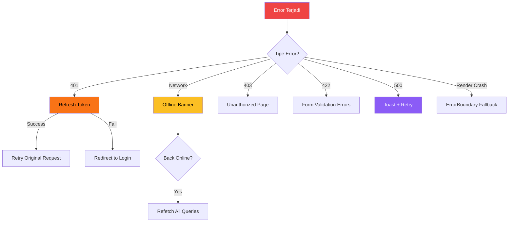

# 10 — Error Handling & UX: Bikin App yang Gak Malu-maluin Pas Error

> *"Lo pernah pake app yang tiba-tiba blank putih? Gak ada pesan error, gak ada tombol retry, cuma... kosong. Lo refresh, masih kosong. Lo gak tau salah lo apa, app-nya kenapa, atau harus ngapain. Pengalaman kayak gitu bikin user uninstall app lo. Hari ini kita belajar bikin app yang ERROR dengan ELEGAN — kasih tau user apa yang terjadi, apa yang bisa mereka lakuin, dan auto-recover kalau bisa."*

## 🎯 Yang Bakal Lo Pelajarin

- Error Boundaries — catch React render errors
- Toast notifications (react-hot-toast / sonner)
- Global Axios error handler
- Retry UI pattern
- Offline detection hook
- Skeleton loading
- Optimistic UI patterns
- Build: App yang handle semua failure mode

## 💥 Error Boundaries — Safety Net buat Render Errors

Error Boundary itu component yang CATCH error saat rendering. Tanpa ini, satu component error = SELURUH app crash (blank putih).

```tsx
// src/components/ErrorBoundary.tsx
import { Component, ErrorInfo, ReactNode } from 'react';

interface Props {
  children: ReactNode;
  fallback?: ReactNode | ((error: Error, reset: () => void) => ReactNode);
  onError?: (error: Error, info: ErrorInfo) => void;
}

interface State {
  hasError: boolean;
  error: Error | null;
}

export class ErrorBoundary extends Component<Props, State> {
  constructor(props: Props) {
    super(props);
    this.state = { hasError: false, error: null };
  }

  static getDerivedStateFromError(error: Error): State {
    return { hasError: true, error };
  }

  componentDidCatch(error: Error, info: ErrorInfo) {
    // Log ke error tracking service (Sentry, etc.)
    console.error('🔥 ErrorBoundary caught:', error, info);
    this.props.onError?.(error, info);
  }

  resetError = () => {
    this.setState({ hasError: false, error: null });
  };

  render() {
    if (this.state.hasError) {
      // Custom fallback
      if (typeof this.props.fallback === 'function') {
        return this.props.fallback(this.state.error!, this.resetError);
      }
      
      if (this.props.fallback) {
        return this.props.fallback;
      }

      // Default fallback
      return (
        <div style={{
          padding: 40,
          textAlign: 'center',
          fontFamily: 'system-ui',
          background: '#fef2f2',
          borderRadius: 12,
          margin: 20,
        }}>
          <h2 style={{ fontSize: 48, marginBottom: 8 }}>💥</h2>
          <h3>Oops, something went wrong</h3>
          <p style={{ color: '#6b7280' }}>{this.state.error?.message}</p>
          <button
            onClick={this.resetError}
            style={{
              marginTop: 16, padding: '10px 24px',
              background: '#3b82f6', color: '#fff',
              border: 'none', borderRadius: 8, cursor: 'pointer',
              fontSize: 16,
            }}
          >
            🔄 Try Again
          </button>
        </div>
      );
    }

    return this.props.children;
  }
}
```

### Pake dengan Granular Boundaries

```tsx
function App() {
  return (
    <div>
      <Navbar /> {/* Navbar gak dibungkus — kalo crash, ya crash semua */}
      
      <div style={{ display: 'grid', gridTemplateColumns: '1fr 1fr', gap: 16, padding: 16 }}>
        {/* Tiap section punya boundary sendiri */}
        <ErrorBoundary fallback={(error, reset) => (
          <div style={{ padding: 20, background: '#fee2e2', borderRadius: 8 }}>
            <p>📊 Stats unavailable: {error.message}</p>
            <button onClick={reset}>Retry</button>
          </div>
        )}>
          <StatsSection />
        </ErrorBoundary>

        <ErrorBoundary fallback={(error, reset) => (
          <div style={{ padding: 20, background: '#fef3c7', borderRadius: 8 }}>
            <p>📦 Orders unavailable: {error.message}</p>
            <button onClick={reset}>Retry</button>
          </div>
        )}>
          <OrdersSection />
        </ErrorBoundary>
      </div>
    </div>
  );
}
```

**Tanpa boundary:** 1 section error → SEMUA hilang
**Dengan boundary:** 1 section error → cuma section itu yang fallback, sisanya jalan

## 🍞 Toast Notifications

Toast itu notifikasi kecil yang muncul di pojok. Perfect buat feedback: "Saved!", "Error!", "Loading...".

### Setup sonner (ringan & elegan)

```bash
npm install sonner
```

```tsx
// src/main.tsx
import { Toaster } from 'sonner';

function App() {
  return (
    <>
      <Router />
      <Toaster
        position="top-right"
        richColors           // ← success = hijau, error = merah
        closeButton          // ← tombol close
        duration={4000}      // ← 4 detik
        toastOptions={{
          style: { fontFamily: 'system-ui' },
        }}
      />
    </>
  );
}
```

### Pake toast di mana aja

```tsx
import { toast } from 'sonner';

// ✅ Success
toast.success('User berhasil dibuat!');

// ❌ Error
toast.error('Gagal menyimpan data. Coba lagi.');

// ⏳ Loading → Success/Error
const saveUser = async (data: UserDTO) => {
  toast.promise(userService.create(data), {
    loading: 'Menyimpan user...',
    success: (user) => `${user.name} berhasil disimpan!`,
    error: (err) => `Gagal: ${err.message}`,
  });
};

// ℹ️ Info with action
toast('Session akan expired dalam 5 menit', {
  action: {
    label: 'Perpanjang',
    onClick: () => authService.refreshToken(),
  },
});

// Custom with JSX
toast.custom((id) => (
  <div style={{
    background: '#1e293b', color: '#fff',
    padding: 16, borderRadius: 8,
    display: 'flex', gap: 12, alignItems: 'center',
  }}>
    <span>🔔 New order received!</span>
    <button
      onClick={() => {
        navigate('/orders');
        toast.dismiss(id);
      }}
      style={{ background: '#3b82f6', color: '#fff', border: 'none', padding: '4px 12px', borderRadius: 4 }}
    >
      View
    </button>
  </div>
));
```

### Integrate dengan React Query

```tsx
const createMutation = useMutation({
  mutationFn: (data: CreateUserDTO) => userService.create(data),
  onSuccess: (user) => {
    toast.success(`${user.name} berhasil dibuat!`);
    queryClient.invalidateQueries({ queryKey: ['users'] });
  },
  onError: (error: ApiError) => {
    if (error.code === 'VALIDATION_ERROR' && error.details) {
      // Show validation errors
      const messages = Object.values(error.details).flat();
      messages.forEach(msg => toast.error(msg));
    } else {
      toast.error(error.message);
    }
  },
});
```

## 🌐 Global Axios Error Handler

Di chapter 05, kita udah bikin response interceptor. Sekarang tambahin toast integration:

```tsx
// src/lib/api.ts — tambahin toast ke interceptor
import { toast } from 'sonner';

api.interceptors.response.use(
  (response) => response,
  async (error: AxiosError) => {
    const status = error.response?.status || 0;

    // 🌐 Network error
    if (!error.response) {
      toast.error('Koneksi internet bermasalah. Cek koneksi lo.', {
        id: 'network-error', // ← prevent duplicate toast
        duration: 6000,
      });
      return Promise.reject({ message: 'Network error', status: 0, code: 'NETWORK_ERROR' });
    }

    // 🔐 401 — handled by refresh logic, no toast here
    if (status === 401) {
      // ... refresh token logic dari chapter 05
      return Promise.reject({ message: 'Session expired', status: 401, code: 'UNAUTHORIZED' });
    }

    // 🚫 403
    if (status === 403) {
      toast.error('Lo gak punya akses buat ini.');
      return Promise.reject({ message: 'Forbidden', status: 403, code: 'FORBIDDEN' });
    }

    // 💥 500
    if (status >= 500) {
      toast.error('Server error. Tim kita lagi fixing.', {
        id: 'server-error',
        action: {
          label: 'Retry',
          onClick: () => error.config && api.request(error.config),
        },
      });
      return Promise.reject({ message: 'Server error', status, code: 'SERVER_ERROR' });
    }

    // 429 Rate limit
    if (status === 429) {
      toast.error('Terlalu banyak request. Tunggu sebentar.');
      return Promise.reject({ message: 'Rate limited', status: 429, code: 'RATE_LIMITED' });
    }

    return Promise.reject({
      message: (error.response?.data as any)?.message || 'Something went wrong',
      status,
      code: 'UNKNOWN_ERROR',
    });
  }
);
```

## 🔄 Retry UI Pattern

```tsx
// src/components/RetryableContent.tsx
import { ReactNode, useState } from 'react';

interface RetryableProps {
  children: ReactNode;
  onRetry: () => void;
  error: string | null;
  isLoading: boolean;
}

export function RetryableContent({ children, onRetry, error, isLoading }: RetryableProps) {
  if (isLoading) {
    return (
      <div style={{ textAlign: 'center', padding: 40 }}>
        <div style={{
          width: 40, height: 40, margin: '0 auto 16px',
          border: '4px solid #e5e7eb',
          borderTop: '4px solid #3b82f6',
          borderRadius: '50%',
          animation: 'spin 1s linear infinite',
        }} />
        <p>Loading...</p>
        <style>{`@keyframes spin { to { transform: rotate(360deg); } }`}</style>
      </div>
    );
  }

  if (error) {
    return (
      <div style={{
        textAlign: 'center', padding: 40,
        background: '#fef2f2', borderRadius: 12,
      }}>
        <p style={{ fontSize: 48, margin: 0 }}>😵</p>
        <h3>Gagal memuat data</h3>
        <p style={{ color: '#6b7280' }}>{error}</p>
        <button
          onClick={onRetry}
          style={{
            marginTop: 12, padding: '10px 24px',
            background: '#3b82f6', color: '#fff',
            border: 'none', borderRadius: 8, cursor: 'pointer',
          }}
        >
          🔄 Coba Lagi
        </button>
      </div>
    );
  }

  return <>{children}</>;
}

// Pake dengan React Query
function UserList() {
  const { data, error, isLoading, refetch } = useQuery({
    queryKey: ['users'],
    queryFn: () => userService.getAll(),
  });

  return (
    <RetryableContent
      isLoading={isLoading}
      error={error ? (error as Error).message : null}
      onRetry={() => refetch()}
    >
      <ul>
        {data?.data.map(user => <li key={user.id}>{user.name}</li>)}
      </ul>
    </RetryableContent>
  );
}
```

## 📡 Offline Detection Hook

```tsx
// src/hooks/useOnlineStatus.ts
import { useState, useEffect } from 'react';
import { toast } from 'sonner';

export function useOnlineStatus() {
  const [isOnline, setIsOnline] = useState(navigator.onLine);

  useEffect(() => {
    const handleOnline = () => {
      setIsOnline(true);
      toast.success('Koneksi kembali! 🎉', { id: 'connection-status' });
    };

    const handleOffline = () => {
      setIsOnline(false);
      toast.error('Lo offline. Beberapa fitur mungkin gak jalan.', {
        id: 'connection-status',
        duration: Infinity, // stay until online
      });
    };

    window.addEventListener('online', handleOnline);
    window.addEventListener('offline', handleOffline);

    return () => {
      window.removeEventListener('online', handleOnline);
      window.removeEventListener('offline', handleOffline);
    };
  }, []);

  return isOnline;
}

// Pake di App
function App() {
  const isOnline = useOnlineStatus();

  return (
    <div>
      {!isOnline && (
        <div style={{
          background: '#fbbf24', color: '#000',
          padding: 8, textAlign: 'center',
          position: 'sticky', top: 0, zIndex: 1000,
        }}>
          ⚠️ Lo lagi offline. Data yang ditampilin mungkin outdated.
        </div>
      )}
      <Router />
    </div>
  );
}
```

## 💀 Skeleton Loading

Skeleton = placeholder UI yang mirip layout asli. Lebih bagus dari spinner karena user tau BENTUK konten yang bakal muncul.

```tsx
// src/components/Skeleton.tsx
import { CSSProperties } from 'react';

interface SkeletonProps {
  width?: string | number;
  height?: string | number;
  borderRadius?: string | number;
  style?: CSSProperties;
}

export function Skeleton({
  width = '100%',
  height = 20,
  borderRadius = 4,
  style,
}: SkeletonProps) {
  return (
    <div
      style={{
        width,
        height,
        borderRadius,
        background: 'linear-gradient(90deg, #e5e7eb 25%, #f3f4f6 50%, #e5e7eb 75%)',
        backgroundSize: '200% 100%',
        animation: 'shimmer 1.5s ease-in-out infinite',
        ...style,
      }}
    >
      <style>{`
        @keyframes shimmer {
          0% { background-position: -200% 0; }
          100% { background-position: 200% 0; }
        }
      `}</style>
    </div>
  );
}

// Skeleton buat card
export function CardSkeleton() {
  return (
    <div style={{ border: '1px solid #e5e7eb', borderRadius: 8, padding: 16 }}>
      <Skeleton width={120} height={16} style={{ marginBottom: 12 }} />
      <Skeleton width="80%" height={32} style={{ marginBottom: 8 }} />
      <Skeleton width="60%" height={14} />
    </div>
  );
}

// Skeleton buat table row
export function TableRowSkeleton({ columns = 4 }: { columns?: number }) {
  return (
    <tr>
      {Array.from({ length: columns }).map((_, i) => (
        <td key={i} style={{ padding: 12 }}>
          <Skeleton width={`${60 + Math.random() * 30}%`} height={16} />
        </td>
      ))}
    </tr>
  );
}

// Skeleton buat user list
export function UserListSkeleton({ count = 5 }: { count?: number }) {
  return (
    <div>
      {Array.from({ length: count }).map((_, i) => (
        <div key={i} style={{
          display: 'flex', alignItems: 'center', gap: 12,
          padding: 12, borderBottom: '1px solid #f3f4f6',
        }}>
          <Skeleton width={40} height={40} borderRadius="50%" />
          <div style={{ flex: 1 }}>
            <Skeleton width={150} height={16} style={{ marginBottom: 6 }} />
            <Skeleton width={200} height={12} />
          </div>
        </div>
      ))}
    </div>
  );
}
```

```tsx
// Pake di component
function UserList() {
  const { data, isLoading } = useQuery({
    queryKey: ['users'],
    queryFn: () => userService.getAll(),
  });

  if (isLoading) return <UserListSkeleton count={5} />;

  return (
    <div>
      {data?.data.map(user => (
        <div key={user.id} style={{
          display: 'flex', alignItems: 'center', gap: 12,
          padding: 12, borderBottom: '1px solid #f3f4f6',
        }}>
          
          <div>
            <p style={{ fontWeight: 'bold', margin: 0 }}>{user.name}</p>
            <p style={{ color: '#6b7280', margin: 0, fontSize: 14 }}>{user.email}</p>
          </div>
        </div>
      ))}
    </div>
  );
}
```

## 🏗️ Build: Resilient App

Combine SEMUA pattern jadi satu app yang gracefully handle APAPUN.

```tsx
// src/App.tsx — COMPLETE RESILIENT APP
import { useState, useEffect } from 'react';
import {
  useQuery,
  useMutation,
  useQueryClient,
  QueryClient,
  QueryClientProvider,
} from '@tanstack/react-query';
import { Toaster, toast } from 'sonner';
import axios from 'axios';
import { ErrorBoundary } from './components/ErrorBoundary';
import { useOnlineStatus } from './hooks/useOnlineStatus';
import { Skeleton, CardSkeleton, UserListSkeleton } from './components/Skeleton';

// ============ API SETUP ============
const api = axios.create({ baseURL: 'http://localhost:3001/api' });

// Global error handler
api.interceptors.response.use(
  res => res,
  error => {
    if (!error.response) {
      toast.error('Network error — cek koneksi internet lo', { id: 'network' });
    } else if (error.response.status >= 500) {
      toast.error('Server error — coba lagi nanti', { id: 'server' });
    }
    return Promise.reject(error);
  }
);

const queryClient = new QueryClient({
  defaultOptions: {
    queries: {
      retry: 2,
      staleTime: 30000,
      // Gak refetch saat offline
      networkMode: 'online',
    },
    mutations: {
      networkMode: 'online',
    },
  },
});

interface User {
  id: string;
  name: string;
  email: string;
}

// ============ STATS (with placeholder) ============
function StatsSection() {
  const { data, isLoading, isPlaceholderData } = useQuery({
    queryKey: ['stats'],
    queryFn: () => api.get('/stats').then(r => r.data),
    placeholderData: { totalUsers: '—', totalOrders: '—', revenue: 0 },
    throwOnError: true, // ← throw ke ErrorBoundary
  });

  return (
    <div style={{
      display: 'grid', gridTemplateColumns: 'repeat(3, 1fr)',
      gap: 12, opacity: isPlaceholderData ? 0.5 : 1,
      transition: 'opacity 0.3s',
    }}>
      {isLoading ? (
        <>
          <CardSkeleton />
          <CardSkeleton />
          <CardSkeleton />
        </>
      ) : (
        <>
          <StatCard title="👥 Users" value={data?.totalUsers} />
          <StatCard title="📦 Orders" value={data?.totalOrders} />
          <StatCard title="💰 Revenue" value={`Rp${data?.revenue?.toLocaleString()}`} />
        </>
      )}
    </div>
  );
}

function StatCard({ title, value }: { title: string; value: any }) {
  return (
    <div style={{ border: '1px solid #e5e7eb', borderRadius: 8, padding: 16 }}>
      <h4 style={{ margin: 0, color: '#6b7280' }}>{title}</h4>
      <p style={{ fontSize: 28, fontWeight: 'bold', margin: '8px 0 0' }}>{value}</p>
    </div>
  );
}

// ============ USER LIST (with skeleton + optimistic) ============
function UsersSection() {
  const client = useQueryClient();
  const [newName, setNewName] = useState('');

  const { data: users = [], isLoading, error, refetch } = useQuery<User[]>({
    queryKey: ['users'],
    queryFn: () => api.get('/users').then(r => r.data),
  });

  const deleteMutation = useMutation({
    mutationFn: (id: string) => api.delete(`/users/${id}`),
    // Optimistic delete
    onMutate: async (id) => {
      await client.cancelQueries({ queryKey: ['users'] });
      const prev = client.getQueryData<User[]>(['users']);
      client.setQueryData<User[]>(['users'], old => old?.filter(u => u.id !== id));
      toast.success('User dihapus');
      return { prev };
    },
    onError: (_, __, ctx) => {
      if (ctx?.prev) client.setQueryData(['users'], ctx.prev);
      toast.error('Gagal hapus user');
    },
    onSettled: () => client.invalidateQueries({ queryKey: ['users'] }),
  });

  const addMutation = useMutation({
    mutationFn: (name: string) => api.post('/users', { name, email: `${name.toLowerCase()}@eth.jkt` }),
    onSuccess: () => {
      toast.success('User berhasil ditambah!');
      client.invalidateQueries({ queryKey: ['users'] });
      setNewName('');
    },
    onError: () => toast.error('Gagal menambah user'),
  });

  // Loading state
  if (isLoading) return <UserListSkeleton count={3} />;

  // Error state with retry
  if (error) {
    return (
      <div style={{ textAlign: 'center', padding: 30, background: '#fef2f2', borderRadius: 8 }}>
        <p>😵 Gagal memuat users</p>
        <p style={{ color: '#6b7280', fontSize: 14 }}>{(error as Error).message}</p>
        <button
          onClick={() => refetch()}
          style={{
            marginTop: 12, padding: '8px 20px',
            background: '#3b82f6', color: '#fff',
            border: 'none', borderRadius: 6, cursor: 'pointer',
          }}
        >
          🔄 Coba Lagi
        </button>
      </div>
    );
  }

  return (
    <div>
      {/* Add user form */}
      <form
        onSubmit={e => {
          e.preventDefault();
          if (newName.trim()) addMutation.mutate(newName.trim());
        }}
        style={{ display: 'flex', gap: 8, marginBottom: 16 }}
      >
        <input
          value={newName}
          onChange={e => setNewName(e.target.value)}
          placeholder="Nama user baru..."
          style={{ flex: 1, padding: 8, fontSize: 14 }}
        />
        <button
          type="submit"
          disabled={addMutation.isPending}
          style={{ padding: '8px 16px', background: '#22c55e', color: '#fff', border: 'none', borderRadius: 6 }}
        >
          {addMutation.isPending ? '...' : '➕ Add'}
        </button>
      </form>

      {/* User list */}
      {users.map(user => (
        <div key={user.id} style={{
          display: 'flex', justifyContent: 'space-between', alignItems: 'center',
          padding: 12, borderBottom: '1px solid #f3f4f6',
        }}>
          <div>
            <p style={{ fontWeight: 'bold', margin: 0 }}>{user.name}</p>
            <p style={{ color: '#6b7280', margin: 0, fontSize: 13 }}>{user.email}</p>
          </div>
          <button
            onClick={() => deleteMutation.mutate(user.id)}
            style={{ background: 'none', border: 'none', cursor: 'pointer', fontSize: 18 }}
          >
            🗑️
          </button>
        </div>
      ))}
    </div>
  );
}

// ============ MAIN APP ============
function Dashboard() {
  const isOnline = useOnlineStatus();

  return (
    <div style={{ maxWidth: 800, margin: '0 auto', padding: 20, fontFamily: 'system-ui' }}>
      {/* Offline banner */}
      {!isOnline && (
        <div style={{
          background: '#fbbf24', color: '#000', padding: 10,
          textAlign: 'center', borderRadius: 8, marginBottom: 16,
        }}>
          ⚠️ Lo lagi offline. Data mungkin outdated.
        </div>
      )}

      <h1>📊 Resilient Dashboard</h1>

      {/* Stats — ErrorBoundary per section */}
      <section style={{ marginBottom: 24 }}>
        <h2>Stats</h2>
        <ErrorBoundary fallback={(err, reset) => (
          <div style={{ padding: 20, background: '#fee2e2', borderRadius: 8 }}>
            <p>📊 Stats error: {err.message}</p>
            <button onClick={reset}>Retry</button>
          </div>
        )}>
          <StatsSection />
        </ErrorBoundary>
      </section>

      {/* Users — independent section */}
      <section>
        <h2>Users</h2>
        <ErrorBoundary fallback={(err, reset) => (
          <div style={{ padding: 20, background: '#fef3c7', borderRadius: 8 }}>
            <p>👥 Users error: {err.message}</p>
            <button onClick={reset}>Retry</button>
          </div>
        )}>
          <UsersSection />
        </ErrorBoundary>
      </section>
    </div>
  );
}

export default function App() {
  return (
    <QueryClientProvider client={queryClient}>
      <Dashboard />
      <Toaster position="top-right" richColors closeButton />
    </QueryClientProvider>
  );
}
```

## 📊 Error Handling Matrix

Ini cheatsheet kapan pake pattern apa:

| Error Type | Detection | UI Response | Recovery |
|---|---|---|---|
| **Network offline** | `useOnlineStatus` hook | Banner + disable mutations | Auto-recover saat online |
| **API 401** | Axios interceptor | Toast + redirect login | Auto refresh token |
| **API 403** | Axios interceptor | Toast + redirect unauthorized | — |
| **API 422** | Mutation `onError` | Inline validation errors | User fix form |
| **API 500** | Axios interceptor | Toast + retry button | Retry |
| **Render crash** | ErrorBoundary | Fallback UI + reset button | Reset boundary |
| **Loading state** | React Query `isLoading` | Skeleton | — |
| **Stale data** | React Query `isPlaceholderData` | Dimmed UI + background fetch | Auto |



## 🎓 Key Takeaways

1. **Error Boundaries** — catch render errors, bungkus per section bukan cuma di root
2. **Toast** — feedback ringan buat actions (save, delete, error)
3. **Global interceptor** — satu tempat handle 401, 403, 500, network errors
4. **Skeleton > Spinner** — user tau bentuk content yang bakal muncul
5. **Offline detection** — kasih tau user, disable mutations, auto-recover
6. **Optimistic UI** — instant feedback, rollback kalau gagal
7. **Retry pattern** — kasih user KONTROL buat coba lagi

**Prinsip utama: User SELALU tau apa yang terjadi dan apa yang bisa mereka lakuin.**

## 🗺️ Navigasi

| Prev | Series |
|---|---|
| [09 — Protected Routes](https://github.com/Ethereum-Jakarta/phase-2-week4-state-and-api/blob/main/study-material/09-protected-routes.md) | [Back to Week 4 Overview](https://github.com/Ethereum-Jakarta/phase-2-week4-state-and-api/blob/main/README.md) |
