# 🔌 Materi 12: WebSocket — Real-time Beyond REST

## Kenapa REST Ngga Cukup?

Oke gue mau kalian bayangin ini: kalian bikin app chat. Pake REST API biasa. Gimana caranya tau ada pesan baru?

**Polling — The Naive Approach:**

```javascript
// Tiap 3 detik, tanya server: "Ada pesan baru ngga?"
setInterval(async () => {
  const { data } = await axios.get('/api/messages?since=' + lastTimestamp);
  if (data.length > 0) {
    setMessages(prev => [...prev, ...data]);
  }
}, 3000);
```

Masalahnya:
- **Boros bandwidth**: 99% request return empty response
- **Delay**: Worst case, pesan baru baru kedetect 3 detik kemudian
- **Server stress**: 1000 user = 333 requests/second ke server
- **Battery drain** di mobile

**Apa yang kita butuhkan:** Server bisa **push** data ke client **kapanpun** tanpa client harus minta dulu.

Enter: **WebSocket** 🎯

---

## 1. WebSocket Fundamentals

### HTTP vs WebSocket

```mermaid
sequenceDiagram
    participant Client
    participant Server

    Note over Client,Server: HTTP (Request-Response)
    Client->>Server: GET /api/messages
    Server-->>Client: [messages]
    Client->>Server: GET /api/messages
    Server-->>Client: [messages]
    Client->>Server: GET /api/messages
    Server-->>Client: [] (nothing new)

    Note over Client,Server: WebSocket (Persistent Connection)
    Client->>Server: HTTP Upgrade Request
    Server-->>Client: 101 Switching Protocols
    Note over Client,Server: 🤝 Connection established!
    Server-->>Client: New message: "hey!"
    Client->>Server: "hey back!"
    Server-->>Client: User X is typing...
    Server-->>Client: New message from Y
```



### Key Differences

| Feature | HTTP | WebSocket |
|---|---|---|
| Connection | New per request | Persistent |
| Direction | Client → Server only | Bidirectional |
| Overhead | Headers every request | Minimal after handshake |
| Protocol | `http://` / `https://` | `ws://` / `wss://` |
| Use Case | CRUD, static data | Real-time, live updates |

### How WebSocket Works

1. **Handshake**: Client kirim HTTP request dengan header `Upgrade: websocket`
2. **Upgrade**: Server respond `101 Switching Protocols`
3. **Connection**: Sekarang kedua sisi bisa kirim data kapan aja
4. **Frames**: Data dikirim sebagai "frames" — lightweight, minimal overhead
5. **Close**: Salah satu sisi bisa close connection

```
Browser                          Server
  |                                |
  |--- HTTP GET /socket.io ----->>|
  |    Upgrade: websocket          |
  |    Connection: Upgrade         |
  |                                |
  |<<-- 101 Switching Protocols ---|
  |                                |
  |<<======= WebSocket ==========>>|
  |   Full-duplex communication    |
  |   Low latency, low overhead    |
  |<<======= WebSocket ==========>>|
```

---

## 2. Socket.IO — WebSocket Made Easy

### Kenapa Socket.IO?

Raw WebSocket API itu low-level. Socket.IO nambahin:
- **Auto-reconnection** — connection drop? Reconnect otomatis
- **Fallback** — kalo WebSocket ngga support, fallback ke long-polling
- **Rooms & namespaces** — organize connections
- **Event-based** — lebih clean daripada raw message passing
- **Acknowledgements** — confirm message delivery
- **Broadcasting** — kirim ke semua client sekaligus

### Install

```bash
# Backend (Express)
npm install socket.io

# Frontend (React)
npm install socket.io-client
```

### Backend Setup (Express + Socket.IO)

Sebelum kita fokus ke React, ini backend-nya biar kalian tau context-nya:

```javascript
// backend/server.js
import express from 'express';
import { createServer } from 'http';
import { Server } from 'socket.io';

const app = express();
const httpServer = createServer(app);
const io = new Server(httpServer, {
  cors: {
    origin: ['http://localhost:5173'],
    methods: ['GET', 'POST'],
    credentials: true,
  },
});

// Track connected users
const onlineUsers = new Map();

io.on('connection', (socket) => {
  console.log(`User connected: ${socket.id}`);

  // User join
  socket.on('user:join', (userData) => {
    onlineUsers.set(socket.id, userData);
    // Broadcast ke semua client
    io.emit('users:online', Array.from(onlineUsers.values()));
    // Notify others
    socket.broadcast.emit('notification', {
      type: 'user_joined',
      message: `${userData.name} is now online`,
      timestamp: new Date().toISOString(),
    });
  });

  // Handle chat message
  socket.on('message:send', (message) => {
    // Broadcast message ke semua (termasuk sender)
    io.emit('message:new', {
      id: Date.now().toString(),
      ...message,
      timestamp: new Date().toISOString(),
    });
  });

  // Handle typing indicator
  socket.on('typing:start', (userName) => {
    socket.broadcast.emit('typing:update', { user: userName, isTyping: true });
  });

  socket.on('typing:stop', (userName) => {
    socket.broadcast.emit('typing:update', { user: userName, isTyping: false });
  });

  // Disconnect
  socket.on('disconnect', () => {
    const user = onlineUsers.get(socket.id);
    onlineUsers.delete(socket.id);
    io.emit('users:online', Array.from(onlineUsers.values()));
    if (user) {
      io.emit('notification', {
        type: 'user_left',
        message: `${user.name} went offline`,
        timestamp: new Date().toISOString(),
      });
    }
    console.log(`User disconnected: ${socket.id}`);
  });
});

httpServer.listen(3000, () => {
  console.log('Server running on port 3000');
});
```

---

## 3. Socket.IO Client di React

### Basic Connection

```javascript
// src/lib/socket.js
import { io } from 'socket.io-client';

const SOCKET_URL = import.meta.env.VITE_WS_URL || 'http://localhost:3000';

export const socket = io(SOCKET_URL, {
  autoConnect: false,       // Jangan connect otomatis, kita control manual
  reconnection: true,
  reconnectionAttempts: 5,
  reconnectionDelay: 1000,
  timeout: 10000,
  auth: {
    // Token bisa di-pass di sini
    // token: localStorage.getItem('token'),
  },
});

export default socket;
```

### Socket Context Provider

Biar socket accessible di seluruh app:

```jsx
// src/contexts/SocketContext.jsx
import { createContext, useContext, useEffect, useState } from 'react';
import socket from '../lib/socket';

const SocketContext = createContext(null);

export function SocketProvider({ children }) {
  const [isConnected, setIsConnected] = useState(false);
  const [connectionError, setConnectionError] = useState(null);

  useEffect(() => {
    // Connect
    socket.connect();

    function onConnect() {
      console.log('🟢 Socket connected:', socket.id);
      setIsConnected(true);
      setConnectionError(null);
    }

    function onDisconnect(reason) {
      console.log('🔴 Socket disconnected:', reason);
      setIsConnected(false);
    }

    function onError(error) {
      console.error('⚠️ Socket error:', error);
      setConnectionError(error.message);
    }

    socket.on('connect', onConnect);
    socket.on('disconnect', onDisconnect);
    socket.on('connect_error', onError);

    // Cleanup
    return () => {
      socket.off('connect', onConnect);
      socket.off('disconnect', onDisconnect);
      socket.off('connect_error', onError);
      socket.disconnect();
    };
  }, []);

  return (
    <SocketContext.Provider value={{ socket, isConnected, connectionError }}>
      {children}
    </SocketContext.Provider>
  );
}

export function useSocket() {
  const context = useContext(SocketContext);
  if (!context) {
    throw new Error('useSocket must be used within SocketProvider');
  }
  return context;
}
```

### Custom Hook: useSocketEvent

Hook reusable buat listen ke socket events:

```javascript
// src/hooks/useSocketEvent.js
import { useEffect } from 'react';
import { useSocket } from '../contexts/SocketContext';

export function useSocketEvent(event, handler) {
  const { socket } = useSocket();

  useEffect(() => {
    socket.on(event, handler);
    return () => {
      socket.off(event, handler);
    };
  }, [socket, event, handler]);
}
```

```javascript
// src/hooks/useSocketEmit.js
import { useCallback } from 'react';
import { useSocket } from '../contexts/SocketContext';

export function useSocketEmit() {
  const { socket, isConnected } = useSocket();

  const emit = useCallback((event, data) => {
    if (isConnected) {
      socket.emit(event, data);
    } else {
      console.warn('Socket not connected. Cannot emit:', event);
    }
  }, [socket, isConnected]);

  return emit;
}
```

---

## 4. Build: Live Notification System 🔔

Sekarang kita bikin notification system beneran. Ini pattern yang dipake di banyak production app.

### Architecture


### Step 1: Notification Store (Zustand)

```javascript
// src/stores/notificationStore.js
import { create } from 'zustand';

const useNotificationStore = create((set, get) => ({
  notifications: [],
  unreadCount: 0,

  addNotification: (notification) => {
    const newNotification = {
      id: notification.id || Date.now().toString(),
      type: notification.type || 'info', // info, success, warning, error
      title: notification.title,
      message: notification.message,
      timestamp: notification.timestamp || new Date().toISOString(),
      read: false,
      link: notification.link || null,
    };

    set((state) => ({
      notifications: [newNotification, ...state.notifications].slice(0, 50), // Keep max 50
      unreadCount: state.unreadCount + 1,
    }));
  },

  markAsRead: (id) => {
    set((state) => ({
      notifications: state.notifications.map((n) =>
        n.id === id ? { ...n, read: true } : n
      ),
      unreadCount: Math.max(0, state.unreadCount - 1),
    }));
  },

  markAllAsRead: () => {
    set((state) => ({
      notifications: state.notifications.map((n) => ({ ...n, read: true })),
      unreadCount: 0,
    }));
  },

  clearAll: () => {
    set({ notifications: [], unreadCount: 0 });
  },

  removeNotification: (id) => {
    set((state) => {
      const notification = state.notifications.find((n) => n.id === id);
      return {
        notifications: state.notifications.filter((n) => n.id !== id),
        unreadCount: notification && !notification.read
          ? Math.max(0, state.unreadCount - 1)
          : state.unreadCount,
      };
    });
  },
}));

export default useNotificationStore;
```

### Step 2: Notification Hook (Socket + Store bridge)

> 💡 **Note:** Contoh ini pake `react-hot-toast` (`npm install react-hot-toast`). Kalau project kalian udah pake `sonner` (dari materi 10), tinggal ganti import dan API-nya mirip.

```javascript
// src/hooks/useNotifications.js
import { useEffect, useCallback } from 'react';
import { useSocket } from '../contexts/SocketContext';
import useNotificationStore from '../stores/notificationStore';
import toast from 'react-hot-toast';

export function useNotifications() {
  const { socket, isConnected } = useSocket();
  const {
    notifications,
    unreadCount,
    addNotification,
    markAsRead,
    markAllAsRead,
    removeNotification,
  } = useNotificationStore();

  useEffect(() => {
    if (!socket || !isConnected) return;

    // Listen for notifications from server
    function handleNotification(data) {
      addNotification(data);

      // Show toast notification
      const toastType = data.type === 'error' ? toast.error
        : data.type === 'success' ? toast.success
        : toast;

      toastType(data.message, {
        duration: 4000,
        icon: getNotificationIcon(data.type),
      });
    }

    // Listen for specific events
    function handleOrderUpdate(data) {
      addNotification({
        type: 'info',
        title: 'Order Update',
        message: `Order #${data.orderId} status: ${data.status}`,
        link: `/orders/${data.orderId}`,
      });
    }

    function handleInventoryAlert(data) {
      addNotification({
        type: 'warning',
        title: 'Low Stock Alert',
        message: `${data.productName} — only ${data.quantity} left!`,
        link: `/products/${data.productId}`,
      });
    }

    socket.on('notification', handleNotification);
    socket.on('order:updated', handleOrderUpdate);
    socket.on('inventory:alert', handleInventoryAlert);

    return () => {
      socket.off('notification', handleNotification);
      socket.off('order:updated', handleOrderUpdate);
      socket.off('inventory:alert', handleInventoryAlert);
    };
  }, [socket, isConnected, addNotification]);

  return {
    notifications,
    unreadCount,
    markAsRead,
    markAllAsRead,
    removeNotification,
  };
}

function getNotificationIcon(type) {
  switch (type) {
    case 'success': return '✅';
    case 'warning': return '⚠️';
    case 'error': return '❌';
    case 'user_joined': return '👋';
    case 'user_left': return '👋';
    default: return 'ℹ️';
  }
}
```

### Step 3: Notification Bell Component

```jsx
// src/components/NotificationBell.jsx
import { useState, useRef, useEffect } from 'react';
import { useNotifications } from '../hooks/useNotifications';

export function NotificationBell() {
  const [isOpen, setIsOpen] = useState(false);
  const panelRef = useRef(null);
  const {
    notifications,
    unreadCount,
    markAsRead,
    markAllAsRead,
  } = useNotifications();

  // Close panel when clicking outside
  useEffect(() => {
    function handleClickOutside(e) {
      if (panelRef.current && !panelRef.current.contains(e.target)) {
        setIsOpen(false);
      }
    }
    document.addEventListener('mousedown', handleClickOutside);
    return () => document.removeEventListener('mousedown', handleClickOutside);
  }, []);

  return (
    <div className="relative" ref={panelRef}>
      {/* Bell Button */}
      <button
        onClick={() => setIsOpen(!isOpen)}
        className="relative p-2 rounded-full hover:bg-gray-100 transition-colors"
        aria-label={`Notifications (${unreadCount} unread)`}
      >
        <svg className="w-6 h-6" fill="none" stroke="currentColor" viewBox="0 0 24 24">
          <path strokeLinecap="round" strokeLinejoin="round" strokeWidth={2}
            d="M15 17h5l-1.405-1.405A2.032 2.032 0 0118 14.158V11a6.002 6.002 0 00-4-5.659V5a2 2 0 10-4 0v.341C7.67 6.165 6 8.388 6 11v3.159c0 .538-.214 1.055-.595 1.436L4 17h5m6 0v1a3 3 0 11-6 0v-1m6 0H9" />
        </svg>

        {/* Badge */}
        {unreadCount > 0 && (
          <span className="absolute -top-1 -right-1 bg-red-500 text-white text-xs font-bold rounded-full w-5 h-5 flex items-center justify-center animate-pulse">
            {unreadCount > 9 ? '9+' : unreadCount}
          </span>
        )}
      </button>

      {/* Panel */}
      {isOpen && (
        <div className="absolute right-0 mt-2 w-80 bg-white rounded-lg shadow-lg border z-50 max-h-96 overflow-hidden">
          {/* Header */}
          <div className="flex items-center justify-between p-3 border-b">
            <h3 className="font-semibold text-gray-900">Notifications</h3>
            {unreadCount > 0 && (
              <button
                onClick={markAllAsRead}
                className="text-sm text-blue-600 hover:text-blue-800"
              >
                Mark all read
              </button>
            )}
          </div>

          {/* Notification List */}
          <div className="overflow-y-auto max-h-72">
            {notifications.length === 0 ? (
              <div className="p-4 text-center text-gray-500">
                No notifications yet 🔔
              </div>
            ) : (
              notifications.map((notification) => (
                <NotificationItem
                  key={notification.id}
                  notification={notification}
                  onRead={() => markAsRead(notification.id)}
                />
              ))
            )}
          </div>
        </div>
      )}
    </div>
  );
}

function NotificationItem({ notification, onRead }) {
  const timeAgo = getTimeAgo(notification.timestamp);
  
  return (
    <div
      onClick={onRead}
      className={`p-3 border-b cursor-pointer hover:bg-gray-50 transition-colors ${
        !notification.read ? 'bg-blue-50' : ''
      }`}
    >
      <div className="flex items-start gap-2">
        <span className="text-lg mt-0.5">
          {getNotificationIcon(notification.type)}
        </span>
        <div className="flex-1 min-w-0">
          {notification.title && (
            <p className="font-medium text-sm text-gray-900">
              {notification.title}
            </p>
          )}
          <p className="text-sm text-gray-600 truncate">
            {notification.message}
          </p>
          <p className="text-xs text-gray-400 mt-1">{timeAgo}</p>
        </div>
        {!notification.read && (
          <span className="w-2 h-2 bg-blue-500 rounded-full mt-2 flex-shrink-0" />
        )}
      </div>
    </div>
  );
}

function getNotificationIcon(type) {
  const icons = {
    success: '✅',
    warning: '⚠️',
    error: '❌',
    info: 'ℹ️',
    user_joined: '👋',
    user_left: '🚪',
  };
  return icons[type] || 'ℹ️';
}

function getTimeAgo(timestamp) {
  const seconds = Math.floor((new Date() - new Date(timestamp)) / 1000);
  if (seconds < 60) return 'just now';
  if (seconds < 3600) return `${Math.floor(seconds / 60)}m ago`;
  if (seconds < 86400) return `${Math.floor(seconds / 3600)}h ago`;
  return `${Math.floor(seconds / 86400)}d ago`;
}
```

### Step 4: Putting It All Together

```jsx
// src/App.jsx
import { QueryClientProvider } from '@tanstack/react-query';
import { Toaster } from 'react-hot-toast';
import { SocketProvider } from './contexts/SocketContext';
import { NotificationBell } from './components/NotificationBell';
import { ConnectionStatus } from './components/ConnectionStatus';
import queryClient from './lib/queryClient';

function App() {
  return (
    <QueryClientProvider client={queryClient}>
      <SocketProvider>
        <div className="min-h-screen">
          {/* Navbar */}
          <nav className="bg-white shadow px-4 py-3 flex items-center justify-between">
            <h1 className="text-xl font-bold">Inventory Manager</h1>
            <div className="flex items-center gap-4">
              <ConnectionStatus />
              <NotificationBell />
              <UserMenu />
            </div>
          </nav>

          {/* Main Content */}
          <main className="container mx-auto p-4">
            {/* Routes here */}
          </main>
        </div>
        <Toaster position="top-right" />
      </SocketProvider>
    </QueryClientProvider>
  );
}
```

```jsx
// src/components/ConnectionStatus.jsx
import { useSocket } from '../contexts/SocketContext';

export function ConnectionStatus() {
  const { isConnected, connectionError } = useSocket();
  
  if (connectionError) {
    return (
      <div className="flex items-center gap-1 text-red-500 text-sm">
        <span className="w-2 h-2 bg-red-500 rounded-full" />
        Connection Error
      </div>
    );
  }

  return (
    <div className={`flex items-center gap-1 text-sm ${
      isConnected ? 'text-green-500' : 'text-yellow-500'
    }`}>
      <span className={`w-2 h-2 rounded-full ${
        isConnected ? 'bg-green-500' : 'bg-yellow-500 animate-pulse'
      }`} />
      {isConnected ? 'Connected' : 'Reconnecting...'}
    </div>
  );
}
```

---

## 5. Real-time Update Patterns

### Pattern 1: Socket + React Query Invalidation

Ini **best pattern** — pake Socket buat tau kapan data berubah, React Query buat fetch data terbaru:

```javascript
// src/hooks/useRealtimeProducts.js
import { useEffect } from 'react';
import { useQueryClient } from '@tanstack/react-query';
import { useSocket } from '../contexts/SocketContext';
import { useProducts } from './useProducts'; // existing React Query hook

export function useRealtimeProducts() {
  const queryClient = useQueryClient();
  const { socket, isConnected } = useSocket();
  const productsQuery = useProducts(); // Regular React Query hook

  useEffect(() => {
    if (!socket || !isConnected) return;

    // When server tells us products changed, invalidate the query
    function handleProductChange(event) {
      console.log('Product changed:', event.type, event.productId);
      
      // Invalidate — React Query will refetch automatically
      queryClient.invalidateQueries({ queryKey: ['products'] });
      
      // If it's a specific product, invalidate that too
      if (event.productId) {
        queryClient.invalidateQueries({ 
          queryKey: ['product', event.productId] 
        });
      }
    }

    socket.on('product:created', handleProductChange);
    socket.on('product:updated', handleProductChange);
    socket.on('product:deleted', handleProductChange);

    return () => {
      socket.off('product:created', handleProductChange);
      socket.off('product:updated', handleProductChange);
      socket.off('product:deleted', handleProductChange);
    };
  }, [socket, isConnected, queryClient]);

  return productsQuery;
}
```

### Pattern 2: Direct State Update via Socket

Buat data yang benar-benar real-time (chat messages, live cursors):

```javascript
// src/hooks/useChat.js
import { useState, useEffect, useCallback } from 'react';
import { useSocket } from '../contexts/SocketContext';

export function useChat(roomId) {
  const { socket, isConnected } = useSocket();
  const [messages, setMessages] = useState([]);
  const [typingUsers, setTypingUsers] = useState([]);

  useEffect(() => {
    if (!socket || !isConnected) return;

    // Join room
    socket.emit('room:join', roomId);

    // Listen for messages
    function handleNewMessage(message) {
      setMessages((prev) => [...prev, message]);
    }

    function handleTyping({ user, isTyping }) {
      setTypingUsers((prev) =>
        isTyping
          ? [...new Set([...prev, user])]
          : prev.filter((u) => u !== user)
      );
    }

    socket.on('message:new', handleNewMessage);
    socket.on('typing:update', handleTyping);

    return () => {
      socket.emit('room:leave', roomId);
      socket.off('message:new', handleNewMessage);
      socket.off('typing:update', handleTyping);
    };
  }, [socket, isConnected, roomId]);

  const sendMessage = useCallback((text) => {
    if (socket && isConnected) {
      socket.emit('message:send', { roomId, text });
    }
  }, [socket, isConnected, roomId]);

  const startTyping = useCallback(() => {
    socket?.emit('typing:start', roomId);
  }, [socket, roomId]);

  const stopTyping = useCallback(() => {
    socket?.emit('typing:stop', roomId);
  }, [socket, roomId]);

  return {
    messages,
    typingUsers,
    sendMessage,
    startTyping,
    stopTyping,
  };
}
```

### Pattern 3: Optimistic + Socket Confirmation

```javascript
// Kirim message optimistic, update dengan server-confirmed version
const sendMessage = useCallback((text) => {
  const optimisticMessage = {
    id: `temp-${Date.now()}`,
    text,
    sender: currentUser,
    timestamp: new Date().toISOString(),
    status: 'sending', // Visual indicator
  };

  // Add immediately (optimistic)
  setMessages((prev) => [...prev, optimisticMessage]);

  // Send via socket with acknowledgement
  socket.emit('message:send', { roomId, text }, (serverMessage) => {
    // Replace optimistic with server-confirmed
    setMessages((prev) =>
      prev.map((m) =>
        m.id === optimisticMessage.id
          ? { ...serverMessage, status: 'sent' }
          : m
      )
    );
  });
}, [socket, roomId, currentUser]);
```

---

## 6. Authentication with WebSocket

Penting! WebSocket connection juga harus di-authenticate:

```javascript
// src/lib/socket.js
import { io } from 'socket.io-client';

export function createAuthenticatedSocket(token) {
  return io(import.meta.env.VITE_WS_URL || 'http://localhost:3000', {
    auth: {
      token: token,
    },
    autoConnect: true,
    reconnection: true,
    reconnectionAttempts: 5,
  });
}
```

```javascript
// Backend: verify token di connection
io.use((socket, next) => {
  const token = socket.handshake.auth.token;
  
  if (!token) {
    return next(new Error('Authentication required'));
  }

  try {
    const decoded = jwt.verify(token, process.env.JWT_SECRET);
    socket.userId = decoded.userId;
    socket.userName = decoded.name;
    next();
  } catch (err) {
    next(new Error('Invalid token'));
  }
});
```

```jsx
// src/contexts/SocketContext.jsx — with auth
import { useAuth } from './AuthContext';

export function SocketProvider({ children }) {
  const { token, isAuthenticated } = useAuth();
  const [socket, setSocket] = useState(null);
  const [isConnected, setIsConnected] = useState(false);

  useEffect(() => {
    if (!isAuthenticated || !token) return;

    const newSocket = createAuthenticatedSocket(token);

    newSocket.on('connect', () => setIsConnected(true));
    newSocket.on('disconnect', () => setIsConnected(false));
    newSocket.on('connect_error', (err) => {
      console.error('Socket auth error:', err.message);
      if (err.message === 'Invalid token') {
        // Token expired, trigger re-auth
        logout();
      }
    });

    setSocket(newSocket);

    return () => {
      newSocket.disconnect();
    };
  }, [isAuthenticated, token]);

  // ...
}
```

---

## 7. Error Handling & Reconnection

```javascript
// src/hooks/useSocketConnection.js
import { useEffect, useState } from 'react';
import { useSocket } from '../contexts/SocketContext';

export function useSocketConnection() {
  const { socket } = useSocket();
  const [status, setStatus] = useState('disconnected');
  const [reconnectAttempt, setReconnectAttempt] = useState(0);

  useEffect(() => {
    if (!socket) return;

    socket.on('connect', () => {
      setStatus('connected');
      setReconnectAttempt(0);
    });

    socket.on('disconnect', (reason) => {
      setStatus('disconnected');
      
      // These reasons mean connection won't auto-reconnect
      if (reason === 'io server disconnect') {
        // Server kicked us — maybe auth expired
        console.warn('Server disconnected us');
      }
    });

    socket.on('reconnect_attempt', (attempt) => {
      setStatus('reconnecting');
      setReconnectAttempt(attempt);
    });

    socket.on('reconnect', () => {
      setStatus('connected');
      setReconnectAttempt(0);
      // Re-join rooms, re-subscribe, etc.
    });

    socket.on('reconnect_failed', () => {
      setStatus('failed');
    });

    return () => {
      socket.off('connect');
      socket.off('disconnect');
      socket.off('reconnect_attempt');
      socket.off('reconnect');
      socket.off('reconnect_failed');
    };
  }, [socket]);

  return { status, reconnectAttempt };
}
```

---

## 8. Vite Proxy untuk WebSocket

Jangan lupa setup proxy buat WebSocket di development:

```javascript
// vite.config.js
export default defineConfig({
  plugins: [react()],
  server: {
    proxy: {
      '/api': {
        target: 'http://localhost:3000',
        changeOrigin: true,
      },
      '/socket.io': {
        target: 'http://localhost:3000',
        changeOrigin: true,
        ws: true, // ← INI PENTING buat WebSocket!
      },
    },
  },
});
```

---

## 9. When to Use WebSocket vs REST

```mermaid
flowchart TD
    A[Butuh real-time updates?] -->|Yes| B{Seberapa real-time?}
    A -->|No| C[Pake REST API ✅]
    
    B -->|Instant < 1s| D[WebSocket ✅]
    B -->|Near real-time 1-30s| E{Berapa banyak user?}
    
    E -->|< 100 concurrent| F[Polling tiap 5-10s<br/>bisa cukup]
    E -->|100+ concurrent| D
    
    D --> G{Tipe data?}
    G -->|Chat, typing, cursors| H[Direct Socket Events]
    G -->|CRUD data lists| I[Socket + React Query<br/>Invalidation]
    G -->|Dashboard metrics| J[Socket Push +<br/>Zustand Store]
    
    style D fill:#8b5cf6,color:#fff
    style C fill:#10b981,color:#fff
```



### Decision Guide

| Use Case | Approach |
|---|---|
| CRUD operations | REST API |
| Dashboard auto-refresh | REST + polling tiap 30s |
| Notifications | WebSocket push |
| Chat / messaging | WebSocket |
| Live collaboration | WebSocket |
| Form submission | REST API |
| File upload | REST API |
| Live typing indicator | WebSocket |
| Product catalog | REST + cache |
| Stock/inventory alerts | WebSocket |

---

## 10. Common Mistakes

### ❌ Lupa Cleanup Event Listeners

```javascript
// ❌ Memory leak!
useEffect(() => {
  socket.on('notification', handleNotif);
}, []);

// ✅ Always cleanup
useEffect(() => {
  socket.on('notification', handleNotif);
  return () => socket.off('notification', handleNotif);
}, []);
```

### ❌ Multiple Connections

```javascript
// ❌ Bikin socket baru tiap render
function MyComponent() {
  const socket = io('http://localhost:3000'); // NEW CONNECTION EVERY RENDER!
}

// ✅ Singleton atau via Context
// Create once, share via context
```

### ❌ No Error Handling

```javascript
// ❌ Happy path only
socket.emit('message:send', data);

// ✅ Handle errors
socket.emit('message:send', data, (response) => {
  if (response.error) {
    toast.error('Failed to send message');
  }
});
```

---

## Summary

| Konsep | Key Point |
|---|---|
| WebSocket | Persistent, bidirectional connection |
| Socket.IO | WebSocket with superpowers (reconnect, rooms, fallback) |
| socket.io-client | Frontend library, event-based |
| SocketProvider | Context pattern buat share socket |
| useSocketEvent | Custom hook buat listen events |
| Socket + React Query | Best pattern: invalidate queries on socket events |
| Auth | Pass token via `auth` option |
| Cleanup | ALWAYS `socket.off()` di useEffect cleanup |

WebSocket opens up a whole new world of real-time features. Tapi remember — **ngga semua butuh WebSocket**. REST masih king buat CRUD operations. Pake WebSocket buat yang beneran butuh real-time. 🎯

---

> **Next:** [Materi 13 — Testing API Integration](./13-testing-integration.md) 🧪
