# 🧪 Materi 13: Testing API Integration

## Kenapa Test API Integration?

Oke, gue mau jujur. Testing itu sering di-skip sama developer — apalagi junior. "Ah, udah jalan di browser" katanya. Terus sebulan kemudian, refactor satu fungsi, 3 halaman lain rusak. 💀

**API integration testing** itu khususnya penting karena:
- API bisa down, response bisa berubah
- Race conditions susah di-debug manual
- Auth flow punya banyak edge cases (expired token, invalid token, no token)
- Error states HARUS di-handle — user ngga boleh liat blank screen

Di materi ini kita bakal pake:
- **Vitest** — test runner (kayak Jest, tapi lebih cepat buat Vite projects)
- **React Testing Library (RTL)** — test components dari perspektif user
- **MSW (Mock Service Worker)** — intercept HTTP requests di level network

Let's build a safety net! 🕸️

---

## 1. Setup: Vitest + React Testing Library + MSW

### Install Dependencies

```bash
npm install -D vitest @testing-library/react @testing-library/jest-dom @testing-library/user-event jsdom msw
```

### Vitest Config

```javascript
// vite.config.js
import { defineConfig } from 'vite';
import react from '@vitejs/plugin-react';

export default defineConfig({
  plugins: [react()],
  test: {
    globals: true,          // Biar bisa pake describe, it, expect tanpa import
    environment: 'jsdom',   // Simulate browser environment
    setupFiles: './src/test/setup.js',
    css: true,
    coverage: {
      provider: 'v8',
      reporter: ['text', 'html'],
      exclude: ['node_modules/', 'src/test/'],
    },
  },
});
```

### Test Setup File

```javascript
// src/test/setup.js
import '@testing-library/jest-dom';
import { cleanup } from '@testing-library/react';
import { afterAll, afterEach, beforeAll } from 'vitest';
import { server } from './mocks/server';

// Start MSW server before all tests
beforeAll(() => server.listen({ onUnhandledRequest: 'error' }));

// Reset handlers after each test
afterEach(() => {
  cleanup();
  server.resetHandlers();
});

// Close server after all tests
afterAll(() => server.close());
```

---

## 2. MSW — Mock Service Worker

### Apa Itu MSW?

MSW intercept network requests **di level Service Worker**. Artinya code kalian tetap pake `fetch()` atau `axios` biasa — MSW yang "nyegat" di tengah jalan dan return mock response.


**Kenapa MSW > manual mocking?**
- Code tetap pake axios/fetch biasa — ngga perlu mock module
- Test lebih realistic — request beneran dibuat, cuma intercepted
- Bisa test error scenarios (500, 401, network error)
- Satu mock definition bisa dipake di tests DAN browser development

### Setup MSW Handlers

```javascript
// src/test/mocks/handlers.js
import { http, HttpResponse } from 'msw';

// Fake data
const mockProducts = [
  { id: 1, name: 'Laptop ASUS', price: 12000000, stock: 15, category: 'Electronics' },
  { id: 2, name: 'Mouse Logitech', price: 350000, stock: 42, category: 'Accessories' },
  { id: 3, name: 'Keyboard Mechanical', price: 850000, stock: 8, category: 'Accessories' },
];

const mockUser = {
  id: 1,
  name: 'Budi Santoso',
  email: 'budi@example.com',
  role: 'admin',
};

export const handlers = [
  // GET /api/products
  http.get('/api/products', ({ request }) => {
    const url = new URL(request.url);
    const search = url.searchParams.get('search');
    const category = url.searchParams.get('category');

    let results = [...mockProducts];

    if (search) {
      results = results.filter((p) =>
        p.name.toLowerCase().includes(search.toLowerCase())
      );
    }

    if (category) {
      results = results.filter((p) => p.category === category);
    }

    return HttpResponse.json({
      data: results,
      total: results.length,
    });
  }),

  // GET /api/products/:id
  http.get('/api/products/:id', ({ params }) => {
    const product = mockProducts.find((p) => p.id === Number(params.id));

    if (!product) {
      return HttpResponse.json(
        { error: 'Product not found' },
        { status: 404 }
      );
    }

    return HttpResponse.json({ data: product });
  }),

  // POST /api/products
  http.post('/api/products', async ({ request }) => {
    const body = await request.json();

    if (!body.name || !body.price) {
      return HttpResponse.json(
        { error: 'Name and price are required' },
        { status: 400 }
      );
    }

    const newProduct = {
      id: mockProducts.length + 1,
      ...body,
    };

    return HttpResponse.json({ data: newProduct }, { status: 201 });
  }),

  // DELETE /api/products/:id
  http.delete('/api/products/:id', ({ params }) => {
    const product = mockProducts.find((p) => p.id === Number(params.id));

    if (!product) {
      return HttpResponse.json(
        { error: 'Product not found' },
        { status: 404 }
      );
    }

    return HttpResponse.json({ message: 'Product deleted successfully' });
  }),

  // POST /api/auth/login
  http.post('/api/auth/login', async ({ request }) => {
    const { email, password } = await request.json();

    if (email === 'budi@example.com' && password === 'password123') {
      return HttpResponse.json({
        token: 'fake-jwt-token-abc123',
        user: mockUser,
      });
    }

    return HttpResponse.json(
      { error: 'Invalid email or password' },
      { status: 401 }
    );
  }),

  // GET /api/auth/me — protected route
  http.get('/api/auth/me', ({ request }) => {
    const authHeader = request.headers.get('Authorization');

    if (!authHeader || !authHeader.startsWith('Bearer ')) {
      return HttpResponse.json(
        { error: 'No token provided' },
        { status: 401 }
      );
    }

    const token = authHeader.split(' ')[1];

    if (token === 'fake-jwt-token-abc123') {
      return HttpResponse.json({ data: mockUser });
    }

    if (token === 'expired-token') {
      return HttpResponse.json(
        { error: 'Token expired' },
        { status: 401 }
      );
    }

    return HttpResponse.json(
      { error: 'Invalid token' },
      { status: 403 }
    );
  }),

  // POST /api/auth/refresh
  http.post('/api/auth/refresh', async ({ request }) => {
    const { refreshToken } = await request.json();

    if (refreshToken === 'valid-refresh-token') {
      return HttpResponse.json({
        token: 'new-fake-jwt-token-xyz789',
      });
    }

    return HttpResponse.json(
      { error: 'Invalid refresh token' },
      { status: 401 }
    );
  }),
];
```

### Create MSW Server

```javascript
// src/test/mocks/server.js
import { setupServer } from 'msw/node';
import { handlers } from './handlers';

export const server = setupServer(...handlers);
```

---

## 3. Testing React Query Hooks

### Test Helper: Render with Providers

```javascript
// src/test/utils.jsx
import { render } from '@testing-library/react';
import { QueryClient, QueryClientProvider } from '@tanstack/react-query';

function createTestQueryClient() {
  return new QueryClient({
    defaultOptions: {
      queries: {
        retry: false,        // Jangan retry di tests
        gcTime: 0,           // No cache between tests
        staleTime: 0,
      },
      mutations: {
        retry: false,
      },
    },
  });
}

export function renderWithProviders(ui, options = {}) {
  const queryClient = options.queryClient || createTestQueryClient();

  function Wrapper({ children }) {
    return (
      <QueryClientProvider client={queryClient}>
        {children}
      </QueryClientProvider>
    );
  }

  return {
    ...render(ui, { wrapper: Wrapper, ...options }),
    queryClient,
  };
}

export function createWrapper() {
  const queryClient = createTestQueryClient();
  return ({ children }) => (
    <QueryClientProvider client={queryClient}>
      {children}
    </QueryClientProvider>
  );
}
```

### Testing useProducts Hook

```javascript
// src/hooks/__tests__/useProducts.test.js
import { renderHook, waitFor } from '@testing-library/react';
import { createWrapper } from '../../test/utils';
import { useProducts } from '../useProducts';
import { http, HttpResponse } from 'msw';
import { server } from '../../test/mocks/server';

describe('useProducts', () => {
  it('fetches products successfully', async () => {
    const { result } = renderHook(() => useProducts(), {
      wrapper: createWrapper(),
    });

    // Initially loading
    expect(result.current.isLoading).toBe(true);
    expect(result.current.data).toBeUndefined();

    // Wait for data
    await waitFor(() => {
      expect(result.current.isSuccess).toBe(true);
    });

    // Check data
    expect(result.current.data.data).toHaveLength(3);
    expect(result.current.data.data[0].name).toBe('Laptop ASUS');
  });

  it('handles server error', async () => {
    // Override handler for this test only
    server.use(
      http.get('/api/products', () => {
        return HttpResponse.json(
          { error: 'Internal server error' },
          { status: 500 }
        );
      })
    );

    const { result } = renderHook(() => useProducts(), {
      wrapper: createWrapper(),
    });

    await waitFor(() => {
      expect(result.current.isError).toBe(true);
    });

    expect(result.current.error).toBeDefined();
  });

  it('handles network error', async () => {
    server.use(
      http.get('/api/products', () => {
        return HttpResponse.error(); // Network error
      })
    );

    const { result } = renderHook(() => useProducts(), {
      wrapper: createWrapper(),
    });

    await waitFor(() => {
      expect(result.current.isError).toBe(true);
    });
  });

  it('filters products by search query', async () => {
    const { result } = renderHook(
      () => useProducts({ search: 'laptop' }),
      { wrapper: createWrapper() }
    );

    await waitFor(() => {
      expect(result.current.isSuccess).toBe(true);
    });

    expect(result.current.data.data).toHaveLength(1);
    expect(result.current.data.data[0].name).toContain('Laptop');
  });
});
```

### Testing useMutation (Create Product)

```javascript
// src/hooks/__tests__/useCreateProduct.test.js
import { renderHook, waitFor, act } from '@testing-library/react';
import { createWrapper } from '../../test/utils';
import { useCreateProduct } from '../useCreateProduct';
import { http, HttpResponse } from 'msw';
import { server } from '../../test/mocks/server';

describe('useCreateProduct', () => {
  it('creates a product successfully', async () => {
    const { result } = renderHook(() => useCreateProduct(), {
      wrapper: createWrapper(),
    });

    act(() => {
      result.current.mutate({
        name: 'New Product',
        price: 100000,
        stock: 10,
      });
    });

    await waitFor(() => {
      expect(result.current.isSuccess).toBe(true);
    });

    expect(result.current.data.data.name).toBe('New Product');
  });

  it('handles validation error', async () => {
    const { result } = renderHook(() => useCreateProduct(), {
      wrapper: createWrapper(),
    });

    act(() => {
      result.current.mutate({
        // Missing name and price — should fail
        stock: 10,
      });
    });

    await waitFor(() => {
      expect(result.current.isError).toBe(true);
    });
  });
});
```

---

## 4. Testing Components with API Integration

### Testing ProductList Component

```jsx
// src/components/__tests__/ProductList.test.jsx
import { screen, waitFor } from '@testing-library/react';
import userEvent from '@testing-library/user-event';
import { renderWithProviders } from '../../test/utils';
import { ProductList } from '../ProductList';
import { http, HttpResponse } from 'msw';
import { server } from '../../test/mocks/server';

describe('ProductList', () => {
  it('shows loading state initially', () => {
    renderWithProviders(<ProductList />);
    
    expect(screen.getByText(/loading/i)).toBeInTheDocument();
  });

  it('renders products after loading', async () => {
    renderWithProviders(<ProductList />);

    // Wait for products to appear
    await waitFor(() => {
      expect(screen.getByText('Laptop ASUS')).toBeInTheDocument();
    });

    expect(screen.getByText('Mouse Logitech')).toBeInTheDocument();
    expect(screen.getByText('Keyboard Mechanical')).toBeInTheDocument();
  });

  it('shows error state when API fails', async () => {
    server.use(
      http.get('/api/products', () => {
        return HttpResponse.json(
          { error: 'Server error' },
          { status: 500 }
        );
      })
    );

    renderWithProviders(<ProductList />);

    await waitFor(() => {
      expect(screen.getByText(/error/i)).toBeInTheDocument();
    });
  });

  it('shows empty state when no products', async () => {
    server.use(
      http.get('/api/products', () => {
        return HttpResponse.json({ data: [], total: 0 });
      })
    );

    renderWithProviders(<ProductList />);

    await waitFor(() => {
      expect(screen.getByText(/no products/i)).toBeInTheDocument();
    });
  });

  it('deletes a product with confirmation', async () => {
    const user = userEvent.setup();
    renderWithProviders(<ProductList />);

    // Wait for products
    await waitFor(() => {
      expect(screen.getByText('Laptop ASUS')).toBeInTheDocument();
    });

    // Find and click delete button for first product
    const deleteButtons = screen.getAllByRole('button', { name: /delete/i });
    await user.click(deleteButtons[0]);

    // Confirm deletion
    const confirmButton = screen.getByRole('button', { name: /confirm/i });
    await user.click(confirmButton);

    // Should show success message
    await waitFor(() => {
      expect(screen.getByText(/deleted/i)).toBeInTheDocument();
    });
  });

  it('searches products', async () => {
    const user = userEvent.setup();
    renderWithProviders(<ProductList />);

    // Wait for initial load
    await waitFor(() => {
      expect(screen.getByText('Laptop ASUS')).toBeInTheDocument();
    });

    // Type in search
    const searchInput = screen.getByPlaceholderText(/search/i);
    await user.type(searchInput, 'laptop');

    // Should show filtered results
    await waitFor(() => {
      expect(screen.getByText('Laptop ASUS')).toBeInTheDocument();
      expect(screen.queryByText('Mouse Logitech')).not.toBeInTheDocument();
    });
  });
});
```

---

## 5. Testing Auth Flows

Auth testing itu tricky karena banyak states. Let's cover them all.

### Testing Login Flow

```jsx
// src/components/__tests__/LoginForm.test.jsx
import { screen, waitFor } from '@testing-library/react';
import userEvent from '@testing-library/user-event';
import { renderWithProviders } from '../../test/utils';
import { LoginForm } from '../LoginForm';
import { http, HttpResponse } from 'msw';
import { server } from '../../test/mocks/server';
import { vi } from 'vitest';

describe('LoginForm', () => {
  const mockOnSuccess = vi.fn();

  beforeEach(() => {
    mockOnSuccess.mockClear();
    localStorage.clear();
  });

  it('renders login form', () => {
    renderWithProviders(<LoginForm onSuccess={mockOnSuccess} />);

    expect(screen.getByLabelText(/email/i)).toBeInTheDocument();
    expect(screen.getByLabelText(/password/i)).toBeInTheDocument();
    expect(screen.getByRole('button', { name: /login/i })).toBeInTheDocument();
  });

  it('validates required fields', async () => {
    const user = userEvent.setup();
    renderWithProviders(<LoginForm onSuccess={mockOnSuccess} />);

    // Click login without filling fields
    await user.click(screen.getByRole('button', { name: /login/i }));

    expect(await screen.findByText(/email is required/i)).toBeInTheDocument();
    expect(screen.getByText(/password is required/i)).toBeInTheDocument();
    expect(mockOnSuccess).not.toHaveBeenCalled();
  });

  it('logs in successfully with valid credentials', async () => {
    const user = userEvent.setup();
    renderWithProviders(<LoginForm onSuccess={mockOnSuccess} />);

    await user.type(screen.getByLabelText(/email/i), 'budi@example.com');
    await user.type(screen.getByLabelText(/password/i), 'password123');
    await user.click(screen.getByRole('button', { name: /login/i }));

    await waitFor(() => {
      expect(mockOnSuccess).toHaveBeenCalledWith({
        token: 'fake-jwt-token-abc123',
        user: expect.objectContaining({ email: 'budi@example.com' }),
      });
    });

    // Token should be stored
    expect(localStorage.getItem('token')).toBe('fake-jwt-token-abc123');
  });

  it('shows error with invalid credentials', async () => {
    const user = userEvent.setup();
    renderWithProviders(<LoginForm onSuccess={mockOnSuccess} />);

    await user.type(screen.getByLabelText(/email/i), 'wrong@email.com');
    await user.type(screen.getByLabelText(/password/i), 'wrongpassword');
    await user.click(screen.getByRole('button', { name: /login/i }));

    await waitFor(() => {
      expect(screen.getByText(/invalid email or password/i)).toBeInTheDocument();
    });

    expect(mockOnSuccess).not.toHaveBeenCalled();
    expect(localStorage.getItem('token')).toBeNull();
  });

  it('disables button during loading', async () => {
    const user = userEvent.setup();
    renderWithProviders(<LoginForm onSuccess={mockOnSuccess} />);

    await user.type(screen.getByLabelText(/email/i), 'budi@example.com');
    await user.type(screen.getByLabelText(/password/i), 'password123');

    const loginButton = screen.getByRole('button', { name: /login/i });
    await user.click(loginButton);

    // Button should be disabled during request
    expect(loginButton).toBeDisabled();

    // Wait for completion
    await waitFor(() => {
      expect(mockOnSuccess).toHaveBeenCalled();
    });
  });

  it('handles network error gracefully', async () => {
    server.use(
      http.post('/api/auth/login', () => {
        return HttpResponse.error();
      })
    );

    const user = userEvent.setup();
    renderWithProviders(<LoginForm onSuccess={mockOnSuccess} />);

    await user.type(screen.getByLabelText(/email/i), 'budi@example.com');
    await user.type(screen.getByLabelText(/password/i), 'password123');
    await user.click(screen.getByRole('button', { name: /login/i }));

    await waitFor(() => {
      expect(screen.getByText(/network error|something went wrong/i)).toBeInTheDocument();
    });
  });
});
```

### Testing Protected Routes

```jsx
// src/components/__tests__/ProtectedRoute.test.jsx
import { screen, waitFor } from '@testing-library/react';
import { renderWithProviders } from '../../test/utils';
import { MemoryRouter, Route, Routes } from 'react-router-dom';
import { ProtectedRoute } from '../ProtectedRoute';
import { AuthProvider } from '../../contexts/AuthContext';
import { http, HttpResponse } from 'msw';
import { server } from '../../test/mocks/server';

function renderProtectedRoute(initialPath = '/dashboard') {
  return renderWithProviders(
    <MemoryRouter initialEntries={[initialPath]}>
      <AuthProvider>
        <Routes>
          <Route path="/login" element={<div>Login Page</div>} />
          <Route
            path="/dashboard"
            element={
              <ProtectedRoute>
                <div>Dashboard Content</div>
              </ProtectedRoute>
            }
          />
        </Routes>
      </AuthProvider>
    </MemoryRouter>
  );
}

describe('ProtectedRoute', () => {
  it('redirects to login when no token', async () => {
    localStorage.clear();
    renderProtectedRoute();

    await waitFor(() => {
      expect(screen.getByText('Login Page')).toBeInTheDocument();
    });

    expect(screen.queryByText('Dashboard Content')).not.toBeInTheDocument();
  });

  it('shows content when authenticated', async () => {
    localStorage.setItem('token', 'fake-jwt-token-abc123');
    renderProtectedRoute();

    await waitFor(() => {
      expect(screen.getByText('Dashboard Content')).toBeInTheDocument();
    });
  });

  it('redirects when token is expired', async () => {
    localStorage.setItem('token', 'expired-token');
    renderProtectedRoute();

    await waitFor(() => {
      expect(screen.getByText('Login Page')).toBeInTheDocument();
    });
  });

  it('redirects when token is invalid', async () => {
    localStorage.setItem('token', 'totally-bogus-token');
    renderProtectedRoute();

    await waitFor(() => {
      expect(screen.getByText('Login Page')).toBeInTheDocument();
    });
  });
});
```

---

## 6. Testing Error States

Error states sering di-skip tapi ini yang bikin app kalian professional vs amatir.

### Testing Various HTTP Errors

```javascript
// src/test/mocks/errorHandlers.js
import { http, HttpResponse } from 'msw';

export const errorHandlers = {
  serverError: http.get('/api/products', () => {
    return HttpResponse.json(
      { error: 'Internal server error' },
      { status: 500 }
    );
  }),

  notFound: http.get('/api/products/:id', () => {
    return HttpResponse.json(
      { error: 'Product not found' },
      { status: 404 }
    );
  }),

  unauthorized: http.get('/api/products', () => {
    return HttpResponse.json(
      { error: 'Unauthorized' },
      { status: 401 }
    );
  }),

  rateLimited: http.get('/api/products', () => {
    return HttpResponse.json(
      { error: 'Too many requests' },
      { status: 429, headers: { 'Retry-After': '60' } }
    );
  }),

  networkError: http.get('/api/products', () => {
    return HttpResponse.error();
  }),

  timeout: http.get('/api/products', async () => {
    // Simulate timeout
    await new Promise((resolve) => setTimeout(resolve, 30000));
    return HttpResponse.json({ data: [] });
  }),

  malformedResponse: http.get('/api/products', () => {
    return new HttpResponse('not json {{{{', {
      status: 200,
      headers: { 'Content-Type': 'application/json' },
    });
  }),
};
```

```jsx
// src/components/__tests__/ErrorStates.test.jsx
import { screen, waitFor } from '@testing-library/react';
import { renderWithProviders } from '../../test/utils';
import { ProductList } from '../ProductList';
import { server } from '../../test/mocks/server';
import { errorHandlers } from '../../test/mocks/errorHandlers';

describe('ProductList Error States', () => {
  it('shows error message for 500 error', async () => {
    server.use(errorHandlers.serverError);
    renderWithProviders(<ProductList />);

    await waitFor(() => {
      expect(screen.getByText(/something went wrong/i)).toBeInTheDocument();
    });

    // Should show retry button
    expect(screen.getByRole('button', { name: /retry/i })).toBeInTheDocument();
  });

  it('shows network error message', async () => {
    server.use(errorHandlers.networkError);
    renderWithProviders(<ProductList />);

    await waitFor(() => {
      expect(screen.getByText(/network error|check your connection/i)).toBeInTheDocument();
    });
  });

  it('handles 401 by redirecting to login', async () => {
    server.use(errorHandlers.unauthorized);
    // This test would need routing context
    // Testing that the global error handler redirects
  });

  it('shows rate limit message', async () => {
    server.use(errorHandlers.rateLimited);
    renderWithProviders(<ProductList />);

    await waitFor(() => {
      expect(screen.getByText(/too many requests|try again later/i)).toBeInTheDocument();
    });
  });
});
```

---

## 7. Testing Optimistic Updates

Ini yang agak tricky — kita perlu verify bahwa UI update SEBELUM server respond.

```jsx
// src/hooks/__tests__/useDeleteProduct.test.js
import { renderHook, waitFor, act } from '@testing-library/react';
import { QueryClient, QueryClientProvider } from '@tanstack/react-query';
import { useDeleteProduct } from '../useDeleteProduct';
import { http, HttpResponse, delay } from 'msw';
import { server } from '../../test/mocks/server';

describe('useDeleteProduct - Optimistic Updates', () => {
  it('removes product from list optimistically', async () => {
    // Setup: slow server response so we can check optimistic state
    server.use(
      http.delete('/api/products/:id', async () => {
        await delay(1000); // Slow response
        return HttpResponse.json({ message: 'Deleted' });
      })
    );

    const queryClient = new QueryClient({
      defaultOptions: { queries: { retry: false } },
    });

    // Pre-populate cache
    queryClient.setQueryData(['products'], {
      data: [
        { id: 1, name: 'Product A' },
        { id: 2, name: 'Product B' },
      ],
    });

    const wrapper = ({ children }) => (
      <QueryClientProvider client={queryClient}>{children}</QueryClientProvider>
    );

    const { result } = renderHook(() => useDeleteProduct(), { wrapper });

    // Delete product 1
    act(() => {
      result.current.mutate(1);
    });

    // IMMEDIATELY check cache — product should be gone (optimistic)
    const cachedData = queryClient.getQueryData(['products']);
    expect(cachedData.data).toHaveLength(1);
    expect(cachedData.data[0].id).toBe(2);

    // Wait for server confirmation
    await waitFor(() => {
      expect(result.current.isSuccess).toBe(true);
    });
  });

  it('rolls back on server error', async () => {
    server.use(
      http.delete('/api/products/:id', async () => {
        await delay(100);
        return HttpResponse.json(
          { error: 'Cannot delete' },
          { status: 400 }
        );
      })
    );

    const queryClient = new QueryClient({
      defaultOptions: { queries: { retry: false }, mutations: { retry: false } },
    });

    // Pre-populate
    queryClient.setQueryData(['products'], {
      data: [
        { id: 1, name: 'Product A' },
        { id: 2, name: 'Product B' },
      ],
    });

    const wrapper = ({ children }) => (
      <QueryClientProvider client={queryClient}>{children}</QueryClientProvider>
    );

    const { result } = renderHook(() => useDeleteProduct(), { wrapper });

    act(() => {
      result.current.mutate(1);
    });

    // Wait for error
    await waitFor(() => {
      expect(result.current.isError).toBe(true);
    });

    // Cache should be rolled back — both products present
    const cachedData = queryClient.getQueryData(['products']);
    expect(cachedData.data).toHaveLength(2);
  });
});
```

---

## 8. Testing Race Conditions

Race conditions happen when multiple requests overlap. Testing them is crucial.

```javascript
// src/hooks/__tests__/useSearch.test.js
import { renderHook, waitFor, act } from '@testing-library/react';
import { createWrapper } from '../../test/utils';
import { useProductSearch } from '../useProductSearch';
import { http, HttpResponse, delay } from 'msw';
import { server } from '../../test/mocks/server';

describe('useProductSearch - Race Conditions', () => {
  it('only shows results from latest search (no stale data)', async () => {
    let requestCount = 0;

    server.use(
      http.get('/api/products', async ({ request }) => {
        requestCount++;
        const url = new URL(request.url);
        const search = url.searchParams.get('search');

        // First search is SLOW, second is FAST
        // This creates a race condition if not handled
        if (search === 'laptop') {
          await delay(500); // Slow response
          return HttpResponse.json({
            data: [{ id: 1, name: 'Laptop ASUS' }],
          });
        }

        if (search === 'mouse') {
          await delay(50); // Fast response
          return HttpResponse.json({
            data: [{ id: 2, name: 'Mouse Logitech' }],
          });
        }

        return HttpResponse.json({ data: [] });
      })
    );

    const { result, rerender } = renderHook(
      ({ query }) => useProductSearch(query),
      {
        wrapper: createWrapper(),
        initialProps: { query: 'laptop' },
      }
    );

    // Immediately search for something else (before first search completes)
    rerender({ query: 'mouse' });

    // Wait for results
    await waitFor(() => {
      expect(result.current.isSuccess).toBe(true);
    });

    // Should show 'mouse' results, NOT 'laptop' results
    // Even though 'laptop' request was sent first
    expect(result.current.data.data[0].name).toBe('Mouse Logitech');
  });
});
```

---

## 9. Running Tests

```bash
# Run all tests
npx vitest

# Run in watch mode (re-run on file changes)
npx vitest --watch

# Run specific file
npx vitest src/hooks/__tests__/useProducts.test.js

# Run with coverage
npx vitest --coverage

# Run with UI
npx vitest --ui
```

### Package.json Scripts

```json
{
  "scripts": {
    "test": "vitest",
    "test:watch": "vitest --watch",
    "test:coverage": "vitest --coverage",
    "test:ui": "vitest --ui"
  }
}
```

---

## 10. Best Practices Checklist

```mermaid
flowchart TD
    A[Mau Test Apa?] --> B{Component atau Hook?}
    
    B -->|Hook| C[renderHook + waitFor]
    B -->|Component| D[render + screen queries]
    
    C --> E{Ada API call?}
    D --> E
    
    E -->|Yes| F[Setup MSW handlers]
    E -->|No| G[Test langsung]
    
    F --> H{Test apa?}
    H -->|Happy path| I[Default handlers ✅]
    H -->|Error state| J[server.use override ❌]
    H -->|Loading state| K[Check before waitFor ⏳]
    H -->|Race condition| L[delay + rerender 🏃]
    
    style F fill:#8b5cf6,color:#fff
    style I fill:#10b981,color:#fff
    style J fill:#ef4444,color:#fff
```



### Do's ✅

1. **Test dari perspektif user** — query by role, label, text. Bukan by class/id.
2. **Test behavior, bukan implementation** — "button disabled saat loading", bukan "isLoading state = true"
3. **MSW buat mock API** — jangan mock axios/fetch directly
4. **Test error states** — 401, 404, 500, network error
5. **Cleanup between tests** — `server.resetHandlers()` di afterEach
6. **Descriptive test names** — "shows error message when API returns 500"

### Don'ts ❌

1. **Jangan test implementation details** — internal state, private functions
2. **Jangan snapshot test everything** — snapshot tests are brittle
3. **Jangan skip error tests** — "it works on happy path" is not enough
4. **Jangan test library code** — don't test React Query itself, test YOUR usage of it
5. **Jangan hardcode timeouts** — use `waitFor` instead of `setTimeout`

---

## Summary

| Tool | Purpose |
|---|---|
| Vitest | Fast test runner buat Vite |
| RTL | Test components like a user would |
| MSW | Mock API at network level |
| `server.use()` | Override handlers per test |
| `renderHook` | Test custom hooks |
| `waitFor` | Wait for async operations |
| `userEvent` | Simulate real user interactions |

Testing itu bukan nice-to-have. Ini **insurance policy** buat code kalian. Setiap test yang kalian tulis itu satu bug yang ngga bakal lolos ke production. 🛡️

---

> **Next:** [Materi 14 — Soft Skill: API Documentation](./14-sk-api-documentation.md) 📖
