# 📖 Materi 14: Soft Skill — API Documentation & Professional Tools

## Kenapa Soft Skill Ini Penting?

Gue pernah kerja di project dimana backend dev ngasih API tanpa dokumentasi. Literally cuma bilang: "endpoint-nya `/api/stuff`, pake POST." That's it. Ngga ada info soal request body, response format, error codes, authentication — nothing.

Hasilnya? **3 hari debugging** yang harusnya bisa selesai 3 jam. 😤

Sebagai developer, kalian HARUS bisa:
1. **Baca** API documentation — supaya ngga buang waktu
2. **Test** API sebelum integrasi — verify dulu, code kemudian
3. **Paham** HTTP status codes — tau artinya bukan cuma 200 dan 404
4. **Tau** konsep rate limiting dan versioning — real-world awareness

Ini bukan coding skill, tapi ini yang bedain developer **junior** dan **professional**.

---

## 1. Swagger / OpenAPI Specification

### Apa Itu OpenAPI?

OpenAPI (dulunya Swagger) itu **standard format** buat describe REST APIs. Bayangin kayak blueprint arsitektur — sebelum bangun rumah, lu liat blueprint dulu.

OpenAPI spec itu file YAML/JSON yang describe:
- Endpoints apa aja yang ada
- HTTP methods (GET, POST, PUT, DELETE)
- Request parameters dan body
- Response format dan status codes
- Authentication method
- Data models / schemas

### Swagger UI

Swagger UI itu **interactive documentation** yang di-generate dari OpenAPI spec. Kalian bisa liat endpoint, baca docs, DAN test API langsung dari browser.

### 🏋️ Exercise: Explore Petstore API

Buka: **https://petstore.swagger.io**

Ini sample API dari Swagger team. Mari kita explore bersama:

**Step 1: Overview**
- Liat header — API title, version, description
- Scroll ke bawah — liat semua endpoint grouped by tag (pet, store, user)

**Step 2: Explore GET /pet/findByStatus**
- Klik endpoint-nya
- Liat Parameters: `status` (query parameter, enum: available/pending/sold)
- Klik "Try it out"
- Pilih status "available"
- Klik "Execute"
- Liat Response: status code, response body, response headers

**Step 3: Explore POST /pet**
- Klik endpoint-nya
- Liat Request Body — ada schema/model yang describe format-nya
- Perhatiin field mana yang required, mana yang optional
- Liat example value

**Step 4: Authentication**
- Klik tombol "Authorize" di atas
- Petstore pake `api_key` dan `OAuth2`
- Dalam real project, biasanya Bearer Token (JWT)

**Step 5: Models**
- Scroll ke paling bawah
- Liat "Schemas" / "Models"
- Ini data structure yang dipake di request/response

### Baca OpenAPI Spec Raw

```yaml
# Contoh OpenAPI spec (simplified)
openapi: 3.0.0
info:
  title: Inventory API
  version: 1.0.0
  description: API untuk manage inventory products

servers:
  - url: http://localhost:3000/api
    description: Development
  - url: https://api.inventory.com/api
    description: Production

paths:
  /products:
    get:
      summary: Get all products
      tags: [Products]
      parameters:
        - name: page
          in: query
          schema:
            type: integer
            default: 1
        - name: limit
          in: query
          schema:
            type: integer
            default: 10
        - name: search
          in: query
          schema:
            type: string
      responses:
        '200':
          description: List of products
          content:
            application/json:
              schema:
                type: object
                properties:
                  data:
                    type: array
                    items:
                      $ref: '#/components/schemas/Product'
                  total:
                    type: integer
                  page:
                    type: integer
        '401':
          description: Unauthorized
        '500':
          description: Internal server error

    post:
      summary: Create a new product
      tags: [Products]
      security:
        - bearerAuth: []
      requestBody:
        required: true
        content:
          application/json:
            schema:
              $ref: '#/components/schemas/CreateProduct'
      responses:
        '201':
          description: Product created
        '400':
          description: Validation error
        '401':
          description: Unauthorized

components:
  schemas:
    Product:
      type: object
      properties:
        id:
          type: integer
        name:
          type: string
        price:
          type: number
        stock:
          type: integer
        category:
          type: string
        createdAt:
          type: string
          format: date-time

    CreateProduct:
      type: object
      required:
        - name
        - price
      properties:
        name:
          type: string
          minLength: 1
          maxLength: 100
        price:
          type: number
          minimum: 0
        stock:
          type: integer
          minimum: 0
          default: 0
        category:
          type: string

  securitySchemes:
    bearerAuth:
      type: http
      scheme: bearer
      bearerFormat: JWT
```

**Yang harus kalian perhatiin dari spec:**
1. **Base URL** — `servers` section
2. **Endpoints** — `paths` section
3. **Parameters** — query, path, header params
4. **Request body** — `requestBody` section (POST/PUT)
5. **Responses** — status codes dan schema
6. **Auth** — `security` dan `securitySchemes`
7. **Required fields** — `required` array di schema

---

## 2. API Testing Tools

### Postman

Postman itu **industry standard** buat test API. Features:
- Send HTTP requests (GET, POST, PUT, DELETE, PATCH)
- Set headers, body, auth
- Save requests dalam Collections
- Environment variables
- Automated testing
- Team collaboration

**Quick Start:**
1. Download di https://www.postman.com/downloads/
2. Bikin new request
3. Set method dan URL
4. Add headers (Authorization: Bearer <token>)
5. Set body (raw JSON)
6. Hit Send!

**Contoh test flow di Postman:**

```
Collection: Inventory API
├── Auth
│   ├── POST /api/auth/register
│   ├── POST /api/auth/login        ← Save token ke variable
│   └── GET  /api/auth/me           ← Pake token variable
├── Products
│   ├── GET    /api/products         ← List all
│   ├── GET    /api/products/:id     ← Get one
│   ├── POST   /api/products         ← Create (need auth)
│   ├── PUT    /api/products/:id     ← Update (need auth)
│   └── DELETE /api/products/:id     ← Delete (need auth)
└── Environment Variables
    ├── baseUrl: http://localhost:3000
    └── token: (auto-set from login response)
```

**Auto-set token setelah login (Postman Scripts):**

```javascript
// Di tab "Scripts" > "Post-response" di request Login:
const response = pm.response.json();
if (response.token) {
  pm.environment.set('token', response.token);
  console.log('Token saved!');
}
```

Terus di request lain, set Header:
```
Authorization: Bearer {{token}}
```

### Thunder Client (VS Code Extension)

Kalo kalian males keluar VS Code, Thunder Client itu Postman-lite yang jalan di VS Code:

1. Install extension "Thunder Client"
2. Klik icon petir di sidebar
3. New Request
4. Same concept as Postman tapi di dalam VS Code

**Pros:** Ngga perlu switch app, lightweight, free
**Cons:** Kurang feature dibanding Postman (no scripting, limited collab)

### cURL (Command Line)

Developer sejati tau cURL. 😎

```bash
# GET request
curl http://localhost:3000/api/products

# GET with pretty JSON (pipe to jq)
curl http://localhost:3000/api/products | jq .

# POST request
curl -X POST http://localhost:3000/api/products \
  -H "Content-Type: application/json" \
  -H "Authorization: Bearer your-token-here" \
  -d '{"name": "New Product", "price": 50000}'

# PUT request
curl -X PUT http://localhost:3000/api/products/1 \
  -H "Content-Type: application/json" \
  -H "Authorization: Bearer your-token-here" \
  -d '{"name": "Updated Product", "price": 75000}'

# DELETE request
curl -X DELETE http://localhost:3000/api/products/1 \
  -H "Authorization: Bearer your-token-here"

# Verbose mode (lihat headers)
curl -v http://localhost:3000/api/products
```

---

## 3. HTTP Status Codes — The Complete Guide

Status code itu **bahasa komunikasi** antara server dan client. Kalian HARUS tau artinya.

### 1xx — Informational

Jarang ketemu di day-to-day. Skip aja.

### 2xx — Success ✅

| Code | Name | Artinya | Contoh Real |
|---|---|---|---|
| **200** | OK | Request berhasil | `GET /products` → return list products |
| **201** | Created | Resource baru dibuat | `POST /products` → product baru di-create |
| **204** | No Content | Berhasil tapi ngga ada response body | `DELETE /products/1` → deleted, ngga perlu return apa-apa |

```javascript
// Di React, handle 2xx:
const response = await api.post('/products', newProduct);
if (response.status === 201) {
  toast.success('Product created!');
}
```

### 3xx — Redirection 🔄

| Code | Name | Artinya | Contoh Real |
|---|---|---|---|
| **301** | Moved Permanently | URL pindah permanen | API lama redirect ke API baru |
| **304** | Not Modified | Data ngga berubah, pake cache | Browser cache still valid |

### 4xx — Client Error ❌ (Salah kalian!)

| Code | Name | Artinya | Contoh Real |
|---|---|---|---|
| **400** | Bad Request | Request-nya salah format | Body kosong, validation fail, JSON invalid |
| **401** | Unauthorized | Ngga authenticated | No token, token expired, token invalid |
| **403** | Forbidden | Authenticated tapi ngga punya permission | User biasa mau akses admin endpoint |
| **404** | Not Found | Resource ngga ada | `GET /products/99999` — product ID 99999 ngga exist |
| **405** | Method Not Allowed | HTTP method salah | `DELETE /api/auth/login` — login cuma support POST |
| **409** | Conflict | Conflict dengan current state | Register pake email yang udah ada |
| **422** | Unprocessable Entity | Data valid tapi logically wrong | Price = -5000 (valid number, tapi ngga masuk akal) |
| **429** | Too Many Requests | Rate limited! | Kirim 100 requests dalam 1 menit |

```javascript
// Di React, handle 4xx errors:
api.interceptors.response.use(
  (response) => response,
  (error) => {
    const status = error.response?.status;
    
    switch (status) {
      case 400:
        toast.error('Data yang dikirim ngga valid');
        break;
      case 401:
        // Token expired → redirect ke login
        localStorage.removeItem('token');
        window.location.href = '/login';
        break;
      case 403:
        toast.error('Kalian ngga punya akses ke halaman ini');
        break;
      case 404:
        toast.error('Data ngga ditemukan');
        break;
      case 429:
        toast.error('Terlalu banyak request. Coba lagi nanti.');
        break;
      default:
        toast.error('Terjadi kesalahan');
    }
    
    return Promise.reject(error);
  }
);
```

### 5xx — Server Error 💀 (Bukan salah kalian!)

| Code | Name | Artinya | Contoh Real |
|---|---|---|---|
| **500** | Internal Server Error | Server error generic | Bug di backend code, unhandled exception |
| **502** | Bad Gateway | Proxy/gateway dapet response jelek | Nginx ngga bisa reach backend |
| **503** | Service Unavailable | Server lagi down/maintenance | Deploy lagi jalan, database restart |
| **504** | Gateway Timeout | Timeout dari proxy | Query database terlalu lama |

```javascript
// Handle 5xx — biasanya show "try again" message
if (error.response?.status >= 500) {
  toast.error('Server lagi bermasalah. Coba lagi dalam beberapa menit.');
}
```

### Status Code Decision Guide


---

## 4. Rate Limiting

### Apa Itu Rate Limiting?

Rate limiting itu **pembatasan jumlah request** yang boleh dikirim dalam periode waktu tertentu. Ini proteksi buat server dari:
- **DDoS attacks** — ribuan request per detik
- **Brute force** — coba login ribuan kali
- **API abuse** — scraping data
- **Accidental loops** — bug di code yang kirim request infinite

### Gimana Rate Limiting Works?

Server track jumlah request per client (biasanya by IP atau API key). Kalo limit tercapai, server respond **429 Too Many Requests**.

Response headers yang biasa ada:

```
X-RateLimit-Limit: 100         ← Max requests allowed
X-RateLimit-Remaining: 23      ← Requests left
X-RateLimit-Reset: 1703275200  ← Unix timestamp kapan reset
Retry-After: 60                ← Coba lagi setelah 60 detik
```

### Handle Rate Limiting di Frontend

```javascript
// src/lib/axios.js
import axios from 'axios';

const api = axios.create({
  baseURL: import.meta.env.VITE_API_URL,
});

api.interceptors.response.use(
  (response) => {
    // Log remaining rate limit
    const remaining = response.headers['x-ratelimit-remaining'];
    if (remaining && Number(remaining) < 10) {
      console.warn(`⚠️ Rate limit almost reached! ${remaining} requests left`);
    }
    return response;
  },
  async (error) => {
    if (error.response?.status === 429) {
      const retryAfter = error.response.headers['retry-after'];
      const waitTime = retryAfter ? Number(retryAfter) * 1000 : 60000;
      
      console.warn(`Rate limited! Retrying after ${waitTime}ms`);
      
      // Wait and retry
      await new Promise((resolve) => setTimeout(resolve, waitTime));
      return api.request(error.config);
    }
    return Promise.reject(error);
  }
);
```

### Best Practices buat Avoid Rate Limiting

1. **Debounce search inputs** — jangan kirim request tiap keystroke
2. **Cache responses** — React Query udah handle ini
3. **Batch requests** — kalo butuh 10 items, mending 1 request with IDs daripada 10 separate requests
4. **Use pagination** — jangan fetch 10000 records sekaligus

```javascript
// ❌ Kirim request tiap keystroke
onChange={(e) => searchProducts(e.target.value)}

// ✅ Debounce 300ms
import { useDebouncedCallback } from 'use-debounce';

const debouncedSearch = useDebouncedCallback((value) => {
  searchProducts(value);
}, 300);

onChange={(e) => debouncedSearch(e.target.value)}
```

---

## 5. API Versioning

### Kenapa Versioning?

API itu berubah seiring waktu. Tapi kalo kalian ubah response format, semua client yang udah integrasi bakal **RUSAK**. Solusinya: **versioning**.

### Strategi Versioning

**1. URL Path Versioning (Most Common)**

```
GET /api/v1/products
GET /api/v2/products
```

- ✅ Paling gampang di-implement dan di-understand
- ✅ Bisa jalanin v1 dan v2 bersamaan
- ❌ URL berubah, bisa break bookmark/links

**2. Header Versioning**

```
GET /api/products
Headers:
  Accept: application/vnd.myapp.v2+json
  X-API-Version: 2
```

- ✅ URL tetep clean
- ❌ Lebih susah test (harus set header)

**3. Query Parameter Versioning**

```
GET /api/products?version=2
```

- ✅ Simple
- ❌ Ngga RESTful, query params harusnya buat filtering

### Sebagai Frontend Developer

Yang penting buat kalian: **tau versi API yang dipake dan handle migration**.

```javascript
// src/config/api.js
const API_VERSION = 'v1';

const config = {
  baseURL: `${import.meta.env.VITE_API_URL}/${API_VERSION}`,
  // Jadi request ke: https://api.myapp.com/api/v1/products
};
```

Kalo backend rilis v2:
1. Baca changelog — apa yang berubah?
2. Update code yang affected
3. Test thoroughly
4. Update `API_VERSION` ke `'v2'`

---

## 6. Professional API Workflow

Ini workflow yang gue recommend buat tiap kali kalian integrasi sama API baru:

```mermaid
flowchart TD
    A[📖 Baca Documentation] --> B[🧪 Test di Postman/Thunder Client]
    B --> C{Response sesuai docs?}
    C -->|No| D[Tanya backend dev 🗣️]
    C -->|Yes| E[📝 Bikin TypeScript types]
    E --> F[🔧 Setup Axios instance]
    F --> G[🎣 Bikin React Query hooks]
    G --> H[🖼️ Build UI components]
    H --> I[❌ Handle error states]
    I --> J[🧪 Write tests dengan MSW]
    J --> K[✅ Done! Ship it!]
    
    D --> B
    
    style A fill:#3b82f6,color:#fff
    style B fill:#8b5cf6,color:#fff
    style J fill:#10b981,color:#fff
    style K fill:#10b981,color:#fff
```



**Step by step:**

1. **Baca docs** — Understand endpoints, auth, data models
2. **Test di Postman** — Verify API beneran works, liat real response
3. **Create types** — Define TypeScript interfaces based on real responses
4. **Setup Axios** — Base URL, interceptors, auth header
5. **React Query hooks** — useQuery/useMutation buat each endpoint
6. **Build UI** — Components yang consume the hooks
7. **Error handling** — Loading, error, empty states
8. **Write tests** — MSW handlers based on real responses

Ikutin workflow ini dan kalian ngga bakal lost. Promise. 🤝

---

## 7. Checklist: API Integration Professional

Sebelum bilang "udah selesai" buat API integration, cek semua ini:

- [ ] Baca API documentation lengkap
- [ ] Test semua endpoints di Postman/Thunder Client
- [ ] TypeScript types match actual API response
- [ ] Axios instance configured (baseURL, timeout, interceptors)
- [ ] Auth token attached to requests
- [ ] Handle ALL status codes (200, 201, 400, 401, 403, 404, 500)
- [ ] Loading states shown to user
- [ ] Error messages user-friendly (bukan raw error)
- [ ] Empty states handled
- [ ] Rate limiting aware (debounce searches)
- [ ] API version pinned
- [ ] Tests written for happy path AND error cases
- [ ] No hardcoded URLs (pake env vars)
- [ ] CORS configured properly

---

## Summary

| Skill | Why It Matters |
|---|---|
| Read OpenAPI/Swagger docs | Understand API before coding |
| Postman/Thunder Client | Verify API works before integrating |
| HTTP Status Codes | Handle every possible response |
| Rate Limiting | Don't get your app blocked |
| API Versioning | Prepare for API changes |
| Professional Workflow | Save time, reduce bugs |

Soft skills ini ngga flashy, tapi ini yang bikin kalian **reliable developer**. Orang yang bisa baca docs, test properly, dan handle edge cases — itu yang di-hire dan di-promote. 💼

---

> **Next:** [Materi 15 — Week 4 Recap & Preparation](./15-week4-recap.md) 🏁
