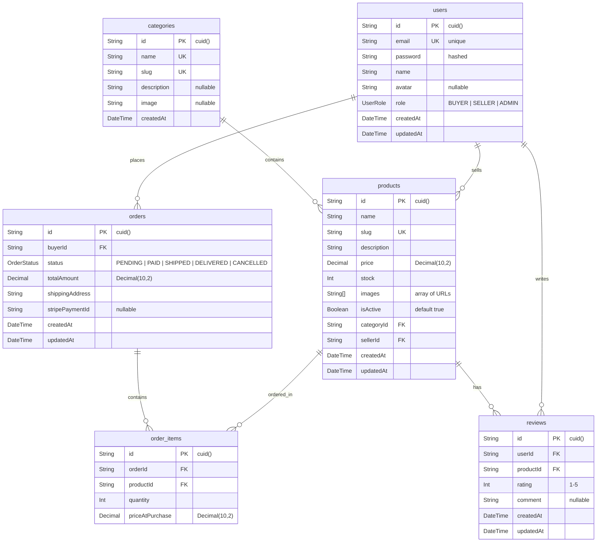
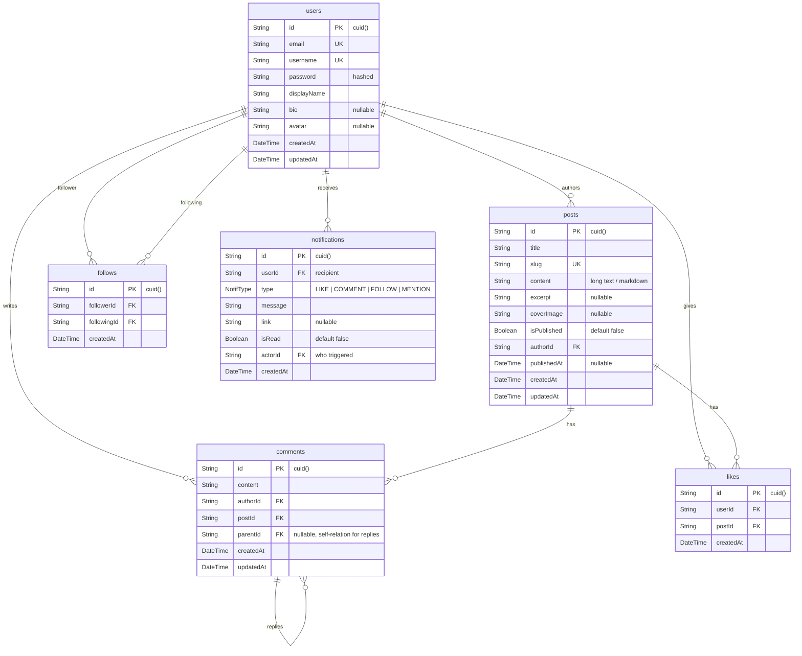
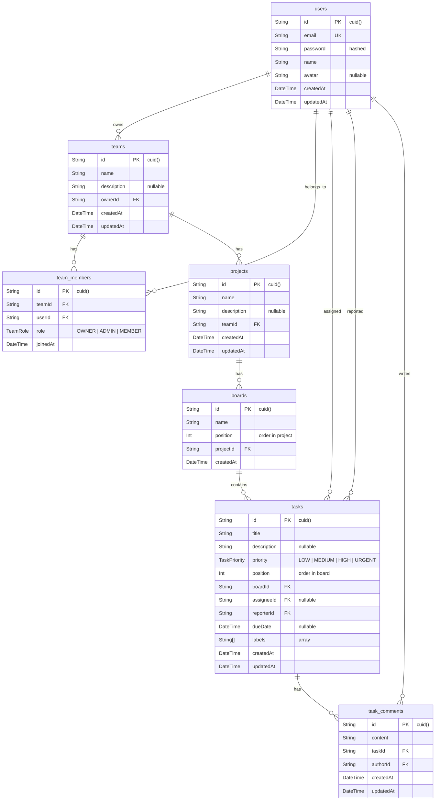
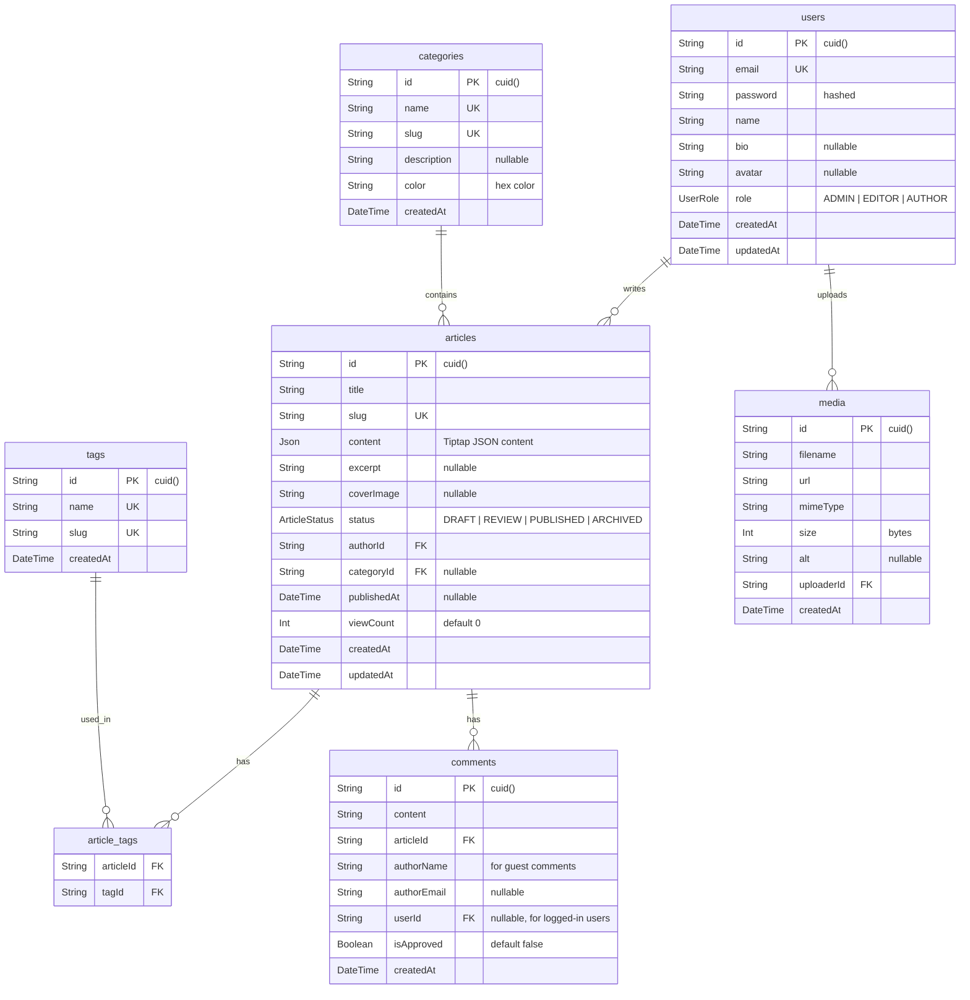

# 👑 ARCANE QUEST 03 — THE FINAL BOSS: Capstone Project

> **"4 minggu. Ratusan jam coding. Puluhan konsep dipelajari. Sekarang waktunya buktiin SEMUANYA dalam satu project. Ini bukan latihan lagi — ini UJIAN."**

---

## 🎯 Misi

Build **fullstack production-grade application** dari nol. Design, develop, test, deploy, present.

**Pilih SATU dari 5 quest options di bawah**, atau ajukan Custom Quest (Option E).

**Kerjain sampai selesai dan production-ready.**

---

## 📐 UNIVERSAL REQUIREMENTS (Semua Options)

Apapun quest yang kalian pilih, SEMUA harus penuhi ini:

### Tech Stack (WAJIB)

| Layer | Technology |
|-------|-----------|
| Language | TypeScript (strict mode, EVERYWHERE) |
| Frontend | React 19 + Vite |
| Styling | Tailwind CSS |
| State | Zustand (client) + TanStack React Query (server) |
| Backend | Express.js / Hono |
| ORM | Prisma |
| Database | PostgreSQL |
| Auth | JWT (access + refresh token) |
| Testing | Vitest + Playwright |
| CI/CD | GitHub Actions |
| Deploy FE | Vercel |
| Deploy BE | Railway |

### Quality Standards (WAJIB)

- [ ] TypeScript strict mode — ZERO `any`
- [ ] ESLint + Prettier configured
- [ ] 15+ tests passing (unit + integration + E2E)
- [ ] CI/CD pipeline green
- [ ] Deployed dan accessible (FE + BE)
- [ ] Responsive design (mobile + desktop)
- [ ] Loading states + Error handling everywhere
- [ ] README complete (badges, screenshots, live URL, setup guide)
- [ ] Git history clean (meaningful commits, feature branches)
- [ ] Presentation ready (10 min demo + Q&A)

---

## 🗂️ Folder Structure Template

```
arcane-[project-name]/
├── apps/
│   ├── web/                        # React frontend
│   │   ├── src/
│   │   │   ├── components/
│   │   │   │   ├── ui/             # Reusable UI (Button, Input, Modal)
│   │   │   │   ├── layout/         # Header, Sidebar, Footer
│   │   │   │   └── features/       # Feature-specific components
│   │   │   ├── pages/              # Route pages
│   │   │   ├── hooks/              # Custom hooks
│   │   │   ├── stores/             # Zustand stores
│   │   │   ├── services/           # API client functions
│   │   │   ├── lib/                # Utilities
│   │   │   ├── types/              # TypeScript types
│   │   │   └── App.tsx
│   │   ├── e2e/                    # Playwright tests
│   │   ├── package.json
│   │   ├── tailwind.config.ts
│   │   ├── tsconfig.json
│   │   └── vite.config.ts
│   └── api/                        # Express backend
│       ├── src/
│       │   ├── routes/             # Route handlers
│       │   ├── middleware/         # Auth, validation, error
│       │   ├── services/           # Business logic
│       │   ├── lib/                # Utilities (prisma client, etc)
│       │   ├── types/              # TypeScript types
│       │   ├── test/               # Test files
│       │   └── index.ts
│       ├── prisma/
│       │   ├── schema.prisma
│       │   ├── seed.ts
│       │   └── migrations/
│       ├── package.json
│       └── tsconfig.json
├── .github/
│   └── workflows/
│       └── ci.yml
├── .gitignore
├── .prettierrc
├── eslint.config.js
└── README.md
```

---

## 📦 Recommended Dependencies

```jsonc
// Frontend package.json (key dependencies)
{
  "dependencies": {
    "react": "^19.0.0",
    "react-dom": "^19.0.0",
    "react-router-dom": "^7.0.0",
    "@tanstack/react-query": "^5.0.0",
    "zustand": "^5.0.0",
    "axios": "^1.7.0",
    "tailwindcss": "^4.0.0",
    "clsx": "^2.1.0",
    "react-hook-form": "^7.54.0",
    "zod": "^3.24.0",
    "@hookform/resolvers": "^3.9.0",
    "sonner": "^1.7.0",
    "lucide-react": "^0.460.0"
  },
  "devDependencies": {
    "typescript": "^5.7.0",
    "vite": "^6.0.0",
    "@vitejs/plugin-react": "^4.3.0",
    "vitest": "^2.1.0",
    "@testing-library/react": "^16.0.0",
    "@playwright/test": "^1.49.0",
    "eslint": "^9.0.0",
    "prettier": "^3.4.0"
  }
}
```

```jsonc
// Backend package.json (key dependencies)
{
  "dependencies": {
    "express": "^4.21.0",
    "@prisma/client": "^6.0.0",
    "jsonwebtoken": "^9.0.0",
    "bcrypt": "^5.1.0",
    "zod": "^3.24.0",
    "cors": "^2.8.0",
    "helmet": "^8.0.0",
    "morgan": "^1.10.0"
  },
  "devDependencies": {
    "typescript": "^5.7.0",
    "prisma": "^6.0.0",
    "vitest": "^2.1.0",
    "supertest": "^7.0.0",
    "tsx": "^4.19.0",
    "@types/express": "^4.17.0",
    "@types/jsonwebtoken": "^9.0.0",
    "@types/bcrypt": "^5.0.0"
  }
}
```

---

## 🅰️ OPTION A — ARCANE MARKETPLACE

> E-commerce platform dengan product catalog, shopping cart, checkout, dan admin panel.

### ERD



### API Endpoints (25+)

**Auth**
| Method | Path | Auth | Description |
|--------|------|------|-------------|
| POST | `/api/auth/register` | ❌ | Register (buyer default) |
| POST | `/api/auth/login` | ❌ | Login, return tokens |
| POST | `/api/auth/refresh` | ❌ | Refresh access token |
| GET | `/api/auth/me` | ✅ | Current user profile |
| PUT | `/api/auth/me` | ✅ | Update profile |

**Products**
| Method | Path | Auth | Description |
|--------|------|------|-------------|
| GET | `/api/products` | ❌ | List products (paginated, filter, search) |
| GET | `/api/products/:slug` | ❌ | Product detail |
| POST | `/api/products` | ✅ SELLER | Create product |
| PUT | `/api/products/:id` | ✅ SELLER | Update own product |
| DELETE | `/api/products/:id` | ✅ SELLER | Delete own product |

**Categories**
| Method | Path | Auth | Description |
|--------|------|------|-------------|
| GET | `/api/categories` | ❌ | List all categories |
| POST | `/api/categories` | ✅ ADMIN | Create category |
| PUT | `/api/categories/:id` | ✅ ADMIN | Update category |
| DELETE | `/api/categories/:id` | ✅ ADMIN | Delete category |

**Orders**
| Method | Path | Auth | Description |
|--------|------|------|-------------|
| POST | `/api/orders` | ✅ | Create order from cart |
| GET | `/api/orders` | ✅ | My orders |
| GET | `/api/orders/:id` | ✅ | Order detail |
| PUT | `/api/orders/:id/status` | ✅ SELLER/ADMIN | Update status |
| POST | `/api/orders/:id/pay` | ✅ | Stripe checkout session |

**Reviews**
| Method | Path | Auth | Description |
|--------|------|------|-------------|
| GET | `/api/products/:id/reviews` | ❌ | Product reviews |
| POST | `/api/products/:id/reviews` | ✅ | Add review |
| PUT | `/api/reviews/:id` | ✅ | Update own review |
| DELETE | `/api/reviews/:id` | ✅ | Delete own review |

**Admin**
| Method | Path | Auth | Description |
|--------|------|------|-------------|
| GET | `/api/admin/users` | ✅ ADMIN | List all users |
| GET | `/api/admin/stats` | ✅ ADMIN | Dashboard stats |
| PUT | `/api/admin/users/:id/role` | ✅ ADMIN | Change user role |

### Key Features
- 🛒 Shopping cart (Zustand, persisted localStorage)
- 💳 Stripe Checkout integration
- 🔍 Product search + category filter + pagination
- ⭐ Product reviews & ratings
- 📊 Admin dashboard (user management, order stats)
- 📱 Responsive product grid

---

## 🅱️ OPTION B — ARCANE CHRONICLE

> Social blogging platform dengan posts, comments, follows, likes, dan real-time notifications.

### ERD



### API Endpoints (20+)

**Auth**
| Method | Path | Auth | Description |
|--------|------|------|-------------|
| POST | `/api/auth/register` | ❌ | Register |
| POST | `/api/auth/login` | ❌ | Login |
| POST | `/api/auth/refresh` | ❌ | Refresh token |
| GET | `/api/auth/me` | ✅ | Current user |

**Posts**
| Method | Path | Auth | Description |
|--------|------|------|-------------|
| GET | `/api/posts` | ❌ | List published posts (paginated) |
| GET | `/api/posts/:slug` | ❌ | Single post |
| POST | `/api/posts` | ✅ | Create post |
| PUT | `/api/posts/:id` | ✅ | Update own post |
| DELETE | `/api/posts/:id` | ✅ | Delete own post |
| GET | `/api/posts/feed` | ✅ | Feed from followed users |

**Comments**
| Method | Path | Auth | Description |
|--------|------|------|-------------|
| GET | `/api/posts/:id/comments` | ❌ | List comments (threaded) |
| POST | `/api/posts/:id/comments` | ✅ | Add comment |
| PUT | `/api/comments/:id` | ✅ | Edit own comment |
| DELETE | `/api/comments/:id` | ✅ | Delete own comment |

**Social**
| Method | Path | Auth | Description |
|--------|------|------|-------------|
| POST | `/api/posts/:id/like` | ✅ | Toggle like |
| POST | `/api/users/:id/follow` | ✅ | Toggle follow |
| GET | `/api/users/:username` | ❌ | User profile + posts |
| GET | `/api/users/:id/followers` | ❌ | Follower list |
| GET | `/api/users/:id/following` | ❌ | Following list |

**Notifications**
| Method | Path | Auth | Description |
|--------|------|------|-------------|
| GET | `/api/notifications` | ✅ | My notifications |
| PUT | `/api/notifications/read-all` | ✅ | Mark all as read |

**Upload**
| Method | Path | Auth | Description |
|--------|------|------|-------------|
| POST | `/api/upload` | ✅ | Upload image (Cloudinary) |

### Key Features
- 📝 Markdown posts dengan cover image
- 💬 Threaded comments (nested replies)
- ❤️ Like/unlike toggle
- 👥 Follow system + personalized feed
- 🔔 WebSocket real-time notifications (Socket.IO)
- 🖼️ Image upload via Cloudinary
- 📱 Responsive feed layout

---

## 🅲 OPTION C — ARCANE BOARD

> Project management tool (Trello/Jira clone) dengan Kanban boards, drag-drop tasks, dan team collaboration.

### ERD



### API Endpoints (25+)

**Auth**
| Method | Path | Auth | Description |
|--------|------|------|-------------|
| POST | `/api/auth/register` | ❌ | Register |
| POST | `/api/auth/login` | ❌ | Login |
| GET | `/api/auth/me` | ✅ | Current user |

**Teams**
| Method | Path | Auth | Description |
|--------|------|------|-------------|
| POST | `/api/teams` | ✅ | Create team |
| GET | `/api/teams` | ✅ | My teams |
| GET | `/api/teams/:id` | ✅ | Team detail |
| PUT | `/api/teams/:id` | ✅ OWNER | Update team |
| POST | `/api/teams/:id/members` | ✅ ADMIN | Add member |
| DELETE | `/api/teams/:id/members/:userId` | ✅ ADMIN | Remove member |
| PUT | `/api/teams/:id/members/:userId/role` | ✅ OWNER | Change role |

**Projects**
| Method | Path | Auth | Description |
|--------|------|------|-------------|
| POST | `/api/teams/:teamId/projects` | ✅ | Create project |
| GET | `/api/teams/:teamId/projects` | ✅ | Team projects |
| GET | `/api/projects/:id` | ✅ | Project with boards |
| PUT | `/api/projects/:id` | ✅ | Update project |
| DELETE | `/api/projects/:id` | ✅ ADMIN | Delete project |

**Boards**
| Method | Path | Auth | Description |
|--------|------|------|-------------|
| POST | `/api/projects/:id/boards` | ✅ | Create board (column) |
| PUT | `/api/boards/:id` | ✅ | Update board |
| DELETE | `/api/boards/:id` | ✅ | Delete board |
| PUT | `/api/boards/reorder` | ✅ | Reorder boards |

**Tasks**
| Method | Path | Auth | Description |
|--------|------|------|-------------|
| POST | `/api/boards/:id/tasks` | ✅ | Create task |
| PUT | `/api/tasks/:id` | ✅ | Update task |
| DELETE | `/api/tasks/:id` | ✅ | Delete task |
| PUT | `/api/tasks/:id/move` | ✅ | Move task (board + position) |
| PUT | `/api/tasks/:id/assign` | ✅ | Assign task |
| GET | `/api/tasks/:id/comments` | ✅ | Task comments |
| POST | `/api/tasks/:id/comments` | ✅ | Add comment |

### Key Features
- 📋 Kanban board dengan drag-and-drop (`@dnd-kit/core`)
- 👥 Team management (invite, roles)
- 🏷️ Task labels, priority, due dates
- 💬 Task comments
- 🔄 Real-time board updates (WebSocket)
- 📱 Responsive board (horizontal scroll mobile)

---

## 🅳 OPTION D — ARCANE CODEX

> Content management system / blogging platform dengan rich text editor, media library, dan public blog.

### ERD



### API Endpoints (20+)

**Auth**
| Method | Path | Auth | Description |
|--------|------|------|-------------|
| POST | `/api/auth/login` | ❌ | Login |
| GET | `/api/auth/me` | ✅ | Current user |
| PUT | `/api/auth/me` | ✅ | Update profile |

**Articles (CMS)**
| Method | Path | Auth | Description |
|--------|------|------|-------------|
| GET | `/api/articles` | ✅ | List all (with drafts) |
| POST | `/api/articles` | ✅ | Create article |
| GET | `/api/articles/:id` | ✅ | Article detail (CMS) |
| PUT | `/api/articles/:id` | ✅ | Update article |
| DELETE | `/api/articles/:id` | ✅ ADMIN | Delete article |
| PUT | `/api/articles/:id/status` | ✅ EDITOR | Change status |

**Public Blog**
| Method | Path | Auth | Description |
|--------|------|------|-------------|
| GET | `/api/blog/posts` | ❌ | Published articles (paginated) |
| GET | `/api/blog/posts/:slug` | ❌ | Single article |
| GET | `/api/blog/categories` | ❌ | All categories |
| GET | `/api/blog/tags` | ❌ | All tags |
| GET | `/api/blog/search` | ❌ | Search articles |

**Comments**
| Method | Path | Auth | Description |
|--------|------|------|-------------|
| GET | `/api/articles/:id/comments` | ❌ | Approved comments |
| POST | `/api/articles/:id/comments` | ❌ | Submit comment |
| PUT | `/api/comments/:id/approve` | ✅ | Approve comment |
| DELETE | `/api/comments/:id` | ✅ | Delete comment |

**Media**
| Method | Path | Auth | Description |
|--------|------|------|-------------|
| GET | `/api/media` | ✅ | Media library |
| POST | `/api/media` | ✅ | Upload file |
| DELETE | `/api/media/:id` | ✅ | Delete file |

**Tags & Categories**
| Method | Path | Auth | Description |
|--------|------|------|-------------|
| POST | `/api/categories` | ✅ ADMIN | Create category |
| POST | `/api/tags` | ✅ | Create tag |

### Key Features
- ✍️ Tiptap rich text editor (headings, bold, italic, images, code blocks, embeds)
- 📂 Media library (upload, browse, insert into articles)
- 🏷️ Categories + tags system
- 💬 Comment moderation (approve/reject)
- 🌐 Public blog with SEO-friendly slugs
- 📊 Article view count + analytics
- 📱 Responsive reading experience

---

## 🅴 OPTION E — CUSTOM QUEST

> Punya ide sendiri? Gue respect that. Tapi ada minimum requirements.

### Minimum Requirements

- [ ] **Minimum 5 database tables** dengan relationships
- [ ] **Minimum 1 third-party integration** (Stripe, Cloudinary, SendGrid, Twilio, OpenAI, dll)
- [ ] Full CRUD untuk minimal 2 resources
- [ ] Authentication + authorization
- [ ] Harus solve **real problem** (bukan todo app, bukan notes app)

### Approval Process

1. Submit proposal (1 halaman):
   - Problem statement
   - ERD diagram
   - Feature list
   - API endpoint list
   - Third-party integrations
2. Gue review dalam 24 jam
3. Kalau approved, mulai build
4. Kalau rejected, revise atau pilih Option A-D

---

## 🛤️ Capstone Phases

```
PHASE 1 — PLANNING & SETUP
├── Finalize ERD & API design
├── Init project, install deps
├── Setup Prisma schema & migrate
└── Seed database

PHASE 2 — BACKEND
├── Auth (register, login, middleware)
├── Main CRUD endpoints
└── Input validation (Zod)

PHASE 3 — FRONTEND
├── Auth pages (login, register)
├── Layout (header, sidebar, navigation)
├── Main feature pages
└── API integration (React Query)

PHASE 4 — INTEGRATION & ADVANCED
├── Connect all frontend ↔ backend
├── Third-party integrations
├── Extra features
└── Responsive design pass

PHASE 5 — TESTING & DEVOPS
├── Write 15+ tests (Vitest + Playwright)
├── GitHub Actions CI/CD
├── Deploy Backend → Railway
├── Deploy Frontend → Vercel
└── Verify production works

PHASE 6 — POLISH & SHIP
├── Documentation + README
├── Clean up code
├── Presentation prep
└── 🎤 DEMO DAY
```

---

## 📊 Grading

| Kategori | Bobot | Detail |
|----------|-------|--------|
| **Functionality** | 30% | Features work end-to-end, no critical bugs, edge cases handled |
| **Code Quality** | 20% | TypeScript strict, clean architecture, DRY, consistent style |
| **UI/UX** | 15% | Responsive, intuitive, loading/error states, visual polish |
| **Testing** | 15% | 15+ meaningful tests, CI green, good coverage |
| **Documentation** | 10% | README complete, API docs, setup guide, screenshots |
| **Presentation** | 10% | Clear demo, confident Q&A, within time limit |

### Grade Scale

| Score | Grade | Verdict |
|-------|-------|---------|
| 90-100 | A | **Phase 3 ready. Outstanding.** |
| 80-89 | B | **Solid work. Minor improvements needed.** |
| 70-79 | C | **Acceptable. Significant room to grow.** |
| < 70 | D | **Not passing. Needs revision.** |

---

## ⚠️ RULES

1. **Solo project** (kecuali pilih AQ-04 Group Capstone)
2. **AI tools boleh** buat boilerplate dan debugging — tapi kalian HARUS bisa explain setiap line
3. **Copy-paste dari tutorial = INSTANT FAIL** kalau ketahuan. Inspired boleh, copy gak boleh.
4. **Plagiarism = automatic zero.** Gue check.
5. **Deploy HARUS work** pas demo day. Broken deploy = max grade B.

---

## 🔥 FINAL WORDS

Gue gak bakal bohong — ini BERAT. Build fullstack production app dari nol itu intense. Tapi kalian udah dibekali SEMUA ilmunya:

- ✅ React + TypeScript dari Week 1-2
- ✅ Express + PostgreSQL + Prisma dari Week 3
- ✅ State management, API design, auth dari Week 4
- ✅ Testing, CI/CD, deploy dari Week 5 study materials

Sekarang tinggal **EXECUTE**.

Gak ada alasan "gak bisa". Yang ada cuma **"belum coba cukup keras"**.

Ini ujian terakhir sebelum Phase 3 — Blockchain & Smart Contract. Buktiin kalian layak. KASIH YANG TERBAIK! 🚀
