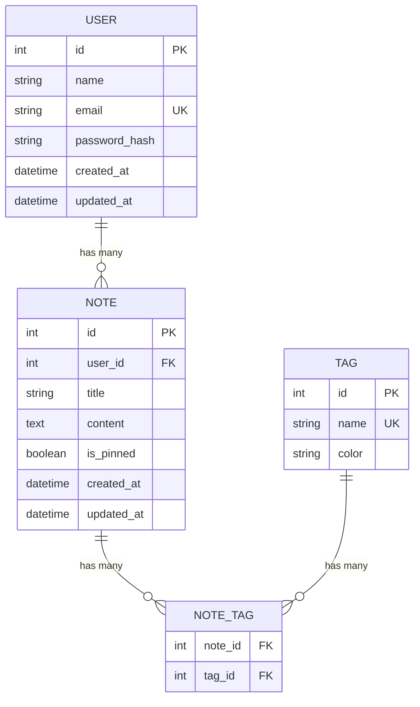
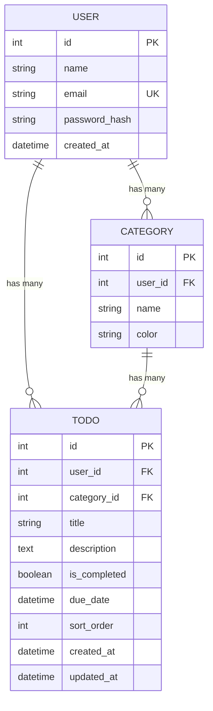

# 📋 01 — Project Planning: Jangan Langsung Coding!

```
╔═══════════════════════════════════════════╗
║  "Failing to plan is planning to fail."   ║
║  — Benjamin Franklin (probably a dev)     ║
╚═══════════════════════════════════════════╝
```

## Kenapa Harus Planning Dulu?

Oke, gua tau yang ada di pikiran kalian: *"Ngapain planning, langsung code aja!"*

Nah, itu mindset yang bakal bikin kalian **rewrite kode 3x lipat** dan **deadline mepet panik**. Gua udah liat ini berkali-kali — developer yang skip planning ujung-ujungnya habis waktu lebih banyak karena:

1. **Fitur gak jelas** → build yang salah → rewrite
2. **Database schema salah** → migration hell di tengah jalan
3. **API gak konsisten** → frontend dan backend saling tunggu
4. **Scope creep** → "eh tambahin fitur ini dong" → gak kelar-kelar

Real talk: **1 jam planning = 5 jam coding yang dihemat**. Ini bukan teori, ini pengalaman real di industri.

```
┌─────────────────────────────────────────┐
│  Developer tanpa planning:              │
│                                         │
│  Code → Bug → Fix → Rewrite → Code →   │
│  "Eh salah" → Rewrite lagi → Deadline  │
│  → Panic → Ship broken code 💀         │
│                                         │
│  Developer dengan planning:             │
│                                         │
│  Plan → Code → Ship → 🎉              │
└─────────────────────────────────────────┘
```

## Step 1: User Stories — Siapa Pake App Lo?

User story itu cara kita define fitur dari perspektif **user**, bukan dari perspektif developer. Format standarnya:

```
As a [tipe user], I want to [aksi], so that [tujuan/benefit].
```

### Contoh Buat Notes App:

```markdown
## User Stories — Notes App

### Authentication
- As a user, I want to register with email and password, so that I can have my own account.
- As a user, I want to login, so that I can access my notes.
- As a user, I want to logout, so that my data is secure on shared devices.

### Notes CRUD
- As a user, I want to create a new note with title and content, so that I can save my thoughts.
- As a user, I want to see all my notes in a list, so that I can browse them.
- As a user, I want to edit a note, so that I can update information.
- As a user, I want to delete a note, so that I can remove outdated notes.
- As a user, I want to search notes by title, so that I can find specific notes quickly.

### Organization
- As a user, I want to pin important notes to the top, so that I can access them quickly.
- As a user, I want to add tags to notes, so that I can categorize them.
- As a user, I want to filter notes by tag, so that I can see related notes.
```

### Tips Nulis User Stories yang Bagus:

1. **Spesifik** — jangan "as a user, I want to do stuff" 😂
2. **Testable** — lo harus bisa verify apakah story ini "done" atau belum
3. **Independent** — setiap story bisa di-build sendiri
4. **Small** — kalau story-nya terlalu gede, pecah jadi beberapa

### INVEST Criteria

User story yang bagus itu **INVEST**:

| Letter | Meaning | Penjelasan |
|--------|---------|------------|
| **I** | Independent | Bisa dikerjain tanpa tergantung story lain |
| **N** | Negotiable | Detail bisa diskusi, bukan kontrak mati |
| **V** | Valuable | Kasih value ke user |
| **E** | Estimable | Bisa diestimasi effort-nya |
| **S** | Small | Kecil enough buat 1 sprint/iteration |
| **T** | Testable | Ada acceptance criteria yang jelas |

## Step 2: MoSCoW Prioritization — Mana yang HARUS Ada?

Setelah punya list user stories, kalian perlu prioritize. Gak semua fitur sama pentingnya. Pake **MoSCoW method**:

```
┌─────────────────────────────────────────────────────┐
│                   MoSCoW Method                      │
├──────────┬──────────────────────────────────────────┤
│ MUST     │ Fitur WAJIB ada. App gak bisa jalan      │
│ HAVE     │ tanpa ini. → Build PERTAMA               │
├──────────┼──────────────────────────────────────────┤
│ SHOULD   │ Penting tapi app masih bisa fungsi       │
│ HAVE     │ tanpa ini. → Build KEDUA                 │
├──────────┼──────────────────────────────────────────┤
│ COULD    │ Nice to have. Bikin app lebih bagus      │
│ HAVE     │ tapi bukan prioritas. → Kalau sempat     │
├──────────┼──────────────────────────────────────────┤
│ WON'T    │ Out of scope. Jangan disentuh.           │
│ HAVE     │ → Simpan buat v2                         │
└──────────┴──────────────────────────────────────────┘
```

### Contoh MoSCoW — Notes App:

**MUST HAVE (MVP):**
- ✅ User registration & login
- ✅ Create, read, update, delete notes
- ✅ Notes list view
- ✅ Basic responsive design

**SHOULD HAVE:**
- 📌 Pin notes to top
- 🔍 Search notes
- 🏷️ Tags/categories

**COULD HAVE:**
- 🌙 Dark mode
- 📱 PWA support
- 📤 Export notes to PDF
- 🎨 Rich text editor (bold, italic, etc.)

**WON'T HAVE (v2):**
- 👥 Collaboration/sharing
- 📊 Analytics dashboard
- 🔔 Push notifications
- 🤖 AI summarization

### Golden Rule: Build MUST first, test, deploy. THEN add SHOULD.

Banyak developer gagal karena langsung build COULD features padahal MUST-nya aja belum solid. Jangan jadi developer itu.

## Step 3: Wireframing — Gambar Dulu Sebelum Code

Lo gak perlu jadi designer. Lo cuma perlu **sketch** kasar gimana app lo bakal keliatan. Tools:

- **[Excalidraw](https://excalidraw.com/)** — FREE, simple, gua recommend ini
- **[Figma](https://figma.com/)** — lebih proper tapi butuh waktu belajar
- **Kertas + pulpen** — serius, ini valid. Foto aja hasilnya

### Apa yang Harus Ada di Wireframe:

1. **Semua halaman** — list semua page yang ada di app
2. **Navigation flow** — gimana user pindah dari page A ke page B
3. **Key components** — form, list, card, modal
4. **Responsive** — minimal sketch desktop + mobile

### Contoh Wireframe Flow:

```
┌──────────────────────────────────────────────────────────┐
│                    WIREFRAME — Notes App                  │
└──────────────────────────────────────────────────────────┘

┌─────────────┐    ┌─────────────┐    ┌─────────────┐
│   LOGIN     │───>│  REGISTER   │    │   NOTES     │
│             │    │             │    │   LIST      │
│ [email   ] │    │ [name     ] │    │ ┌─────────┐ │
│ [password] │    │ [email    ] │    │ │ Note 1  │ │
│ [Login]    │    │ [password ] │    │ │ Note 2  │ │
│             │    │ [Register] │    │ │ Note 3  │ │
│ Register -> │    │ <- Login   │    │ └─────────┘ │
└─────────────┘    └─────────────┘    │ [+ New Note]│
                                       └──────┬──────┘
                                              │
                                    ┌─────────▼─────────┐
                                    │   NOTE DETAIL      │
                                    │                    │
                                    │ Title: __________ │
                                    │ Content:           │
                                    │ __________________ │
                                    │ __________________ │
                                    │                    │
                                    │ [Save] [Delete]    │
                                    └────────────────────┘
```

## Step 4: ERD (Entity Relationship Diagram) — Database Design

Sebelum nulis satu baris code pun, kalian HARUS tau database schema kalian. ERD itu peta dari data kalian — table apa aja, kolom apa aja, relasi gimana.

### Cara Bikin ERD:

1. **Identify entities** — apa aja "benda" di app lo? (User, Note, Tag, dll)
2. **Define attributes** — tiap entity punya kolom apa? (id, name, email, dll)
3. **Define relationships** — gimana entity saling berhubungan? (1-to-many, many-to-many)

### Relationship Types:

```
1:1  (One to One)     → User has one Profile
1:N  (One to Many)    → User has many Notes
M:N  (Many to Many)   → Notes have many Tags, Tags have many Notes
```

### Contoh ERD — Notes App:



### Tips ERD:

- **Selalu pake `id` sebagai primary key** — auto-increment integer atau UUID
- **Selalu pake `created_at` dan `updated_at`** — lo bakal butuhin ini
- **Password JANGAN pernah plain text** — simpan `password_hash`
- **Foreign key = relasi** — `user_id` di tabel Note berarti "Note ini milik User mana"
- **Junction table buat M:N** — NOTE_TAG itu junction table antara Note dan Tag

## Step 5: API Contract — Frontend & Backend Agreement

API contract itu **perjanjian** antara frontend dan backend: "Endpoint apa aja yang ada, request format gimana, response format gimana."

Kenapa penting? Karena dengan API contract, **frontend dan backend bisa kerja PARALEL**. Frontend mock data based on contract, backend implement based on contract. Pas digabung = langsung nyambung.

### Format API Contract:

```markdown
## API Contract — Notes App

### Base URL
- Development: `http://localhost:3000/api`
- Production: `https://api.notes-app.railway.app/api`

---

### Auth

#### POST /auth/register
Request:
```json
{
  "name": "string",
  "email": "string",
  "password": "string (min 8 chars)"
}
```
Response (201):
```json
{
  "message": "User created successfully",
  "user": {
    "id": 1,
    "name": "John",
    "email": "john@example.com"
  },
  "token": "jwt_token_here"
}
```
Error (400):
```json
{
  "error": "Email already registered"
}
```

#### POST /auth/login
Request:
```json
{
  "email": "string",
  "password": "string"
}
```
Response (200):
```json
{
  "user": { "id": 1, "name": "John", "email": "john@example.com" },
  "token": "jwt_token_here"
}
```

---

### Notes (🔒 Requires Auth Token)

#### GET /notes
Query params: `?search=keyword&tag=tagname&pinned=true`
Response (200):
```json
{
  "notes": [
    {
      "id": 1,
      "title": "My Note",
      "content": "Content here...",
      "is_pinned": false,
      "tags": [{ "id": 1, "name": "work", "color": "#ff0000" }],
      "created_at": "2025-01-01T00:00:00Z",
      "updated_at": "2025-01-01T00:00:00Z"
    }
  ],
  "total": 1
}
```

#### POST /notes
Request:
```json
{
  "title": "string",
  "content": "string",
  "is_pinned": false,
  "tag_ids": [1, 2]
}
```
Response (201): Created note object

#### GET /notes/:id
Response (200): Single note object
Error (404): `{ "error": "Note not found" }`

#### PUT /notes/:id
Request: Same as POST /notes
Response (200): Updated note object

#### DELETE /notes/:id
Response (200): `{ "message": "Note deleted" }`

---

### Tags (🔒 Requires Auth Token)

#### GET /tags
Response (200):
```json
{
  "tags": [{ "id": 1, "name": "work", "color": "#ff0000" }]
}
```

#### POST /tags
Request: `{ "name": "string", "color": "#hex" }`
Response (201): Created tag object
```

### API Contract Tips:

1. **Konsisten** — semua response pake format yang sama
2. **Include error responses** — frontend perlu tau error format-nya
3. **Include auth info** — endpoint mana yang butuh token
4. **Version your API** — `/api/v1/notes` lebih safe buat masa depan
5. **HTTP methods yang bener** — GET buat read, POST buat create, PUT buat update, DELETE buat delete

## Step 6: Timeline Estimation — The 2x Rule

Ini **SUPER PENTING** dan hampir semua developer salah estimasi waktu. Bahkan senior developer.

### The 2x Rule:

> **Kalau lo pikir butuh 2 jam, alokasiin 4 jam. Kalau lo pikir butuh 1 hari, alokasiin 2 hari.**

Kenapa? Karena lo pasti ketemu:
- Bug yang gak expected
- Library yang docs-nya misleading
- Setup yang lebih ribet dari bayangan
- "Oh ternyata gua juga harus handle edge case ini"

### Contoh Timeline — Capstone (14 hari):

```
Day 1-2: Planning (JANGAN SKIP!)
├── User stories + MoSCoW              (2 jam)
├── Wireframe semua halaman             (3 jam)
├── ERD design                          (2 jam)
├── API contract                        (3 jam)
├── Setup repo + boilerplate            (2 jam)
└── Buffer                              (4 jam)

Day 3-5: Core Backend
├── Database setup + Prisma schema      (3 jam)
├── Auth (register, login, middleware)  (4 jam)
├── Main CRUD endpoints                 (6 jam)
├── Input validation                    (2 jam)
└── Buffer                              (3 jam)

Day 6-8: Core Frontend
├── Layout + routing + auth pages       (4 jam)
├── Main feature pages                  (8 jam)
├── State management (Zustand + RQ)     (3 jam)
├── Connect to real API                 (3 jam)
└── Buffer                              (4 jam)

Day 9-10: Polish
├── Responsive design                   (3 jam)
├── Loading/error states                (2 jam)
├── UX improvements                     (3 jam)
├── SHOULD HAVE features               (4 jam)
└── Buffer                              (2 jam)

Day 11-12: Testing + Deploy
├── Write 15+ tests                     (4 jam)
├── Setup CI/CD                         (2 jam)
├── Deploy to Vercel + Railway          (3 jam)
├── Fix production bugs                 (2 jam)
└── Buffer                              (3 jam)

Day 13: Documentation + Prep
├── README with screenshots             (2 jam)
├── API documentation                   (1 jam)
├── Presentation slides                 (2 jam)
├── Practice demo                       (2 jam)
└── Buffer                              (1 jam)

Day 14: DEMO DAY 🎤
├── Final check                         (1 jam)
├── Presentation                        (30 min)
└── Celebrate! 🎉                       (∞)
```

## 📝 Planning Template — COPY THIS

Gua kasih template lengkap yang bisa kalian copy dan isi buat capstone:

```markdown
# [Nama Project] — Planning Document

## 1. Overview
- **Deskripsi singkat:** [1-2 kalimat apa app ini]
- **Target user:** [Siapa yang pake]
- **Problem:** [Masalah apa yang diselesaikan]

## 2. User Stories

### Must Have
- [ ] As a [user], I want to [action], so that [benefit]
- [ ] ...

### Should Have
- [ ] ...

### Could Have
- [ ] ...

## 3. Tech Stack
- Frontend: React + Vite + TypeScript + Tailwind + Zustand + React Query
- Backend: Express + TypeScript + Prisma + PostgreSQL
- Testing: Vitest + Playwright
- CI/CD: GitHub Actions
- Deploy: Vercel (FE) + Railway (BE)

## 4. ERD
[Gambar di Excalidraw atau Mermaid diagram]

## 5. API Contract
[List semua endpoint: method, path, request, response]

## 6. Wireframe
[Link ke Excalidraw atau gambar]

## 7. Timeline
| Day | Task | Status |
|-----|------|--------|
| 1-2 | Planning | ⬜ |
| 3-5 | Backend | ⬜ |
| 6-8 | Frontend | ⬜ |
| 9-10 | Polish | ⬜ |
| 11-12 | Test + Deploy | ⬜ |
| 13 | Docs + Prep | ⬜ |
| 14 | Demo Day | ⬜ |

## 8. Risks
- [Apa yang bisa go wrong dan gimana antisipasinya]
```

## 🔨 Build Bareng: Planning Mini Project

Oke sekarang kita practice. Kita plan bareng sebuah **Todo App with Categories** — simple tapi cukup buat latihan.

### Step 1 — User Stories:

**Must Have:**
- As a user, I want to register/login, so that I have my own todos
- As a user, I want to create a todo with title and optional description, so that I can track tasks
- As a user, I want to mark a todo as complete, so that I know what's done
- As a user, I want to delete a todo, so that I can clean up my list
- As a user, I want to see all my todos, so that I can review my tasks

**Should Have:**
- As a user, I want to create categories, so that I can organize todos
- As a user, I want to assign a category to a todo, so that I can filter
- As a user, I want to set a due date, so that I know deadlines

**Could Have:**
- As a user, I want to drag and reorder todos
- As a user, I want to see overdue todos highlighted in red

### Step 2 — ERD:



### Step 3 — API Contract (shortened):

| Method | Endpoint | Auth | Description |
|--------|----------|------|-------------|
| POST | /auth/register | ❌ | Register user |
| POST | /auth/login | ❌ | Login user |
| GET | /todos | ✅ | Get all todos |
| POST | /todos | ✅ | Create todo |
| PUT | /todos/:id | ✅ | Update todo |
| DELETE | /todos/:id | ✅ | Delete todo |
| PATCH | /todos/:id/toggle | ✅ | Toggle complete |
| GET | /categories | ✅ | Get categories |
| POST | /categories | ✅ | Create category |
| PUT | /categories/:id | ✅ | Update category |
| DELETE | /categories/:id | ✅ | Delete category |

### Step 4 — Timeline (5 hari):

| Day | Task | Hours |
|-----|------|-------|
| 1 | Planning + Setup + DB + Auth endpoints | 6h |
| 2 | Todo + Category CRUD endpoints | 6h |
| 3 | Frontend: Auth + Todo list + Create/Edit | 6h |
| 4 | Frontend: Categories + Filter + Polish | 6h |
| 5 | Testing + Deploy + README | 6h |

Liat? Planning itu gak lama. Tapi hasilnya: lo tau PERSIS apa yang harus dikerjain setiap hari. Gak ada "hmm mau ngapain ya hari ini." LANGSUNG GAS.

## Common Mistakes dalam Planning

### ❌ Mistake 1: Skip planning, langsung code
**Result:** Rewrite 3x, deadline panik

### ❌ Mistake 2: Over-planning
**Result:** 5 hari planning, 2 hari code. Jangan. Planning 1-2 hari MAX.

### ❌ Mistake 3: Plan terlalu detail
**Result:** "Button harus warna biru hex #3B82F6 dengan border-radius 8px" — ini bukan planning, ini bikeshedding. Keep high-level.

### ❌ Mistake 4: Gak pake MoSCoW
**Result:** Build dark mode sebelum CRUD jalan. Prioritize!

### ❌ Mistake 5: Estimasi terlalu optimis
**Result:** "Auth? 30 menit lah." → 4 jam kemudian masih debug JWT. SELALU 2x.

## Recap

```
Planning = User Stories + MoSCoW + Wireframe + ERD + API Contract + Timeline

Time spent: ~4-6 jam
Time saved: ~20-30 jam debugging + rewriting

ROI: INSANE 📈
```

Planning bukan waste of time. Planning adalah **senjata rahasia** developer yang produktif. Semua senior developer plan dulu. Semua tech lead plan dulu. Kalau kalian mau jadi professional developer, START PLANNING.

Oke, sekarang kalian udah tau caranya plan. Next, kita bahas gimana nge-structure project fullstack yang bener.

---

Next Part -> [02 - Fullstack Architecture](https://github.com/Ethereum-Jakarta/phase-2-week5-fullstack-capstone/blob/main/study-material/02-fullstack-architecture.md)
