# 🧪 04 — Testing dengan Vitest: Code Tanpa Test = Hutang Teknis

```
╔═══════════════════════════════════════════════════╗
║  "Code without tests is broken by design."       ║
║                          — Jacob Kaplan-Moss      ║
╚═══════════════════════════════════════════════════╝
```

## 🎯 Tujuan Pembelajaran

Setelah materi ini, kalian bakal bisa:

- Memahami Testing Pyramid dan kapan pakai jenis test apa
- Setup Vitest dari nol (dan kenapa dia lebih baik dari Jest di 2025)
- Nulis unit test untuk utility functions
- Nulis component test pakai React Testing Library
- Testing custom hooks
- Mock API calls pakai MSW (Mock Service Worker)
- Setup coverage reports
- Test complete CRUD feature end-to-end

## 🏗️ Testing Pyramid

Sebelum nulis satu line test pun, kalian harus paham konsep ini:

```mermaid
graph TB
    subgraph "Testing Pyramid"
        A["🔺 E2E Tests\n(Few, Slow, Expensive)\nPlaywright"]
        B["🔶 Integration Tests\n(Some, Medium)\nComponent + API"]
        C["🟢 Unit Tests\n(Many, Fast, Cheap)\nFunctions + Utils"]
    end
    
    A --- B --- C
    
    style A fill:#E53E3E,stroke:#fff,color:#fff
    style B fill:#ED8936,stroke:#fff,color:#fff
    style C fill:#48BB78,stroke:#fff,color:#fff
```



**Breakdown:**

| Level | What | Speed | Coverage | Tools |
|-------|------|-------|----------|-------|
| **Unit** | Individual functions, utils, helpers | ⚡ Very fast | Banyak | Vitest |
| **Integration** | Components + interactions, API routes | 🏃 Medium | Sedang | Vitest + RTL + MSW |
| **E2E** | Full user flows, browser | 🐌 Slow | Sedikit | Playwright |

**Rule of thumb:**
- 70% unit tests
- 20% integration tests
- 10% E2E tests

Banyak yang salah: nulis E2E test buat semuanya. Itu mahal, lambat, dan flaky. Kunci-nya: **test the right thing at the right level.**

---

## ⚡ Part 1: Vitest — Faster than Jest

### Kenapa Vitest, bukan Jest?


**Vitest advantages:**
- **Vite-powered** — reuse your `vite.config.ts`, no duplicate config
- **Native ESM & TypeScript** — no babel, no ts-jest, just works
- **Compatible API** — `describe`, `it`, `expect` sama kayak Jest
- **Watch mode by default** — instant feedback loop
- **Faster** — 2-10x faster than Jest for most projects
- **Built-in UI** — `vitest --ui` buat visual test runner

### Setup Vitest

```bash
# Install
npm install -D vitest @testing-library/react @testing-library/jest-dom @testing-library/user-event
npm install -D jsdom
npm install -D msw

# Kalau pakai happy-dom (faster alternative to jsdom)
npm install -D happy-dom
```

**Vitest config:**

```typescript
// vite.config.ts (atau vitest.config.ts kalau mau separate)
import { defineConfig } from 'vitest/config';
import react from '@vitejs/plugin-react';
import path from 'path';

export default defineConfig({
  plugins: [react()],
  resolve: {
    alias: {
      '@': path.resolve(__dirname, './src'),
    },
  },
  test: {
    globals: true,            // no need to import describe, it, expect
    environment: 'jsdom',     // atau 'happy-dom'
    setupFiles: ['./src/test/setup.ts'],
    include: ['src/**/*.{test,spec}.{ts,tsx}'],
    coverage: {
      provider: 'v8',         // atau 'istanbul'
      reporter: ['text', 'json', 'html', 'lcov'],
      include: ['src/**/*.{ts,tsx}'],
      exclude: [
        'src/**/*.d.ts',
        'src/**/*.test.{ts,tsx}',
        'src/**/*.spec.{ts,tsx}',
        'src/test/**',
        'src/main.tsx',
        'src/vite-env.d.ts',
      ],
      thresholds: {
        branches: 70,
        functions: 70,
        lines: 70,
        statements: 70,
      },
    },
  },
});
```

**Setup file:**

```typescript
// src/test/setup.ts
import '@testing-library/jest-dom/vitest';
import { cleanup } from '@testing-library/react';
import { afterEach, vi } from 'vitest';

// Cleanup after each test
afterEach(() => {
  cleanup();
});

// Mock window.matchMedia
Object.defineProperty(window, 'matchMedia', {
  writable: true,
  value: vi.fn().mockImplementation((query: string) => ({
    matches: false,
    media: query,
    onchange: null,
    addListener: vi.fn(),
    removeListener: vi.fn(),
    addEventListener: vi.fn(),
    removeEventListener: vi.fn(),
    dispatchEvent: vi.fn(),
  })),
});

// Mock IntersectionObserver
class MockIntersectionObserver {
  observe = vi.fn();
  disconnect = vi.fn();
  unobserve = vi.fn();
}
Object.defineProperty(window, 'IntersectionObserver', {
  writable: true,
  value: MockIntersectionObserver,
});
```

**Package.json scripts:**

```json
{
  "scripts": {
    "test": "vitest",
    "test:run": "vitest run",
    "test:coverage": "vitest run --coverage",
    "test:ui": "vitest --ui"
  }
}
```

**TypeScript config:**

```json
// tsconfig.json - tambah ke compilerOptions
{
  "compilerOptions": {
    "types": ["vitest/globals"]
  }
}
```

---

## 🔬 Part 2: Unit Tests — Functions & Utils

Unit test = test fungsi secara isolated. No DOM, no API, no database. Pure input → output.

### Testing Utility Functions

```typescript
// src/utils/format.ts
export function formatPrice(price: number): string {
  return new Intl.NumberFormat('id-ID', {
    style: 'currency',
    currency: 'IDR',
    minimumFractionDigits: 0,
  }).format(price);
}

export function formatDate(date: string | Date): string {
  return new Intl.DateTimeFormat('id-ID', {
    day: 'numeric',
    month: 'long',
    year: 'numeric',
  }).format(new Date(date));
}

export function slugify(text: string): string {
  return text
    .toLowerCase()
    .trim()
    .replace(/[^\w\s-]/g, '')
    .replace(/[\s_-]+/g, '-')
    .replace(/^-+|-+$/g, '');
}

export function truncate(text: string, maxLength: number): string {
  if (text.length <= maxLength) return text;
  return text.slice(0, maxLength).trimEnd() + '...';
}
```

```typescript
// src/utils/__tests__/format.test.ts
import { describe, it, expect } from 'vitest';
import { formatPrice, formatDate, slugify, truncate } from '../format';

describe('formatPrice', () => {
  it('should format number to IDR currency', () => {
    expect(formatPrice(1250000)).toBe('Rp1.250.000');
  });

  it('should handle zero', () => {
    expect(formatPrice(0)).toBe('Rp0');
  });

  it('should handle large numbers', () => {
    expect(formatPrice(99999999)).toBe('Rp99.999.999');
  });
});

describe('slugify', () => {
  it('should convert text to slug', () => {
    expect(slugify('Hello World')).toBe('hello-world');
  });

  it('should handle special characters', () => {
    expect(slugify('Harga @#$ Murah!!!')).toBe('harga-murah');
  });

  it('should handle multiple spaces', () => {
    expect(slugify('too   many   spaces')).toBe('too-many-spaces');
  });

  it('should trim leading/trailing hyphens', () => {
    expect(slugify('--hello--')).toBe('hello');
  });

  it('should handle empty string', () => {
    expect(slugify('')).toBe('');
  });
});

describe('truncate', () => {
  it('should not truncate short text', () => {
    expect(truncate('hello', 10)).toBe('hello');
  });

  it('should truncate long text with ellipsis', () => {
    expect(truncate('this is a long text', 10)).toBe('this is a...');
  });

  it('should handle exact length', () => {
    expect(truncate('hello', 5)).toBe('hello');
  });
});
```

### Testing Validation Logic

```typescript
// src/utils/validation.ts
export interface ValidationResult {
  valid: boolean;
  errors: Record<string, string>;
}

export function validateRegister(data: {
  email: string;
  password: string;
  name: string;
}): ValidationResult {
  const errors: Record<string, string> = {};

  if (!data.name || data.name.trim().length < 2) {
    errors.name = 'Name must be at least 2 characters';
  }

  if (!data.email || !/^[^\s@]+@[^\s@]+\.[^\s@]+$/.test(data.email)) {
    errors.email = 'Please enter a valid email';
  }

  if (!data.password || data.password.length < 8) {
    errors.password = 'Password must be at least 8 characters';
  }

  if (data.password && !/(?=.*[A-Z])/.test(data.password)) {
    errors.password = 'Password must contain at least one uppercase letter';
  }

  if (data.password && !/(?=.*\d)/.test(data.password)) {
    errors.password = 'Password must contain at least one number';
  }

  return {
    valid: Object.keys(errors).length === 0,
    errors,
  };
}
```

```typescript
// src/utils/__tests__/validation.test.ts
import { describe, it, expect } from 'vitest';
import { validateRegister } from '../validation';

describe('validateRegister', () => {
  const validData = {
    email: 'test@arcane.dev',
    password: 'Password123',
    name: 'Test User',
  };

  it('should pass with valid data', () => {
    const result = validateRegister(validData);
    expect(result.valid).toBe(true);
    expect(result.errors).toEqual({});
  });

  it('should fail with empty name', () => {
    const result = validateRegister({ ...validData, name: '' });
    expect(result.valid).toBe(false);
    expect(result.errors.name).toBeDefined();
  });

  it('should fail with short name', () => {
    const result = validateRegister({ ...validData, name: 'A' });
    expect(result.valid).toBe(false);
    expect(result.errors.name).toContain('at least 2');
  });

  it('should fail with invalid email', () => {
    const result = validateRegister({ ...validData, email: 'not-email' });
    expect(result.valid).toBe(false);
    expect(result.errors.email).toBeDefined();
  });

  it('should fail with short password', () => {
    const result = validateRegister({ ...validData, password: 'Ab1' });
    expect(result.valid).toBe(false);
    expect(result.errors.password).toBeDefined();
  });

  it('should fail password without uppercase', () => {
    const result = validateRegister({ ...validData, password: 'password123' });
    expect(result.valid).toBe(false);
    expect(result.errors.password).toContain('uppercase');
  });

  it('should fail password without number', () => {
    const result = validateRegister({ ...validData, password: 'PasswordNoNum' });
    expect(result.valid).toBe(false);
    expect(result.errors.password).toContain('number');
  });
});
```

---

## 🎨 Part 3: Component Tests — React Testing Library

RTL philosophy: **Test behavior, not implementation.** Jangan test internal state, test apa yang user lihat dan lakukan.

### Setup Test Utilities

```typescript
// src/test/utils.tsx
import React, { ReactElement } from 'react';
import { render, RenderOptions } from '@testing-library/react';
import { QueryClient, QueryClientProvider } from '@tanstack/react-query';
import { BrowserRouter } from 'react-router-dom';

// Create a fresh QueryClient for each test
function createTestQueryClient() {
  return new QueryClient({
    defaultOptions: {
      queries: {
        retry: false,       // jangan retry di test
        gcTime: 0,          // jangan cache di test
      },
    },
  });
}

interface WrapperProps {
  children: React.ReactNode;
}

function AllTheProviders({ children }: WrapperProps) {
  const queryClient = createTestQueryClient();
  
  return (
    <QueryClientProvider client={queryClient}>
      <BrowserRouter>
        {children}
      </BrowserRouter>
    </QueryClientProvider>
  );
}

const customRender = (
  ui: ReactElement,
  options?: Omit<RenderOptions, 'wrapper'>
) => render(ui, { wrapper: AllTheProviders, ...options });

// Re-export everything
export * from '@testing-library/react';
export { customRender as render };
export { default as userEvent } from '@testing-library/user-event';
```

### Testing a Simple Component

```typescript
// src/components/ProductCard.tsx
interface ProductCardProps {
  name: string;
  price: number;
  imageUrl: string;
  inStock: boolean;
  onAddToCart: () => void;
}

export function ProductCard({
  name,
  price,
  imageUrl,
  inStock,
  onAddToCart,
}: ProductCardProps) {
  return (
    <div className="border rounded-lg p-4" data-testid="product-card">
      
      <h3 className="text-lg font-semibold mt-2">{name}</h3>
      <p className="text-xl font-bold text-blue-600">
        {new Intl.NumberFormat('id-ID', {
          style: 'currency',
          currency: 'IDR',
          minimumFractionDigits: 0,
        }).format(price)}
      </p>
      {inStock ? (
        <button
          onClick={onAddToCart}
          className="mt-2 w-full bg-blue-500 text-white py-2 rounded"
        >
          Add to Cart
        </button>
      ) : (
        <p className="mt-2 text-red-500 font-semibold text-center">
          Out of Stock
        </p>
      )}
    </div>
  );
}
```

```typescript
// src/components/__tests__/ProductCard.test.tsx
import { describe, it, expect, vi } from 'vitest';
import { render, screen, userEvent } from '../../test/utils';
import { ProductCard } from '../ProductCard';

describe('ProductCard', () => {
  const defaultProps = {
    name: 'Mechanical Keyboard',
    price: 1250000,
    imageUrl: 'https://example.com/keyboard.jpg',
    inStock: true,
    onAddToCart: vi.fn(),
  };

  it('should render product info', () => {
    render(<ProductCard {...defaultProps} />);

    expect(screen.getByText('Mechanical Keyboard')).toBeInTheDocument();
    expect(screen.getByText('Rp1.250.000')).toBeInTheDocument();
    expect(screen.getByAltText('Mechanical Keyboard')).toHaveAttribute(
      'src',
      'https://example.com/keyboard.jpg'
    );
  });

  it('should show Add to Cart button when in stock', () => {
    render(<ProductCard {...defaultProps} />);

    expect(screen.getByRole('button', { name: /add to cart/i })).toBeInTheDocument();
    expect(screen.queryByText(/out of stock/i)).not.toBeInTheDocument();
  });

  it('should show Out of Stock when not in stock', () => {
    render(<ProductCard {...defaultProps} inStock={false} />);

    expect(screen.getByText(/out of stock/i)).toBeInTheDocument();
    expect(screen.queryByRole('button', { name: /add to cart/i })).not.toBeInTheDocument();
  });

  it('should call onAddToCart when button clicked', async () => {
    const onAddToCart = vi.fn();
    render(<ProductCard {...defaultProps} onAddToCart={onAddToCart} />);

    const user = userEvent.setup();
    await user.click(screen.getByRole('button', { name: /add to cart/i }));

    expect(onAddToCart).toHaveBeenCalledOnce();
  });
});
```

### Testing Forms

```typescript
// src/components/LoginForm.tsx
import { useState } from 'react';

interface LoginFormProps {
  onSubmit: (data: { email: string; password: string }) => Promise<void>;
}

export function LoginForm({ onSubmit }: LoginFormProps) {
  const [email, setEmail] = useState('');
  const [password, setPassword] = useState('');
  const [error, setError] = useState('');
  const [loading, setLoading] = useState(false);

  const handleSubmit = async (e: React.FormEvent) => {
    e.preventDefault();
    setError('');

    if (!email || !password) {
      setError('Please fill in all fields');
      return;
    }

    setLoading(true);
    try {
      await onSubmit({ email, password });
    } catch (err) {
      setError(err instanceof Error ? err.message : 'Login failed');
    } finally {
      setLoading(false);
    }
  };

  return (
    <form onSubmit={handleSubmit} aria-label="Login form">
      {error && (
        <div role="alert" className="text-red-500 mb-4">
          {error}
        </div>
      )}
      <div>
        <label htmlFor="email">Email</label>
        <input
          id="email"
          type="email"
          value={email}
          onChange={(e) => setEmail(e.target.value)}
          placeholder="Enter your email"
        />
      </div>
      <div>
        <label htmlFor="password">Password</label>
        <input
          id="password"
          type="password"
          value={password}
          onChange={(e) => setPassword(e.target.value)}
          placeholder="Enter your password"
        />
      </div>
      <button type="submit" disabled={loading}>
        {loading ? 'Logging in...' : 'Login'}
      </button>
    </form>
  );
}
```

```typescript
// src/components/__tests__/LoginForm.test.tsx
import { describe, it, expect, vi } from 'vitest';
import { render, screen, userEvent, waitFor } from '../../test/utils';
import { LoginForm } from '../LoginForm';

describe('LoginForm', () => {
  const mockSubmit = vi.fn();

  beforeEach(() => {
    mockSubmit.mockReset();
  });

  it('should render all form elements', () => {
    render(<LoginForm onSubmit={mockSubmit} />);

    expect(screen.getByLabelText(/email/i)).toBeInTheDocument();
    expect(screen.getByLabelText(/password/i)).toBeInTheDocument();
    expect(screen.getByRole('button', { name: /login/i })).toBeInTheDocument();
  });

  it('should show error when fields are empty', async () => {
    render(<LoginForm onSubmit={mockSubmit} />);

    const user = userEvent.setup();
    await user.click(screen.getByRole('button', { name: /login/i }));

    expect(screen.getByRole('alert')).toHaveTextContent('Please fill in all fields');
    expect(mockSubmit).not.toHaveBeenCalled();
  });

  it('should call onSubmit with form data', async () => {
    mockSubmit.mockResolvedValue(undefined);
    render(<LoginForm onSubmit={mockSubmit} />);

    const user = userEvent.setup();
    await user.type(screen.getByLabelText(/email/i), 'test@arcane.dev');
    await user.type(screen.getByLabelText(/password/i), 'password123');
    await user.click(screen.getByRole('button', { name: /login/i }));

    expect(mockSubmit).toHaveBeenCalledWith({
      email: 'test@arcane.dev',
      password: 'password123',
    });
  });

  it('should show loading state during submit', async () => {
    // Make submit hang so we can check loading state
    mockSubmit.mockImplementation(
      () => new Promise((resolve) => setTimeout(resolve, 100))
    );
    render(<LoginForm onSubmit={mockSubmit} />);

    const user = userEvent.setup();
    await user.type(screen.getByLabelText(/email/i), 'test@arcane.dev');
    await user.type(screen.getByLabelText(/password/i), 'password123');
    await user.click(screen.getByRole('button', { name: /login/i }));

    expect(screen.getByRole('button')).toHaveTextContent('Logging in...');
    expect(screen.getByRole('button')).toBeDisabled();

    await waitFor(() => {
      expect(screen.getByRole('button')).toHaveTextContent('Login');
    });
  });

  it('should show error message on failed submit', async () => {
    mockSubmit.mockRejectedValue(new Error('Invalid credentials'));
    render(<LoginForm onSubmit={mockSubmit} />);

    const user = userEvent.setup();
    await user.type(screen.getByLabelText(/email/i), 'test@arcane.dev');
    await user.type(screen.getByLabelText(/password/i), 'wrongpassword');
    await user.click(screen.getByRole('button', { name: /login/i }));

    await waitFor(() => {
      expect(screen.getByRole('alert')).toHaveTextContent('Invalid credentials');
    });
  });
});
```

---

## 🪝 Part 4: Testing Custom Hooks

Custom hooks butuh wrapper karena mereka gak bisa di-render standalone. Pakai `renderHook` dari RTL.

```typescript
// src/hooks/useDebounce.ts
import { useState, useEffect } from 'react';

export function useDebounce<T>(value: T, delay: number): T {
  const [debouncedValue, setDebouncedValue] = useState<T>(value);

  useEffect(() => {
    const handler = setTimeout(() => {
      setDebouncedValue(value);
    }, delay);

    return () => {
      clearTimeout(handler);
    };
  }, [value, delay]);

  return debouncedValue;
}
```

```typescript
// src/hooks/__tests__/useDebounce.test.ts
import { describe, it, expect, vi } from 'vitest';
import { renderHook, act } from '@testing-library/react';
import { useDebounce } from '../useDebounce';

describe('useDebounce', () => {
  beforeEach(() => {
    vi.useFakeTimers();
  });

  afterEach(() => {
    vi.useRealTimers();
  });

  it('should return initial value immediately', () => {
    const { result } = renderHook(() => useDebounce('hello', 500));
    expect(result.current).toBe('hello');
  });

  it('should debounce value changes', () => {
    const { result, rerender } = renderHook(
      ({ value, delay }) => useDebounce(value, delay),
      { initialProps: { value: 'hello', delay: 500 } }
    );

    // Change value
    rerender({ value: 'world', delay: 500 });

    // Value shouldn't have changed yet
    expect(result.current).toBe('hello');

    // Fast-forward time
    act(() => {
      vi.advanceTimersByTime(500);
    });

    // Now it should be updated
    expect(result.current).toBe('world');
  });

  it('should reset timer on rapid changes', () => {
    const { result, rerender } = renderHook(
      ({ value, delay }) => useDebounce(value, delay),
      { initialProps: { value: 'a', delay: 500 } }
    );

    rerender({ value: 'ab', delay: 500 });
    act(() => vi.advanceTimersByTime(200));

    rerender({ value: 'abc', delay: 500 });
    act(() => vi.advanceTimersByTime(200));

    // Should still be 'a' because timer keeps resetting
    expect(result.current).toBe('a');

    act(() => vi.advanceTimersByTime(500));
    expect(result.current).toBe('abc');
  });
});
```

### Testing a Hook with API Call

```typescript
// src/hooks/useProducts.ts
import { useQuery, useMutation, useQueryClient } from '@tanstack/react-query';
import { api } from '../lib/api';

interface Product {
  id: number;
  name: string;
  price: number;
}

export function useProducts() {
  return useQuery<Product[]>({
    queryKey: ['products'],
    queryFn: () => api.get('/products').then((r) => r.data),
  });
}

export function useCreateProduct() {
  const queryClient = useQueryClient();

  return useMutation({
    mutationFn: (data: Omit<Product, 'id'>) =>
      api.post('/products', data).then((r) => r.data),
    onSuccess: () => {
      queryClient.invalidateQueries({ queryKey: ['products'] });
    },
  });
}
```

---

## 🌐 Part 5: MSW — Mock Service Worker

MSW intercepts network requests at the service worker level. Ini lebih reliable daripada mock axios karena dia intercept di level network, jadi code kalian tetap hit real fetch/axios.

### Setup MSW

```typescript
// src/test/mocks/handlers.ts
import { http, HttpResponse } from 'msw';

const API_URL = 'http://localhost:3000/api';

// Sample data
const products = [
  { id: 1, name: 'Mechanical Keyboard', price: 1250000, stock: 50 },
  { id: 2, name: 'Wireless Mouse', price: 450000, stock: 100 },
  { id: 3, name: 'Developer Hoodie', price: 350000, stock: 200 },
];

export const handlers = [
  // GET /api/products
  http.get(`${API_URL}/products`, () => {
    return HttpResponse.json({
      data: products,
      pagination: { page: 1, limit: 20, total: 3, totalPages: 1 },
    });
  }),

  // GET /api/products/:id
  http.get(`${API_URL}/products/:id`, ({ params }) => {
    const id = Number(params.id);
    const product = products.find((p) => p.id === id);

    if (!product) {
      return HttpResponse.json(
        { error: 'Product not found' },
        { status: 404 }
      );
    }

    return HttpResponse.json({ data: product });
  }),

  // POST /api/products
  http.post(`${API_URL}/products`, async ({ request }) => {
    const body = (await request.json()) as Record<string, unknown>;
    const newProduct = { id: products.length + 1, ...body };

    return HttpResponse.json({ data: newProduct }, { status: 201 });
  }),

  // POST /api/auth/login
  http.post(`${API_URL}/auth/login`, async ({ request }) => {
    const { email, password } = (await request.json()) as {
      email: string;
      password: string;
    };

    if (email === 'test@arcane.dev' && password === 'password123') {
      return HttpResponse.json({
        token: 'fake-jwt-token',
        user: { id: 1, email, name: 'Test User' },
      });
    }

    return HttpResponse.json(
      { error: 'Invalid credentials' },
      { status: 401 }
    );
  }),

  // DELETE /api/products/:id
  http.delete(`${API_URL}/products/:id`, ({ params }) => {
    const id = Number(params.id);
    const exists = products.find((p) => p.id === id);

    if (!exists) {
      return HttpResponse.json(
        { error: 'Product not found' },
        { status: 404 }
      );
    }

    return HttpResponse.json({ message: 'Deleted' });
  }),
];
```

```typescript
// src/test/mocks/server.ts
import { setupServer } from 'msw/node';
import { handlers } from './handlers';

export const server = setupServer(...handlers);
```

**Update setup file:**

```typescript
// src/test/setup.ts
import '@testing-library/jest-dom/vitest';
import { cleanup } from '@testing-library/react';
import { afterAll, afterEach, beforeAll } from 'vitest';
import { server } from './mocks/server';

// Start MSW server before all tests
beforeAll(() => server.listen({ onUnhandledRequest: 'error' }));

// Reset handlers after each test (kalau ada override)
afterEach(() => {
  cleanup();
  server.resetHandlers();
});

// Close server after all tests
afterAll(() => server.close());
```

### Testing Components with MSW

```typescript
// src/pages/__tests__/ProductList.test.tsx
import { describe, it, expect } from 'vitest';
import { render, screen, waitFor, userEvent } from '../../test/utils';
import { http, HttpResponse } from 'msw';
import { server } from '../../test/mocks/server';
import { ProductList } from '../ProductList';

describe('ProductList', () => {
  it('should show loading state initially', () => {
    render(<ProductList />);
    expect(screen.getByText(/loading/i)).toBeInTheDocument();
  });

  it('should render products after loading', async () => {
    render(<ProductList />);

    await waitFor(() => {
      expect(screen.getByText('Mechanical Keyboard')).toBeInTheDocument();
    });

    expect(screen.getByText('Wireless Mouse')).toBeInTheDocument();
    expect(screen.getByText('Developer Hoodie')).toBeInTheDocument();
  });

  it('should show error state on API failure', async () => {
    // Override handler for this test
    server.use(
      http.get('http://localhost:3000/api/products', () => {
        return HttpResponse.json(
          { error: 'Internal Server Error' },
          { status: 500 }
        );
      })
    );

    render(<ProductList />);

    await waitFor(() => {
      expect(screen.getByText(/error/i)).toBeInTheDocument();
    });
  });

  it('should show empty state when no products', async () => {
    server.use(
      http.get('http://localhost:3000/api/products', () => {
        return HttpResponse.json({
          data: [],
          pagination: { page: 1, limit: 20, total: 0, totalPages: 0 },
        });
      })
    );

    render(<ProductList />);

    await waitFor(() => {
      expect(screen.getByText(/no products found/i)).toBeInTheDocument();
    });
  });
});
```

---

## 🧑‍💻 Part 6: Testing Complete CRUD Feature

Ini bagian paling penting. Kita test satu feature lengkap: Products CRUD.

```typescript
// src/features/products/__tests__/ProductCRUD.test.tsx
import { describe, it, expect, vi } from 'vitest';
import { render, screen, waitFor, userEvent, within } from '../../../test/utils';
import { http, HttpResponse } from 'msw';
import { server } from '../../../test/mocks/server';
import { ProductManager } from '../ProductManager';

describe('Product CRUD', () => {
  // ═══════════════════════════════════════
  // READ - List products
  // ═══════════════════════════════════════
  describe('List Products', () => {
    it('should display all products', async () => {
      render(<ProductManager />);

      await waitFor(() => {
        expect(screen.getByText('Mechanical Keyboard')).toBeInTheDocument();
        expect(screen.getByText('Wireless Mouse')).toBeInTheDocument();
      });
    });

    it('should show product count', async () => {
      render(<ProductManager />);

      await waitFor(() => {
        expect(screen.getByText(/3 products/i)).toBeInTheDocument();
      });
    });
  });

  // ═══════════════════════════════════════
  // CREATE - Add new product
  // ═══════════════════════════════════════
  describe('Create Product', () => {
    it('should open create form when clicking add button', async () => {
      render(<ProductManager />);

      const user = userEvent.setup();
      
      await waitFor(() => {
        expect(screen.getByText('Mechanical Keyboard')).toBeInTheDocument();
      });

      await user.click(screen.getByRole('button', { name: /add product/i }));

      expect(screen.getByRole('dialog')).toBeInTheDocument();
      expect(screen.getByLabelText(/product name/i)).toBeInTheDocument();
      expect(screen.getByLabelText(/price/i)).toBeInTheDocument();
    });

    it('should create product and refresh list', async () => {
      render(<ProductManager />);

      const user = userEvent.setup();

      await waitFor(() => {
        expect(screen.getByText('Mechanical Keyboard')).toBeInTheDocument();
      });

      await user.click(screen.getByRole('button', { name: /add product/i }));

      const dialog = screen.getByRole('dialog');
      await user.type(within(dialog).getByLabelText(/product name/i), 'New Product');
      await user.type(within(dialog).getByLabelText(/price/i), '500000');
      await user.type(within(dialog).getByLabelText(/stock/i), '25');
      await user.click(within(dialog).getByRole('button', { name: /save/i }));

      await waitFor(() => {
        expect(screen.queryByRole('dialog')).not.toBeInTheDocument();
      });
    });

    it('should show validation errors for empty fields', async () => {
      render(<ProductManager />);

      const user = userEvent.setup();

      await waitFor(() => {
        expect(screen.getByText('Mechanical Keyboard')).toBeInTheDocument();
      });

      await user.click(screen.getByRole('button', { name: /add product/i }));

      const dialog = screen.getByRole('dialog');
      await user.click(within(dialog).getByRole('button', { name: /save/i }));

      await waitFor(() => {
        expect(within(dialog).getByText(/name is required/i)).toBeInTheDocument();
      });
    });
  });

  // ═══════════════════════════════════════
  // UPDATE - Edit product
  // ═══════════════════════════════════════
  describe('Update Product', () => {
    it('should open edit form with pre-filled data', async () => {
      render(<ProductManager />);

      const user = userEvent.setup();

      await waitFor(() => {
        expect(screen.getByText('Mechanical Keyboard')).toBeInTheDocument();
      });

      const editButtons = screen.getAllByRole('button', { name: /edit/i });
      await user.click(editButtons[0]);

      const dialog = screen.getByRole('dialog');
      expect(within(dialog).getByLabelText(/product name/i)).toHaveValue('Mechanical Keyboard');
    });
  });

  // ═══════════════════════════════════════
  // DELETE - Remove product
  // ═══════════════════════════════════════
  describe('Delete Product', () => {
    it('should show confirmation dialog before delete', async () => {
      render(<ProductManager />);

      const user = userEvent.setup();

      await waitFor(() => {
        expect(screen.getByText('Mechanical Keyboard')).toBeInTheDocument();
      });

      const deleteButtons = screen.getAllByRole('button', { name: /delete/i });
      await user.click(deleteButtons[0]);

      expect(screen.getByText(/are you sure/i)).toBeInTheDocument();
    });

    it('should delete product when confirmed', async () => {
      render(<ProductManager />);

      const user = userEvent.setup();

      await waitFor(() => {
        expect(screen.getByText('Mechanical Keyboard')).toBeInTheDocument();
      });

      const deleteButtons = screen.getAllByRole('button', { name: /delete/i });
      await user.click(deleteButtons[0]);

      await user.click(screen.getByRole('button', { name: /confirm/i }));

      await waitFor(() => {
        expect(screen.getByText(/deleted successfully/i)).toBeInTheDocument();
      });
    });

    it('should cancel delete when dismissed', async () => {
      render(<ProductManager />);

      const user = userEvent.setup();

      await waitFor(() => {
        expect(screen.getByText('Mechanical Keyboard')).toBeInTheDocument();
      });

      const deleteButtons = screen.getAllByRole('button', { name: /delete/i });
      await user.click(deleteButtons[0]);

      await user.click(screen.getByRole('button', { name: /cancel/i }));

      expect(screen.getByText('Mechanical Keyboard')).toBeInTheDocument();
    });
  });
});
```

---

## 📊 Part 7: Coverage Reports

### Running Coverage

```bash
# Generate coverage report
npx vitest run --coverage

# Output:
# ------------|---------|----------|---------|---------|-------------------
# File        | % Stmts | % Branch | % Funcs | % Lines | Uncovered Line #s
# ------------|---------|----------|---------|---------|-------------------
# All files   |   85.71 |    83.33 |   90.00 |   85.71 |
#  format.ts  |   100   |    100   |   100   |   100   |
#  valid...ts |   88.89 |    75.00 |   100   |   88.89 | 24-25
# ------------|---------|----------|---------|---------|-------------------
```

### Coverage di CI

```yaml
# .github/workflows/test.yml (preview)
- name: Run tests with coverage
  run: npx vitest run --coverage

- name: Check coverage thresholds
  run: npx vitest run --coverage --coverage.thresholds.lines=70
```

### Tips Coverage

1. **Jangan kejar 100%** — 70-85% itu sweet spot
2. **Coverage bukan quality metric** — bisa 100% coverage tapi test-nya gak useful
3. **Focus on critical paths** — auth, payment, data mutation
4. **Ignore generated files** — types, configs, index files

---

## 🎯 Testing Strategy buat Capstone

```mermaid
graph TB
    subgraph "What to Test"
        A["✅ Utility Functions\n(formatPrice, validation, etc.)"]
        B["✅ Form Components\n(LoginForm, ProductForm)"]
        C["✅ Data Display Components\n(ProductList, OrderHistory)"]
        D["✅ Custom Hooks\n(useDebounce, useAuth)"]
        E["✅ API Integration\n(with MSW mocks)"]
        F["⚠️ Style/Layout\n(only if critical)"]
    end
    
    subgraph "What NOT to Test"
        G["❌ Third-party libraries"]
        H["❌ TypeScript types"]
        I["❌ Static components\n(no logic)"]
        J["❌ Implementation details\n(internal state)"]
    end
    
    style A fill:#48BB78,stroke:#fff,color:#fff
    style B fill:#48BB78,stroke:#fff,color:#fff
    style C fill:#48BB78,stroke:#fff,color:#fff
    style D fill:#48BB78,stroke:#fff,color:#fff
    style E fill:#48BB78,stroke:#fff,color:#fff
    style F fill:#ED8936,stroke:#fff,color:#fff
    style G fill:#E53E3E,stroke:#fff,color:#fff
    style H fill:#E53E3E,stroke:#fff,color:#fff
    style I fill:#E53E3E,stroke:#fff,color:#fff
    style J fill:#E53E3E,stroke:#fff,color:#fff
```



### Minimum Test Count buat Capstone: **15 tests**

| Category | Tests | Examples |
|----------|-------|---------|
| Unit | 5-8 | Validation, formatPrice, slugify, auth helpers |
| Component | 4-6 | LoginForm, ProductCard, Navbar, SearchBar |
| Integration | 3-4 | ProductList + API, Cart flow, Auth flow |

---

## 📝 Quick Reference — Vitest API

```typescript
// Describe & It
describe('group', () => {
  it('should do something', () => {});
  it.skip('skip this', () => {});     // skip
  it.only('run only this', () => {});  // focus
  it.todo('implement later');          // placeholder
});

// Assertions
expect(value).toBe(exact);
expect(value).toEqual(deep);
expect(value).toBeTruthy();
expect(value).toBeFalsy();
expect(value).toBeNull();
expect(value).toBeDefined();
expect(value).toContain(item);
expect(value).toHaveLength(n);
expect(fn).toThrow();
expect(fn).toThrowError('message');
expect(value).toMatchObject(subset);
expect(value).toMatchSnapshot();

// DOM assertions (jest-dom)
expect(element).toBeInTheDocument();
expect(element).toBeVisible();
expect(element).toBeDisabled();
expect(element).toHaveTextContent('text');
expect(element).toHaveValue('value');
expect(element).toHaveAttribute('attr', 'value');
expect(element).toHaveClass('class-name');

// Mocks
const fn = vi.fn();
const fn = vi.fn().mockReturnValue(42);
const fn = vi.fn().mockResolvedValue(data);
const fn = vi.fn().mockRejectedValue(error);
expect(fn).toHaveBeenCalled();
expect(fn).toHaveBeenCalledOnce();
expect(fn).toHaveBeenCalledWith(arg1, arg2);

// Timers
vi.useFakeTimers();
vi.advanceTimersByTime(1000);
vi.useRealTimers();

// Spies
const spy = vi.spyOn(object, 'method');
spy.mockImplementation(() => 'mocked');
```

---

## 🏆 Summary

| Konsep | Key Takeaway |
|--------|-------------|
| Testing Pyramid | Banyak unit, medium integration, sedikit E2E |
| Vitest | Faster than Jest, native ESM/TS, same API |
| Unit Tests | Test pure functions in isolation |
| RTL | Test behavior, bukan implementation |
| userEvent | Simulate real user interactions |
| MSW | Mock API at network level |
| Coverage | 70-85% sweet spot, focus on critical paths |
| Capstone | Minimum 15 tests across all levels |

**Ingat: test bukan tentang "checking boxes". Test itu insurance policy. Kalau kalian deploy ke production dan ada bug, test yang baik bakal catch itu sebelum user nemu.**

---

**Next up:** E2E Testing dengan Playwright — kita test the whole damn thing dari browser. 🎭
