# 🔄 06 — CI/CD dengan GitHub Actions: Automate Everything

```
╔════════════════════════════════════════════════════╗
║  "If you have to do it twice, automate it."       ║
║                             — Every DevOps ever    ║
╚════════════════════════════════════════════════════╝
```

## 🎯 Tujuan Pembelajaran

Setelah materi ini, kalian bakal bisa:

- Memahami konsep CI/CD dan kenapa itu critical
- Setup GitHub Actions dari nol
- Nulis workflow: lint → test → build → deploy
- Node version matrix testing
- Caching untuk speed up
- Status badges di README
- Auto-deploy ke Vercel dan Railway

## 🤔 CI/CD itu Apa?

**CI (Continuous Integration):** Setiap kali push code, otomatis di-test dan di-validate. Kalau ada yang break, langsung ketauan.

**CD (Continuous Deployment):** Setelah CI pass, otomatis deploy ke production. No manual deployment.

```mermaid
graph LR
    A["👨‍💻 Push Code"] --> B["🔍 Lint\n(ESLint)"]
    B --> C["🧪 Test\n(Vitest)"]
    C --> D["🏗️ Build\n(TypeScript)"]
    D --> E["🎭 E2E\n(Playwright)"]
    E --> F["🚀 Deploy\n(Vercel/Railway)"]
    
    B -->|"❌ Fail"| G["🛑 Block PR"]
    C -->|"❌ Fail"| G
    D -->|"❌ Fail"| G
    E -->|"❌ Fail"| G
    
    style A fill:#5A67D8,stroke:#fff,color:#fff
    style F fill:#48BB78,stroke:#fff,color:#fff
    style G fill:#E53E3E,stroke:#fff,color:#fff
```



### Tanpa CI/CD (Chaos Mode):

1. Developer A push code yang break tests
2. Developer B pull, code-nya error
3. Senin pagi deploy manual, lupa run tests
4. Production down
5. ~~Blame game~~ Post-mortem meeting

### Dengan CI/CD (Professional Mode):

1. Developer A push code
2. GitHub Actions otomatis run lint + test + build
3. PR gak bisa merge kalau CI fail
4. Merge ke main → auto deploy
5. Tidur nyenyak 😴

---

## ⚙️ GitHub Actions Basics

### Workflow File

Setiap workflow = 1 YAML file di `.github/workflows/`:

```yaml
# .github/workflows/ci.yml
name: CI Pipeline

# Kapan workflow ini jalan?
on:
  push:
    branches: [main, develop]
  pull_request:
    branches: [main]

# Environment variables (global)
env:
  NODE_VERSION: 20

# Jobs yang dijalankan
jobs:
  lint:
    runs-on: ubuntu-latest
    steps:
      - name: Checkout code
        uses: actions/checkout@v4

      - name: Setup Node.js
        uses: actions/setup-node@v4
        with:
          node-version: ${{ env.NODE_VERSION }}
          cache: 'npm'

      - name: Install dependencies
        run: npm ci

      - name: Run ESLint
        run: npm run lint

  test:
    runs-on: ubuntu-latest
    needs: lint  # tunggu lint selesai dulu
    steps:
      - uses: actions/checkout@v4

      - uses: actions/setup-node@v4
        with:
          node-version: ${{ env.NODE_VERSION }}
          cache: 'npm'

      - run: npm ci
      - run: npm run test:run -- --coverage

      - name: Upload coverage
        uses: actions/upload-artifact@v4
        with:
          name: coverage-report
          path: coverage/

  build:
    runs-on: ubuntu-latest
    needs: test
    steps:
      - uses: actions/checkout@v4

      - uses: actions/setup-node@v4
        with:
          node-version: ${{ env.NODE_VERSION }}
          cache: 'npm'

      - run: npm ci
      - run: npm run build

      - name: Upload build
        uses: actions/upload-artifact@v4
        with:
          name: build
          path: dist/
```

### Anatomy of a Workflow


### Key Concepts

| Concept | Explanation |
|---------|------------|
| **Workflow** | The entire YAML file. Triggered by events. |
| **Job** | A set of steps that run on the same runner. |
| **Step** | Individual command or action within a job. |
| **Runner** | VM that executes the job (`ubuntu-latest`, etc.) |
| **Action** | Reusable step (e.g., `actions/checkout@v4`) |
| **Trigger** | Event that starts the workflow (`push`, `pull_request`) |
| **needs** | Job dependency — wait for another job to finish |
| **Artifact** | File/folder preserved after workflow completes |
| **Secret** | Encrypted environment variable |

---

## 🏗️ The Complete CI/CD Pipeline

Ini workflow lengkap yang bisa kalian pakai di capstone:

```yaml
# .github/workflows/ci.yml
name: 🚀 CI/CD Pipeline

on:
  push:
    branches: [main]
  pull_request:
    branches: [main]

env:
  NODE_VERSION: 20

# Cancel in-progress runs for the same PR/branch
concurrency:
  group: ${{ github.workflow }}-${{ github.event.pull_request.number || github.ref }}
  cancel-in-progress: true

jobs:
  # ════════════════════════════════════════
  # Job 1: Lint & Type Check
  # ════════════════════════════════════════
  lint:
    name: 🔍 Lint & Type Check
    runs-on: ubuntu-latest
    timeout-minutes: 10

    steps:
      - name: 📦 Checkout
        uses: actions/checkout@v4

      - name: 🟢 Setup Node.js
        uses: actions/setup-node@v4
        with:
          node-version: ${{ env.NODE_VERSION }}
          cache: 'npm'

      - name: 📥 Install dependencies
        run: npm ci

      - name: 🔍 ESLint
        run: npm run lint

      - name: 📝 TypeScript type check
        run: npx tsc --noEmit

      - name: 💅 Prettier check
        run: npx prettier --check "src/**/*.{ts,tsx,css}"

  # ════════════════════════════════════════
  # Job 2: Unit & Integration Tests
  # ════════════════════════════════════════
  test:
    name: 🧪 Tests
    runs-on: ubuntu-latest
    needs: lint
    timeout-minutes: 15

    steps:
      - uses: actions/checkout@v4

      - uses: actions/setup-node@v4
        with:
          node-version: ${{ env.NODE_VERSION }}
          cache: 'npm'

      - run: npm ci

      - name: 🧪 Run tests with coverage
        run: npm run test:run -- --coverage

      - name: 📊 Upload coverage report
        if: always()
        uses: actions/upload-artifact@v4
        with:
          name: coverage-report
          path: coverage/
          retention-days: 7

  # ════════════════════════════════════════
  # Job 3: Build
  # ════════════════════════════════════════
  build:
    name: 🏗️ Build
    runs-on: ubuntu-latest
    needs: test
    timeout-minutes: 10

    steps:
      - uses: actions/checkout@v4

      - uses: actions/setup-node@v4
        with:
          node-version: ${{ env.NODE_VERSION }}
          cache: 'npm'

      - run: npm ci

      - name: 🏗️ Build application
        run: npm run build
        env:
          VITE_API_URL: ${{ vars.VITE_API_URL || 'https://api.example.com' }}

      - name: 📦 Upload build artifact
        uses: actions/upload-artifact@v4
        with:
          name: build
          path: dist/
          retention-days: 7

  # ════════════════════════════════════════
  # Job 4: E2E Tests (optional, on main only)
  # ════════════════════════════════════════
  e2e:
    name: 🎭 E2E Tests
    runs-on: ubuntu-latest
    needs: build
    if: github.ref == 'refs/heads/main'
    timeout-minutes: 30

    steps:
      - uses: actions/checkout@v4

      - uses: actions/setup-node@v4
        with:
          node-version: ${{ env.NODE_VERSION }}
          cache: 'npm'

      - run: npm ci

      - name: Install Playwright
        run: npx playwright install --with-deps chromium

      - name: 🎭 Run E2E tests
        run: npx playwright test --project=chromium

      - name: 📊 Upload Playwright report
        if: always()
        uses: actions/upload-artifact@v4
        with:
          name: playwright-report
          path: playwright-report/
          retention-days: 7
```

### Pipeline Visualization

```mermaid
graph LR
    subgraph "On Push/PR"
        A["🔍 Lint\n& Type Check"] --> B["🧪 Tests\n& Coverage"]
        B --> C["🏗️ Build"]
    end
    
    subgraph "On Main Only"
        C --> D["🎭 E2E Tests"]
        D --> E["🚀 Deploy"]
    end
    
    style A fill:#667EEA,stroke:#fff,color:#fff
    style B fill:#48BB78,stroke:#fff,color:#fff
    style C fill:#ED8936,stroke:#fff,color:#fff
    style D fill:#9F7AEA,stroke:#fff,color:#fff
    style E fill:#38B2AC,stroke:#fff,color:#fff
```



---

## 🧩 Node Version Matrix

Test di multiple Node versions buat pastiin compatibility:

```yaml
  test-matrix:
    name: 🧪 Test (Node ${{ matrix.node-version }})
    runs-on: ubuntu-latest
    
    strategy:
      matrix:
        node-version: [18, 20, 22]
      fail-fast: false  # jangan stop kalau satu version fail
    
    steps:
      - uses: actions/checkout@v4
      
      - uses: actions/setup-node@v4
        with:
          node-version: ${{ matrix.node-version }}
          cache: 'npm'
      
      - run: npm ci
      - run: npm run test:run
```

Ini bikin 3 parallel jobs — satu per Node version. `fail-fast: false` artinya kalau Node 18 fail, Node 20 dan 22 tetep jalan. Useful buat tau exact compatibility.

---

## ⚡ Caching — Speed is Everything

### npm Cache (Built-in)

```yaml
- uses: actions/setup-node@v4
  with:
    node-version: 20
    cache: 'npm'  # Auto-cache ~/.npm
```

Ini udah include. Tapi kita bisa optimize lebih:

### Custom Caching

```yaml
  build:
    steps:
      - uses: actions/checkout@v4

      # Cache node_modules (faster than npm ci from cache)
      - name: Cache node_modules
        uses: actions/cache@v4
        id: cache-deps
        with:
          path: node_modules
          key: deps-${{ runner.os }}-${{ hashFiles('package-lock.json') }}

      - name: Install dependencies
        if: steps.cache-deps.outputs.cache-hit != 'true'
        run: npm ci

      # Cache Next.js build (kalau pakai Next.js)
      - name: Cache Next.js build
        uses: actions/cache@v4
        with:
          path: .next/cache
          key: next-${{ runner.os }}-${{ hashFiles('package-lock.json') }}-${{ hashFiles('src/**') }}
          restore-keys: |
            next-${{ runner.os }}-${{ hashFiles('package-lock.json') }}-
            next-${{ runner.os }}-

      # Cache Playwright browsers
      - name: Cache Playwright
        uses: actions/cache@v4
        id: cache-playwright
        with:
          path: ~/.cache/ms-playwright
          key: playwright-${{ runner.os }}-${{ hashFiles('package-lock.json') }}

      - name: Install Playwright
        if: steps.cache-playwright.outputs.cache-hit != 'true'
        run: npx playwright install --with-deps chromium
```

**Impact:** Cache hit bisa cut CI time dari 5 menit jadi 1-2 menit. Significant kalau push sering.

---

## 🔐 Secrets & Environment Variables

### Setting Secrets

1. Go to GitHub repo → Settings → Secrets and variables → Actions
2. Click "New repository secret"
3. Add: `DATABASE_URL`, `JWT_SECRET`, dll

### Using Secrets

```yaml
jobs:
  deploy:
    steps:
      - name: Deploy
        run: npm run deploy
        env:
          DATABASE_URL: ${{ secrets.DATABASE_URL }}
          JWT_SECRET: ${{ secrets.JWT_SECRET }}
          SENTRY_DSN: ${{ secrets.SENTRY_DSN }}
          
      # JANGAN PERNAH console.log secrets!
      # GitHub otomatis mask secrets di logs, tapi tetep hati-hati.
```

### Using Variables (non-secret)

```yaml
# Repo → Settings → Variables → Actions
env:
  VITE_API_URL: ${{ vars.VITE_API_URL }}
```

---

## 🏷️ Status Badges

Tambahin status badge di README biar keliatan professional:

```markdown
<!-- README.md -->
# My Awesome Project


```

Cara dapetin URL:
1. Go to Actions tab
2. Click workflow name
3. Click "..." (three dots) → "Create status badge"
4. Copy markdown

---

## 🚀 Auto-Deploy Workflows

### Deploy Frontend ke Vercel

Vercel auto-deploy by default kalau connect GitHub. Tapi kalau mau custom:

```yaml
# .github/workflows/deploy-frontend.yml
name: 🚀 Deploy Frontend

on:
  push:
    branches: [main]
    paths:
      - 'frontend/**'  # only trigger kalau frontend berubah

jobs:
  deploy:
    name: Deploy to Vercel
    runs-on: ubuntu-latest
    
    steps:
      - uses: actions/checkout@v4

      - name: Deploy to Vercel
        uses: amondnet/vercel-action@v25
        with:
          vercel-token: ${{ secrets.VERCEL_TOKEN }}
          vercel-org-id: ${{ secrets.VERCEL_ORG_ID }}
          vercel-project-id: ${{ secrets.VERCEL_PROJECT_ID }}
          vercel-args: '--prod'
          working-directory: ./frontend
```

### Deploy Backend ke Railway

```yaml
# .github/workflows/deploy-backend.yml
name: 🚀 Deploy Backend

on:
  push:
    branches: [main]
    paths:
      - 'backend/**'

jobs:
  deploy:
    name: Deploy to Railway
    runs-on: ubuntu-latest
    
    steps:
      - uses: actions/checkout@v4

      - name: Install Railway CLI
        run: npm install -g @railway/cli

      - name: Deploy to Railway
        run: railway up --service backend
        env:
          RAILWAY_TOKEN: ${{ secrets.RAILWAY_TOKEN }}
        working-directory: ./backend
```

---

## 🔔 Notifications

### Slack Notification on Failure

```yaml
  notify:
    name: 📢 Notify
    runs-on: ubuntu-latest
    needs: [lint, test, build]
    if: failure()
    
    steps:
      - name: Notify Slack
        uses: 8398a7/action-slack@v3
        with:
          status: ${{ job.status }}
          text: '❌ CI Pipeline failed! Check: ${{ github.server_url }}/${{ github.repository }}/actions/runs/${{ github.run_id }}'
        env:
          SLACK_WEBHOOK_URL: ${{ secrets.SLACK_WEBHOOK }}
```

---

## 📋 Branch Protection Rules

Setup ini di GitHub supaya gak bisa push langsung ke main:

1. Go to repo → Settings → Branches → Add rule
2. Branch name pattern: `main`
3. Enable:
   - ✅ Require a pull request before merging
   - ✅ Require status checks to pass before merging
   - ✅ Require branches to be up to date before merging
   - Select required checks: `lint`, `test`, `build`

Sekarang gak ada yang bisa merge ke main tanpa CI pass. **This is how professional teams work.**

---

## 🎯 Complete Workflow buat Capstone

Copy-paste ini ke repo capstone kalian:

```yaml
# .github/workflows/ci.yml
name: 🚀 CI/CD

on:
  push:
    branches: [main]
  pull_request:
    branches: [main]

concurrency:
  group: ${{ github.workflow }}-${{ github.event.pull_request.number || github.ref }}
  cancel-in-progress: true

jobs:
  quality:
    name: 🔍 Code Quality
    runs-on: ubuntu-latest
    timeout-minutes: 10
    steps:
      - uses: actions/checkout@v4
      - uses: actions/setup-node@v4
        with:
          node-version: 20
          cache: 'npm'
      - run: npm ci
      - run: npm run lint
      - run: npx tsc --noEmit

  test:
    name: 🧪 Tests
    runs-on: ubuntu-latest
    needs: quality
    timeout-minutes: 15
    steps:
      - uses: actions/checkout@v4
      - uses: actions/setup-node@v4
        with:
          node-version: 20
          cache: 'npm'
      - run: npm ci
      - run: npm run test:run -- --coverage
      - uses: actions/upload-artifact@v4
        if: always()
        with:
          name: coverage
          path: coverage/

  build:
    name: 🏗️ Build
    runs-on: ubuntu-latest
    needs: test
    timeout-minutes: 10
    steps:
      - uses: actions/checkout@v4
      - uses: actions/setup-node@v4
        with:
          node-version: 20
          cache: 'npm'
      - run: npm ci
      - run: npm run build
```

---

## 📝 Summary

| Konsep | Key Takeaway |
|--------|-------------|
| CI | Auto-run lint + test + build on every push |
| CD | Auto-deploy after CI passes |
| Workflow | YAML file in `.github/workflows/` |
| Jobs | Independent units of work (can run parallel) |
| Matrix | Test across multiple versions/platforms |
| Caching | Save npm/build caches for faster runs |
| Secrets | Encrypted env vars for tokens/keys |
| Badges | Visual CI status in README |
| Branch Protection | Enforce CI pass before merge |

**Buat capstone: minimal punya 1 CI workflow yang lint → test → build. Itu udah cukup buat impressed reviewer. Kalau tambahin auto-deploy, that's bonus points.**

---

**Next up:** Deploy ke Vercel — from localhost to the world. 🌍
