# 🌍 07 — Deploy React ke Vercel: From Localhost to Production

```
╔══════════════════════════════════════════════════════╗
║  "It works on localhost" is not a deployment        ║
║   strategy.                                         ║
╚══════════════════════════════════════════════════════╝
```

## 🎯 Tujuan Pembelajaran

Setelah materi ini, kalian bakal bisa:

- Deploy React app ke Vercel (free tier)
- Setup environment variables
- Pakai preview deployments buat testing
- Connect custom domain
- Setup Vercel Analytics
- Troubleshoot common deployment issues

## 🤔 Kenapa Vercel?

Vercel itu platform deployment yang dibuat oleh creator Next.js. Tapi dia support semua frontend framework: React (Vite), Vue, Svelte, static sites, dll.

**Kenapa Vercel buat frontend:**
- **Free tier generous** — 100 deployments/day, unlimited preview
- **Auto-deploy dari GitHub** — push = deploy
- **Preview deployments** — setiap PR dapet unique URL
- **Edge network** — CDN global, fast everywhere
- **Zero config** — detect framework otomatis
- **HTTPS by default** — SSL gratis

```mermaid
graph LR
    A["Git Push"] --> B["Vercel\nBuild"]
    B --> C["Vercel CDN\n(Edge Network)"]
    C --> D["🌏 Users\nWorldwide"]
    
    E["PR Created"] --> F["Preview\nDeployment"]
    F --> G["unique-url.vercel.app"]
    
    style B fill:#000,stroke:#fff,color:#fff
    style C fill:#5A67D8,stroke:#fff,color:#fff
    style F fill:#ED8936,stroke:#fff,color:#fff
```



---

## 🚀 Step-by-Step Deployment

### Step 1: Prepare Your React App

Pastiin app kalian bisa build tanpa error:

```bash
# Build locally first!
npm run build

# Test the build
npm run preview  # Vite preview server
```

**Common pre-deploy checklist:**
- ✅ `npm run build` sukses tanpa error
- ✅ `npm run lint` clean
- ✅ No TypeScript errors (`npx tsc --noEmit`)
- ✅ All tests pass
- ✅ Environment variables documented

### Step 2: Push to GitHub

```bash
git add .
git commit -m "feat: ready for deployment"
git push origin main
```

### Step 3: Connect to Vercel

**Option A: Vercel Dashboard (Recommended for first time)**

1. Go to [vercel.com](https://vercel.com)
2. Sign up with GitHub account
3. Click "Add New Project"
4. Import your GitHub repository
5. Vercel auto-detects Vite/React → configure:
   - **Framework Preset:** Vite
   - **Build Command:** `npm run build`
   - **Output Directory:** `dist`
   - **Install Command:** `npm ci`
6. Add environment variables (kalau ada)
7. Click "Deploy"

**Option B: Vercel CLI**

```bash
# Install Vercel CLI
npm install -g vercel

# Login
vercel login

# Deploy (first time — will create project)
vercel

# Deploy to production
vercel --prod

# Deploy with specific env
vercel --prod --env VITE_API_URL=https://api.myapp.com
```

### Step 4: Verify Deployment

Setelah deploy, Vercel kasih URL:

```
✅ Production: https://my-app.vercel.app
✅ Preview:    https://my-app-git-feature-x.vercel.app
```

Buka URL, test semua fitur. Kalau ada yang broken, check build logs di Vercel dashboard.

---

## 🔐 Environment Variables

### Setting Env Vars di Vercel

1. Vercel Dashboard → Project → Settings → Environment Variables
2. Add variable:
   - **Key:** `VITE_API_URL`
   - **Value:** `https://api.myapp.railway.app`
   - **Environment:** Production, Preview, Development

**PENTING:** Untuk Vite, env vars HARUS prefix `VITE_`:

```bash
# ✅ Accessible di frontend
VITE_API_URL=https://api.myapp.com
VITE_SENTRY_DSN=https://xxx@sentry.io/xxx

# ❌ NOT accessible di frontend (no VITE_ prefix)
DATABASE_URL=postgresql://...   # ini backend only
JWT_SECRET=supersecret          # ini backend only
```

### Using Env Vars di Code

```typescript
// src/lib/api.ts
const API_URL = import.meta.env.VITE_API_URL || 'http://localhost:3000/api';

export const api = axios.create({
  baseURL: API_URL,
});
```

```typescript
// .env (local development)
VITE_API_URL=http://localhost:3000/api

// .env.production (production — tapi better pakai Vercel dashboard)
VITE_API_URL=https://api.myapp.railway.app
```

### Env Vars per Environment

Vercel support different values per environment:

| Variable | Production | Preview | Development |
|----------|-----------|---------|-------------|
| `VITE_API_URL` | `https://api.myapp.com` | `https://api-staging.myapp.com` | `http://localhost:3000` |

Ini useful kalau punya staging backend buat preview deployments.

---

## 🔍 Preview Deployments

Ini fitur TERBAIK Vercel. Setiap PR otomatis dapet deployment sendiri:


**How it works:**
1. Bikin PR di GitHub
2. Vercel auto-build dan deploy ke unique URL
3. URL muncul di PR comments
4. Reviewer bisa test langsung di preview URL
5. Merge PR → auto-deploy ke production

**Gak perlu setup apa-apa.** Ini otomatis kalau repo udah connected.

### Preview di PR Comments

```
✅ Vercel Bot commented:

Preview deployment ready!
🔍 Preview: https://my-app-git-feature-cart-username.vercel.app
📦 Build: Success
⏱️ Duration: 45s
```

---

## 🌐 Custom Domain

### Add Custom Domain

1. Vercel Dashboard → Project → Settings → Domains
2. Add domain: `myapp.com`
3. Configure DNS at your registrar:

```
# A Record
Type: A
Name: @
Value: 76.76.21.21

# CNAME for www
Type: CNAME
Name: www
Value: cname.vercel-dns.com
```

4. Vercel auto-provisions SSL certificate
5. Wait ~5 minutes for DNS propagation

### Subdomain

Kalau gak punya custom domain, Vercel kasih `project-name.vercel.app` gratis. Buat capstone, ini udah lebih dari cukup.

---

## 📊 Vercel Analytics

### Web Analytics (Free)

```bash
npm install @vercel/analytics
```

```typescript
// src/main.tsx
import { Analytics } from '@vercel/analytics/react';

function App() {
  return (
    <>
      <Router>
        {/* ... routes ... */}
      </Router>
      <Analytics />
    </>
  );
}
```

That's it. Vercel Analytics sekarang tracking:
- Page views
- Unique visitors
- Top pages
- Referrers
- Countries
- Devices

### Speed Insights (Free)

```bash
npm install @vercel/speed-insights
```

```typescript
// src/main.tsx
import { SpeedInsights } from '@vercel/speed-insights/react';

function App() {
  return (
    <>
      <Router>{/* ... */}</Router>
      <Analytics />
      <SpeedInsights />
    </>
  );
}
```

Ini track Core Web Vitals (LCP, FID, CLS) dari real users.

---

## 🔧 Vercel Configuration

### vercel.json

```json
{
  "rewrites": [
    {
      "source": "/((?!api/).*)",
      "destination": "/index.html"
    }
  ],
  "headers": [
    {
      "source": "/assets/(.*)",
      "headers": [
        {
          "key": "Cache-Control",
          "value": "public, max-age=31536000, immutable"
        }
      ]
    }
  ]
}
```

**Rewrites** — CRITICAL buat SPA. Tanpa ini, direct URL access (e.g., `myapp.com/products/1`) bakal 404 karena Vercel cari file `/products/1/index.html` yang gak ada. Rewrite redirect semua non-API routes ke `index.html` biar React Router handle.

**Headers** — Cache static assets forever (hash-based filenames from Vite ensure cache busting).

---

## 🐛 Troubleshooting

### Common Issues

**1. Build fails: "Module not found"**

```bash
# Biasanya karena case sensitivity
# macOS: case-insensitive filesystem
# Linux (Vercel): case-sensitive filesystem

# ❌ import { Button } from './components/button'  (file: Button.tsx)
# ✅ import { Button } from './components/Button'
```

**2. Routes return 404**

```json
// vercel.json — add SPA rewrite
{
  "rewrites": [{ "source": "/(.*)", "destination": "/index.html" }]
}
```

**3. API calls fail (CORS)**

Frontend di Vercel, backend di Railway = different domains = CORS:

```typescript
// Backend: Express CORS setup
import cors from 'cors';

app.use(cors({
  origin: [
    'https://my-app.vercel.app',
    'http://localhost:5173',
  ],
  credentials: true,
}));
```

**4. Environment variables not working**

- Harus prefix `VITE_` untuk Vite apps
- Harus redeploy setelah add/change env vars
- Check: `import.meta.env.VITE_API_URL` (bukan `process.env`)

**5. Build succeeds but app is blank**

```bash
# Check if build output is correct
# Vercel Output Directory should be: dist (for Vite)
# NOT: build, out, .next, etc.
```

**6. Images/assets 404**

```typescript
// Use import for static assets
import logo from './assets/logo.png';

// Or use public folder
// public/images/hero.jpg → /images/hero.jpg
```

---

## 📋 Deployment Checklist buat Capstone

```markdown
## Pre-Deploy
- [ ] `npm run build` succeeds locally
- [ ] `npm run lint` — no errors
- [ ] `npx tsc --noEmit` — no TypeScript errors
- [ ] All tests pass
- [ ] `.env.example` file exists with all required vars
- [ ] No hardcoded localhost URLs in code
- [ ] CORS configured on backend for Vercel domain

## Deploy
- [ ] GitHub repo connected to Vercel
- [ ] Environment variables set in Vercel dashboard
- [ ] Build settings correct (Vite, dist/)
- [ ] vercel.json with SPA rewrites

## Post-Deploy
- [ ] Production URL works
- [ ] All pages load (including direct URL access)
- [ ] API calls work (check network tab)
- [ ] Images/assets load
- [ ] Auth flow works
- [ ] Mobile responsive
- [ ] Vercel Analytics installed
```

---

## 📝 Summary

| Konsep | Key Takeaway |
|--------|-------------|
| Vercel | Best platform for frontend deployment, free tier |
| Deploy | Connect GitHub → auto-deploy on push |
| Env Vars | Prefix `VITE_` for Vite, set in dashboard |
| Preview | Every PR gets unique deployment URL |
| Custom Domain | Add in settings, configure DNS |
| Analytics | Install `@vercel/analytics`, free tracking |
| SPA Rewrite | Critical! Add vercel.json rewrite for React Router |
| CORS | Configure backend to allow Vercel domain |

**Vercel deployment buat capstone itu literally 5 menit. Connect repo, add env vars, done. No excuse buat gak deploy.**

---

**Next up:** Deploy backend ke Railway — because your API needs a home too. 🚂
