# 🚂 08 — Deploy Express + PostgreSQL ke Railway

```
╔═══════════════════════════════════════════════════════╗
║  "Your API running on localhost is like a restaurant  ║
║   that only serves the chef."                         ║
╚═══════════════════════════════════════════════════════╝
```

## 🎯 Tujuan Pembelajaran

Setelah materi ini, kalian bakal bisa:

- Deploy Express.js backend ke Railway
- Provision PostgreSQL database di Railway
- Setup environment variables
- Health checks dan monitoring
- View logs dan debug production issues
- Connect frontend (Vercel) ke backend (Railway)

## 🤔 Kenapa Railway?

Railway itu platform buat deploy backend services — servers, databases, workers. Think of it as "Vercel for backends."

**Kenapa Railway:**
- **Free tier** — $5 credit/month (cukup buat capstone)
- **PostgreSQL built-in** — no need separate DB hosting
- **Auto-deploy** — push to GitHub = deploy
- **Environment variables** — easy management
- **Logs** — real-time log streaming
- **Custom domain** — free subdomain + custom domain support
- **Sleep on idle** — save credits when no traffic


---

## 🛠️ Prepare Your Express App for Production

Sebelum deploy, pastiin app kalian production-ready:

### 1. Health Check Endpoint

```typescript
// src/routes/health.ts
import { Router } from 'express';

const router = Router();

router.get('/health', (req, res) => {
  res.json({
    status: 'ok',
    timestamp: new Date().toISOString(),
    uptime: process.uptime(),
    environment: process.env.NODE_ENV,
  });
});

// Deep health check — include DB connection
router.get('/health/db', async (req, res) => {
  try {
    // Prisma
    await prisma.$queryRaw`SELECT 1`;
    res.json({ status: 'ok', database: 'connected' });
  } catch (error) {
    res.status(503).json({ status: 'error', database: 'disconnected' });
  }
});

export default router;
```

### 2. Dynamic Port

```typescript
// src/index.ts
const PORT = process.env.PORT || 3000;

app.listen(PORT, '0.0.0.0', () => {
  console.log(`🚀 Server running on port ${PORT}`);
});

// ⚠️ Railway sets PORT automatically. NEVER hardcode it.
// ⚠️ Bind to 0.0.0.0, not localhost/127.0.0.1
```

### 3. CORS Configuration

```typescript
// src/middleware/cors.ts
import cors from 'cors';

const allowedOrigins = [
  process.env.FRONTEND_URL || 'http://localhost:5173',
  // Add Vercel preview URLs pattern
  /\.vercel\.app$/,
];

export const corsMiddleware = cors({
  origin: (origin, callback) => {
    // Allow requests with no origin (mobile apps, Postman)
    if (!origin) return callback(null, true);
    
    const isAllowed = allowedOrigins.some((allowed) =>
      typeof allowed === 'string'
        ? allowed === origin
        : allowed.test(origin)
    );

    if (isAllowed) {
      callback(null, true);
    } else {
      callback(new Error('Not allowed by CORS'));
    }
  },
  credentials: true,
});
```

### 4. Production Build Script

```json
// package.json
{
  "scripts": {
    "dev": "tsx watch src/index.ts",
    "build": "tsc",
    "start": "node dist/index.js",
    "db:migrate": "prisma migrate deploy",
    "db:seed": "tsx prisma/seed.ts",
    "postinstall": "prisma generate"
  },
  "engines": {
    "node": ">=18"
  }
}
```

### 5. tsconfig for Build

```json
// tsconfig.json
{
  "compilerOptions": {
    "target": "ES2022",
    "module": "commonjs",
    "lib": ["ES2022"],
    "outDir": "./dist",
    "rootDir": "./src",
    "strict": true,
    "esModuleInterop": true,
    "skipLibCheck": true,
    "resolveJsonModule": true,
    "declaration": true,
    "declarationMap": true,
    "sourceMap": true
  },
  "include": ["src/**/*"],
  "exclude": ["node_modules", "dist", "**/*.test.ts"]
}
```

### 6. Proper Error Handling

```typescript
// src/middleware/error.ts
import { Request, Response, NextFunction } from 'express';

export function errorHandler(
  err: Error,
  req: Request,
  res: Response,
  next: NextFunction
) {
  console.error(`[ERROR] ${req.method} ${req.path}:`, err.message);

  // Don't leak error details in production
  if (process.env.NODE_ENV === 'production') {
    res.status(500).json({ error: 'Internal Server Error' });
  } else {
    res.status(500).json({
      error: err.message,
      stack: err.stack,
    });
  }
}

// Graceful shutdown
process.on('SIGTERM', async () => {
  console.log('SIGTERM received. Shutting down gracefully...');
  await prisma.$disconnect();
  process.exit(0);
});

process.on('SIGINT', async () => {
  console.log('SIGINT received. Shutting down...');
  await prisma.$disconnect();
  process.exit(0);
});
```

---

## 🚀 Deploy to Railway — Step by Step

### Step 1: Create Railway Account

1. Go to [railway.app](https://railway.app)
2. Sign up with GitHub
3. You get $5 free credit/month

### Step 2: Create New Project

1. Click "New Project"
2. Choose "Deploy from GitHub repo"
3. Select your backend repository
4. Railway auto-detects Node.js

### Step 3: Provision PostgreSQL

1. In your Railway project, click "New"
2. Select "Database" → "Add PostgreSQL"
3. Railway creates PostgreSQL instance instantly
4. Click the PostgreSQL service → "Variables" tab
5. Copy `DATABASE_URL`

Or connect via Railway variable reference:

```
DATABASE_URL=${{Postgres.DATABASE_URL}}
```

Railway supports variable references — the PostgreSQL service exposes `DATABASE_URL` yang bisa di-reference dari service lain.

### Step 4: Configure Backend Service

Click your backend service → Settings:

**Build Command:**
```
npm run build
```

**Start Command:**
```
npm run db:migrate && npm run start
```

Atau bikin custom start script:

```json
// package.json
{
  "scripts": {
    "start:prod": "prisma migrate deploy && node dist/index.js"
  }
}
```

**Start Command:** `npm run start:prod`

### Step 5: Environment Variables

Click backend service → Variables tab → Add:

```bash
# Database (auto-linked kalau pakai Railway PostgreSQL)
DATABASE_URL=${{Postgres.DATABASE_URL}}

# App config
NODE_ENV=production
PORT=3000
JWT_SECRET=your-super-secret-jwt-key-min-32-chars
FRONTEND_URL=https://your-app.vercel.app

# Optional
SENTRY_DSN=https://xxx@sentry.io/xxx
```

**Tips env vars:**
- `PORT` — Railway sets this automatically, but good to be explicit
- `DATABASE_URL` — use Railway variable reference, JANGAN hardcode
- `JWT_SECRET` — generate random string: `openssl rand -hex 32`

### Step 6: Deploy!

Railway auto-deploys when you push to the connected branch. Or click "Deploy" manually.

**Watch the build logs:**

```
==> Building...
npm ci
prisma generate
tsc
==> Build completed
==> Deploying...
prisma migrate deploy
Server running on port 3000
✅ Deployment successful!
```

### Step 7: Get Your URL

Railway gives you a URL like: `your-app-production.up.railway.app`

Or generate one: Service → Settings → Networking → Generate Domain

Test it:

```bash
curl https://your-app-production.up.railway.app/health
# {"status":"ok","timestamp":"2025-02-15T...","environment":"production"}
```

---

## 📊 Monitoring & Logs

### Real-time Logs

Railway Dashboard → Service → Logs tab

```
[2025-02-15 10:00:00] 🚀 Server running on port 3000
[2025-02-15 10:00:01] ✅ Database connected
[2025-02-15 10:00:15] POST /api/auth/login 200 45ms
[2025-02-15 10:00:20] GET /api/products 200 12ms
[2025-02-15 10:01:30] GET /api/products/999 404 8ms
[2025-02-15 10:02:00] POST /api/orders 500 120ms - Error: Insufficient stock
```

### Structured Logging

```typescript
// src/middleware/logger.ts
import morgan from 'morgan';

// Custom format for Railway logs
export const requestLogger = morgan(
  ':method :url :status :response-time ms - :res[content-length]',
  {
    stream: {
      write: (message) => console.log(message.trim()),
    },
  }
);
```

### Health Check Configuration

Railway → Service → Settings → Health Check:

```
Path: /health
Timeout: 10s
Interval: 30s
```

Kalau health check fail, Railway otomatis restart service. Ini important buat reliability.

---

## 🔗 Connect Frontend (Vercel) to Backend (Railway)

### Update Frontend Environment

Di Vercel dashboard, set:

```bash
VITE_API_URL=https://your-app-production.up.railway.app/api
```

### API Client

```typescript
// Frontend: src/lib/api.ts
import axios from 'axios';

export const api = axios.create({
  baseURL: import.meta.env.VITE_API_URL || 'http://localhost:3000/api',
  withCredentials: true,
  headers: {
    'Content-Type': 'application/json',
  },
});

// Add auth token to requests
api.interceptors.request.use((config) => {
  const token = localStorage.getItem('token');
  if (token) {
    config.headers.Authorization = `Bearer ${token}`;
  }
  return config;
});

// Handle auth errors
api.interceptors.response.use(
  (response) => response,
  (error) => {
    if (error.response?.status === 401) {
      localStorage.removeItem('token');
      window.location.href = '/login';
    }
    return Promise.reject(error);
  }
);
```

### Architecture Diagram

```mermaid
graph TB
    A["👤 User Browser"] -->|"HTTPS"| B["Vercel CDN\n(React SPA)"]
    B -->|"API Calls\nHTTPS"| C["Railway\n(Express API)"]
    C -->|"TCP"| D["Railway\n(PostgreSQL)"]
    
    B -.->|"Static Assets\nJS, CSS, Images"| A
    C -.->|"JSON Responses"| B
    
    subgraph "Frontend (Vercel)"
        B
    end
    
    subgraph "Backend (Railway)"
        C
        D
    end
    
    style B fill:#000,stroke:#fff,color:#fff
    style C fill:#9333EA,stroke:#fff,color:#fff
    style D fill:#336791,stroke:#fff,color:#fff
```



---

## 🔧 Database Management di Production

### Run Migrations

```bash
# Via Railway CLI
railway run npx prisma migrate deploy

# Or set as start command (recommended)
# Start Command: prisma migrate deploy && node dist/index.js
```

### Seed Production Data

```bash
# HATI-HATI! Only seed data yang emang harus ada (admin user, categories, etc.)
railway run npx prisma db seed
```

### Access Production Database

```bash
# Install Railway CLI
npm install -g @railway/cli

# Login
railway login

# Link to project
railway link

# Open database shell
railway connect postgres

# Or get connection string
railway variables get DATABASE_URL
```

### Database Backup

Railway PostgreSQL auto-backs up. Tapi buat manual:

```bash
# Export
railway run pg_dump $DATABASE_URL > backup.sql

# Import
railway run psql $DATABASE_URL < backup.sql
```

---

## ⚡ Optimization Tips

### 1. Railway Sleep

Free tier services sleep after 5 minutes of no traffic. First request after sleep takes ~10 seconds (cold start).

**Solution: Keep-alive ping (optional):**

```typescript
// Kalau mau prevent sleep, bikin cron ping
// Tapi ini burn credits faster — cuma pakai kalau perlu
```

Untuk capstone, cold start gak masalah. Reviewer tau ini free tier.

### 2. Database Connection Pooling

```typescript
// prisma/schema.prisma
datasource db {
  provider = "postgresql"
  url      = env("DATABASE_URL")
  // Railway PostgreSQL supports direct connections
  // For production at scale, consider connection pooling
}
```

### 3. Minimize Build Size

```json
// .dockerignore (kalau pakai Docker)
node_modules
.git
*.md
tests
coverage
```

```
# .railwayignore
node_modules
.git
coverage
playwright-report
e2e
```

---

## 🐛 Troubleshooting

### "Build failed"

```bash
# Most common: TypeScript errors
# Fix: run `npx tsc --noEmit` locally first

# Missing dependencies
# Fix: make sure all deps are in `dependencies`, not just `devDependencies`
# Prisma must be in dependencies (or use postinstall script)
```

### "Application failed to respond"

```bash
# Check PORT
# Railway sets PORT env var automatically
# Your app MUST use process.env.PORT
const PORT = process.env.PORT || 3000;

# Check host binding
app.listen(PORT, '0.0.0.0')  # NOT 'localhost'
```

### "Database connection refused"

```bash
# Check DATABASE_URL is set correctly
# Use Railway variable reference: ${{Postgres.DATABASE_URL}}
# NOT a hardcoded string

# Check Prisma migration ran
# Add to start command: prisma migrate deploy && node dist/index.js
```

### "CORS error from frontend"

```typescript
// Backend CORS must allow your Vercel domain
app.use(cors({
  origin: [
    process.env.FRONTEND_URL,  // https://your-app.vercel.app
    /\.vercel\.app$/,          // all Vercel preview URLs
  ],
  credentials: true,
}));
```

### "502 Bad Gateway"

```bash
# App crashed. Check logs:
# Railway Dashboard → Service → Logs

# Common causes:
# - Unhandled promise rejection
# - Out of memory
# - Missing env var
# - Database connection failed
```

---

## 📋 Railway Deployment Checklist

```markdown
## Pre-Deploy
- [ ] App builds locally: `npm run build`
- [ ] App starts from build: `npm run start`
- [ ] Health endpoint exists: GET /health
- [ ] PORT from env: `process.env.PORT`
- [ ] Bind to 0.0.0.0
- [ ] CORS configured for Vercel domain
- [ ] Error handler catches all errors
- [ ] Graceful shutdown handlers

## Railway Setup
- [ ] PostgreSQL service provisioned
- [ ] DATABASE_URL linked via variable reference
- [ ] All env vars set (JWT_SECRET, FRONTEND_URL, etc.)
- [ ] Build command: `npm run build`
- [ ] Start command: `prisma migrate deploy && node dist/index.js`
- [ ] Health check configured

## Post-Deploy
- [ ] Health endpoint responds: curl https://your-url/health
- [ ] Database connected: curl https://your-url/health/db
- [ ] API endpoints work (test with Postman)
- [ ] Frontend can reach API (no CORS errors)
- [ ] Auth flow works end-to-end
- [ ] Logs look clean (no unhandled errors)
```

---

## 📝 Summary

| Konsep | Key Takeaway |
|--------|-------------|
| Railway | Backend + Database hosting, free $5/month |
| PostgreSQL | Built-in provisioning, variable references |
| Env Vars | Use Railway references, never hardcode |
| Health Check | Required for reliability monitoring |
| Logs | Real-time in Railway dashboard |
| CORS | Must whitelist Vercel domain |
| Start Command | `prisma migrate deploy && node dist/index.js` |
| Cold Start | Free tier sleeps — first request slow, that's OK |

**Buat capstone: Railway + Vercel = fullstack deployment gratis. Backend di Railway, frontend di Vercel, database di Railway. Total cost: $0. Professional setup: ✅**

---

**Next up:** Monitoring dengan Sentry — karena "it works on my machine" gak berlaku di production. 🔍
