# 🔍 09 — Monitoring dengan Sentry: See Every Error Before Users Complain

```
╔══════════════════════════════════════════════════════╗
║  "You can't fix what you can't see."                ║
╚══════════════════════════════════════════════════════╝
```

## 🎯 Tujuan Pembelajaran

Setelah materi ini, kalian bakal bisa:

- Setup Sentry (free tier) untuk React + Express
- Upload source maps buat readable stack traces
- Error grouping dan triage
- Performance monitoring
- Setup alerts

## 🤔 Kenapa Sentry?

Production error itu silent killer. User encounter error → user leave → you lose money. Tanpa monitoring, kalian gak tau ada masalah sampai someone complains (atau worse, nobody complains — they just leave).

**Sentry captures:**
- Runtime errors (crashes, unhandled promises)
- Stack traces with source maps
- Browser/device info
- User context
- Performance metrics (slow API calls, page loads)
- Breadcrumbs (what happened before the error)

```mermaid
graph LR
    A["🐛 Error di Production"] --> B["Sentry SDK\n(Captures)"]
    B --> C["Sentry Dashboard\n(Groups & Alerts)"]
    C --> D["📧 Email Alert"]
    C --> E["💬 Slack Alert"]
    C --> F["📊 Analytics"]
    
    style A fill:#E53E3E,stroke:#fff,color:#fff
    style B fill:#362D59,stroke:#fff,color:#fff
    style C fill:#362D59,stroke:#fff,color:#fff
```



### Free Tier

Sentry Developer plan (free):
- 5,000 errors/month
- 10,000 performance events/month
- 1 user
- 30-day data retention

More than enough buat capstone.

---

## ⚛️ Part 1: Sentry untuk React (Frontend)

### Setup

```bash
# Install Sentry React SDK
npm install @sentry/react
```

### Initialize Sentry

```typescript
// src/lib/sentry.ts
import * as Sentry from '@sentry/react';

export function initSentry() {
  if (import.meta.env.PROD) {
    Sentry.init({
      dsn: import.meta.env.VITE_SENTRY_DSN,
      environment: import.meta.env.MODE, // 'production' or 'development'
      
      // Performance Monitoring
      tracesSampleRate: 0.1, // 10% of transactions (save quota)
      
      // Session Replay (optional, uses quota)
      replaysSessionSampleRate: 0,
      replaysOnErrorSampleRate: 1.0, // capture replay on error
      
      integrations: [
        Sentry.browserTracingIntegration(),
        Sentry.replayIntegration(),
      ],
      
      // Don't send errors in development
      enabled: import.meta.env.PROD,
      
      // Filter out noise
      ignoreErrors: [
        'ResizeObserver loop limit exceeded',
        'Non-Error promise rejection captured',
        /Loading chunk \d+ failed/,
      ],
      
      beforeSend(event) {
        // Don't send events from bots/crawlers
        if (navigator.userAgent.match(/bot|crawler|spider/i)) {
          return null;
        }
        return event;
      },
    });
  }
}
```

```typescript
// src/main.tsx
import React from 'react';
import ReactDOM from 'react-dom/client';
import App from './App';
import { initSentry } from './lib/sentry';

// Initialize Sentry BEFORE rendering
initSentry();

ReactDOM.createRoot(document.getElementById('root')!).render(
  <React.StrictMode>
    <App />
  </React.StrictMode>
);
```

### Error Boundary with Sentry

```typescript
// src/components/ErrorBoundary.tsx
import * as Sentry from '@sentry/react';

// Sentry provides a built-in error boundary
export function AppErrorBoundary({ children }: { children: React.ReactNode }) {
  return (
    <Sentry.ErrorBoundary
      fallback={({ error, resetError }) => (
        <div className="min-h-screen flex items-center justify-center">
          <div className="text-center p-8">
            <h1 className="text-2xl font-bold text-red-600 mb-4">
              Oops! Something went wrong
            </h1>
            <p className="text-gray-600 mb-4">
              We've been notified and are looking into it.
            </p>
            <button
              onClick={resetError}
              className="bg-blue-500 text-white px-4 py-2 rounded"
            >
              Try Again
            </button>
          </div>
        </div>
      )}
      showDialog // shows Sentry feedback dialog
    >
      {children}
    </Sentry.ErrorBoundary>
  );
}
```

```typescript
// src/App.tsx
import { AppErrorBoundary } from './components/ErrorBoundary';

function App() {
  return (
    <AppErrorBoundary>
      <Router>
        {/* routes */}
      </Router>
    </AppErrorBoundary>
  );
}
```

### Add User Context

```typescript
// After login, tell Sentry who the user is
import * as Sentry from '@sentry/react';

function onLoginSuccess(user: { id: number; email: string; name: string }) {
  Sentry.setUser({
    id: String(user.id),
    email: user.email,
    username: user.name,
  });
}

function onLogout() {
  Sentry.setUser(null);
}
```

### Manual Error Capture

```typescript
// Catch and report errors that don't crash the app
try {
  await api.post('/orders', orderData);
} catch (error) {
  Sentry.captureException(error, {
    tags: {
      feature: 'checkout',
      action: 'create_order',
    },
    extra: {
      orderData,
      userId: user.id,
    },
  });
  
  toast.error('Failed to create order');
}

// Custom messages (not errors, just events)
Sentry.captureMessage('User attempted checkout with empty cart', 'warning');
```

---

## 🖥️ Part 2: Sentry untuk Express (Backend)

### Setup

```bash
npm install @sentry/node @sentry/profiling-node
```

### Initialize

```typescript
// src/lib/sentry.ts (backend)
import * as Sentry from '@sentry/node';
import { nodeProfilingIntegration } from '@sentry/profiling-node';

export function initSentry() {
  Sentry.init({
    dsn: process.env.SENTRY_DSN,
    environment: process.env.NODE_ENV,
    
    tracesSampleRate: 0.1,
    profilesSampleRate: 0.1,
    
    integrations: [
      nodeProfilingIntegration(),
    ],
  });
}
```

### Integrate with Express

```typescript
// src/index.ts
import express from 'express';
import * as Sentry from '@sentry/node';
import { initSentry } from './lib/sentry';

// Initialize Sentry FIRST
initSentry();

const app = express();

// Your routes
app.use('/api/auth', authRouter);
app.use('/api/products', productRouter);
app.use('/api/orders', orderRouter);

// Sentry error handler — MUST be after routes, before your error handler
Sentry.setupExpressErrorHandler(app);

// Your error handler (after Sentry)
app.use(errorHandler);
```

### Capture in Route Handlers

```typescript
// src/routes/orders.ts
router.post('/', async (req, res, next) => {
  try {
    const order = await orderService.create(req.body);
    res.status(201).json({ data: order });
  } catch (error) {
    // Sentry auto-captures via error handler, but add context:
    Sentry.setContext('order', {
      userId: req.user?.id,
      items: req.body.items?.length,
      total: req.body.total,
    });
    next(error);
  }
});
```

---

## 🗺️ Part 3: Source Maps

Tanpa source maps, error di Sentry keliatan kayak gini:

```
TypeError: Cannot read property 'map' of undefined
  at e.render (app.3f2a1b.js:1:23456)
  at t.performWork (vendor.8c9d2e.js:1:78901)
```

Gak useful. Dengan source maps:

```
TypeError: Cannot read property 'map' of undefined
  at ProductList (src/components/ProductList.tsx:42:18)
  at renderWithHooks (node_modules/react-dom/...)
```

### Upload Source Maps — Vite

```bash
npm install @sentry/vite-plugin --save-dev
```

```typescript
// vite.config.ts
import { sentryVitePlugin } from '@sentry/vite-plugin';

export default defineConfig({
  build: {
    sourcemap: true, // REQUIRED for source maps
  },
  plugins: [
    react(),
    // Put Sentry plugin LAST
    sentryVitePlugin({
      org: 'your-org',
      project: 'your-project',
      authToken: process.env.SENTRY_AUTH_TOKEN,
    }),
  ],
});
```

**Get auth token:**
1. Sentry → Settings → Auth Tokens
2. Create new token with `project:releases` and `org:read` scopes
3. Add to CI: `SENTRY_AUTH_TOKEN` secret

### Source Maps in CI

```yaml
# .github/workflows/ci.yml
  build:
    steps:
      - run: npm run build
        env:
          SENTRY_AUTH_TOKEN: ${{ secrets.SENTRY_AUTH_TOKEN }}
          SENTRY_ORG: your-org
          SENTRY_PROJECT: your-project
```

---

## 📊 Part 4: Performance Monitoring

Sentry bisa track slow API calls, page loads, dan database queries.

### Frontend Performance

```typescript
// Automatic — Sentry tracks:
// - Page load time
// - First Contentful Paint (FCP)
// - Largest Contentful Paint (LCP)
// - Time to Interactive (TTI)
// - API call durations

// Manual span for custom operations
import * as Sentry from '@sentry/react';

async function heavyOperation() {
  return Sentry.startSpan(
    { name: 'heavy-computation', op: 'function' },
    async () => {
      // ... expensive work
      return result;
    }
  );
}
```

### Backend Performance

```typescript
// Sentry auto-instruments:
// - Express route handler duration
// - Database query duration (Prisma)
// - HTTP outbound requests

// Manual span
import * as Sentry from '@sentry/node';

async function processOrder(orderData: OrderInput) {
  return Sentry.startSpan(
    { name: 'process-order', op: 'business-logic' },
    async (span) => {
      span.setAttribute('order.items', orderData.items.length);
      // ... process
      return order;
    }
  );
}
```

---

## 🚨 Part 5: Alerts

### Setup Email Alerts

1. Sentry → Alerts → Create Alert Rule
2. **When:** A new issue is created
3. **If:** Error level is `error` or `fatal`
4. **Then:** Send email notification
5. Frequency: At most once every 30 minutes

### Alert Conditions buat Capstone

| Alert | Condition | Action |
|-------|-----------|--------|
| New Error | New issue created | Email |
| Error Spike | 10+ events in 1 hour | Email |
| Slow API | Transaction > 5s | Email |
| High Error Rate | >5% of requests fail | Email |

---

## 📋 Sentry Setup Checklist buat Capstone

```markdown
## Frontend (React)
- [ ] @sentry/react installed
- [ ] Sentry.init() in main.tsx (PROD only)
- [ ] Error boundary wrapping App
- [ ] User context set on login
- [ ] Source maps uploaded (CI)
- [ ] VITE_SENTRY_DSN in Vercel env vars

## Backend (Express)
- [ ] @sentry/node installed
- [ ] Sentry.init() before Express app
- [ ] Error handler middleware added
- [ ] SENTRY_DSN in Railway env vars

## Monitoring
- [ ] Alert rule: new errors → email
- [ ] Performance monitoring enabled (10% sample)
- [ ] Test: trigger a test error, verify it appears in Sentry
```

### Test Your Setup

```typescript
// Frontend: add a test button (remove before submission!)
<button onClick={() => {
  throw new Error('Sentry Test Error from Frontend');
}}>
  Test Sentry
</button>

// Backend: test endpoint
app.get('/api/test-sentry', () => {
  throw new Error('Sentry Test Error from Backend');
});
```

Trigger both, check Sentry dashboard. Kalau muncul = setup berhasil!

---

## 📝 Summary

| Konsep | Key Takeaway |
|--------|-------------|
| Sentry | Error tracking + performance monitoring |
| Free Tier | 5K errors/month — cukup buat capstone |
| Frontend | @sentry/react + Error Boundary + user context |
| Backend | @sentry/node + Express error handler |
| Source Maps | Upload via Vite plugin / CI — readable stack traces |
| Performance | Auto-instrument routes, DB queries, page loads |
| Alerts | Email on new errors, spikes, slow requests |

**Sentry itu cherry on top buat capstone. Reviewer mau lihat kalian mikir beyond "it works" — kalian mikir "how do I know when it breaks?" That's production thinking.**

---

**Next up:** Portfolio & GitHub — make your work look as good as it is. 💼
