# 🎤 11 — Demo Day: Present Like You Mean It

```
╔═══════════════════════════════════════════════════════╗
║  "A great product poorly presented loses to a good   ║
║   product brilliantly presented."                    ║
╚═══════════════════════════════════════════════════════╝
```

## 🎯 Tujuan Pembelajaran

Setelah materi ini, kalian bakal bisa:

- Structure a compelling 10-minute demo presentation
- Tell a story, bukan cuma show features
- Handle live demo failures gracefully
- Practice and polish your pitch
- Answer technical questions with confidence

## 🎬 Part 1: The Storytelling Structure

Demo Day bukan cuma "ini app gua, bisa ini, bisa itu." Itu boring. Kalian harus **tell a story**.

### The Hero's Journey — Demo Edition

```mermaid
graph LR
    A["🤔 Problem\n(1 min)"] --> B["💡 Solution\n(1 min)"]
    B --> C["🎮 Live Demo\n(5 min)"]
    C --> D["🔧 Tech Deep Dive\n(2 min)"]
    D --> E["🎯 Lessons &\nNext Steps\n(1 min)"]
    
    style A fill:#E53E3E,stroke:#fff,color:#fff
    style B fill:#ED8936,stroke:#fff,color:#fff
    style C fill:#48BB78,stroke:#fff,color:#fff
    style D fill:#5A67D8,stroke:#fff,color:#fff
    style E fill:#9F7AEA,stroke:#fff,color:#fff
```



### Minute-by-Minute Breakdown

**⏱️ 0:00-1:00 — The Problem (Hook)**

Jangan mulai dengan "Halo, nama gua..." Mulai dengan **problem**.

```
❌ "Halo, nama saya Budi, saya dari batch 15, 
    saya bikin e-commerce app..."

✅ "Pernah gak kalian belanja online dan checkout-nya 
    ribet banget? Loading lama, cart ilang, payment error? 
    Gua pernah. Dan itu yang motivate gua bikin 
    Arcane Marketplace."
```

**⏱️ 1:00-2:00 — The Solution (What You Built)**

Brief overview. Don't go deep yet.

```
"Arcane Marketplace adalah full-stack e-commerce platform 
yang fokus di user experience. Built with React, Express, 
PostgreSQL — complete with auth, product catalog, cart, 
and order management. Fully tested, CI/CD, deployed."
```

Show 1 screenshot. That's it. Move to the demo.

**⏱️ 2:00-7:00 — Live Demo (The Main Event)**

Ini 60% dari presentasi. Show, don't tell.

**Demo script (rehearse this!):**

1. **Open the live URL** — show it's actually deployed
2. **Register a new account** — show auth flow
3. **Browse products** — show catalog, search, filter
4. **Add to cart** — show cart functionality
5. **Checkout** — show order creation
6. **Admin panel** — switch to admin, show product management
7. **Mobile view** — resize browser, show responsive
8. **(Bonus) Show GitHub** — quick flash of README, CI badge green

**⏱️ 7:00-9:00 — Technical Deep Dive**

Pick 1-2 interesting technical challenges:

```
"One thing gua proud of adalah gimana gua handle 
the shopping cart. Gua pakai Zustand buat local state 
yang sync ke server via React Query. Jadi kalau user 
refresh, cart-nya persist. Dan gua implement optimistic 
updates — cart langsung update di UI sebelum API respond, 
jadi feels instant."
```

Show a code snippet or architecture diagram. Keep it focused.

**⏱️ 9:00-10:00 — Lessons & What's Next**

```
"Biggest lesson: planning saves time. Gua spend day 1 
bikin ERD dan API spec. Itu save gua dari refactor besar 
di week 2.

Next steps: implement payment integration with Midtrans, 
add real-time notification with WebSocket, dan improve 
search dengan Elasticsearch.

Thank you! Any questions?"
```

---

## 🎮 Part 2: The Live Demo

### Pre-Demo Checklist

```markdown
30 MINUTES BEFORE:
- [ ] Live URLs work (frontend + backend)
- [ ] Test account exists (pre-seeded data)
- [ ] Admin account exists
- [ ] Browser bookmarks ready (frontend, admin, GitHub)
- [ ] Browser zoom level right (125-150% for projector)
- [ ] Dark mode ON (easier to read on projector)
- [ ] Close unnecessary tabs/apps
- [ ] Silence phone/notifications
- [ ] Clear browser autofill (show real typing)

5 MINUTES BEFORE:
- [ ] Open all URLs in tabs
- [ ] Login to admin panel (pre-logged in)
- [ ] Take a deep breath 🧘
```

### Demo Flow Script

```typescript
// Your mental model for the demo:

const DEMO_FLOW = [
  {
    step: 'Open landing page',
    url: 'https://arcane-marketplace.vercel.app',
    talk: 'This is running live on Vercel',
    time: '15s',
  },
  {
    step: 'Register new user',
    data: { email: 'demo@live.com', password: 'Demo123!' },
    talk: 'Full JWT auth with validation',
    time: '30s',
  },
  {
    step: 'Browse products',
    actions: ['scroll', 'search keyboard', 'filter electronics'],
    talk: 'React Query handles caching, search is debounced',
    time: '45s',
  },
  {
    step: 'Product detail',
    actions: ['click product', 'read reviews', 'add to cart'],
    talk: 'Relational data — product + reviews + category',
    time: '30s',
  },
  {
    step: 'Cart',
    actions: ['open cart', 'change quantity', 'see total update'],
    talk: 'Zustand store with optimistic updates',
    time: '30s',
  },
  {
    step: 'Checkout',
    actions: ['fill address', 'confirm order', 'see success'],
    talk: 'Transaction handles order + stock decrement atomically',
    time: '30s',
  },
  {
    step: 'Admin panel',
    actions: ['switch to admin tab', 'show product list', 'edit product'],
    talk: 'Role-based access, separate admin routes',
    time: '45s',
  },
  {
    step: 'Mobile responsive',
    actions: ['resize browser or open devtools mobile view'],
    talk: 'Tailwind responsive, mobile-first',
    time: '15s',
  },
  {
    step: 'GitHub quick flash',
    actions: ['show README', 'point at CI badge', 'show test count'],
    talk: 'Full CI/CD, 25 tests, Sentry monitoring',
    time: '30s',
  },
];
```

---

## 💀 Part 3: When Things Go Wrong

**IT WILL GO WRONG.** API down, database error, Vercel cold start, WiFi dies. Prepare for everything.

### Plan B: Recorded Demo

Record your demo as a video BEFORE demo day:

```bash
# Use OBS Studio (free) or Loom
# Record the full happy path
# Save as MP4 and GIF
```

```
"Looks like we're having a connection issue. 
No worries — I recorded the demo earlier. Let me 
show you the recorded version while the live app 
recovers."
```

**ALWAYS have a recorded backup.** No exceptions.

### Plan C: Screenshots

Kalau video juga gak work, punya screenshots di slide deck.

### Common Failures & Recovery

| Failure | Recovery |
|---------|----------|
| API returns 500 | "Interesting — this is actually a great demo of error handling. See how the frontend shows a friendly error message? Sentry just captured this." |
| Page loads slow | "Railway free tier has cold starts. In production you'd use a paid plan with always-on." |
| Login fails | Switch to pre-logged admin tab |
| WiFi dies | Switch to recorded demo |
| Browser crashes | Open backup browser (have Chrome AND Firefox ready) |
| Blank screen | Clear cache, hard refresh. If still broken → recorded demo |

### The Golden Rule

> **Never apologize profusely.** Handle it confidently. Judges know shit happens. How you HANDLE failure matters more than the failure itself.

```
❌ "Oh no, sorry sorry, it's broken, I'm so sorry, 
    this usually works, I don't know what happened..."

✅ "Looks like we hit a timeout. That's actually our 
    Railway cold start — takes about 10 seconds on free tier. 
    While we wait, let me show you the architecture..."
```

---

## 🗣️ Part 4: Presenting Tips

### Voice & Body Language

- **Speak slowly.** Nervous people speed up. Consciously slow down.
- **Make eye contact** with the audience, not the screen.
- **Use your hands** naturally. Don't stand rigid.
- **Pause after key points.** Let it sink in.
- **Project your voice.** Back of the room should hear you clearly.

### Avoid These

- ❌ Reading from notes/slides word by word
- ❌ Saying "um" every other word (practice reduces this)
- ❌ Turning your back to the audience while demoing
- ❌ Going over time (10 min means 10 min)
- ❌ Demoing every single feature (pick highlights)
- ❌ Getting flustered by questions (say "great question" and think)

### Technical Questions — How to Answer

```
Q: "Why did you choose Zustand over Redux?"

✅ Good answer:
"Zustand has simpler API with less boilerplate. For an 
e-commerce app, I needed global state for cart and auth — 
Zustand handles that cleanly without providers. Combined 
with React Query for server state, I didn't need Redux's 
complexity."

❌ Bad answer:
"Because everyone uses it" / "I don't know, tutorial used it"
```

```
Q: "How do you handle race conditions in cart updates?"

✅ If you know:
"I use optimistic updates with React Query's onMutate. 
If the server rejects, it rolls back to the previous state. 
For concurrent updates, Prisma transactions ensure data 
consistency."

✅ If you don't know:
"Honestly, I haven't deeply explored race conditions in 
this project. Right now I rely on Prisma transactions for 
database consistency. But handling concurrent client updates 
is something I'd want to explore — maybe with versioning 
or WebSocket sync."
```

**It's OK to say "I don't know, but here's how I'd approach it."** That's more impressive than bullshitting.

---

## 🎯 Part 5: Practice Plan

### Week Before Demo Day

| Day | Activity |
|-----|----------|
| **Day 7** | Write demo script. Identify key features to show. |
| **Day 6** | Record practice run #1. Watch it. Cringe. Improve. |
| **Day 5** | Record practice run #2. Time it. Cut what's over 10 min. |
| **Day 4** | Practice in front of a friend/family member. Get feedback. |
| **Day 3** | Record backup demo video. Take screenshots. |
| **Day 2** | Final practice run. Polish transitions. Prepare for Q&A. |
| **Day 1** | Light practice only. Prepare equipment. Sleep well. |

### Rehearsal Checklist

```markdown
After each practice run, ask:
- [ ] Was I under 10 minutes?
- [ ] Did I start with a hook (not "hi my name is...")?
- [ ] Did I show the live app?
- [ ] Did I highlight 1-2 technical decisions?
- [ ] Did I have a clear ending?
- [ ] Would I be interested watching this?
```

---

## 🔧 Part 6: Technical Setup for Demo Day

### Slides (Optional but recommended)

Simple slides to complement the demo:

```
Slide 1: Project name + one-liner + screenshot
Slide 2: Problem statement
Slide 3: Solution overview (architecture diagram)
[SWITCH TO LIVE DEMO]
Slide 4: Tech stack (after demo)
Slide 5: Technical challenge + how you solved it
Slide 6: Lessons learned + next steps
Slide 7: Thank you + links (GitHub, live URL)
```

Use Google Slides or [slides.com](https://slides.com). Keep it minimal — max 7 slides. The demo is the star.

### Browser Setup

```
Tab 1: Slides (if using)
Tab 2: Frontend (logged out — for registration demo)
Tab 3: Frontend (logged in as admin — for admin demo)  
Tab 4: GitHub repo (README visible)
Tab 5: Backup — recorded demo video
```

---

## 📝 Summary

| Konsep | Key Takeaway |
|--------|-------------|
| Structure | Problem → Solution → Demo → Tech → Lessons (10 min) |
| Hook | Start with a problem, not your name |
| Live Demo | Pre-script every step, rehearse 5+ times |
| Backup | ALWAYS have recorded demo + screenshots |
| Failures | Handle confidently, never apologize excessively |
| Q&A | "I don't know but here's how I'd approach it" > bullshit |
| Practice | Record yourself, watch, improve, repeat |

**Demo Day itu bukan tentang showing off. Ini tentang communicating your work effectively. The best engineers aren't just good coders — they can explain what they built and why.**

**Latihan. Latihan. Latihan. 🎤**

---

**Next up:** Final checklist — the last thing between you and graduation. 📋
