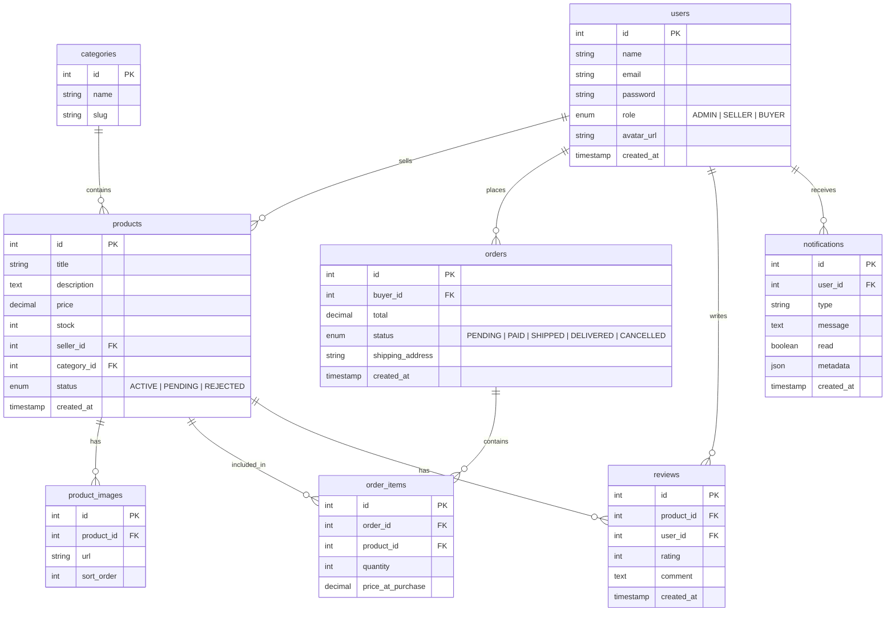
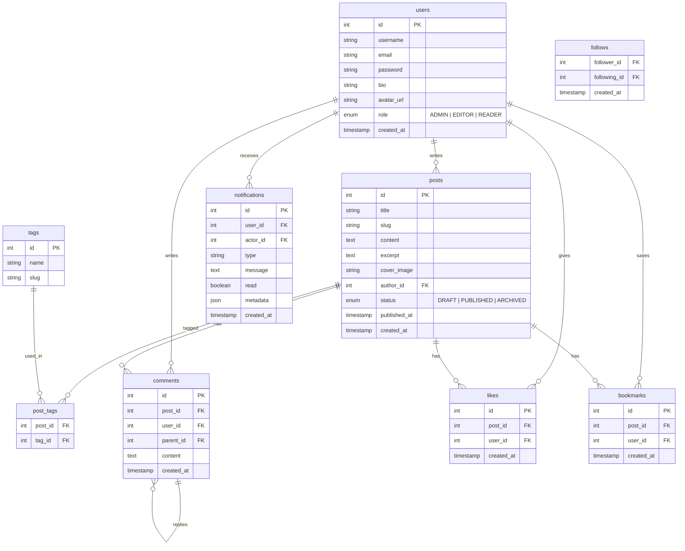
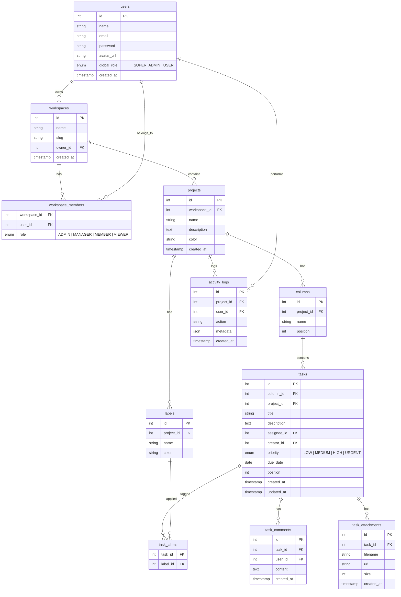
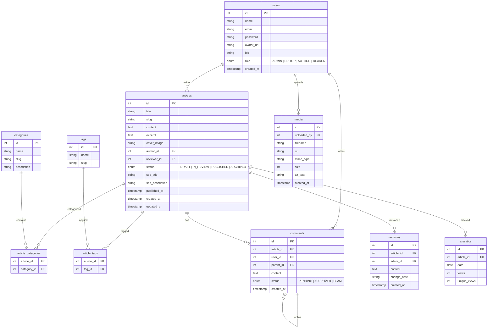

# ⚔️ ARCANE QUEST 01 — GROUP CAPSTONE

> **"Solo capstone cuma appetizer. Sekarang kalian kerja bareng 3-4 orang dan ship production app yang scope-nya JAUH lebih gede. Koordinasi itu skill yang gak bisa di-copy-paste."**

---

## 🎯 Misi

Dalam tim **3-4 orang**, build fullstack application yang production-ready. Scope LEBIH BESAR dari individual capstone Week 5, dengan mandatory features tambahan.

**Kerjain sampai production-ready, deploy, dan siap demo di Magic Temple.**

---

## 👥 Team Formation

- **3-4 orang per tim** (gak boleh kurang, gak boleh lebih)
- Tentuin **Team Lead** — yang koordinasi, manage GitHub, resolve conflicts
- Setiap orang punya **clear ownership** atas fitur tertentu
- Tulis **team charter** di README: siapa ngerjain apa

### Recommended Roles

| Role | Tanggung Jawab |
|------|----------------|
| **Team Lead / Fullstack** | Architecture, git workflow, integration, code review, deploy |
| **Frontend Lead** | UI/UX design, component library, responsive layout, state management |
| **Backend Lead** | API design, database, auth, WebSocket, file uploads |
| **Feature Dev** | Implement assigned features, write tests, documentation |

> Tim 3 orang? Gabungin Frontend Lead + Feature Dev.

---

## 📋 MANDATORY REQUIREMENTS

Semua requirements individual capstone Week 5 tetap berlaku. PLUS requirements tambahan ini yang **WAJIB** ada:

### 1. 🔌 WebSocket Real-Time (WAJIB)

Minimal 1 real-time feature menggunakan Socket.IO atau native WebSocket:
- Live notifications
- Real-time collaboration (live updates saat orang lain edit)
- Live chat
- Real-time dashboard updates

```typescript
// Server setup minimum
import { Server } from 'socket.io';

const io = new Server(httpServer, {
  cors: { origin: process.env.FRONTEND_URL },
});

io.use(async (socket, next) => {
  const token = socket.handshake.auth.token;
  // Verify JWT
  next();
});

io.on('connection', (socket) => {
  socket.join(`user:${socket.data.userId}`);
  
  socket.on('disconnect', () => {
    // cleanup
  });
});

// Client setup minimum
import { io } from 'socket.io-client';

const socket = io(API_URL, {
  auth: { token: getAccessToken() },
  reconnection: true,
  reconnectionDelay: 1000,
});
```

**Requirements:**
- [ ] Proper connection handling (reconnect, disconnect cleanup)
- [ ] Auth integration (JWT verify di socket handshake)
- [ ] Room-based events (per project/board/conversation)
- [ ] Optimistic UI updates + server confirmation

### 2. 🔐 Role-Based Access Control / RBAC (WAJIB)

Minimum 3 roles: **Admin**, **Editor/Manager**, **Viewer/Member**

```typescript
// Backend middleware
const requireRole = (...roles: UserRole[]) => {
  return (req: AuthRequest, res: Response, next: NextFunction) => {
    if (!roles.includes(req.user.role)) {
      return res.status(403).json({ error: 'Insufficient permissions' });
    }
    next();
  };
};

// Usage
router.delete('/users/:id', requireRole('ADMIN'), deleteUser);
router.put('/articles/:id', requireRole('ADMIN', 'EDITOR'), updateArticle);
router.get('/articles', requireRole('ADMIN', 'EDITOR', 'VIEWER'), getArticles);
```

**Requirements:**
- [ ] Backend middleware enforce role permissions
- [ ] Frontend conditionally render based on role
- [ ] Role assignment oleh Admin
- [ ] Protected API endpoints per role

### 3. 🛡️ Admin Panel (WAJIB)

- [ ] Separate admin routes/pages
- [ ] User management (list, edit role, deactivate)
- [ ] Content moderation (approve, reject, delete)
- [ ] Dashboard with stats (charts pakai Recharts atau Chart.js)
- [ ] Activity logs (siapa ngapain kapan)

### 4. 📁 File Uploads (WAJIB)

- [ ] Image upload minimal (profile picture + content images)
- [ ] Cloudinary atau S3-compatible storage (Supabase Storage juga OK)
- [ ] File size validation (max 5MB)
- [ ] Image optimization/resize
- [ ] Media library (browse uploaded files)

---

## 📐 Quest Options

Pilih SATU dari 5 quest options berikut. Scope-nya lebih besar dari individual capstone — karena kalian berempat.

---

### Option A — 🛒 Arcane Marketplace (E-Commerce)

Full-featured e-commerce platform dengan seller dashboard, real-time order notifications, dan admin moderation.

**Core Features:**
- Product CRUD dengan categories, tags, search, filter, sort
- Shopping cart + checkout flow
- Order management (buyer & seller side)
- Seller dashboard: product management, sales analytics, revenue charts
- Payment integration (Stripe atau Midtrans sandbox)
- Product reviews & ratings

**Mandatory Extras (Group):**
- Real-time order notifications via WebSocket ("Pesanan baru masuk!")
- Admin panel: user management, product moderation, order overview
- RBAC: Admin / Seller / Buyer
- Image upload for product photos (multiple images per product)

**ERD:**



---

### Option B — 📝 Arcane Chronicle (Social Platform)

Social blogging/media platform dengan real-time notifications, rich content, dan community features.

**Core Features:**
- Post/article CRUD dengan rich text editor (Tiptap/Lexical)
- Follow/unfollow system
- Like, comment, bookmark
- User profiles dengan bio, avatar, social links
- Feed: timeline posts dari followed users
- Tags/categories, search

**Mandatory Extras (Group):**
- Real-time notifications via WebSocket (new follower, like, comment)
- Admin panel: content moderation, user management, analytics
- RBAC: Admin / Editor / Reader
- Image upload for posts dan profile (Cloudinary)

**ERD:**



---

### Option C — 📋 Arcane Board (Project Management)

Project management tool ala Trello/Linear dengan real-time collaboration dan team features.

**Core Features:**
- Project/workspace CRUD
- Kanban board: columns (To Do, In Progress, Review, Done)
- Drag & drop tasks antar columns
- Task detail: description, assignee, priority, labels, due date, comments
- Member invitation ke project
- Activity log per project

**Mandatory Extras (Group):**
- Real-time board updates via WebSocket (semua member liat perubahan instant)
- Admin panel: workspace management, user management, analytics
- RBAC: Admin / Manager / Member / Viewer
- File attachments di tasks (Cloudinary/S3)

**ERD:**



---

### Option D — 📖 Arcane Codex (CMS)

Content Management System dengan multi-author workflow, public blog, dan SEO optimization.

**Core Features:**
- Article CRUD dengan rich text editor (Tiptap/Lexical)
- Multi-author workflow: Draft → Review → Published
- Public blog frontend (SSR-friendly, SEO meta tags)
- Categories & tags management
- Comment system pada articles
- Search (full-text search)

**Mandatory Extras (Group):**
- Real-time collaboration indicators ("User X is editing...")
- Admin panel: content management, user roles, analytics dashboard
- RBAC: Admin / Editor / Author / Reader
- Media library dengan file upload (Cloudinary)
- SEO: meta tags, Open Graph, sitemap

**ERD:**



---

### Option E — 🌟 Custom Quest

Punya ide project sendiri? Boleh! Tapi harus:

- [ ] Minimal 8 database tables
- [ ] Semua mandatory requirements (WebSocket, RBAC, Admin Panel, File Uploads)
- [ ] Minimal 2 third-party integrations (payment, email, maps, AI, dll)
- [ ] Scope setara atau lebih besar dari Option A-D
- [ ] **Proposal harus di-approve mentor SEBELUM mulai**

---

## 🏗️ Recommended Folder Structure

```
arcane-[project-name]/
├── apps/
│   ├── frontend/
│   │   ├── src/
│   │   │   ├── components/
│   │   │   │   ├── ui/              # Reusable UI (Button, Modal, Input)
│   │   │   │   ├── layout/          # Header, Sidebar, Footer
│   │   │   │   └── features/        # Feature-specific components
│   │   │   ├── pages/
│   │   │   ├── hooks/
│   │   │   ├── lib/
│   │   │   │   ├── api.ts           # Axios instance
│   │   │   │   ├── socket.ts        # Socket.IO client
│   │   │   │   └── utils.ts
│   │   │   ├── stores/              # Zustand stores
│   │   │   ├── types/
│   │   │   ├── App.tsx
│   │   │   └── main.tsx
│   │   ├── package.json
│   │   ├── tailwind.config.ts
│   │   ├── tsconfig.json
│   │   └── vite.config.ts
│   └── backend/
│       ├── src/
│       │   ├── controllers/
│       │   ├── middleware/
│       │   │   ├── auth.ts
│       │   │   ├── rbac.ts
│       │   │   └── upload.ts
│       │   ├── routes/
│       │   ├── services/
│       │   ├── socket/
│       │   │   ├── index.ts
│       │   │   └── handlers/
│       │   ├── lib/
│       │   │   ├── prisma.ts
│       │   │   └── cloudinary.ts
│       │   ├── types/
│       │   └── index.ts
│       ├── prisma/
│       │   ├── schema.prisma
│       │   └── seed.ts
│       ├── package.json
│       └── tsconfig.json
├── .github/
│   └── workflows/
│       └── ci.yml
├── .eslintrc.cjs
├── .prettierrc
├── .husky/
│   └── pre-commit
├── README.md
└── package.json                     # Root package.json (workspaces)
```

### Root `package.json`

```json
{
  "name": "arcane-project",
  "private": true,
  "workspaces": ["apps/*"],
  "scripts": {
    "dev:fe": "npm -w apps/frontend run dev",
    "dev:be": "npm -w apps/backend run dev",
    "dev": "concurrently \"npm run dev:fe\" \"npm run dev:be\"",
    "build:fe": "npm -w apps/frontend run build",
    "build:be": "npm -w apps/backend run build",
    "lint": "eslint apps/*/src --ext .ts,.tsx",
    "format": "prettier --write \"apps/*/src/**/*.{ts,tsx}\"",
    "test": "npm -w apps/frontend run test && npm -w apps/backend run test",
    "prepare": "husky install"
  },
  "devDependencies": {
    "@typescript-eslint/eslint-plugin": "^7.0.0",
    "@typescript-eslint/parser": "^7.0.0",
    "concurrently": "^8.0.0",
    "eslint": "^8.56.0",
    "husky": "^9.0.0",
    "lint-staged": "^15.0.0",
    "prettier": "^3.2.0"
  },
  "lint-staged": {
    "*.{ts,tsx}": ["eslint --fix", "prettier --write"],
    "*.{json,md}": ["prettier --write"]
  }
}
```

---

## 🤝 Git Workflow (WAJIB)

```
main (protected — no direct push)
├── develop (integration branch)
│   ├── feature/auth          (Person A)
│   ├── feature/products      (Person B)
│   ├── feature/admin-panel   (Person C)
│   └── feature/realtime      (Person D)
```

- [ ] `main` branch protected — no direct push
- [ ] All changes via Pull Request ke `develop`
- [ ] **Setiap PR harus di-review minimal 1 orang lain**
- [ ] PR description jelas (what, why, how)
- [ ] Merge conflicts resolved properly
- [ ] Meaningful commit messages (conventional commits): `feat:`, `fix:`, `docs:`, `refactor:`

---

## 📊 Grading

| Kategori | Bobot | Detail |
|----------|-------|--------|
| **Functionality** | 25% | Features work, WebSocket + RBAC + Admin + Uploads semua jalan |
| **Code Quality** | 20% | TypeScript strict, clean architecture, consistent across team |
| **UI/UX** | 15% | Responsive, polished, coherent design language |
| **Testing + CI/CD** | 15% | 20+ tests, GitHub Actions pipeline, deploy automated |
| **Teamwork** | 15% | Git history balanced, PR reviews done, equal commits, code ownership |
| **Presentation** | 10% | Demo smooth, semua member present dan bicara |

### ⚠️ Teamwork Evaluation

Gue bakal check:

```bash
git shortlog -sn --all
```

- **Git contribution graph** — semua member harus punya meaningful commits
- **PR history** — semua member harus pernah bikin DAN review PR
- **Code ownership** — setiap member responsible buat section tertentu
- **Kalau 1 orang carry semua** → yang carry dapet A, sisanya dapet C max
- **Commit < 5 atau semua "fix typo"?** → kita ngobrol.

---

## ⏰ Timeline

Ini 1 minggu penuh. Gak ada time limit per hari — manage waktu kalian sendiri. Tapi ini recommended flow:

```
Day 1:     Kickoff
           ├── Finalize quest option
           ├── Write team charter (siapa ngerjain apa)
           ├── Setup repo, branching strategy, ESLint/Prettier/Husky
           └── ERD & API design (BERSAMA)

Day 2:     Foundation (semua bareng)
           ├── Project setup (Prisma, Express, React, Socket.IO)
           ├── Auth system (1 person leads, others review)
           └── Base UI layout & routing

Day 3-4:   Parallel Feature Development
           ├── Person A: [Feature set 1]
           ├── Person B: [Feature set 2]
           ├── Person C: [Feature set 3]
           └── Person D: [Admin panel + File uploads]

Day 5:     Integration + WebSocket
           ├── Merge all features ke develop
           ├── WebSocket integration
           ├── Fix integration bugs
           └── Cross-testing (test fitur orang lain)

Day 6:     Testing + Deploy + Polish
           ├── 20+ tests (each person writes 5+)
           ├── CI/CD pipeline
           ├── Deploy to Vercel + Railway
           ├── Responsive design pass
           └── README + API docs

Day 7:     DEMO DAY 🎤
           ├── Final polish
           ├── Practice presentation 2x
           ├── Record backup demo
           └── PRESENT DI MAGIC TEMPLE
```

---

## ✨ Bonus Features

| Bonus | Poin | Detail |
|-------|------|--------|
| 📱 **PWA** | +5 | Installable, works offline |
| 🔔 **Push Notifications** | +3 | Browser push notifications |
| 🌍 **i18n** | +3 | Multi-language support |
| 📊 **Analytics Dashboard** | +3 | Charts, graphs, insights |
| 🔍 **Full-Text Search** | +3 | Debounced search with highlighting |
| 🎨 **Dark Mode** | +2 | Theme toggle, persistent preference |
| 📝 **Activity Audit Log** | +2 | Full trail of all actions |

---

## 💡 Tips

1. **Day 1 itu CRUCIAL** — spend full day planning. Architecture diagram, component list, API design, task breakdown. Tim yang planning-nya bagus di Day 1 SELALU menang.
2. **Agree on code style DAY 1.** Setup ESLint + Prettier + Husky SEBELUM nulis code.
3. **Define interfaces/types DULU sebelum coding.** Biar API contract jelas antara FE dan BE.
4. **Komunikasi > Code** — pake Discord/WA group, daily standup 10 menit.
5. **Merge often** — jangan develop 3 hari baru merge, pasti conflict.
6. **Don't block each other** — kalau butuh API yang belum ready, bikin mock dulu.
7. **Review PR dalam 24 jam** — jangan biarkan PR numpuk.
8. **Help each other** — kalo teammate stuck, bantu. Grade tim = grade lu juga.
9. **Demo prep** — practice demo minimal 2x sebelum Demo Day.

---

## 📝 Submission Checklist

- [ ] GitHub repo (public, all members as collaborators)
- [ ] README.md di repo:
  - Team members + roles
  - Tech stack
  - Setup instructions (`npm install`, `npm run dev`)
  - Architecture diagram
  - ERD
  - Screenshots
  - Live demo URL
- [ ] Vercel deployment URL (frontend)
- [ ] Railway deployment URL (backend)
- [ ] CI/CD pipeline green ✅
- [ ] Minimal 20 tests passing
- [ ] All members have meaningful git commits
- [ ] PR reviews done by all members

---

**Assemble your guild, Arcanists. This is the REAL final boss. ⚔️🛡️**
